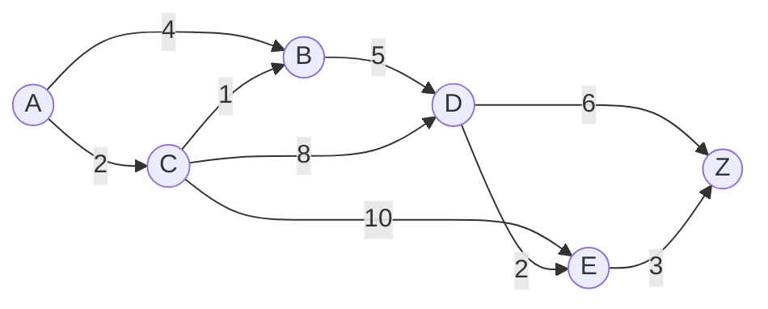
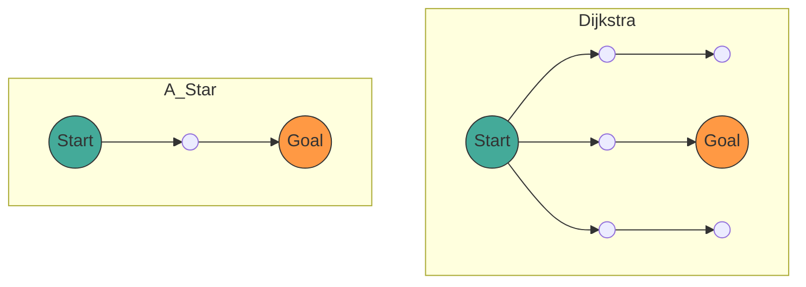

## 1. はじめに

現代のコンピュータサイエンスにおいて、 **[グラフ](https://kenji.blog/p/tree-graph-data-structures-search-dfs-bfs-dijkstra/)理論** ([Graph](https://kenji.blog/p/tree-graph-data-structures-search-dfs-bfs-dijkstra/) Theory) はネットワーク構造をモデル化するための強力な数学的枠組みを提供します。私たちの日常生活において、カーナビゲーションや鉄道の乗り換え案内、インターネットのルーティング、さらにはゲームAIの経路探索など、さまざまな場面で「最短経路」を計算する技術が使われています。

本記事では、この経路探索の基礎となるグラフ理論の数学的定義から始まり、代表的な[探索アルゴリズム](https://kenji.blog/p/search-algorithms-linear-binary-hash-table-principles/)である **ダイクストラ法** ([Dijkstra](https://kenji.blog/p/tree-graph-data-structures-search-dfs-bfs-dijkstra/)'s Algorithm) と、それをさらに発展させた **A*アルゴリズム** (A-Star Algorithm) の仕組み、数学的証明、そしてPythonを用いた実践的な実装方法までを網羅的に解説します。

## 2. グラフ理論の基礎

アルゴリズムの解説に入る前に、まずは対象となるデータ構造であるグラフについて数学的に定義します。

### 2.1 グラフの数学的定義

グラフ $ G $ は、頂点 (Vertex/Node) の集合 $ V $ と、辺 (Edge) の集合 $ E $ の組によって定義されます。

$$
G = (V, E)
$$

ここで、辺の集合 $ E $ の要素 $ e $ は、2つの頂点 $ u, v \in V $ を結ぶものであり、$ e = (u, v) $ と表されます。

- **無向グラフ** (Undirected Graph): 辺に向きがないグラフ。$ (u, v) \in E $ ならば $ (v, u) \in E $ となります。
- **有向グラフ** (Directed Graph): 辺に向きがあるグラフ。$ (u, v) $ と $ (v, u) $ は区別されます。

### 2.2 重み付きグラフ (Weighted Graph)

実際の経路探索では、距離や時間、コストなどを考慮する必要があります。そこで、各辺に「重み」 (Weight) を割り当てた **重み付きグラフ** を考えます。重み関数 $ w: E \rightarrow \mathbb{R} $ を導入すると、グラフは $ G = (V, E, w) $ と定義されます。

$$
w(u, v) \ge 0
$$

多くの場合、距離や時間は負にならないため、辺の重みは非負であると仮定します。



上の図は、頂点 $ A $ から $ Z $ までの重み付き有向[グラフ](https://kenji.blog/p/tree-graph-data-structures-search-dfs-bfs-dijkstra/)の例です。エッジ上の数字がコスト（重み）を表しています。

### 2.3 最短経路問題の定式化

始点 (Source) $ s \in V $ から終点 (Target) $ t \in V $ までの経路 (Path) $ P $ を、頂点の列 $ (v_0, v_1, \dots, v_k) $ （ただし $ v_0 = s, v_k = t $ ）とし、各 $ i $ について $ (v_i, v_{i+1}) \in E $ であるとします。
この経路 $ P $ の総コスト $ W(P) $ は、経路上の辺の重みの総和で表されます。

$$
W(P) = \sum_{i=0}^{k-1} w(v_i, v_{i+1})
$$

**最短経路問題** (Shortest Path Problem) とは、すべての可能な経路 $ P $ の中で、$ W(P) $ を最小にする経路 $ P^* $ を見つける問題です。

---

## 3. [ダイクストラ法](https://kenji.blog/p/tree-graph-data-structures-search-dfs-bfs-dijkstra/) ([Dijkstra](https://kenji.blog/p/tree-graph-data-structures-search-dfs-bfs-dijkstra/)'s Algorithm)

エドガー・ダイクストラによって考案された **ダイクストラ法** は、非負の重みを持つグラフにおいて、単一始点からすべての頂点への最短経路を求めるためのアルゴリズムです。

### 3.1 アルゴリズムの直感的な理解

ダイクストラ法は、「始点から最も近い未確定の頂点を順次確定していく」という貪欲法 (Greedy Algorithm) に基づいています。

1. 始点からの暫定的な距離を保持する配列を用意し、始点を `0`、それ以外を `無限大` ( $ \infty $ ) で初期化します。
2. 未確定の頂点の中で、暫定距離が最小の頂点 $ u $ を選び、「確定済み」とします。
3. 頂点 $ u $ に隣接するすべての頂点 $ v $ について、$ u $ を経由した方が暫定距離が短くなる場合、距離を更新します（この操作を **緩和** (Relaxation) と呼びます）。
4. すべての頂点が確定するか、目的の頂点が確定するまで2〜3を繰り返します。

### 3.2 緩和 (Relaxation) の数学的表現

頂点 $ u $ から $ v $ へのエッジを緩和する操作は、数式で次のように表されます。ここで、$ d[v] $ は始点から $ v $ までの現在の暫定最短距離を示します。

$$
\text{if } d[u] + w(u, v) < d[v]: \\\\
d[v] = d[u] + w(u, v)
$$

### 3.3 Python による[ダイクストラ法](https://kenji.blog/p/tree-graph-data-structures-search-dfs-bfs-dijkstra/)の実装

効率的な実装のために、最小値を取得するデータ構造として優先度付きキュー (Priority Queue) を使用します。Pythonでは `heapq` モジュールを利用できます。

```python
import heapq

def dijkstra(graph, start):
    """
    graph: 辞書型。graph[u] = {v1: weight1, v2: weight2, ...} の形式
    start: 始点のノード
    """
    # 距離を保存する辞書。初期値は無限大
    distances = {node: float('inf') for node in graph}
    distances[start] = 0
    
    # 優先度付きキュー [(距離, ノード)]
    pq = [(0, start)]
    
    # 経路復元用の辞書
    previous_nodes = {node: None for node in graph}

    while pq:
        current_distance, current_node = heapq.heappop(pq)

        # すでに処理済みの（より短い経路が見つかっている）場合はスキップ
        if current_distance > distances[current_node]:
            continue

        # 隣接ノードの探索
        for neighbor, weight in graph[current_node].items():
            distance = current_distance + weight

            # 緩和操作 (Relaxation)
            if distance < distances[neighbor]:
                distances[neighbor] = distance
                previous_nodes[neighbor] = current_node
                heapq.heappush(pq, (distance, neighbor))

    return distances, previous_nodes
```

### 3.4 計算量について

優先度付きキューとして二分[ヒープ](https://kenji.blog/p/c-language-pointers-memory-management-stack-heap/) (Binary [Heap](https://kenji.blog/p/c-language-pointers-memory-management-stack-heap/)) を用いた場合、各頂点はキューから1回取り出され、各辺は1回緩和されます。
したがって、[時間計算量](https://kenji.blog/p/time-space-complexity-big-o-notation-examples/)は $ O((|V| + |E|) \log |V|) $ となります。フィボナッチ[ヒープ](https://kenji.blog/p/c-language-pointers-memory-management-stack-heap/)を用いれば $ O(|E| + |V| \log |V|) $ まで理論上改善されますが、実用上は二分ヒープが多く用いられます。

---

## 4. A* アルゴリズム (A-Star Algorithm)

[ダイクストラ法](https://kenji.blog/p/tree-graph-data-structures-search-dfs-bfs-dijkstra/)は確実ですが、目的地の方向を考慮せず全方向に探索を広げるため、無駄な探索が多くなることがあります。これを解決するのが **A*アルゴリズム** です。

### 4.1 ヒューリスティック関数の導入

A*アルゴリズムは、現在のノードからゴールまでの「推定距離」を用いることで、ゴールに向かって優先的に探索を進めます。この推定距離を返す関数を **ヒューリスティック関数** (Heuristic Function) $ h(n) $ と呼びます。

A*では、ノード $ n $ を評価するための関数 $ f(n) $ を次のように定義します。

$$
f(n) = g(n) + h(n)
$$

ここで、
- $ g(n) $: 始点からノード $ n $ までの実際のコスト（ダイクストラ法における距離と同じ）
- $ h(n) $: ノード $ n $ から終点までの推定コスト（ヒューリスティック）
- $ f(n) $: 始点から $ n $ を経由して終点へ向かう経路の推定総コスト

### 4.2 ヒューリスティックの条件

A*が常に **最短経路を見つける（最適性）** ためには、ヒューリスティック関数 $ h(n) $ が以下の条件を満たす必要があります。

1. **許容的** (Admissible):
   推定コストが決して実際のコストを上回らないこと。
   $$
   h(n) \le h^*(n)
   $$
   （ $ h^*(n) $ は $ n $ から終点までの真の最短コスト）

2. **無矛盾** (Consistent / Monotonic):
   任意の隣接ノード $ m, n $ に対して、三角不等式を満たすこと。
   $$
   h(m) \le c(m, n) + h(n)
   $$
   ここで $ c(m, n) $ は $ m $ から $ n $ へのエッジのコストです。無矛盾なヒューリスティックは自動的に許容的になります。

### 4.3 代表的なヒューリスティック関数

グリッド上の経路探索では、以下のような距離関数がよく使われます。

- **マンハッタン距離** (Manhattan Distance): 上下左右のみ移動可能な場合
  $$
  h(n) = |x_n - x_{goal}| + |y_n - y_{goal}|
  $$
- **ユークリッド距離** (Euclidean Distance): 任意の方向に直線移動可能な場合
  $$
  h(n) = \sqrt{(x_n - x_{goal})^2 + (y_n - y_{goal})^2}
  $$

### 4.4 A* アルゴリズムの Python 実装

A*の実装はダイクストラ法と非常に似ていますが、優先度付きキューのキーが $ f(n) $ になる点が異なります。

```python
import heapq

def a_star(graph, start, goal, heuristic_func):
    """
    graph: ノード間のコストを持つ辞書
    start: 始点
    goal: 終点
    heuristic_func: ヒューリスティック関数 h(node, goal)
    """
    open_set = []
    heapq.heappush(open_set, (0, start))
    
    # 始点からの実コスト g(n)
    g_score = {node: float('inf') for node in graph}
    g_score[start] = 0
    
    # f(n) = g(n) + h(n)
    f_score = {node: float('inf') for node in graph}
    f_score[start] = heuristic_func(start, goal)
    
    came_from = {}

    while open_set:
        # f(n) が最小のノードを取得
        current_f, current_node = heapq.heappop(open_set)

        if current_node == goal:
            return reconstruct_path(came_from, current_node)

        for neighbor, weight in graph[current_node].items():
            tentative_g_score = g_score[current_node] + weight

            if tentative_g_score < g_score[neighbor]:
                # より良い経路を発見
                came_from[neighbor] = current_node
                g_score[neighbor] = tentative_g_score
                f_score[neighbor] = tentative_g_score + heuristic_func(neighbor, goal)
                
                # open_set に追加
                heapq.heappush(open_set, (f_score[neighbor], neighbor))

    return None # 経路が見つからなかった場合

def reconstruct_path(came_from, current):
    path = [current]
    while current in came_from:
        current = came_from[current]
        path.append(current)
    path.reverse()
    return path
```

### 4.5 [ダイクストラ法](https://kenji.blog/p/tree-graph-data-structures-search-dfs-bfs-dijkstra/)と A* の比較

以下のMermaid図は、ダイクストラ法とA*の探索範囲のイメージ比較です。ダイクストラ法が同心円状に探索を広げるのに対し、A*はゴール方向に引き伸ばされた楕円状に探索を進めます。



---

## 5. 経路探索の応用と今後の展望

[ダイクストラ法](https://kenji.blog/p/tree-graph-data-structures-search-dfs-bfs-dijkstra/)とA*アルゴリズムは、基礎的な手法でありながら、多くの応用技術のベースとなっています。

1. **双方向探索** (Bidirectional Search):
   始点と終点の両方から同時に探索を進め、中間で合流することで探索空間を劇的に削減する手法。
2. **D* アルゴリズム** (Dynamic A*):
   未知の障害物が動的に現れるような環境（ロボットの自動走行など）において、経路を効率的に再計算する手法。
3. **JPS** (Jump Point Search):
   均一なグリッドマップ上で、A*の探索をさらに高速化するための手法。対称性を利用して不要なノードをスキップします。

経路[探索アルゴリズム](https://kenji.blog/p/search-algorithms-linear-binary-hash-table-principles/)は、[グラフ](https://kenji.blog/p/tree-graph-data-structures-search-dfs-bfs-dijkstra/)理論の数学的な美しさと、コンピュータサイエンスのアルゴリズム的効率性が見事に融合した分野です。

## 6. まとめ

本記事では、グラフ理論の基礎的な定義から出発し、ダイクストラ法とA*アルゴリズムの数学的背景、具体的な仕組み、そしてPythonを用いた実装例について解説しました。

- **ダイクストラ法** は、すべてのノードを均等に評価し、確実な最短経路を保証します。
- **A*アルゴリズム** は、ヒューリスティック関数 $ h(n) $ を導入することで、ゴールに向けた効率的な探索を実現します。

これらの知識は、単なるアルゴリズムの理解にとどまらず、複雑な現実世界の問題を「グラフ」という数学的モデルに落とし込み、最適解を導き出すための強力な思考ツールとなるでしょう。ぜひ、実際のコードを動かして、その強力さを体験してみてください。
