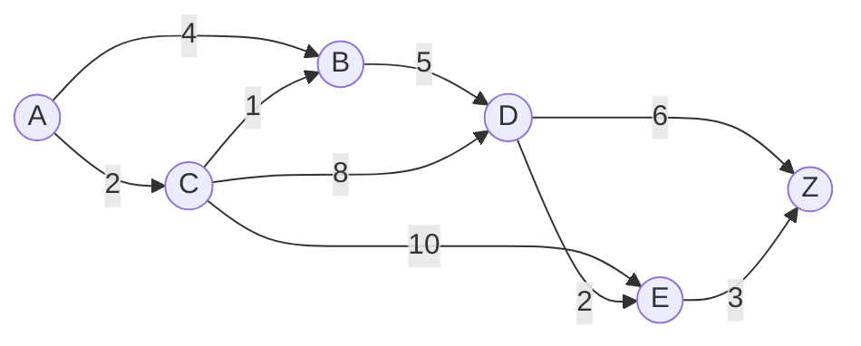
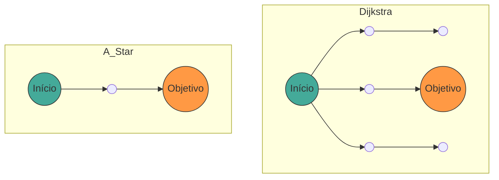

## 1. Introdução

Na ciência da computação moderna, a **Teoria dos Grafos** ([Graph](https://kenji.blog/pt/p/tree-graph-data-structures-search-dfs-bfs-dijkstra/) Theory) fornece um quadro matemático poderoso para modelar estruturas de rede. No nosso dia a dia, a tecnologia de cálculo de "caminho mais curto" é utilizada em diversas situações, como navegação automotiva, guias de transferência de trens, roteamento de internet e até busca de caminhos em IA de jogos.

Neste artigo, a partir da definição matemática da teoria dos grafos, que é a base da busca de caminhos, explicaremos de forma abrangente o funcionamento, a prova matemática e a implementação prática usando Python do **Algoritmo de [Dijkstra](https://kenji.blog/pt/p/tree-graph-data-structures-search-dfs-bfs-dijkstra/)** (Dijkstra's Algorithm), um algoritmo de busca representativo, e do **Algoritmo A*** (A-Star Algorithm), que é o seu desenvolvimento posterior.

## 2. Fundamentos da Teoria dos Grafos

Antes de entrar na explicação dos algoritmos, primeiro definiremos matematicamente os grafos, que são a estrutura de dados alvo.

### 2.1 Definição Matemática de Grafos

Um grafo $ G $ é definido por um par de um conjunto de vértices (Vertex/Node) $ V $ e um conjunto de arestas (Edge) $ E $.

$$
G = (V, E)
$$

Aqui, o elemento $ e $ do conjunto de arestas $ E $ conecta dois vértices $ u, v \in V $, sendo representado como $ e = (u, v) $.

- **Grafo Não Direcionado** (Undirected Graph): Um grafo onde as arestas não têm direção. Se $ (u, v) \in E $, então $ (v, u) \in E $.
- **Grafo Direcionado** (Directed Graph): Um grafo onde as arestas têm direção. $ (u, v) $ e $ (v, u) $ são distintos.

### 2.2 Grafo Ponderado (Weighted Graph)

Na busca de caminhos real, é necessário considerar distância, tempo, custo, etc. Portanto, consideramos um **grafo ponderado** onde um "peso" (Weight) é atribuído a cada aresta. Introduzindo uma função de peso $ w: E \rightarrow \mathbb{R} $, o grafo é definido como $ G = (V, E, w) $.

$$
w(u, v) \ge 0
$$

Na maioria dos casos, como distância e tempo não se tornam negativos, assumimos que os pesos das arestas são não negativos.



A figura acima é um exemplo de um grafo direcionado ponderado do vértice $ A $ até $ Z $. Os números nas arestas representam o custo (peso).

### 2.3 Formulação do Problema do Caminho Mais Curto

Seja o caminho (Path) $ P $ do ponto inicial (Source) $ s \in V $ até o ponto final (Target) $ t \in V $ a sequência de vértices $ (v_0, v_1, \dots, v_k) $ (onde $ v_0 = s, v_k = t $), assumimos que $ (v_i, v_{i+1}) \in E $ para cada $ i $.
O custo total $ W(P) $ deste caminho $ P $ é representado pela soma dos pesos das arestas no caminho.

$$
W(P) = \sum_{i=0}^{k-1} w(v_i, v_{i+1})
$$

O **Problema do Caminho Mais Curto** (Shortest Path Problem) é o problema de encontrar o caminho $ P^* $ que minimiza $ W(P) $ entre todos os caminhos possíveis $ P $.

---

## 3. Algoritmo de [Dijkstra](https://kenji.blog/pt/p/tree-graph-data-structures-search-dfs-bfs-dijkstra/) (Dijkstra's Algorithm)

O **Algoritmo de Dijkstra**, criado por Edsger W. Dijkstra, é um algoritmo para encontrar o caminho mais curto a partir de um único ponto inicial para todos os vértices em um grafo com pesos não negativos.

### 3.1 Compreensão Intuitiva do Algoritmo

O Algoritmo de Dijkstra baseia-se em um algoritmo guloso (Greedy Algorithm) de "confirmar sequencialmente o vértice não confirmado mais próximo a partir do ponto inicial".

1. Prepare um array que armazena a distância provisória do ponto inicial, inicialize o ponto inicial com `0` e os demais com `infinito` ( $ \infty $ ).
2. Entre os vértices não confirmados, escolha o vértice $ u $ com a menor distância provisória e marque-o como "confirmado".
3. Para todos os vértices adjacentes $ v $ ao vértice $ u $, atualize a distância se a distância provisória for mais curta passando por $ u $ (esta operação é chamada de **Relaxamento** (Relaxation)).
4. Repita os passos 2 a 3 até que todos os vértices sejam confirmados ou que o vértice de destino seja confirmado.

### 3.2 Expressão Matemática do Relaxamento (Relaxation)

A operação de relaxar uma aresta do vértice $ u $ para $ v $ é expressa matematicamente da seguinte maneira. Aqui, $ d[v] $ indica a menor distância provisória atual do ponto inicial para $ v $.

$$
\text{se } d[u] + w(u, v) < d[v]: \\\\
d[v] = d[u] + w(u, v)
$$

### 3.3 Implementação do Algoritmo de [Dijkstra](https://kenji.blog/pt/p/tree-graph-data-structures-search-dfs-bfs-dijkstra/) em Python

Para uma implementação eficiente, utilizamos uma fila de prioridade (Priority Queue) como a estrutura de dados para obter o valor mínimo. No Python, podemos usar o módulo `heapq`.

```python
import heapq

def dijkstra(graph, start):
    """
    graph: Tipo dicionário. No formato graph[u] = {v1: weight1, v2: weight2, ...}
    start: Nó inicial
    """
    # Dicionário para armazenar a distância. Valor inicial é infinito
    distances = {node: float('inf') for node in graph}
    distances[start] = 0
    
    # Fila de prioridade [(distância, nó)]
    pq = [(0, start)]
    
    # Dicionário para reconstrução do caminho
    previous_nodes = {node: None for node in graph}

    while pq:
        current_distance, current_node = heapq.heappop(pq)

        # Ignorar se já foi processado (caminho mais curto já encontrado)
        if current_distance > distances[current_node]:
            continue

        # Exploração de nós adjacentes
        for neighbor, weight in graph[current_node].items():
            distance = current_distance + weight

            # Operação de relaxamento (Relaxation)
            if distance < distances[neighbor]:
                distances[neighbor] = distance
                previous_nodes[neighbor] = current_node
                heapq.heappush(pq, (distance, neighbor))

    return distances, previous_nodes
```

### 3.4 Sobre a Complexidade Computacional

Ao usar um [Heap](https://kenji.blog/pt/p/c-language-pointers-memory-management-stack-heap/) Binário (Binary Heap) como fila de prioridade, cada vértice é retirado da fila uma vez, e cada aresta é relaxada uma vez.
Portanto, a complexidade de tempo é $ O((|V| + |E|) \log |V|) $. Usar um Heap de Fibonacci melhora a complexidade teórica para $ O(|E| + |V| \log |V|) $, mas na prática o Heap Binário é amplamente utilizado.

---

## 4. Algoritmo A* (A-Star Algorithm)

O Algoritmo de [Dijkstra](https://kenji.blog/pt/p/tree-graph-data-structures-search-dfs-bfs-dijkstra/) é confiável, mas como expande a busca em todas as direções sem considerar a direção do destino, muitas buscas podem ser desperdiçadas. O **Algoritmo A*** resolve isso.

### 4.1 Introdução da Função Heurística

O Algoritmo A* prioriza a busca em direção ao objetivo usando a "distância estimada" do nó atual até o objetivo. A função que retorna essa distância estimada é chamada de **Função Heurística** (Heuristic Function) $ h(n) $.

No A*, definimos a função $ f(n) $ para avaliar o nó $ n $ da seguinte forma:

$$
f(n) = g(n) + h(n)
$$

Onde,
- $ g(n) $: Custo real do ponto inicial ao nó $ n $ (o mesmo que a distância no algoritmo de Dijkstra)
- $ h(n) $: Custo estimado do nó $ n $ até o ponto final (heurística)
- $ f(n) $: Custo total estimado do caminho do ponto inicial até o ponto final passando por $ n $

### 4.2 Condições da Heurística

Para que o A* sempre **encontre o caminho mais curto (otimalidade)**, a função heurística $ h(n) $ precisa satisfazer as seguintes condições:

1. **Admissível** (Admissible):
   O custo estimado nunca excede o custo real.
   $$
   h(n) \le h^*(n)
   $$
   ( $ h^*(n) $ é o custo real mais curto de $ n $ até o ponto final)

2. **Consistente** (Consistent / Monotonic):
   Para quaisquer nós adjacentes $ m, n $, satisfaz a desigualdade triangular.
   $$
   h(m) \le c(m, n) + h(n)
   $$
   Onde $ c(m, n) $ é o custo da aresta de $ m $ para $ n $. Uma heurística consistente torna-se automaticamente admissível.

### 4.3 Funções Heurísticas Representativas

Em buscas de caminhos numa grade, são comumente usadas as seguintes funções de distância:

- **Distância de Manhattan** (Manhattan Distance): Quando apenas movimentos para cima, para baixo, para a esquerda e para a direita são possíveis.
  $$
  h(n) = |x_n - x_{goal}| + |y_n - y_{goal}|
  $$
- **Distância Euclidiana** (Euclidean Distance): Quando o movimento em linha reta em qualquer direção é possível.
  $$
  h(n) = \sqrt{(x_n - x_{goal})^2 + (y_n - y_{goal})^2}
  $$

### 4.4 Implementação do Algoritmo A* em Python

A implementação do A* é muito parecida com a do algoritmo de Dijkstra, exceto que a chave da fila de prioridade é $ f(n) $.

```python
import heapq

def a_star(graph, start, goal, heuristic_func):
    """
    graph: Dicionário contendo os custos entre os nós
    start: Ponto inicial
    goal: Ponto final
    heuristic_func: Função heurística h(node, goal)
    """
    open_set = []
    heapq.heappush(open_set, (0, start))
    
    # Custo real a partir do ponto inicial g(n)
    g_score = {node: float('inf') for node in graph}
    g_score[start] = 0
    
    # f(n) = g(n) + h(n)
    f_score = {node: float('inf') for node in graph}
    f_score[start] = heuristic_func(start, goal)
    
    came_from = {}

    while open_set:
        # Obter o nó com o menor f(n)
        current_f, current_node = heapq.heappop(open_set)

        if current_node == goal:
            return reconstruct_path(came_from, current_node)

        for neighbor, weight in graph[current_node].items():
            tentative_g_score = g_score[current_node] + weight

            if tentative_g_score < g_score[neighbor]:
                # Um caminho melhor foi encontrado
                came_from[neighbor] = current_node
                g_score[neighbor] = tentative_g_score
                f_score[neighbor] = tentative_g_score + heuristic_func(neighbor, goal)
                
                # Adicionar ao open_set
                heapq.heappush(open_set, (f_score[neighbor], neighbor))

    return None # Se não foi encontrado caminho

def reconstruct_path(came_from, current):
    path = [current]
    while current in came_from:
        current = came_from[current]
        path.append(current)
    path.reverse()
    return path
```

### 4.5 Comparação entre o Algoritmo de [Dijkstra](https://kenji.blog/pt/p/tree-graph-data-structures-search-dfs-bfs-dijkstra/) e A*

O diagrama Mermaid a seguir é uma imagem de comparação da área de busca entre o Algoritmo de Dijkstra e A*. Enquanto o Dijkstra expande a busca de forma concêntrica, o A* avança na busca de forma elíptica, esticada em direção ao objetivo.



---

## 5. Aplicações e Perspectivas Futuras da Busca de Caminho

Os algoritmos de [Dijkstra](https://kenji.blog/pt/p/tree-graph-data-structures-search-dfs-bfs-dijkstra/) e A*, embora sendo métodos básicos, são a base para muitas tecnologias aplicadas.

1. **Busca Bidirecional** (Bidirectional Search):
   Um método em que a busca progride simultaneamente do ponto inicial e do ponto final, reduzindo drasticamente o espaço de busca encontrando-se no meio.
2. **Algoritmo D*** (Dynamic A*):
   Um método para recalcular eficientemente o caminho em um ambiente em que obstáculos desconhecidos aparecem dinamicamente (como em condução autônoma de robôs).
3. **JPS** (Jump Point Search):
   Um método para acelerar ainda mais a busca do A* em mapas de grade uniformes. Nós desnecessários são ignorados usando simetria.

Os algoritmos de busca de caminho representam um campo onde a beleza matemática da teoria dos grafos e a eficiência algorítmica da ciência da computação se fundem perfeitamente.

## 6. Conclusão

Neste artigo, partindo das definições básicas da teoria dos grafos, explicamos a base matemática dos algoritmos de Dijkstra e A*, seus mecanismos específicos, bem como exemplos de implementação em Python.

- O **Algoritmo de Dijkstra** avalia uniformemente todos os nós, garantindo um caminho mais curto definitivo.
- O **Algoritmo A*** realiza uma busca eficiente em direção ao objetivo introduzindo a função heurística $ h(n) $.

Este conhecimento vai além do simples entendimento de algoritmos e será uma poderosa ferramenta de raciocínio para traduzir problemas complexos do mundo real num modelo matemático de "grafos" para obter soluções ótimas. Não deixe de executar e testar o código real para sentir o seu poder.
