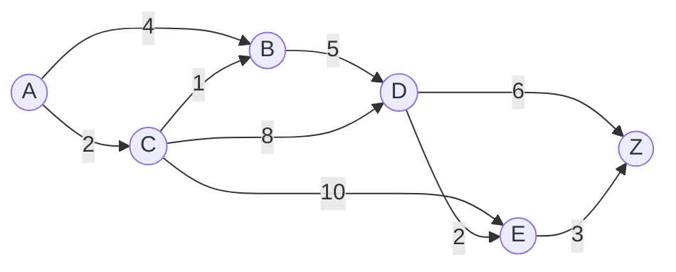
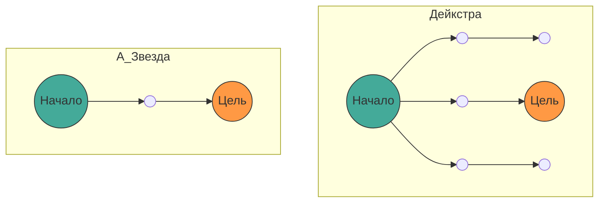

## 1. Введение

В современной информатике **теория графов** ([Graph](https://kenji.blog/ru/p/tree-graph-data-structures-search-dfs-bfs-dijkstra/) Theory) предоставляет мощную математическую основу для моделирования сетевых структур. В нашей повседневной жизни технологии вычисления «кратчайшего пути» используются в различных ситуациях, таких как автомобильная навигация, информация о пересадках на поездах, интернет-маршрутизация и даже поиск пути ИИ в играх.

В этой статье представлено всестороннее объяснение, начиная с математического определения теории графов, которая является основой этого поиска пути, и заканчивая механизмами типичных алгоритмов поиска: **алгоритма Дейкстры** ([Dijkstra](https://kenji.blog/ru/p/tree-graph-data-structures-search-dfs-bfs-dijkstra/)'s Algorithm) и его дальнейшего развития, **алгоритма A*** (A-Star Algorithm), их математическими доказательствами и практическими методами реализации с использованием Python.

## 2. Основы теории графов

Перед тем как перейти к объяснению алгоритмов, давайте сначала математически определим граф, который является целевой структурой данных.

### 2.1 Математическое определение графа

Граф $ G $ определяется парой из множества вершин (Vertex/Node) $ V $ и множества ребер (Edge) $ E $.

$$
G = (V, E)
$$

Здесь элемент $ e $ множества ребер $ E $ соединяет две вершины $ u, v \in V $ и представляется как $ e = (u, v) $.

- **Неориентированный граф** (Undirected Graph): Граф без направления ребер. Если $ (u, v) \in E $, то $ (v, u) \in E $.
- **Ориентированный граф** (Directed Graph): Граф с направлением ребер. $ (u, v) $ и $ (v, u) $ различаются.

### 2.2 Взвешенный граф (Weighted Graph)

При реальном поиске пути необходимо учитывать расстояние, время, стоимость и т. д. Поэтому мы рассмотрим **взвешенный граф**, в котором каждому ребру назначен «вес» (Weight). При введении весовой функции $ w: E \rightarrow \mathbb{R} $ граф определяется как $ G = (V, E, w) $.

$$
w(u, v) \ge 0
$$

Во многих случаях, поскольку расстояние и время не могут быть отрицательными, предполагается, что веса ребер неотрицательны.



Приведенный выше рисунок представляет собой пример взвешенного ориентированного графа от вершины $ A $ до $ Z $. Числа на ребрах обозначают стоимость (вес).

### 2.3 Формулировка задачи о кратчайшем пути

Пусть путь (Path) $ P $ от начальной точки (Source) $ s \in V $ до конечной точки (Target) $ t \in V $ представляет собой последовательность вершин $ (v_0, v_1, \dots, v_k) $ (где $ v_0 = s, v_k = t $), и для каждого $ i $ выполняется $ (v_i, v_{i+1}) \in E $.
Общая стоимость $ W(P) $ этого пути $ P $ выражается суммой весов ребер на пути.

$$
W(P) = \sum_{i=0}^{k-1} w(v_i, v_{i+1})
$$

**Задача о кратчайшем пути** (Shortest Path Problem) — это задача нахождения пути $ P^* $, минимизирующего $ W(P) $ среди всех возможных путей $ P $.

---

## 3. Алгоритм Дейкстры ([Dijkstra](https://kenji.blog/ru/p/tree-graph-data-structures-search-dfs-bfs-dijkstra/)'s Algorithm)

**Алгоритм Дейкстры**, разработанный Эдсгером Дейкстрой, представляет собой алгоритм для нахождения кратчайших путей от одной начальной вершины до всех остальных вершин в графе с неотрицательными весами.

### 3.1 Интуитивное понимание алгоритма

Алгоритм Дейкстры основан на жадном алгоритме (Greedy Algorithm) с подходом «последовательного определения ближайшей неподтвержденной вершины от начальной точки».

1. Подготовьте массив для хранения предварительного расстояния от начальной точки, инициализируйте начальную точку как `0`, а остальные — как `бесконечность` ( $ \infty $ ).
2. Среди неподтвержденных вершин выберите вершину $ u $ с минимальным предварительным расстоянием и отметьте её как «подтвержденную».
3. Для всех смежных с вершиной $ u $ вершин $ v $, если путь через $ u $ дает меньшее предварительное расстояние, обновите расстояние (эта операция называется **релаксацией** (Relaxation)).
4. Повторяйте шаги 2 и 3, пока все вершины не будут подтверждены или пока не будет подтверждена целевая вершина.

### 3.2 Математическое выражение релаксации (Relaxation)

Операция релаксации ребра от вершины $ u $ к $ v $ математически выражается следующим образом. Здесь $ d[v] $ обозначает текущее предварительное кратчайшее расстояние от начальной точки до $ v $.

$$
\text{если } d[u] + w(u, v) < d[v]: \\
d[v] = d[u] + w(u, v)
$$

### 3.3 Реализация алгоритма Дейкстры на Python

Для эффективной реализации в качестве структуры данных для получения минимального значения используется очередь с приоритетом (Priority Queue). В Python можно использовать модуль `heapq`.

```python
import heapq

def dijkstra(graph, start):
    """
    graph: Тип словаря. Формат graph[u] = {v1: weight1, v2: weight2, ...}
    start: Начальный узел
    """
    # Словарь для хранения расстояний. Начальное значение - бесконечность
    distances = {node: float('inf') for node in graph}
    distances[start] = 0
    
    # Очередь с приоритетом [(расстояние, узел)]
    pq = [(0, start)]
    
    # Словарь для восстановления пути
    previous_nodes = {node: None for node in graph}

    while pq:
        current_distance, current_node = heapq.heappop(pq)

        # Пропустить, если уже обработано (найден более короткий путь)
        if current_distance > distances[current_node]:
            continue

        # Поиск соседних узлов
        for neighbor, weight in graph[current_node].items():
            distance = current_distance + weight

            # Операция релаксации (Relaxation)
            if distance < distances[neighbor]:
                distances[neighbor] = distance
                previous_nodes[neighbor] = current_node
                heapq.heappush(pq, (distance, neighbor))

    return distances, previous_nodes
```

### 3.4 О вычислительной сложности

Если в качестве очереди с приоритетом используется бинарная куча (Binary Heap), каждая вершина извлекается из очереди один раз, а каждое ребро релаксируется один раз.
Следовательно, временная сложность составляет $ O((|V| + |E|) \log |V|) $. При использовании фибоначчиевой кучи теоретически она улучшается до $ O(|E| + |V| \log |V|) $, но на практике часто применяется бинарная куча.

---

## 4. Алгоритм A* (A-Star Algorithm)

Алгоритм Дейкстры надежен, но может привести к множеству ненужных поисков, поскольку расширяет поиск во всех направлениях без учета направления цели. Эту проблему решает **алгоритм A***.

### 4.1 Введение эвристической функции

Алгоритм A* приоритетно продвигает поиск в направлении цели, используя «оценочное расстояние» от текущего узла до цели. Функция, возвращающая это оценочное расстояние, называется **эвристической функцией** (Heuristic Function) $ h(n) $.

В A* функция $ f(n) $ для оценки узла $ n $ определяется следующим образом.

$$
f(n) = g(n) + h(n)
$$

Где,
- $ g(n) $: Фактическая стоимость от начальной точки до узла $ n $ (то же самое, что расстояние в алгоритме Дейкстры)
- $ h(n) $: Оценочная стоимость от узла $ n $ до конечной точки (эвристика)
- $ f(n) $: Оценочная общая стоимость пути от начальной точки до конечной через $ n $

### 4.2 Условия эвристики

Чтобы алгоритм A* всегда **находил кратчайший путь (оптимальность)**, эвристическая функция $ h(n) $ должна удовлетворять следующим условиям.

1. **Допустимость** (Admissible):
   Оценочная стоимость никогда не должна превышать фактическую стоимость.
   $$
   h(n) \le h^*(n)
   $$
   (где $ h^*(n) $ — истинная кратчайшая стоимость от $ n $ до конечной точки)

2. **Согласованность** (Consistent / Monotonic):
   Для любых смежных узлов $ m, n $ должно выполняться неравенство треугольника.
   $$
   h(m) \le c(m, n) + h(n)
   $$
   Здесь $ c(m, n) $ — стоимость ребра от $ m $ к $ n $. Согласованная эвристика автоматически становится допустимой.

### 4.3 Типичные эвристические функции

Для поиска пути на сетке часто используются следующие функции расстояния.

- **Манхэттенское расстояние** (Manhattan Distance): Когда движение возможно только вверх, вниз, влево и вправо
  $$
  h(n) = |x_n - x_{goal}| + |y_n - y_{goal}|
  $$
- **Евклидово расстояние** (Euclidean Distance): Когда возможно прямолинейное движение в любом направлении
  $$
  h(n) = \sqrt{(x_n - x_{goal})^2 + (y_n - y_{goal})^2}
  $$

### 4.4 Реализация алгоритма A* на Python

Реализация A* очень похожа на алгоритм Дейкстры, за исключением того, что ключом для очереди с приоритетом становится $ f(n) $.

```python
import heapq

def a_star(graph, start, goal, heuristic_func):
    """
    graph: Словарь со стоимостями между узлами
    start: Начальная точка
    goal: Конечная точка
    heuristic_func: Эвристическая функция h(node, goal)
    """
    open_set = []
    heapq.heappush(open_set, (0, start))
    
    # Фактическая стоимость от начальной точки g(n)
    g_score = {node: float('inf') for node in graph}
    g_score[start] = 0
    
    # f(n) = g(n) + h(n)
    f_score = {node: float('inf') for node in graph}
    f_score[start] = heuristic_func(start, goal)
    
    came_from = {}

    while open_set:
        # Получить узел с минимальным f(n)
        current_f, current_node = heapq.heappop(open_set)

        if current_node == goal:
            return reconstruct_path(came_from, current_node)

        for neighbor, weight in graph[current_node].items():
            tentative_g_score = g_score[current_node] + weight

            if tentative_g_score < g_score[neighbor]:
                # Найден лучший путь
                came_from[neighbor] = current_node
                g_score[neighbor] = tentative_g_score
                f_score[neighbor] = tentative_g_score + heuristic_func(neighbor, goal)
                
                # Добавить в open_set
                heapq.heappush(open_set, (f_score[neighbor], neighbor))

    return None # Если путь не найден

def reconstruct_path(came_from, current):
    path = [current]
    while current in came_from:
        current = came_from[current]
        path.append(current)
    path.reverse()
    return path
```

### 4.5 Сравнение алгоритма Дейкстры и A*

Следующая диаграмма Mermaid представляет собой концептуальное сравнение диапазонов поиска алгоритма Дейкстры и A*. В то время как алгоритм Дейкстры расширяет поиск концентрическими кругами, A* продвигает поиск в форме эллипса, вытянутого в направлении цели.



---

## 5. Применение поиска пути и перспективы

Алгоритм Дейкстры и алгоритм A* являются базовыми методами, но они служат основой для многих прикладных технологий.

1. **Двунаправленный поиск** (Bidirectional Search):
   Метод, который радикально сокращает пространство поиска путем одновременного продвижения поиска как от начальной, так и от конечной точки, объединяя их посередине.
2. **Алгоритм D*** (Dynamic A*):
   Метод эффективного пересчета пути в средах, где динамически появляются неизвестные препятствия (например, автономное вождение роботов).
3. **JPS** (Jump Point Search):
   Метод дальнейшего ускорения поиска A* на однородных картах-сетках. Он использует симметрию для пропуска ненужных узлов.

Алгоритмы поиска пути — это область, в которой прекрасно сочетаются математическая красота теории графов и алгоритмическая эффективность информатики.

## 6. Заключение

В этой статье мы начали с базовых определений теории графов и объяснили математическую подоплеку, конкретные механизмы и примеры реализации на Python алгоритма Дейкстры и алгоритма A*.

- **Алгоритм Дейкстры** оценивает все узлы одинаково и гарантирует нахождение надежного кратчайшего пути.
- **Алгоритм A*** реализует эффективный поиск к цели путем введения эвристической функции $ h(n) $.

Эти знания не ограничиваются простым пониманием алгоритмов, но станут мощным инструментом мышления для сведения сложных проблем реального мира к математической модели под названием «граф» и нахождения оптимального решения. Обязательно попробуйте запустить реальный код и ощутить его мощь.
