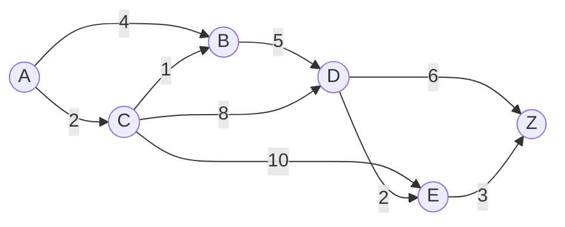
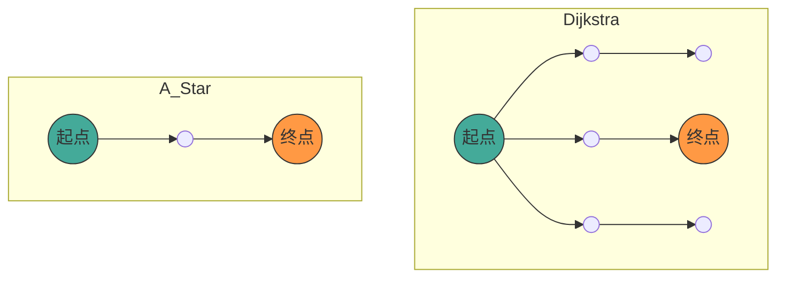

## 1. 引言

在现代计算机科学中， **图论** ([Graph](https://kenji.blog/zh-cn/p/tree-graph-data-structures-search-dfs-bfs-dijkstra/) Theory) 为对网络结构进行建模提供了强大的数学框架。在我们的日常生活中，汽车导航、铁路换乘指南、互联网路由，甚至游戏AI的路径搜索等各种场景中，都使用了计算“最短路径”的技术。

本文将从作为路径搜索基础的图论数学定义开始，全面讲解代表性的搜索算法—— **[Dijkstra](https://kenji.blog/zh-cn/p/tree-graph-data-structures-search-dfs-bfs-dijkstra/)算法** (Dijkstra's Algorithm)，以及对其进行进一步发展的 **A*算法** (A-Star Algorithm) 的原理、数学证明，以及使用Python进行实践的实现方法。

## 2. 图论基础

在进入算法的讲解之前，我们首先从数学上定义目标数据结构——图。

### 2.1 图的数学定义

图 $ G $ 由顶点 (Vertex/Node) 集合 $ V $ 和边 (Edge) 集合 $ E $ 的元组来定义。

$$
G = (V, E)
$$

在这里，边集合 $ E $ 的元素 $ e $ 是连接两个顶点 $ u, v \in V $ 的边，表示为 $ e = (u, v) $。

- **无向图** (Undirected Graph)：边没有方向的图。如果 $ (u, v) \in E $，那么 $ (v, u) \in E $。
- **有向图** (Directed Graph)：边有方向的图。$ (u, v) $ 和 $ (v, u) $ 是区分开的。

### 2.2 加权图 (Weighted Graph)

在实际的路径搜索中，需要考虑距离、时间、成本等因素。因此，我们考虑为每条边分配“权重” (Weight) 的 **加权图**。引入权重函数 $ w: E \rightarrow \mathbb{R} $ 后，图被定义为 $ G = (V, E, w) $。

$$
w(u, v) \ge 0
$$

在许多情况下，由于距离或时间不会是负数，因此我们假设边的权重是非负的。



上图是从顶点 $ A $ 到 $ Z $ 的加权有向图示例。边上的数字表示成本（权重）。

### 2.3 最短路径问题的公式化

设从起点 (Source) $ s \in V $ 到终点 (Target) $ t \in V $ 的路径 (Path) $ P $ 为顶点序列 $ (v_0, v_1, \dots, v_k) $（其中 $ v_0 = s, v_k = t $），并且对于每个 $ i $，都有 $ (v_i, v_{i+1}) \in E $。
该路径 $ P $ 的总成本 $ W(P) $ 由路径上边的权重总和表示。

$$
W(P) = \sum_{i=0}^{k-1} w(v_i, v_{i+1})
$$

**最短路径问题** (Shortest Path Problem) 是指在所有可能的路径 $ P $ 中，寻找使 $ W(P) $ 最小的路径 $ P^* $ 的问题。

---

## 3. [Dijkstra](https://kenji.blog/zh-cn/p/tree-graph-data-structures-search-dfs-bfs-dijkstra/)算法 (Dijkstra's Algorithm)

由艾兹格·迪科斯彻提出的 **Dijkstra算法** 是一种用于在具有非负权重的图中，求从单一起点到所有顶点的最短路径的算法。

### 3.1 算法的直观理解

Dijkstra算法基于“依次确定距离起点最近的未确定顶点”的贪心算法 (Greedy Algorithm)。

1. 准备一个保存距起点的暂定距离的数组，将起点初始化为 `0`，其余初始化为 `无穷大` ( $ \infty $ )。
2. 在未确定的顶点中，选择暂定距离最小的顶点 $ u $，将其设为“已确定”。
3. 对于与顶点 $ u $ 相邻的所有顶点 $ v $，如果经过 $ u $ 会使暂定距离变短，则更新距离（此操作称为 **松弛** (Relaxation)）。
4. 重复步骤2到3，直到所有顶点都已确定，或者目标顶点已确定。

### 3.2 松弛 (Relaxation) 的数学表达

松弛从顶点 $ u $ 到 $ v $ 的边的操作可以用以下公式表示。这里，$ d[v] $ 表示从起点到 $ v $ 的当前暂定最短距离。

$$
\text{如果 } d[u] + w(u, v) < d[v]: \\\\
d[v] = d[u] + w(u, v)
$$

### 3.3 使用 Python 实现 [Dijkstra](https://kenji.blog/zh-cn/p/tree-graph-data-structures-search-dfs-bfs-dijkstra/)算法

为了高效地实现，我们使用优先队列 (Priority Queue) 作为获取最小值的数据结构。在 Python 中，可以使用 `heapq` 模块。

```python
import heapq

def dijkstra(graph, start):
    """
    graph: 字典类型。graph[u] = {v1: weight1, v2: weight2, ...} 的格式
    start: 起点节点
    """
    # 保存距离的字典。初始值为无穷大
    distances = {node: float('inf') for node in graph}
    distances[start] = 0
    
    # 优先队列 [(距离, 节点)]
    pq = [(0, start)]
    
    # 用于恢复路径的字典
    previous_nodes = {node: None for node in graph}

    while pq:
        current_distance, current_node = heapq.heappop(pq)

        # 如果已经处理过（找到了更短的路径），则跳过
        if current_distance > distances[current_node]:
            continue

        # 探索相邻节点
        for neighbor, weight in graph[current_node].items():
            distance = current_distance + weight

            # 松弛操作 (Relaxation)
            if distance < distances[neighbor]:
                distances[neighbor] = distance
                previous_nodes[neighbor] = current_node
                heapq.heappush(pq, (distance, neighbor))

    return distances, previous_nodes
```

### 3.4 关于时间复杂度

当使用二叉堆 (Binary [Heap](https://kenji.blog/zh-cn/p/c-language-pointers-memory-management-stack-heap/)) 作为优先队列时，每个顶点从队列中取出1次，每条边被松弛1次。
因此，时间复杂度为 $ O((|V| + |E|) \log |V|) $。如果使用斐波那契堆，理论上可以改进到 $ O(|E| + |V| \log |V|) $，但在实际应用中多使用二叉堆。

---

## 4. A* 算法 (A-Star Algorithm)

[Dijkstra](https://kenji.blog/zh-cn/p/tree-graph-data-structures-search-dfs-bfs-dijkstra/)算法虽然可靠，但由于不考虑目的地的方向而向所有方向扩展搜索，因此往往会产生很多无效的搜索。解决这个问题的是 **A*算法**。

### 4.1 引入启发式函数

A*算法通过使用从当前节点到终点的“估计距离”，优先向终点方向进行搜索。返回这个估计距离的函数称为 **启发式函数** (Heuristic Function) $ h(n) $。

在 A* 中，用于评估节点 $ n $ 的函数 $ f(n) $ 定义如下。

$$
f(n) = g(n) + h(n)
$$

这里，
- $ g(n) $：从起点到节点 $ n $ 的实际成本（与Dijkstra算法中的距离相同）
- $ h(n) $：从节点 $ n $ 到终点的估计成本（启发式）
- $ f(n) $：从起点经过 $ n $ 前往终点路径的估计总成本

### 4.2 启发式的条件

为了让 A* 始终 **找到最短路径（最优性）**，启发式函数 $ h(n) $ 必须满足以下条件。

1. **可采纳性** (Admissible)：
   估计成本绝不能超过实际成本。
   $$
   h(n) \le h^*(n)
   $$
   （ $ h^*(n) $ 是从 $ n $ 到终点的真实最短成本）

2. **一致性** (Consistent / Monotonic)：
   对于任意相邻节点 $ m, n $，必须满足三角不等式。
   $$
   h(m) \le c(m, n) + h(n)
   $$
   这里 $ c(m, n) $ 是从 $ m $ 到 $ n $ 的边的成本。一致的启发式会自动满足可采纳性。

### 4.3 代表性的启发式函数

在网格上的路径搜索中，经常使用以下距离函数。

- **曼哈顿距离** (Manhattan Distance)：当只能上下左右移动时
  $$
  h(n) = |x_n - x_{goal}| + |y_n - y_{goal}|
  $$
- **欧几里得距离** (Euclidean Distance)：当可以向任意方向直线移动时
  $$
  h(n) = \sqrt{(x_n - x_{goal})^2 + (y_n - y_{goal})^2}
  $$

### 4.4 A* 算法的 Python 实现

A* 的实现与 Dijkstra 算法非常相似，不同之处在于优先队列的键变为 $ f(n) $。

```python
import heapq

def a_star(graph, start, goal, heuristic_func):
    """
    graph: 带有节点间成本的字典
    start: 起点
    goal: 终点
    heuristic_func: 启发式函数 h(node, goal)
    """
    open_set = []
    heapq.heappush(open_set, (0, start))
    
    # 从起点的实际成本 g(n)
    g_score = {node: float('inf') for node in graph}
    g_score[start] = 0
    
    # f(n) = g(n) + h(n)
    f_score = {node: float('inf') for node in graph}
    f_score[start] = heuristic_func(start, goal)
    
    came_from = {}

    while open_set:
        # 获取 f(n) 最小的节点
        current_f, current_node = heapq.heappop(open_set)

        if current_node == goal:
            return reconstruct_path(came_from, current_node)

        for neighbor, weight in graph[current_node].items():
            tentative_g_score = g_score[current_node] + weight

            if tentative_g_score < g_score[neighbor]:
                # 发现了更好的路径
                came_from[neighbor] = current_node
                g_score[neighbor] = tentative_g_score
                f_score[neighbor] = tentative_g_score + heuristic_func(neighbor, goal)
                
                # 添加到 open_set
                heapq.heappush(open_set, (f_score[neighbor], neighbor))

    return None # 如果没有找到路径

def reconstruct_path(came_from, current):
    path = [current]
    while current in came_from:
        current = came_from[current]
        path.append(current)
    path.reverse()
    return path
```

### 4.5 [Dijkstra](https://kenji.blog/zh-cn/p/tree-graph-data-structures-search-dfs-bfs-dijkstra/) 算法与 A* 的比较

以下的 Mermaid 图展示了 Dijkstra 算法和 A* 搜索范围的概念比较。Dijkstra 算法呈同心圆状向外扩展搜索，而 A* 则向终点方向呈拉长的椭圆形进行搜索。



---

## 5. 路径搜索的应用与未来展望

[Dijkstra](https://kenji.blog/zh-cn/p/tree-graph-data-structures-search-dfs-bfs-dijkstra/)算法和A*算法虽然是基础方法，但却是许多应用技术的基础。

1. **双向搜索** (Bidirectional Search)：
   同时从起点和终点进行搜索，并在中间汇合，从而大幅减少搜索空间的方法。
2. **D* 算法** (Dynamic A*)：
   在动态出现未知障碍物的环境中（如机器人的自动驾驶等），高效地重新计算路径的方法。
3. **JPS** (Jump Point Search)：
   在均匀的网格地图上，进一步加速 A* 搜索的方法。利用对称性跳过不必要的节点。

路径搜索算法是一个将图论的数学美感与计算机科学的算法效率完美融合的领域。

## 6. 总结

本文从图论的基础定义出发，讲解了 Dijkstra算法和A*算法的数学背景、具体机制，以及使用Python的实现示例。

- **Dijkstra算法** 对所有节点进行同等评估，保证能找到确实的最短路径。
- **A*算法** 通过引入启发式函数 $ h(n) $，实现了向终点方向的高效搜索。

这些知识不仅仅停留在对算法的理解上，更成为了将复杂的现实世界问题抽象为“图”这种数学模型，并推导出最优解的强大思考工具。请务必运行实际代码，体验其强大之处。
