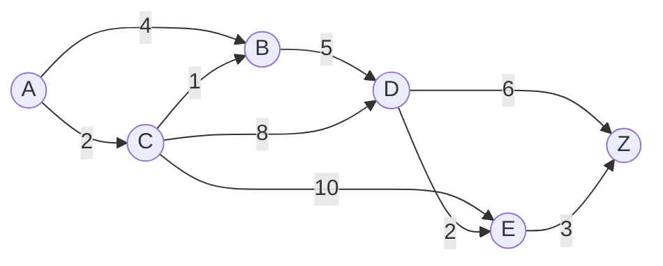
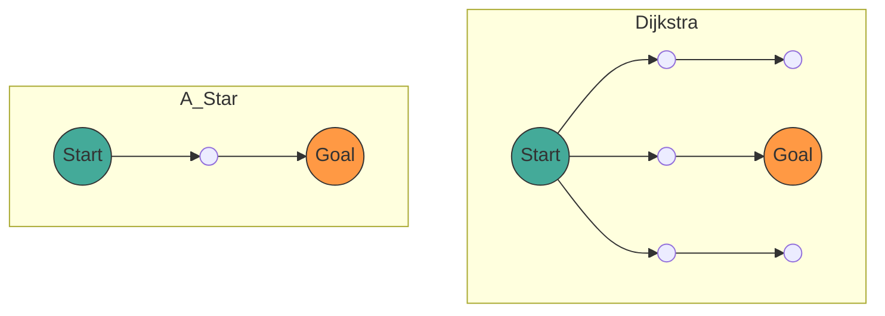

## 1. 前言

在現代計算機科學中， **圖論** (Graph Theory) 為了對網路結構建立模型，提供了強大的數學框架。在我們的日常生活中，無論是汽車導航、鐵路轉乘指南、網際網路路由，甚至是遊戲 AI 的路徑搜尋等各種場景，都運用了計算「最短路徑」的技術。

本文將從作為路徑搜尋基礎的圖論數學定義開始，網羅並徹底解說代表性的搜尋演算法 **Dijkstra 演算法** (Dijkstra's Algorithm) ，以及將其進一步發展的 **A* 演算法** (A-Star Algorithm) 的運作機制、數學證明，還有使用 Python 進行實作的方法。

## 2. 圖論基礎

在進入演算法的解說之前，首先在數學上定義目標的資料結構，也就是圖 (Graph)。

### 2.1 圖的數學定義

圖 $ G $ 是由頂點 (Vertex/Node) 集合 $ V $ 與邊 (Edge) 集合 $ E $ 所構成的集合對。

$$
G = (V, E)
$$

在此，邊集合 $ E $ 的元素 $ e $ 是連接兩個頂點 $ u, v \in V $ 的邊，表示為 $ e = (u, v) $。

- **無向圖** (Undirected Graph)：邊沒有方向的圖。若 $ (u, v) \in E $ 則 $ (v, u) \in E $。
- **有向圖** (Directed Graph)：邊有方向的圖。$ (u, v) $ 與 $ (v, u) $ 是不同的。

### 2.2 權重圖 (Weighted Graph)

在實際的路徑搜尋中，必須考慮距離、時間、成本等因素。因此，我們考慮在各邊分配了「權重」 (Weight) 的 **權重圖** 。導入權重函數 $ w: E \rightarrow \mathbb{R} $ 後，圖定義為 $ G = (V, E, w) $。

$$
w(u, v) \ge 0
$$

在多數情況下，由於距離和時間不會是負數，我們假設邊的權重為非負數。



上圖是從頂點 $ A $ 到 $ Z $ 的權重有向圖範例。邊上的數字代表成本（權重）。

### 2.3 最短路徑問題的公式化

假設從起點 (Source) $ s \in V $ 到終點 (Target) $ t \in V $ 的路徑 (Path) $ P $，為頂點的序列 $ (v_0, v_1, \dots, v_k) $ （其中 $ v_0 = s, v_k = t $ ），並對於每個 $ i $ 皆有 $ (v_i, v_{i+1}) \in E $。
此路徑 $ P $ 的總成本 $ W(P) $，以路徑上邊的權重總和來表示。

$$
W(P) = \sum_{i=0}^{k-1} w(v_i, v_{i+1})
$$

**最短路徑問題** (Shortest Path Problem) 即是從所有可能路徑 $ P $ 中，尋找能使 $ W(P) $ 最小化的路徑 $ P^* $ 的問題。

---

## 3. Dijkstra 演算法 (Dijkstra's Algorithm)

由艾茲赫爾·戴克斯特拉 (Edsger W. Dijkstra) 提出的 **Dijkstra 演算法** ，是在擁有非負權重的圖中，求得單一起點到所有頂點的最短路徑之演算法。

### 3.1 演算法的直觀理解

Dijkstra 演算法基於「依序確定距離起點最近且尚未確定的頂點」之貪婪法 (Greedy Algorithm)。

1. 準備一個陣列來保存從起點出發的暫定距離，將起點初始化為 `0`，其餘初始化為 `無限大` ( $ \infty $ )。
2. 在尚未確定的頂點中，選擇暫定距離最小的頂點 $ u $，將其設為「已確定」。
3. 對於所有與頂點 $ u $ 相鄰的頂點 $ v $，若經由 $ u $ 的暫定距離較短，則更新距離（此操作稱為 **鬆弛** (Relaxation)）。
4. 重複步驟 2 至 3，直到所有頂點都已確定，或是目的頂點已被確定為止。

### 3.2 鬆弛 (Relaxation) 的數學表達

鬆弛從頂點 $ u $ 到 $ v $ 邊的操作，以數學式表示如下。此處的 $ d[v] $ 代表從起點到 $ v $ 目前的暫定最短距離。

$$
\text{若 } d[u] + w(u, v) < d[v]: \\\\
d[v] = d[u] + w(u, v)
$$

### 3.3 Dijkstra 演算法的 Python 實作

為了達到高效率實作，使用優先權佇列 (Priority Queue) 作為取得最小值的資料結構。在 Python 中可利用 `heapq` 模組。

```python
import heapq

def dijkstra(graph, start):
    """
    graph: 字典型別。格式為 graph[u] = {v1: weight1, v2: weight2, ...}
    start: 起點的節點
    """
    # 儲存距離的字典。初始值為無限大
    distances = {node: float('inf') for node in graph}
    distances[start] = 0
    
    # 優先權佇列 [(距離, 節點)]
    pq = [(0, start)]
    
    # 用於還原路徑的字典
    previous_nodes = {node: None for node in graph}

    while pq:
        current_distance, current_node = heapq.heappop(pq)

        # 若已處理過（已找到更短的路徑）則略過
        if current_distance > distances[current_node]:
            continue

        # 探索相鄰節點
        for neighbor, weight in graph[current_node].items():
            distance = current_distance + weight

            # 鬆弛操作 (Relaxation)
            if distance < distances[neighbor]:
                distances[neighbor] = distance
                previous_nodes[neighbor] = current_node
                heapq.heappush(pq, (distance, neighbor))

    return distances, previous_nodes
```

### 3.4 關於時間複雜度

若使用二元樹堆積 (Binary Heap) 作為優先權佇列，每個頂點會從佇列中取出 1 次，每條邊會被鬆弛 1 次。
因此，時間複雜度為 $ O((|V| + |E|) \log |V|) $。若使用費波那契堆積 (Fibonacci Heap)，理論上可改善至 $ O(|E| + |V| \log |V|) $，但實務上大多使用二元樹堆積。

---

## 4. A* 演算法 (A-Star Algorithm)

Dijkstra 演算法雖然穩當，但因為沒有考慮目的地的方向而向所有方向擴展搜尋，可能會產生許多無效的搜尋。為了解決這個問題，便有了 **A* 演算法** 。

### 4.1 導入啟發式函數

A* 演算法透過使用目前節點到目標的「估計距離」，優先朝目標方向進行搜尋。回傳此估計距離的函數稱為 **啟發式函數** (Heuristic Function) $ h(n) $。

在 A* 中，評估節點 $ n $ 的函數 $ f(n) $ 定義如下。

$$
f(n) = g(n) + h(n)
$$

其中，
- $ g(n) $：從起點到節點 $ n $ 的實際成本（與 Dijkstra 演算法中的距離相同）
- $ h(n) $：從節點 $ n $ 到終點的估計成本（啟發式）
- $ f(n) $：從起點經過 $ n $ 到達終點路徑的估計總成本

### 4.2 啟發式函數的條件

為了讓 A* 總是能 **找到最短路徑（最佳性）** ，啟發式函數 $ h(n) $ 必須滿足以下條件。

1. **可容允的** (Admissible)：
   估計成本絕不超過實際成本。
   $$
   h(n) \le h^*(n)
   $$
   （ $ h^*(n) $ 是從 $ n $ 到終點的真實最短成本）

2. **一致性** (Consistent / Monotonic)：
   對於任意相鄰的節點 $ m, n $，滿足三角不等式。
   $$
   h(m) \le c(m, n) + h(n)
   $$
   此處的 $ c(m, n) $ 是從 $ m $ 到 $ n $ 的邊成本。一致的啟發式函數必定也是可容允的。

### 4.3 代表性的啟發式函數

在網格上的路徑搜尋中，常使用以下距離函數。

- **曼哈頓距離** (Manhattan Distance)：僅能上下左右移動時
  $$
  h(n) = |x_n - x_{goal}| + |y_n - y_{goal}|
  $$
- **歐幾里得距離** (Euclidean Distance)：可朝任意方向直線移動時
  $$
  h(n) = \sqrt{(x_n - x_{goal})^2 + (y_n - y_{goal})^2}
  $$

### 4.4 A* 演算法的 Python 實作

A* 的實作與 Dijkstra 演算法非常相似，差別在於優先權佇列的鍵值改為 $ f(n) $。

```python
import heapq

def a_star(graph, start, goal, heuristic_func):
    """
    graph: 包含節點間成本的字典
    start: 起點
    goal: 終點
    heuristic_func: 啟發式函數 h(node, goal)
    """
    open_set = []
    heapq.heappush(open_set, (0, start))
    
    # 來自起點的實際成本 g(n)
    g_score = {node: float('inf') for node in graph}
    g_score[start] = 0
    
    # f(n) = g(n) + h(n)
    f_score = {node: float('inf') for node in graph}
    f_score[start] = heuristic_func(start, goal)
    
    came_from = {}

    while open_set:
        # 取得 f(n) 最小的節點
        current_f, current_node = heapq.heappop(open_set)

        if current_node == goal:
            return reconstruct_path(came_from, current_node)

        for neighbor, weight in graph[current_node].items():
            tentative_g_score = g_score[current_node] + weight

            if tentative_g_score < g_score[neighbor]:
                # 發現更好的路徑
                came_from[neighbor] = current_node
                g_score[neighbor] = tentative_g_score
                f_score[neighbor] = tentative_g_score + heuristic_func(neighbor, goal)
                
                # 加入 open_set
                heapq.heappush(open_set, (f_score[neighbor], neighbor))

    return None # 找不到路徑的情況

def reconstruct_path(came_from, current):
    path = [current]
    while current in came_from:
        current = came_from[current]
        path.append(current)
    path.reverse()
    return path
```

### 4.5 Dijkstra 演算法與 A* 的比較

以下的 Mermaid 圖表是 Dijkstra 演算法與 A* 搜尋範圍的概念比較。Dijkstra 演算法以同心圓狀擴展搜尋，而 A* 則是向目標方向拉長成橢圓狀進行搜尋。



---

## 5. 路徑搜尋的應用與未來展望

Dijkstra 演算法與 A* 演算法雖然是基礎手法，卻也是許多應用技術的基礎。

1. **雙向搜尋** (Bidirectional Search)：
   從起點與終點同時進行搜尋，並在中途會合，藉此大幅減少搜尋空間的手法。
2. **D* 演算法** (Dynamic A*)：
   在未知障礙物動態出現的環境（如機器人自動行駛等）中，高效率重新計算路徑的手法。
3. **JPS** (Jump Point Search)：
   在均勻的網格地圖上，進一步加速 A* 搜尋的手法。利用對稱性跳過不必要的節點。

路徑搜尋演算法完美融合了圖論的數學美感與計算機科學的演算法效率，是一個令人著迷的領域。

## 6. 總結

本文從圖論的基礎定義出發，解說了 Dijkstra 演算法與 A* 演算法的數學背景、具體機制，以及使用 Python 實作的範例。

- **Dijkstra 演算法** 均等地評估所有節點，保證能得到確實的最短路徑。
- **A* 演算法** 透過導入啟發式函數 $ h(n) $，實現朝向目標的有效率搜尋。

這些知識不單只是對演算法的理解，更將複雜的現實世界問題轉化為「圖」的數學模型，成為推導出最佳解的強大思考工具。請務必試著執行實際的程式碼，體驗其強大之處。
