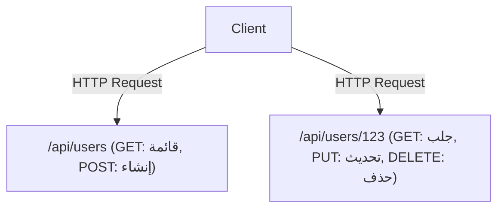

# GraphQL و REST API: صدام وتكامل فلسفات التصميم

في تطوير البرمجيات الحديثة، يعد تصميم واجهة برمجة التطبيقات (API) التي تربط الواجهة الأمامية بالخلفية عنصراً حاسماً يحدد أداء النظام بأكمله وتجربة التطوير. REST (نقل الحالة التمثيلية)، التي سادت كمعيار واقعي لفترة طويلة، و GraphQL، النموذج الجديد الذي أنشأته فيسبوك (Meta حالياً). في هذا المقال، سنتعمق في الاختلافات الأساسية في فلسفة التصميم بين الاثنين، ونقاط القوة والضعف لكل منهما، وأيهما يجب اعتماده في تطوير المنتجات في الواقع، أو كيف ينبغي أن يتعايشا.

## أصل REST API: جمالية التوجيه نحو الموارد وانعدام الحالة

REST هو أسلوب معماري اقترحه Roy Fielding في أطروحته للدكتوراه عام 2000. إنه يحقق أقصى استفادة من المبادئ الأساسية لبروتوكول HTTP ويحدد قيوداً بسيطة وقوية لتوسيع نطاق الأنظمة.

### البنية الموجهة نحو الموارد (ROA)
جوهر REST هو "المورد". يحتوي كل بيانات على معرّف موارد منتظم (URI) فريد، ويتم إجراء العمليات على الموارد باستخدام طرق HTTP (مثل GET و POST و PUT و DELETE).



### التخزين المؤقت (Cache) وقابلية التوسع
من خلال الاعتماد على المواصفات القياسية لـ HTTP، يمكنك استخدام آليات التخزين المؤقت القوية التي توفرها البنية التحتية الحالية للويب كما هي، مثل المتصفحات، وشبكات توصيل المحتوى (CDN)، والخوادم الوكيلة (Proxy). هذه ميزة لا تقدر بثمن في التعامل مع الزيارات الهائلة.

## الانفصال عن الواقع: تحديات عصر الهواتف المحمولة

ومع ذلك، مع انتشار تطبيقات الهواتف المحمولة وزيادة ثراء وتعقيد واجهات المستخدم (UI)، بدأت واجهات برمجة تطبيقات REST الصارمة الموجهة نحو الموارد تظهر بعض القيود.

### 1. الجلب الزائد للبيانات (Over-fetching)
وهي المشكلة حيث يحتاج العميل فقط إلى "اسم المستخدم"، ولكن عند استدعاء `/api/users/123`، يتم إرسال كمية كبيرة من البيانات غير الضرورية، مثل رابط صورة الملف الشخصي، وتاريخ الميلاد، والعنوان. على شبكات الهواتف المحمولة، يؤدي نقل البيانات غير الضروري هذا إلى تدهور الأداء.

### 2. الجلب الناقص للبيانات (Under-fetching) ومشكلة N+1
عندما تكون هناك حاجة لموارد متعددة لعرض شاشة ما، فإن طلباً واحداً لـ API لا يوفر بيانات كافية، وعليك تكرار الطلبات عدة مرات.
على سبيل المثال، لجلب "قائمة مقالات مستخدم معين، وأحدث 3 تعليقات لكل مقال":
1. جلب معلومات المستخدم
2. جلب قائمة مقالات المستخدم
3. جلب التعليقات لكل مقال (N طلب إذا كان هناك N مقالات)
يعد هذا أحد أسباب مشكلة N+1 الشهيرة، مما يؤدي إلى زيادة زمن الوصول (Latency).

## ولادة GraphQL: جلب البيانات بطلب من العميل

في عام 2012، واجهت فيسبوك هذه التحديات أثناء مشروع إعادة بناء تطبيق الهاتف المحمول الخاص بها، وأنشأت GraphQL لحلها (تم جعلها مفتوحة المصدر في عام 2015).

GraphQL هي لغة استعلام تتيح للعميل وصف بنية "البيانات المطلوبة" بدقة.

```graphql
query GetUserPosts {
  user(id: "123") {
    name
    posts(first: 5) {
      title
      comments(first: 3) {
        author
        content
      }
    }
  }
}
```

### حل هيكل الرسم البياني بواسطة Schema و Resolver
يحتوي خادم GraphQL على "Schema" (مخطط) يحدد بيانات النظام بأكمله كبنية رسم بياني واحدة. يتم تحليل الاستعلام المرسل من العميل وفقاً للمخطط، وتقوم وظيفة "Resolver" المقابلة لكل حقل بجمع البيانات في الخلفية. ونتيجة لذلك، يمكن للعميل إرسال طلب واحد فقط إلى نقطة نهاية واحدة (عادةً `/graphql`) والحصول على جميع البيانات الضرورية بالظبط دون زيادة أو نقصان.

## لا توجد رصاصة سحرية: ثمن GraphQL

قد تبدو GraphQL كتقنية أحلام لمطوري الواجهة الأمامية، لكنها تجلب تعقيداً جديداً إلى الواجهة الخلفية.

### صعوبة التخزين المؤقت (Caching)
بينما يمكن لـ REST استخدام آلية التخزين المؤقت لـ HTTP بشفافية، تُرسل طلبات GraphQL أساساً كطلبات POST إلى نقطة نهاية واحدة، لذا فإن التخزين المؤقت على مستوى HTTP لا يعمل. هناك حاجة إلى التخزين المؤقت الموحد (Normalized Cache) باستخدام مكتبات العميل مثل Apollo، وجهود إضافية لتخزين الاستعلامات مؤقتاً عند حافة CDN.

### الاستعلامات المستمرة (Persisted Queries)
كحل عملي لتحديات الأمان والتخزين المؤقت، غالباً ما يتم استخدام "الاستعلامات المستمرة" في بيئات الإنتاج. هذه آلية حيث يتم تسجيل قيمة التجزئة (Hash) للاستعلام الذي يصدره العميل على الخادم في وقت البناء (Build)، ويتم إرسال قيمة التجزئة فقط أثناء التنفيذ (كطلب GET). هذا يمنع الاستعلامات الضخمة الخبيثة ويسمح باستخدام التخزين المؤقت لـ HTTP.

## الخلاصة: من الصدام إلى التكامل

لن تقضي REST أو GraphQL على الأخرى تماماً.

- **الحالات التي تناسبها REST:** واجهات برمجة التطبيقات العامة، والتواصل بين الخدمات المصغرة (Microservices)، ورفع/تنزيل الملفات الثنائية، والأنظمة التي تتمحور حول عمليات CRUD البسيطة.
- **الحالات التي تناسبها GraphQL:** تطبيقات الهواتف المحمولة وتطبيقات الصفحة الواحدة (SPA) ذات واجهات المستخدم المعقدة، والطبقات التي تجمع خدمات خلفية متعددة (BFF)، والمنتجات التي تحتاج إلى التكيف بمرونة مع المتطلبات سريعة التغير.

في البنى الحديثة، أصبح شكل "التكامل" هو السائد، حيث تتواصل الخدمات المصغرة الداخلية باستخدام gRPC أو REST، بينما توفر الطبقة المواجهة للواجهة الأمامية (API Gateway أو BFF) خدمة GraphQL. إن الفهم العميق لخصائص التقنيات واستخدامها في المكان المناسب سيكون مفتاحاً لتصميم نظام متميز.
