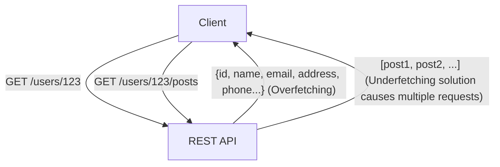
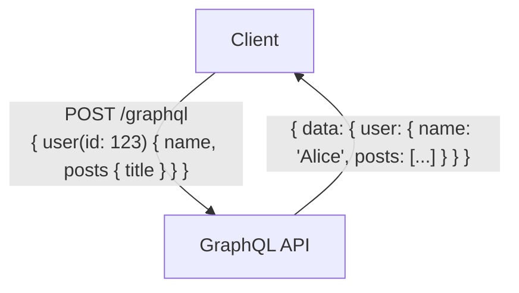

# GraphQL مقابل REST API: الاختلافات الجوهرية في فلسفة التصميم وحالات الاستخدام

في تطوير تطبيقات الويب وتطبيقات الهاتف المحمول الحديثة، يعد تصميم "واجهة برمجة التطبيقات" (API) التي تربط بين الواجهة الخلفية والواجهة الأمامية عنصرًا بالغ الأهمية يؤثر بشكل مباشر على أداء النظام العام وقابليته للصيانة. لفترة طويلة، كانت "REST" (نقل الحالة التمثيلية) هي المعيار الفعلي لتصميم واجهات برمجة التطبيقات. ولكن في السنوات الأخيرة، انتشر "GraphQL" بسرعة كنموذج جديد لتلبية المتطلبات المتزايدة التعقيد للواجهات الأمامية.

تقدم هذه المقالة، من منظور تقني احترافي، تحليلاً مفصلاً وعميقًا بدءًا من النمط المعماري الذي شكل أساس REST، ووصولاً إلى التحديات الحديثة التي يسعى GraphQL لحلها (مثل الجلب المفرط والجلب الناقص للبيانات). بالإضافة إلى ذلك، سنناقش مزايا وعيوب التنفيذ لكلا النهجين، ونقدم إرشادات شاملة حول "أي منهما يجب استخدامه وفي أي نوع من المشاريع".

## 1. فلسفة وبنية REST API

تعتبر REST (Representational State Transfer) نمطًا لمعمارية البرمجيات اقترحه روي فيلدنج (Roy Fielding) في أطروحته للدكتوراه عام 2000. إن REST ليس مجرد مواصفة أو بروتوكول، بل هو "مجموعة من القيود" لبناء أنظمة موزعة (خاصة شبكة الويب العالمية) قابلة للتطوير وقوية.

### المبادئ الأساسية لـ REST

تشمل القيود الرئيسية لـ REST التي حددها روي فيلدنج ما يلي:

1. **فصل العميل عن الخادم (Client-Server)**:
   فصل الاهتمامات المتعلقة بواجهة المستخدم (العميل) عن الاهتمامات المتعلقة بتخزين البيانات (الخادم). يؤدي ذلك إلى تحسين قابلية نقل العميل وضمان قابلية التوسع للخادم.
2. **عدم الاحتفاظ بالحالة (Stateless)**:
   لا يحتفظ الخادم بحالة جلسة العميل. يجب أن يحتوي كل طلب من العميل على جميع المعلومات اللازمة لمعالجة هذا الطلب. يقلل هذا من العبء على الخادم ويحسن موثوقية النظام.
3. **قابلية التخزين المؤقت (Cacheability)**:
   يجب أن تحتوي الاستجابات على معلومات توضح ما إذا كانت قابلة للتخزين المؤقت أم لا. الاستخدام المناسب للتخزين المؤقت يمكن أن يقلل بشكل كبير من عدد الاتصالات بين العميل والخادم ويعزز كفاءة الشبكة بشكل دراماتيكي.
4. **الواجهة الموحدة (Uniform Interface)**:
   هذا هو القيد الأكثر أهمية الذي يميز REST. يتم تحديد الموارد بشكل فريد بواسطة URI (معرف الموارد الموحد)، ويتم إجراء العمليات الموحدة باستخدام طرق HTTP (مثل GET، POST، PUT، DELETE).
5. **نظام الطبقات (Layered System)**:
   لا يحتاج العميل إلى معرفة ما إذا كان متصلاً مباشرة بالخادم النهائي أم بوكيل وسيط أو موازن أحمال.

### مزايا وتحديات REST API

تتمتع REST API بميزة هائلة تتمثل في القدرة على الاستفادة من البنية التحتية الحالية لبروتوكول HTTP (مثل خوادم التخزين المؤقت، الوكلاء، شبكات توصيل المحتوى CDN) كما هي. ومع ذلك، في التطبيقات الحديثة ذات واجهات المستخدم المعقدة، تم رصد بعض القيود.

#### الجلب المفرط (Overfetching) والجلب الناقص (Underfetching)

- **الجلب المفرط (Overfetching)**:
  حتى إذا كانت شاشة معينة تتطلب فقط اسم المستخدم وصورة الملف الشخصي، فإن استدعاء نقطة النهاية `/users/{id}` سيؤدي إلى جلب كمية كبيرة من البيانات غير الضرورية، مثل العنوان ورقم الهاتف وتاريخ التسجيل. في البيئات ذات النطاق الترددي المحدود مثل شبكات الهاتف المحمول، يؤدي هذا إلى انخفاض فادح في الأداء.
- **الجلب الناقص (Underfetching) ومسألة N+1**:
  لعرض شاشة معينة، يتعين عليك استدعاء نقطة النهاية الأولى (على سبيل المثال: `/users/{id}`)، ثم استخدام المعرف (ID) الذي تم الحصول عليه لاستدعاء نقطة نهاية أخرى (على سبيل المثال: `/users/{id}/posts`) عدة مرات. تحدث هذه المشكلة لأن البيانات المطلوبة ليست مجتمعة في مورد واحد، مما يؤدي إلى زيادة زمن الوصول (Latency).



## 2. ولادة GraphQL والتحول النموذجي

لحل هذه التحديات في REST، وخاصة الاسترداد غير الفعال للبيانات من الأجهزة المحمولة، طورت شركة فيسبوك (حاليًا Meta) تقنية "GraphQL" للاستخدام الداخلي في عام 2012، وأصدرتها كمصدر مفتوح في عام 2015.

### فلسفة تصميم GraphQL

إن GraphQL ليس نمطًا معماريًا مثل REST، بل هو "لغة استعلام" لواجهات برمجة التطبيقات و"بيئة تشغيل" لتنفيذ تلك الاستعلامات. الميزة الأبرز هي **"قدرة العميل على طلب البيانات التي يحتاجها بدقة، بالهيكل الذي يحتاجه، وفي طلب واحد فقط"**.

### نظام الأنواع والتطوير الموجه بالمخطط (Schema-Driven)

يشكل نظام الأنواع القوي (Type System) جوهر GraphQL. فهو يحدد بدقة البيانات التي يمكن أن يوفرها الخادم وعلاقاتها كـ "مخطط" (Schema).

```graphql
type User {
  id: ID!
  name: String!
  email: String
  posts: [Post!]!
}

type Post {
  id: ID!
  title: String!
  content: String!
  author: User!
}

type Query {
  user(id: ID!): User
}
```

هذا المخطط يوضح "العقد" بين مهندسي الواجهة الأمامية ومهندسي الواجهة الخلفية. بفضل ميزة الاستبطان (Introspection) في GraphQL، يمكن استخدام أدوات تطوير قوية (مثل GraphiQL) وإنشاء الأكواد تلقائيًا بناءً على معلومات المخطط، مما يحسن تجربة المطور (DX) بشكل كبير.

### نقطة نهاية واحدة ومرونة الاستعلامات

في حين أن REST يحتوي على نقاط نهاية متعددة لكل مورد، فإن GraphQL عادةً ما يمتلك نقطة نهاية واحدة فقط وهي `/graphql`. يرسل العميل الاستعلامات إلى نقطة النهاية هذه عبر طلب POST.

```graphql
# مثال لطلب من العميل
query {
  user(id: "123") {
    name
    posts {
      title
    }
  }
}
```

استجابةً للطلب أعلاه، يقوم الخادم بإرجاع استجابة JSON تحتوي فقط على الحقول المحددة (`name` و `title` ضمن `posts`). بفضل هذا، يتم حل مشاكل الجلب المفرط والجلب الناقص بشكل مثالي.



## 3. تحديات التنفيذ واستراتيجيات التصميم المتقدمة

يعد GraphQL أداة سحرية للواجهات الأمامية، لكنه يجلب تحديات جديدة في تصميم وتنفيذ الواجهات الخلفية.

### بروز مشكلة N+1 و Dataloader

في GraphQL، مع زيادة عمق تداخل الاستعلامات، يمكن أن تحدث "مشكلة N+1" بسهولة، حيث يزداد عدد استعلامات قاعدة البيانات في الخلفية بشكل انفجاري.
على سبيل المثال، إذا تم إرسال استعلام للحصول على 10 مستخدمين وأحدث 5 منشورات كتبها كل مستخدم، فإن التنفيذ البسيط سيؤدي إلى إجمالي 11 استعلاماً لقاعدة البيانات ("1 للحصول على المستخدمين" + "10 للحصول على منشورات كل مستخدم").

النهج القياسي لحل هذا هو نمط **Dataloader**. يقوم Dataloader بتجميع طلبات جلب البيانات الفردية التي تحدث ضمن دورة حياة الطلب (Batching) وتخزينها مؤقتاً لمنع الاستعلامات المكررة في نفس الطلب (Caching)، مما يحل مشكلة N+1 بكفاءة.

### اختلافات استراتيجية التخزين المؤقت

في REST API، يمكن استخدام آليات التخزين المؤقت القياسية لـ HTTP (مثل رؤوس ETag و Cache-Control لطلبات GET) بسهولة على شبكات CDN والمتصفحات. نظراً لأن URI للمورد فريد، فإن التخزين المؤقت على مستوى البنية التحتية فعال للغاية.

من ناحية أخرى، في GraphQL، تكون جميع الطلبات تقريباً عبارة عن طلبات POST لنقطة نهاية واحدة (`/graphql`)، مما يجعل من الصعب استخدام آليات التخزين المؤقت لـ HTTP كما هي. لذلك، يجب ابتكار حلول للتخزين المؤقت في GraphQL عبر الطبقات التالية:

1. **التخزين المؤقت على جانب العميل**: الاستفادة من ذاكرة التخزين المؤقت المعيارية في الذاكرة التي توفرها مكتبات العملاء المتقدمة مثل Apollo Client و Relay.
2. **الاستعلامات المستمرة (Persisted Queries)**: تقنية تتيح التخزين المؤقت على شبكات CDN من خلال تسجيل الاستعلامات الضخمة والشائعة الاستخدام مسبقاً على الخادم وتحويلها إلى قيم مشفرة (Hashes)، بحيث يمكن استدعاؤها عبر طلبات GET.
3. **التخزين المؤقت للتطبيق على جانب الخادم**: استخدام أدوات مثل Redis لتخزين البيانات مؤقتاً على مستوى أدوات الحل (Resolvers).

### الأمان والتدابير ضد التعقيد

بما أن GraphQL يمنح العميل قدرات استعلام قوية، فهناك خطر حدوث هجمات حجب الخدمة (DoS) حيث يرسل المستخدمون الخبيثون عمداً استعلامات ثقيلة ومتداخلة بعمق لاستنزاف وحدة المعالجة المركزية أو الذاكرة في الخادم.

فيما يلي استراتيجيات التصميم الرئيسية لمنع ذلك:

- **حد عمق الاستعلام (Query Depth Limit)**: تحليل شجرة البناء المجردة (AST) ورفض الاستعلامات التي يتجاوز عمق التداخل فيها حداً معيناً (على سبيل المثال: 5 مستويات).
- **تحليل تعقيد الاستعلام (Query Complexity Analysis)**: تعيين "تكلفة" لكل حقل وحظر التنفيذ إذا تجاوزت التكلفة الإجمالية للاستعلام الحد الأقصى.
- **تحديد المعدل (Rate Limiting)**: تحديد التكلفة الإجمالية للاستعلامات التي يمكن تنفيذها خلال فترة زمنية معينة لكل عنوان IP أو مستخدم.

## 4. REST مقابل GraphQL: حالات الاستخدام المناسبة

لا تعتبر REST و GraphQL بدائل تلغي إحداها الأخرى تماماً، بل يجب اختيار النهج المناسب بناءً على متطلبات المشروع.

### الحالات التي يجب فيها اختيار REST API

- **تطبيقات CRUD البسيطة**: عندما تكون بنية الموارد مسطحة ولا تحتوي على علاقات بيانات معقدة.
- **توفير واجهات برمجة تطبيقات عامة (Public API)**: عند توفير API لعدد غير محدد من المطورين، تعتبر REST الأكثر معيارية وأقل تكلفة من حيث التعلم، ويمكن استدعاؤها بسهولة من أي لغة أو بيئة.
- **نقل الملفات والبث**: التعامل مع البيانات الثنائية، مثل تحميل الصور وبث مقاطع الفيديو، يكون أبسط وأكثر كفاءة في REST (مثل Multipart Form Data).
- **متطلبات قوية للتخزين المؤقت في البنية التحتية**: الأنظمة المتمحورة حول توزيع المحتوى التي تتطلب الاستفادة من شبكات CDN لتخزين الملايين من الطلبات بشكل ثابت للتعامل معها.

### الحالات التي يجب فيها اختيار GraphQL

- **التطبيقات ذات واجهات المستخدم ومتطلبات البيانات المعقدة**: تطبيقات الصفحة الواحدة الحديثة (SPA) وتطبيقات الهاتف المحمول التي تحتاج إلى جمع ودمج البيانات من مصادر متعددة في شاشة واحدة.
- **النشر عبر منصات متعددة**: عندما ترغب في تقديم البيانات بكفاءة عبر API واحدة لعدة عملاء يطلبون البيانات بأشكال مختلفة، مثل الويب و iOS و Android.
- **طبقة BFF (Backend For Frontend) للخدمات المصغرة**: إنها ممتازة جداً كطبقة تجميع (API Gateway/BFF) لجمع الخدمات المصغرة المتناثرة وواجهات برمجة التطبيقات REST الحالية في الواجهة الخلفية، وتقديمها كبنية رسم بياني (Graph) واحدة سهلة الاستخدام للواجهة الأمامية.
- **التطوير الرشيق (Agile) والموجه بالمخطط**: المشاريع التي تشهد تغييرات متكررة في واجهة المستخدم، وما يصاحب ذلك من طلبات كثيرة لتعديل API. يمكن للواجهة الأمامية إضافة أو إزالة البيانات المطلوبة بحرية في الاستعلامات دون انتظار تغييرات الواجهة الخلفية.

## الخلاصة

جلبت بنية REST التي قدمها روي فيلدنج النظام للأنظمة الموزعة، وأرست الأساس للويب اليوم. من ناحية أخرى، وفرت GraphQL سلاحاً قوياً لتلبية المتطلبات المتزايدة التعقيد للواجهة الأمامية، وتحسين تجربة المطورين وأداء العملاء.

لا ينبغي أن نقع في ثنائية بسيطة مفادها أن "REST قديمة و GraphQL جديدة". إن المهندس المعماري المحترف حقاً هو من يفهم بعمق الاختلافات الجوهرية في فلسفة تصميم كليهما، ويقوم بتقييم شامل لخصائص البيانات ومتطلبات الشبكة وأنواع العملاء ومهارات فريق التطوير قبل اختيار البنية المعمارية الأمثل. في بعض الحالات، قد يكون النهج الهجين—حيث يُبنى جوهر النظام باستخدام REST، بينما يُعتمد GraphQL فقط كطبقة BFF للواجهة الأمامية—خياراً قوياً للغاية.
