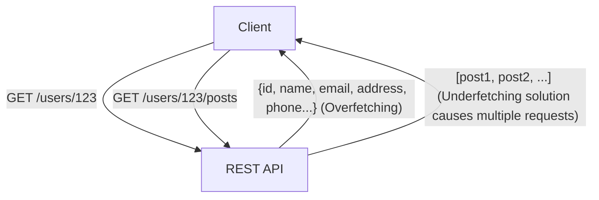
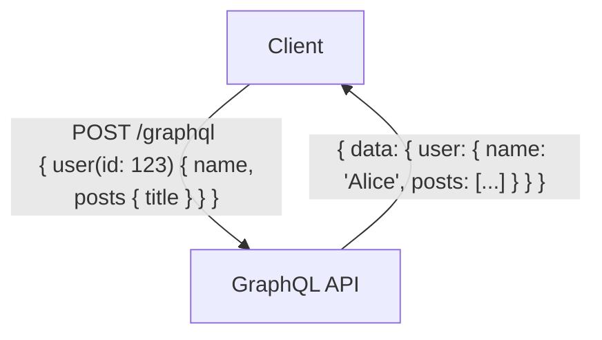

# GraphQL vs. REST API: Grundlegende Unterschiede in der Designphilosophie und deren Anwendungsfälle

Bei der Entwicklung moderner Web- und mobiler Anwendungen ist das Design der "API" (Application Programming Interface), die das Backend mit dem Frontend verbindet, ein äußerst wichtiger Faktor, der direkt mit der Gesamtleistung und der Wartbarkeit des Systems zusammenhängt. "REST" (Representational State Transfer) hat lange Zeit als De-facto-Standard für das API-Design regiert. In den letzten Jahren hat sich jedoch "GraphQL" als neues Paradigma rasant verbreitet, um den immer komplexer werdenden Anforderungen des Frontends gerecht zu werden.

In diesem Artikel werden wir aus der Sicht eines professionellen Technikers die Architekturstile untersuchen, die den Ursprung von REST bilden, sowie die modernen Probleme, die GraphQL zu lösen versucht (Overfetching und Underfetching). Darüber hinaus werden die Vor- und Nachteile beider Ansätze bei der Implementierung sowie Richtlinien zur Entscheidung, "in welcher Art von Projekt welches System eingesetzt werden sollte", detailliert und tiefgehend erläutert.

## 1. Die Philosophie und Architektur von REST API

REST (Representational State Transfer) ist ein Softwarearchitekturstil, der im Jahr 2000 von Roy Fielding in seiner Dissertation vorgeschlagen wurde. REST ist nicht einfach nur eine Spezifikation oder ein Protokoll, sondern eine "Sammlung von Einschränkungen", um verteilte Systeme (insbesondere das World Wide Web) skalierbar und robust aufzubauen.

### Grundprinzipien von REST

Zu den wichtigsten Einschränkungen von REST, wie von Roy Fielding definiert, gehören:

1. **Client-Server-Trennung (Client-Server)**:
   Die Belange der Benutzeroberfläche (Client) und die Belange der Datenspeicherung (Server) werden voneinander getrennt. Dadurch wird die Portabilität des Clients verbessert und die Skalierbarkeit des Servers sichergestellt.
2. **Zustandslosigkeit (Stateless)**:
   Der Server speichert keinen Sitzungsstatus des Clients. Jede Anfrage vom Client muss alle Informationen enthalten, die zur Verarbeitung dieser Anfrage erforderlich sind. Dies reduziert die Serverlast und erhöht die Zuverlässigkeit des Systems.
3. **Cachebarkeit (Cacheability)**:
   Eine Antwort muss Informationen darüber enthalten, ob sie cachebar ist oder nicht. Durch die angemessene Nutzung von Caching kann die Anzahl der Kommunikationen zwischen Client und Server reduziert und die Netzwerkeffizienz drastisch erhöht werden.
4. **Einheitliche Schnittstelle (Uniform Interface)**:
   Dies ist die wichtigste Einschränkung, die REST zu REST macht. Ressourcen werden durch URIs (Uniform Resource Identifiers) eindeutig identifiziert und standardisierte Operationen werden unter Verwendung von HTTP-Methoden (GET, POST, PUT, DELETE usw.) durchgeführt.
5. **Mehrschichtiges System (Layered System)**:
   Der Client muss nicht wissen, ob er direkt mit dem Endserver oder mit einem zwischengeschalteten Proxy oder Load Balancer verbunden ist.

### Vorteile und Herausforderungen der REST API

Die REST API bietet den enormen Vorteil, die vorhandene Infrastruktur des HTTP-Protokolls (Cache-Server, Proxys, CDNs usw.) unverändert nutzen zu können. Bei modernen Anwendungen mit komplexen Benutzeroberflächen wurden jedoch auch einige Einschränkungen festgestellt.

#### Overfetching und Underfetching

- **Overfetching**:
  Dies ist das Problem, dass beim Aufrufen eines Endpunkts wie `/users/{id}` auch dann unnötige Daten wie Adressen, Telefonnummern und Registrierungsdaten in großen Mengen abgerufen werden, wenn auf einem bestimmten Bildschirm nur der Name und das Profilbild des Benutzers benötigt werden. In Umgebungen mit begrenzter Bandbreite, wie z. B. in mobilen Netzwerken, führt dies zu einem fatalen Leistungsabfall.
- **Underfetching (N+1-Problem)**:
  Um einen bestimmten Bildschirm anzuzeigen, muss der erste Endpunkt (z. B. `/users/{id}`) aufgerufen werden, und die dort erhaltene ID muss verwendet werden, um einen weiteren Endpunkt (z. B. `/users/{id}/posts`) mehrmals aufzurufen. Dies geschieht, weil die benötigten Daten nicht in einer einzigen Ressource zusammengefasst sind, was zu einer erhöhten Latenz führt.



## 2. Die Entstehung von GraphQL und der Paradigmenwechsel

Um diese REST-Probleme, insbesondere den ineffizienten Datenabruf von mobilen Geräten, zu lösen, Facebook (heute Meta) entwickelte 2012 intern "GraphQL", das 2015 als Open Source veröffentlicht wurde.

### Die Designphilosophie von GraphQL

GraphQL ist kein Architekturstil wie REST, sondern eine "Abfragesprache" für APIs und eine "Laufzeitumgebung" zur Ausführung dieser Abfragen. Das wichtigste Merkmal ist, **"dass der Client die benötigten Daten in der exakt benötigten Struktur mit einer einzigen Anfrage genau anfordern kann"**.

### Typsystem und Schema-gesteuerte Entwicklung

Den Kern von GraphQL bildet ein starkes Typsystem (Type System). Die Daten, die vom Server bereitgestellt werden können, und ihre Beziehungen werden strikt als "Schema" definiert.

```graphql
type User {
  id: ID!
  name: String!
  email: String
  posts: [Post!]!
}

type Post {
  id: ID!
  title: String!
  content: String!
  author: User!
}

type Query {
  user(id: ID!): User
}
```

Durch dieses Schema wird der "Vertrag" zwischen Frontend- und Backend-Entwicklern klar definiert. Die GraphQL-Introspection-Funktion (Selbstprüfung) ermöglicht den Einsatz leistungsstarker Entwicklungswerkzeuge (wie GraphiQL) und automatischer Codegenerierung basierend auf den Schemainformationen, was die Entwicklererfahrung (DX - Developer Experience) dramatisch verbessert.

### Einzelner Endpunkt und Flexibilität bei Abfragen

Während REST mehrere Endpunkte pro Ressource hat, besitzt GraphQL normalerweise nur einen einzigen Endpunkt, oft `/graphql`. Der Client sendet Abfragen als POST-Anfrage an diesen Endpunkt.

```graphql
# Beispiel für eine Client-Anfrage
query {
  user(id: "123") {
    name
    posts {
      title
    }
  }
}
```

Auf die obige Anfrage gibt der Server eine JSON-Antwort zurück, die nur die angegebenen Felder (den `name` und den `title` der `posts`) enthält. Dadurch werden die Probleme von Overfetching und Underfetching elegant gelöst.



## 3. Implementierungsherausforderungen und fortgeschrittene Designstrategien

Obwohl GraphQL wie ein magisches Werkzeug für das Frontend wirkt, bringt es neue Herausforderungen für das Design und die Implementierung des Backends mit sich.

### Die Manifestation des N+1-Problems und Dataloader

Bei GraphQL tritt mit zunehmender Verschachtelung der Abfragen leicht das "N+1-Problem" auf, bei dem die Datenbankabfragen im Backend explosionsartig ansteigen.
Wenn beispielsweise eine Abfrage zum Abrufen von 10 Benutzern und den 5 neuesten Beiträgen jedes Benutzers gesendet wird, würde eine naive Implementierung "1 Mal für den Benutzerabruf" + "10 Mal für den Beitragsabruf jedes Benutzers", also insgesamt 11 Datenbankabfragen ausführen.

Der Standardansatz zur Lösung dieses Problems ist das **Dataloader**-Muster. Dataloader löst das N+1-Problem effizient, indem individuelle Datenabrufanforderungen, die innerhalb des Lebenszyklus einer Anfrage auftreten, zusammengefasst (gebatcht als eine einzige DB-Abfrage) und gecacht (zur Vermeidung doppelter Abfragen innerhalb derselben Anfrage) werden.

### Unterschiede in den Caching-Strategien

Bei REST-APIs können Standard-HTTP-Caching-Mechanismen (wie ETags und Cache-Control-Header für GET-Anfragen) problemlos von CDNs und Browsern genutzt werden. Da die URI einer Ressource eindeutig ist, ist das Caching auf Infrastrukturebene äußerst effektiv.

Bei GraphQL hingegen werden standardmäßig alle Anforderungen als POST-Anfragen an einen einzigen Endpunkt (`/graphql`) gesendet, was es schwierig macht, HTTP-Level-Caching-Mechanismen direkt zu verwenden. Daher muss das Caching bei GraphQL auf den folgenden Ebenen durchdacht werden:

1. **Clientseitiger Cache**: Verwendung von normalisierten In-Memory-Caches, die von fortschrittlichen Client-Bibliotheken wie Apollo Client oder Relay bereitgestellt werden.
2. **Persistierte Abfragen (Persisted Queries)**: Ein Ansatz, bei dem häufig verwendete, umfangreiche Abfragen vorab auf dem Server registriert und gehasht werden, um sie über GET-Anfragen aufrufbar zu machen, was Caching in CDNs ermöglicht.
3. **Serverseitiger Anwendungs-Cache**: Verwendung von Redis oder Ähnlichem, um Daten auf Resolver-Ebene zwischenzuspeichern.

### Maßnahmen gegen Sicherheitsrisiken und Komplexität

Da GraphQL dem Client leistungsstarke Abfragefähigkeiten verleiht, besteht das Risiko von DoS-Angriffen (Denial of Service), bei denen böswillige Benutzer absichtlich tief verschachtelte, schwere Abfragen senden, um die CPU oder den Speicher des Servers zu erschöpfen.

Zu den repräsentativen Designstrategien, um dies zu verhindern, gehören:

- **Begrenzung der Abfragetiefe (Query Depth Limit)**: Analysiert den abstrakten Syntaxbaum (AST) und lehnt Abfragen ab, deren Verschachtelungstiefe einen bestimmten Wert (z. B. 5 Ebenen) überschreitet.
- **Analyse der Abfragekomplexität (Query Complexity Analysis)**: Weist jedem Feld "Kosten" zu und blockiert die Ausführung, wenn die Gesamtkosten der gesamten Abfrage das Limit überschreiten.
- **Ratenbegrenzung (Rate Limiting)**: Begrenzt die Gesamtkosten der Abfragen, die von einer IP-Adresse oder einem Benutzer innerhalb eines bestimmten Zeitraums ausgeführt werden können.

## 4. REST vs. GraphQL: Anwendungsfälle für den richtigen Einsatz

REST und GraphQL schließen sich nicht gegenseitig aus; keines wird das andere vollständig verdrängen. Es sollte das für die Projektanforderungen am besten geeignete ausgewählt werden.

### Wann Sie die REST API wählen sollten

- **Einfache CRUD-Anwendungen**: Wenn die Ressourcenstruktur flach ist und keine komplexen Datenbeziehungen aufweist.
- **Bereitstellung öffentlicher APIs**: Bei der Bereitstellung einer API für eine unbestimmte Anzahl von Entwicklern ist REST der größte Standard, hat eine geringe Lernkurve und kann leicht von beliebigen Sprachen und Umgebungen aus aufgerufen werden.
- **Dateiübertragungen und Streaming**: Für den Umgang mit Binärdaten, wie beim Hochladen von Bildern oder Video-Streaming, ist REST (wie Multipart-Form-Data) einfacher und effizienter.
- **Hohe Anforderungen an das Infrastruktur-Caching**: In inhaltszentrierten Systemen, die stark auf CDNs angewiesen sind, um Millionen von Anfragen statisch zu cachen und zu verarbeiten.

### Wann Sie GraphQL wählen sollten

- **Anwendungen mit komplexen Benutzeroberflächen und Datenanforderungen**: Moderne SPAs (Single Page Applications) und mobile Apps, die Daten aus mehreren Ressourcen auf einem einzigen Bildschirm sammeln und integrieren müssen.
- **Plattformübergreifende Bereitstellung**: Wenn Daten effizient über eine einzige API an mehrere Clients (Web, iOS, Android usw.) bereitgestellt werden sollen, die Daten in unterschiedlichen Formaten benötigen.
- **BFF-Schicht (Backend For Frontend) für Microservices**: Es eignet sich hervorragend als Aggregationsschicht (API Gateway / BFF), die mehrere im Backend verstreute Microservices oder vorhandene REST-APIs bündelt und dem Frontend als einfach zu nutzende, einzige Graphenstruktur bereitstellt.
- **Agile Entwicklung und Schema-gesteuerter Ansatz**: Projekte mit häufigen UI-Änderungen und daraus resultierenden API-Änderungsanforderungen. Das Frontend kann dem Query frei notwendige Daten hinzufügen oder entfernen, ohne auf Änderungen am Backend warten zu müssen.

## Fazit

Roy Fieldings REST brachte Ordnung in verteilte Systeme und legte den Grundstein für das heutige Web. Auf der anderen Seite liefert GraphQL Entwicklern eine leistungsstarke Waffe, um die zunehmend komplexeren Frontend-Anforderungen zu erfüllen und die Entwicklererfahrung sowie die Clientleistung zu optimieren.

Wir sollten nicht in den einfachen Dualismus von "REST ist alt und GraphQL ist neu" verfallen. Ein wirklich professioneller Architekt versteht die grundlegenden Unterschiede in beiden Designphilosophien tiefgreifend und wählt die optimale Architektur aus, indem er die Eigenschaften der Daten, die Netzwerkanforderungen, die Arten der Clients und die Fähigkeiten des Entwicklungsteams ganzheitlich bewertet. In einigen Fällen kann ein hybrider Ansatz – der Aufbau des Systemkerns mit REST und die Einführung von GraphQL nur als BFF-Schicht für das Frontend – ebenfalls eine äußerst mächtige Option darstellen.
