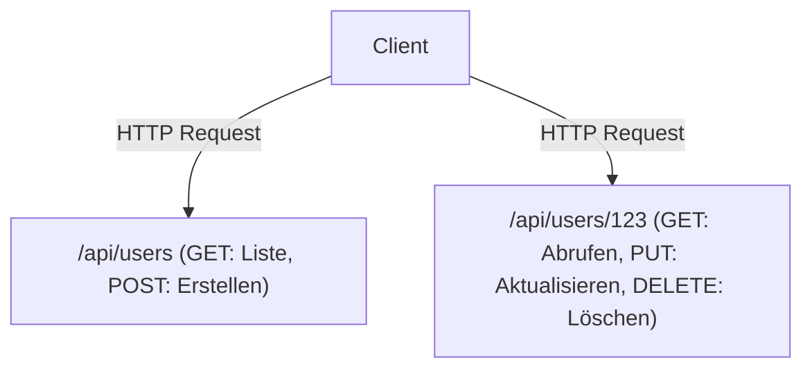

# GraphQL und REST-API: Konflikt und Konvergenz von Designphilosophien

In der modernen Softwareentwicklung ist das Design von APIs, die Frontend und Backend verbinden, ein entscheidendes Element, das die Gesamtleistung und das Entwicklungserlebnis des Systems bestimmt. REST (Representational State Transfer) herrscht seit langem als De-facto-Standard, während GraphQL ein neues, von Facebook (jetzt Meta) geschaffenes Paradigma darstellt. In diesem Artikel werden wir tief in die grundlegenden Unterschiede ihrer jeweiligen Designphilosophien, ihre Stärken und Schwächen eintauchen und erörtern, welches davon man bei der tatsächlichen Produktentwicklung anwenden sollte oder wie sie koexistieren sollten.

## Der Ursprung der REST-API: Die Schönheit von Ressourcenorientierung und Zustandslosigkeit (Statelessness)

REST ist ein Architekturstil, der im Jahr 2000 von Roy Fielding in seiner Dissertation vorgeschlagen wurde. Er definierte einfache, aber leistungsstarke Einschränkungen für die Skalierung von Systemen, während die Grundprinzipien des HTTP-Protokolls optimal genutzt wurden.

### Ressourcenorientierte Architektur (ROA)
Das Herzstück von REST ist die "Ressource". Alle Daten haben einen eindeutigen URI (Uniform Resource Identifier), und HTTP-Methoden (GET, POST, PUT, DELETE usw.) werden verwendet, um Operationen an diesen Ressourcen durchzuführen.



### Caching und Skalierbarkeit
Durch das Aufsetzen auf den Standard-HTTP-Spezifikationen können die leistungsstarken Caching-Mechanismen, die von der bestehenden Web-Infrastruktur wie Browsern, CDNs und Proxy-Servern bereitgestellt werden, direkt genutzt werden. Dies ist ein unschätzbarer Vorteil bei der Verarbeitung von massivem Datenverkehr.

## Die Kluft zur Realität: Herausforderungen des mobilen Zeitalters

Als jedoch mobile Apps immer beliebter wurden und die Benutzeroberflächen reichhaltiger und komplexer wurden, begann die streng ressourcenorientierte REST-API einige ihrer Grenzen zu offenbaren.

### 1. Over-fetching (Überabruf)
Obwohl der Client nur den "Namen des Benutzers" benötigt, wird beim Aufrufen von `/api/users/123` eine große Menge an unnötigen Daten, wie URL des Profilbilds, Geburtsdatum und Adresse, mitgesendet. In mobilen Netzwerken führt diese unnötige Datenübertragung zu Leistungseinbußen.

### 2. Under-fetching (Unterabruf) und das N+1-Problem
Wenn mehrere Ressourcen zur Anzeige eines Bildschirms benötigt werden, reicht eine einzige API-Anfrage nicht aus, um genügend Daten bereitzustellen, und das Problem ist, dass die Anfrage wiederholt werden muss.
Zum Beispiel beim Abrufen von "der Artikelliste eines Benutzers und den 3 neuesten Kommentaren zu jedem Artikel":
1. Benutzerinformationen abrufen
2. Artikelliste des Benutzers abrufen
3. Kommentare für jeden Artikel abrufen (N Anfragen bei N Artikeln)
Dies ist eine Ursache für das berühmte N+1-Problem und führt zu erhöhter Latenz.

## Die Geburt von GraphQL: Client-gesteuerter Datenabruf

Im Jahr 2012 sah sich Facebook bei einem Projekt zum Neuaufbau seiner mobilen App mit diesen Herausforderungen konfrontiert und entwickelte GraphQL, um sie zu lösen (Open Source seit 2015).

GraphQL ist eine Abfragesprache (Query Language), die es dem Client ermöglicht, die Struktur der "gewünschten Daten" genau zu beschreiben.

```graphql
query GetUserPosts {
  user(id: "123") {
    name
    posts(first: 5) {
      title
      comments(first: 3) {
        author
        content
      }
    }
  }
}
```

### Auflösung von Graphenstrukturen durch Schema und Resolver
Ein GraphQL-Server verfügt über ein "Schema", das die Daten des gesamten Systems als Graphenstruktur definiert. Die vom Client gesendeten Abfragen werden gemäß dem Schema analysiert, und "Resolver"-Funktionen, die jedem Feld entsprechen, sammeln die Daten im Backend. Dadurch muss der Client nur eine einzige Anfrage an einen einzelnen Endpunkt (normalerweise `/graphql`) senden, um exakt alle benötigten Daten zu erhalten, weder zu viel noch zu wenig.

## Es gibt kein Wundermittel: Der Preis von GraphQL

Während GraphQL für Frontend-Entwickler wie eine Traumtechnologie erscheint, bringt es neue Komplexität auf der Backend-Seite mit sich.

### Die Schwierigkeit des Cachings
Während REST den HTTP-Caching-Mechanismus transparent nutzen konnte, kann GraphQL nicht von Caching auf HTTP-Ebene profitieren, da standardmäßig alles als POST-Anfragen an einen einzigen Endpunkt gesendet wird. Es ist erforderlich, Lösungen für normalisiertes Caching mithilfe von Client-Bibliotheken wie Apollo zu entwerfen oder Abfragen am Rand (Edge) des CDNs zwischenzuspeichern.

### Persisted Queries (Persistierte Abfragen)
Als praktische Lösung für Sicherheits- und Caching-Probleme werden in Produktionsumgebungen häufig "Persisted Queries" verwendet. Dabei handelt es sich um einen Mechanismus, bei dem die Hash-Werte von Abfragen, die vom Client zur Build-Zeit ausgegeben werden, auf dem Server registriert werden und zur Laufzeit nur der Hash-Wert (GET-Anfrage) gesendet wird. Dies blockiert bösartige, riesige Abfragen und ermöglicht gleichzeitig die Nutzung von HTTP-Caching.

## Fazit: Vom Konflikt zur Konvergenz

REST und GraphQL sind nicht dazu bestimmt, einander vollständig zu ersetzen.

- **Fälle, in denen REST geeignet ist:** Öffentliche APIs (Public APIs) zur externen Nutzung, Kommunikation zwischen Microservices, Hochladen/Herunterladen von Binärdateien, Systeme, die sich hauptsächlich auf einfache CRUD-Operationen konzentrieren.
- **Fälle, in denen GraphQL geeignet ist:** Mobile Apps und SPAs (Single Page Applications) mit komplexen Benutzeroberflächen, eine Schicht, die mehrere Backend-Dienste (BFF) aggregiert, Produkte, die flexibel auf sich schnell ändernde Anforderungen reagieren müssen.

In modernen Architekturen wird die Form der "Konvergenz" zum Mainstream, bei der interne Microservices über gRPC oder REST kommunizieren und die Frontend-Schicht (API Gateway oder BFF) GraphQL bereitstellt. Das tiefe Verständnis der Eigenschaften dieser Technologien und deren zielgerichteter Einsatz sind der Schlüssel zum Entwurf hervorragender Systeme.
