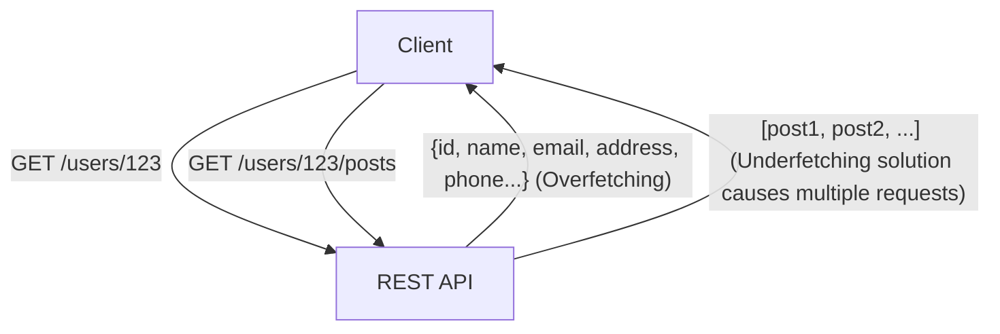
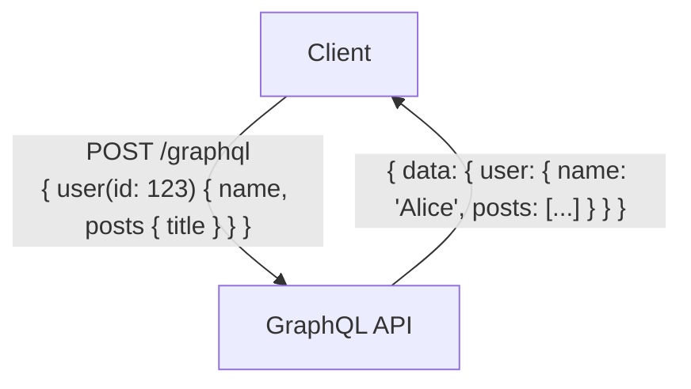

# GraphQL vs REST API: Fundamental Differences in Design Philosophy and When to Use Them

In the development of modern web and mobile applications, the design of the "API (Application Programming Interface)" that connects the backend and frontend is an extremely crucial factor that directly affects the performance and maintainability of the entire system. While "REST (Representational State Transfer)" has long reigned as the de facto standard for API design, "GraphQL" has been rapidly gaining popularity in recent years as a new paradigm to meet the increasingly complex demands of frontends.

In this article, from a professional engineer's perspective, we will delve deeply into everything from the architectural style that forms the origin of REST, to the modern challenges GraphQL attempts to solve (overfetching and underfetching), the implementation pros and cons of both, and guidelines on "which to adopt in what kind of project."

## 1. The Philosophy and Architecture of REST API

REST (Representational State Transfer) is a software architectural style proposed by Roy Fielding in his doctoral dissertation in 2000. REST is not merely a specification or protocol; it is a "collection of constraints" for building scalable and robust distributed systems (especially the World Wide Web).

### Core Principles of REST

The primary constraints of REST defined by Roy Fielding include the following:

1. **Client-Server Separation**:
   It separates user interface concerns (client) from data storage concerns (server). This improves the portability of the client and ensures the scalability of the server.
2. **Stateless**:
   The server does not maintain the client's session state. Each request from the client must contain all the necessary information to process that request. This reduces server load and improves system reliability.
3. **Cacheability**:
   Responses must include information indicating whether they are cacheable. By properly utilizing caches, the number of communications between the client and server can be reduced, dramatically increasing network efficiency.
4. **Uniform Interface**:
   This is the most critical constraint that defines REST. Resources are uniquely identified by URIs (Uniform Resource Identifiers) and are operated on using standardized HTTP methods (GET, POST, PUT, DELETE, etc.).
5. **Layered System**:
   Clients do not need to be aware of whether they are connected directly to the end server or to an intermediate proxy or load balancer.

### Advantages and Challenges of REST APIs

REST APIs have the immense advantage of being able to directly leverage the existing infrastructure of the HTTP protocol (cache servers, proxies, CDNs, etc.). However, in modern applications with complex UIs, some limitations have also been pointed out.

#### Overfetching and Underfetching

- **Overfetching**:
  Even if only the user's name and icon image are needed on a certain screen, hitting an endpoint like `/users/{id}` retrieves a massive amount of unnecessary data, such as addresses, phone numbers, and registration dates. This causes fatal performance degradation in environments with limited bandwidth, such as mobile networks.
- **Underfetching (The N+1 Problem)**:
  To display a specific screen, you have to hit an initial endpoint (e.g., `/users/{id}`), and then use the ID obtained there to hit another endpoint (e.g., `/users/{id}/posts`) multiple times. This occurs because the necessary data is not grouped into a single resource, leading to increased latency.



## 2. The Birth of GraphQL and the Paradigm Shift

To solve these challenges of REST, particularly the inefficient data retrieval from mobile devices, Facebook (now Meta) developed "GraphQL" for internal use in 2012 and open-sourced it in 2015.

### Design Philosophy of GraphQL

GraphQL is not an architectural style like REST, but rather a "query language" for APIs and a "runtime" to execute those queries. Its biggest feature is that **"clients can exactly request the data they need, in the structure they need, with a single request."**

### Type System and Schema-Driven Development

At the core of GraphQL lies a powerful Type System. It strictly defines the data that the server can provide and their relationships as a "schema."

```graphql
type User {
  id: ID!
  name: String!
  email: String
  posts: [Post!]!
}

type Post {
  id: ID!
  title: String!
  content: String!
  author: User!
}

type Query {
  user(id: ID!): User
}
```

This schema clearly defines the "contract" between frontend and backend engineers. Thanks to the GraphQL Introspection feature, powerful development tools (such as GraphiQL) and automatic code generation based on schema information become available, dramatically improving the Developer Experience (DX).

### Single Endpoint and Query Flexibility

While REST has multiple endpoints for each resource, GraphQL typically has only a single endpoint, `/graphql`. Clients send queries to this endpoint via POST requests.

```graphql
# Example request from the client
query {
  user(id: "123") {
    name
    posts {
      title
    }
  }
}
```

In response to the above request, the server returns a JSON response containing only the specified fields (`name` and the `title` of `posts`). This elegantly solves the problems of overfetching and underfetching.



## 3. Implementation Challenges and Advanced Design Strategies

While GraphQL is a magical tool for the frontend, it brings new challenges to backend design and implementation.

### Manifestation of the N+1 Problem and Dataloader

In GraphQL, as queries become more deeply nested, the backend is prone to the "N+1 problem," where database queries explode in number.
For example, if a query is cast to fetch 10 users and the latest 5 posts written by each user, a naive implementation would run 1 query to fetch users and 10 queries to fetch posts for each user, resulting in a total of 11 DB queries.

The standard approach to solving this is the **Dataloader** pattern. Dataloader efficiently resolves the N+1 problem by batching (grouping into a single DB query) and caching (preventing duplicate queries within the same request) individual data fetch requests that occur within the lifecycle of a request.

### Differences in Caching Strategies

In REST APIs, standard HTTP caching mechanisms (like ETags and Cache-Control headers for GET requests) can be easily utilized by CDNs and browsers. Because resource URIs are unique, infrastructure-level caching is highly effective.

On the other hand, in GraphQL, since almost all requests are POST requests to a single endpoint (`/graphql`), it is difficult to directly use HTTP-level caching mechanisms. Therefore, caching in GraphQL requires ingenuity across the following layers:

1. **Client-side Caching**: Utilizing normalized in-memory caches provided by advanced client libraries like Apollo Client or Relay.
2. **Persisted Queries**: A technique to enable CDN caching by pre-registering heavily used, large queries on the server, hashing them, and allowing them to be called via GET requests.
3. **Server-side Application Caching**: Using tools like Redis to cache data at the resolver level.

### Countermeasures for Security and Complexity

Because GraphQL gives clients powerful querying capabilities, there is a risk of Denial of Service (DoS) attacks where malicious users intentionally send deeply nested, heavy queries to exhaust the server's CPU and memory.

Typical design strategies to prevent this are as follows:

- **Query Depth Limit**: Analyzing the AST (Abstract Syntax Tree) and rejecting queries that exceed a certain nesting depth (e.g., 5 levels).
- **Query Complexity Analysis**: Assigning a "cost" to each field and blocking execution if the total cost of the entire query exceeds a maximum limit.
- **Rate Limiting**: Limiting the total cost of queries that can be executed within a certain time frame per IP address or user.

## 4. REST vs GraphQL: The Right Tool for the Right Job

REST and GraphQL are not meant to completely eradicate each other; the appropriate one should be chosen based on the project's requirements.

### Cases Where REST API Should Be Chosen

- **Simple CRUD Applications**: When resources have a flat structure and do not possess complex data relationships.
- **Providing Public APIs**: When providing an API to an unspecified number of developers, REST is the most standard, has the lowest learning curve, and can be easily called from any language and environment.
- **File Transfers and Streaming**: Handling binary data, such as image uploads or video streaming, is simpler and more efficient with REST (e.g., multipart form data).
- **Strong Infrastructure Caching Requirements**: Content delivery-centric systems that need to statically cache and handle millions of requests utilizing CDNs.

### Cases Where GraphQL Should Be Chosen

- **Applications with Complex UIs and Data Requirements**: Modern SPAs (Single Page Applications) and mobile apps that need to collect and integrate data from multiple resources on a single screen.
- **Multi-platform Deployment**: When you want to efficiently provide data through a single API to multiple clients (Web, iOS, Android, etc.) that require data in different shapes.
- **BFF (Backend For Frontend) Layer for Microservices**: It excels as an aggregation layer (API Gateway/BFF) that bundles multiple microservices or existing REST APIs scattered across the backend, providing them as a single graph structure that is easy for the frontend to use.
- **Agile Development and Schema-Driven**: Projects with frequent UI changes and many accompanying API modification requests. The frontend can freely add or remove necessary data in their queries without waiting for backend changes.

## Conclusion

Roy Fielding's REST brought order to distributed systems and laid the foundation for today's Web. Meanwhile, GraphQL has provided a powerful weapon to meet the complex demands of frontends, optimizing developer experience and client performance.

One should not fall into the simple dichotomy that "REST is old, GraphQL is new." A truly professional architect deeply understands the fundamental differences in their design philosophies, comprehensively evaluates data characteristics, network requirements, client types, and the development team's skill set, and then chooses the optimal architecture. In some cases, a hybrid approach—building the core of the system with REST and adopting GraphQL solely as a BFF layer for the frontend—can be an extremely powerful option.
