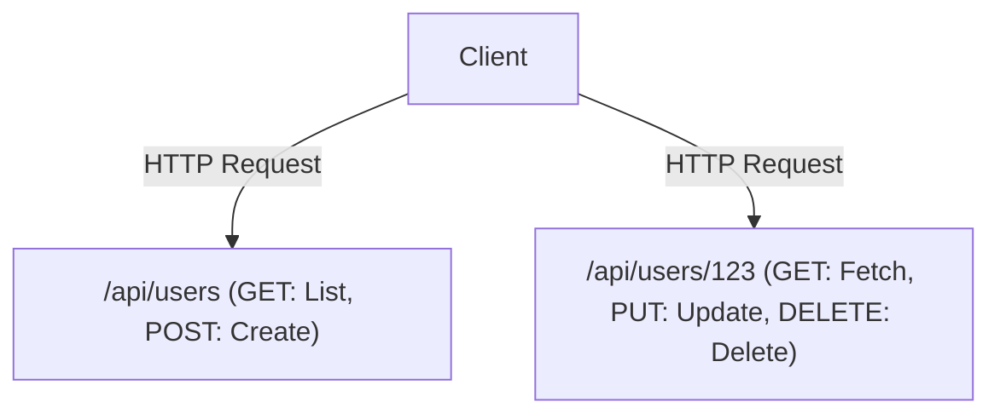

# GraphQL vs. REST API: The Collision and Convergence of Design Philosophies

In modern software development, designing the API that connects the front-end and back-end is a critical factor that influences both overall system performance and developer experience. REST (Representational State Transfer) has long reigned as the de facto standard, while GraphQL has emerged as a new paradigm created by Facebook (now Meta). In this article, we will delve deeply into the fundamental differences in their design philosophies, their respective strengths and weaknesses, and explore which one should be adopted in real-world product development, or how they might coexist.

## The Orthodox REST API: The Beauty of Resource-Oriented and Stateless Design

REST is an architectural style proposed in Roy Fielding's doctoral dissertation in 2000. It maximizes the fundamental principles of the HTTP protocol and defines simple yet powerful constraints for scaling systems.

### Resource-Oriented Architecture (ROA)
The core of REST is "resources". Every piece of data has a unique URI (Uniform Resource Identifier), and HTTP methods (GET, POST, PUT, DELETE, etc.) are used to perform operations on these resources.



### Caching and Scalability
By piggybacking on standard HTTP specifications, REST can seamlessly utilize the powerful caching mechanisms provided by existing web infrastructure such as browsers, CDNs, and proxy servers. This is an immeasurable advantage when handling massive traffic.

## The Divergence from Reality: Challenges of the Mobile Era

However, as mobile apps became widespread and UIs grew richer and more complex, strictly resource-oriented REST APIs began to expose several limitations.

### 1. Over-fetching
This is the problem where a client only needs the "user's name", but calling `/api/users/123` returns a massive amount of unnecessary data, such as their profile image URL, date of birth, and address. On mobile networks, this wasteful data transfer leads to performance degradation.

### 2. Under-fetching and the N+1 Problem
When multiple resources are required to render a screen, a single API request does not yield enough data, forcing the client to repeatedly make requests.
For example, if you want to fetch "a list of a user's articles and the 3 latest comments for each article":
1. Fetch the user's information
2. Fetch the user's article list
3. Fetch the comments for each article (if there are N articles, this requires N requests)
This is a contributing factor to the infamous N+1 problem, causing an increase in latency.

## The Birth of GraphQL: Client-Driven Data Fetching

In 2012, Facebook faced these challenges during a project to rebuild their mobile app, and created GraphQL to solve them (it was open-sourced in 2015).

GraphQL is a query language that allows clients to precisely describe the structure of the "data they want".

```graphql
query GetUserPosts {
  user(id: "123") {
    name
    posts(first: 5) {
      title
      comments(first: 3) {
        author
        content
      }
    }
  }
}
```

### Resolving Graph Structures with Schemas and Resolvers
A GraphQL server has a "Schema" that defines the entire system's data as a single graph structure. Queries sent from clients are parsed according to the Schema, and "Resolver" functions corresponding to each field collect the data on the back-end. This allows the client to obtain exactly all the data it needs—no more, no less—by sending a single request to a single endpoint (usually `/graphql`).

## There Is No Perfect Silver Bullet: The Trade-offs of GraphQL

While GraphQL might look like a dream technology for front-end developers, it introduces new complexities on the back-end.

### Caching Difficulties
Whereas REST could transparently utilize HTTP caching mechanisms, GraphQL essentially sends everything as POST requests to a single endpoint, meaning HTTP-level caching is ineffective. It requires workarounds such as normalized caching using client libraries like Apollo, or caching queries at the CDN edge.

### Persisted Queries
As a practical solution to security and caching challenges, "Persisted Queries" are often used in production environments. This is a mechanism where the hash values of queries issued by the client are registered with the server at build time, and only the hash values are sent (via GET requests) at runtime. This prevents massive malicious queries while enabling the use of HTTP caching.

## Conclusion: From Collision to Convergence

Neither REST nor GraphQL will completely eradicate the other.

- **Cases where REST is suitable:** Public APIs for external use, communication between microservices, binary file uploads/downloads, and systems centered around simple CRUD operations.
- **Cases where GraphQL is suitable:** Mobile apps and SPAs with complex UIs, layers aggregating multiple back-end services (BFF), and products that need to flexibly adapt to rapidly changing requirements.

In modern architectures, a form of "convergence" is becoming mainstream, where internal microservices communicate via gRPC or REST, while the front-end facing layer (API Gateway or BFF) provides GraphQL. Deeply understanding the characteristics of each technology and utilizing them in the right places is the key to superior system design.
