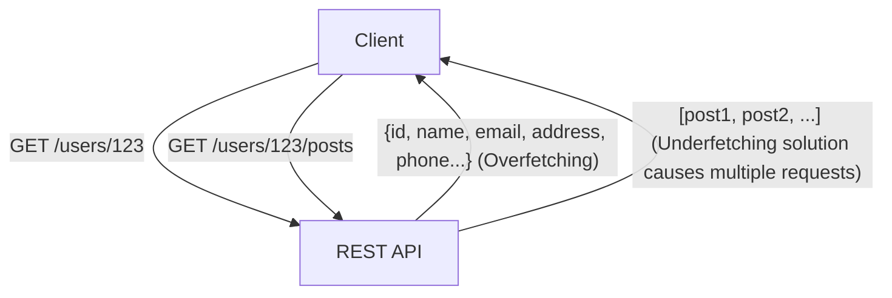
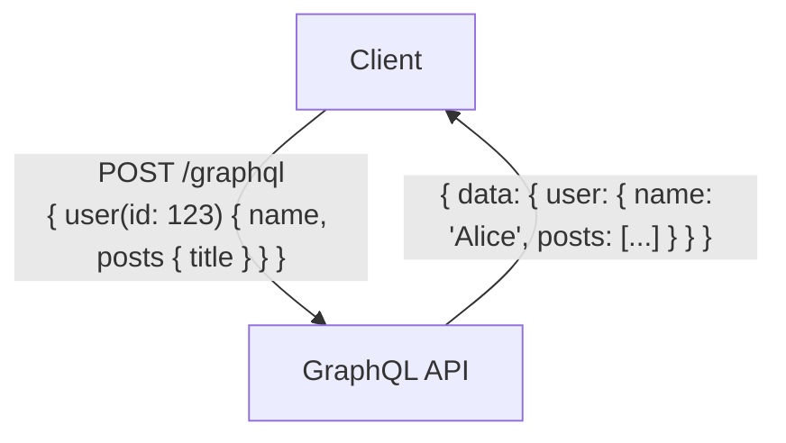

# GraphQL vs REST API: Diferencias fundamentales en la filosofía de diseño y cuándo usarlos

En el desarrollo de aplicaciones web y móviles modernas, el diseño de la "API" (Interfaz de Programación de Aplicaciones) que conecta el backend con el frontend es un elemento extremadamente importante que afecta directamente el rendimiento y la mantenibilidad de todo el sistema. Durante mucho tiempo, "REST" (Transferencia de Estado Representacional) ha reinado como el estándar de facto para el diseño de APIs. Sin embargo, en los últimos años, "GraphQL" se ha extendido rápidamente como un nuevo paradigma para satisfacer las demandas cada vez más complejas del frontend.

En este artículo, desde la perspectiva de un ingeniero profesional, profundizaremos en detalle desde el estilo arquitectónico que constituye el origen de REST, hasta los problemas modernos que GraphQL intenta resolver (overfetching y underfetching). Además, analizaremos las ventajas y desventajas de ambos en la implementación, y proporcionaremos pautas sobre "qué enfoque adoptar según el tipo de proyecto".

## 1. La filosofía y arquitectura de la API REST

REST (Transferencia de Estado Representacional) es un estilo de arquitectura de software propuesto por Roy Fielding en el año 2000 en su tesis doctoral. REST no es una simple especificación o protocolo, sino un "conjunto de restricciones" para construir sistemas distribuidos (especialmente la World Wide Web) de forma escalable y robusta.

### Principios básicos de REST

Entre las principales restricciones de REST definidas por Roy Fielding se encuentran las siguientes:

1. **Separación Cliente-Servidor (Client-Server)**:
   Separa las preocupaciones relacionadas con la interfaz de usuario (cliente) y las relacionadas con el almacenamiento de datos (servidor). Esto mejora la portabilidad del cliente y asegura la escalabilidad del servidor.
2. **Sin estado (Stateless)**:
   El servidor no mantiene el estado de la sesión del cliente. Cada solicitud del cliente debe contener toda la información necesaria para procesar dicha solicitud. Esto reduce la carga del servidor y mejora la fiabilidad del sistema.
3. **Capacidad de caché (Cacheability)**:
   Las respuestas deben incluir información sobre si son almacenables en caché o no. Al utilizar la caché de manera adecuada, se puede reducir el número de comunicaciones entre el cliente y el servidor, aumentando drásticamente la eficiencia de la red.
4. **Interfaz uniforme (Uniform Interface)**:
   Es la restricción más importante que define a REST. Los recursos se identifican de manera única mediante URIs (Identificador de Recursos Uniforme) y se manipulan utilizando métodos HTTP estandarizados (GET, POST, PUT, DELETE, etc.).
5. **Sistema en capas (Layered System)**:
   El cliente no necesita saber si está conectado directamente al servidor final o a un proxy intermediario o balanceador de carga.

### Ventajas y desafíos de la API REST

Las APIs REST tienen la enorme ventaja de poder aprovechar la infraestructura existente del protocolo HTTP (servidores de caché, proxies, CDNs, etc.) tal cual. Sin embargo, en aplicaciones modernas con interfaces de usuario complejas, se han señalado algunas limitaciones.

#### Overfetching y Underfetching

- **Overfetching (Exceso de obtención de datos)**:
  Es el problema en el que, aunque solo se necesite el nombre de usuario y la imagen de perfil en una pantalla, al llamar al endpoint `/users/{id}` se obtiene una gran cantidad de datos innecesarios, como la dirección, el número de teléfono o la fecha de registro. En entornos con ancho de banda limitado, como redes móviles, esto provoca una caída de rendimiento crítica.
- **Underfetching (Problema N+1)**:
  Ocurre cuando, para mostrar una pantalla específica, se debe llamar a un primer endpoint (ej: `/users/{id}`) y luego usar el ID obtenido para llamar a otros endpoints (ej: `/users/{id}/posts`) varias veces. Surge porque los datos necesarios no están agrupados en un solo recurso, lo que provoca un aumento en la latencia.



## 2. El nacimiento de GraphQL y el cambio de paradigma

Para resolver estos problemas de REST, especialmente la ineficiencia en la obtención de datos desde dispositivos móviles, Facebook (ahora Meta) desarrolló "GraphQL" para uso interno en 2012 y lo lanzó como código abierto en 2015.

### Filosofía de diseño de GraphQL

GraphQL no es un estilo arquitectónico como REST, sino un "lenguaje de consulta" para APIs y un "entorno de ejecución" (runtime) para procesar dichas consultas. Su mayor característica es que **"el cliente puede solicitar exactamente los datos que necesita, con la estructura requerida, en una sola solicitud"**.

### Sistema de tipos y desarrollo basado en esquemas

El núcleo de GraphQL es su potente sistema de tipos (Type System). Los datos que el servidor puede proporcionar y sus relaciones se definen de manera estricta como un "esquema".

```graphql
type User {
  id: ID!
  name: String!
  email: String
  posts: [Post!]!
}

type Post {
  id: ID!
  title: String!
  content: String!
  author: User!
}

type Query {
  user(id: ID!): User
}
```

Gracias a este esquema, el "contrato" entre los ingenieros de frontend y backend queda claramente definido. Mediante la función de Introspección (Introspection) de GraphQL, se pueden utilizar potentes herramientas de desarrollo basadas en el esquema (como GraphiQL) y generación automática de código, mejorando drásticamente la experiencia del desarrollador (DX).

### Punto de enlace único y flexibilidad de las consultas

Mientras que REST tiene múltiples endpoints para cada recurso, GraphQL suele tener un único endpoint, generalmente `/graphql`. El cliente envía consultas a este endpoint a través de peticiones POST.

```graphql
# Ejemplo de solicitud del cliente
query {
  user(id: "123") {
    name
    posts {
      title
    }
  }
}
```

En respuesta a la solicitud anterior, el servidor devuelve una respuesta en formato JSON que incluye únicamente los campos especificados (`name` y `title` dentro de `posts`). Esto resuelve de manera brillante los problemas de overfetching y underfetching.



## 3. Desafíos de implementación y estrategias avanzadas de diseño

Aunque GraphQL es una herramienta mágica para el frontend, introduce nuevos desafíos en el diseño e implementación del backend.

### La manifestación del problema N+1 y Dataloader

En GraphQL, a medida que las consultas se anidan profundamente, es fácil que ocurra el "problema N+1", donde las consultas a la base de datos en el backend aumentan de forma explosiva.
Por ejemplo, si se envía una consulta para obtener 10 usuarios y las 5 publicaciones más recientes de cada uno, una implementación ingenua ejecutaría "1 consulta para usuarios" + "10 consultas para las publicaciones de cada usuario", totalizando 11 consultas a la base de datos.

El enfoque estándar para resolver esto es el patrón **Dataloader**. Dataloader soluciona eficientemente el problema N+1 agrupando (batching) las solicitudes individuales de obtención de datos que ocurren durante el ciclo de vida de una petición en una sola consulta a la base de datos, y almacenando en caché (caching) para evitar consultas duplicadas en la misma petición.

### Diferencias en la estrategia de caché

En las APIs REST, los mecanismos de caché estándar de HTTP (como ETag o la cabecera Cache-Control para peticiones GET) pueden usarse fácilmente en CDNs y navegadores. Debido a que la URI del recurso es única, el almacenamiento en caché a nivel de infraestructura es extremadamente efectivo.

Por otro lado, en GraphQL, dado que fundamentalmente todas las peticiones son de tipo POST dirigidas a un único endpoint (`/graphql`), es difícil utilizar los mecanismos de caché a nivel HTTP tal cual. Por lo tanto, el almacenamiento en caché en GraphQL debe diseñarse cuidadosamente en las siguientes capas:

1. **Caché del lado del cliente**: Utilizar cachés en memoria normalizadas proporcionadas por bibliotecas de cliente avanzadas como Apollo Client o Relay.
2. **Consultas persistentes (Persisted Queries)**: Registrar y generar un hash de consultas grandes y de uso frecuente en el servidor de antemano, permitiendo llamarlas mediante peticiones GET. Esta técnica hace posible el uso de caché en CDNs.
3. **Caché de la aplicación del lado del servidor**: Utilizar herramientas como Redis para almacenar en caché los datos a nivel de los "resolvers".

### Medidas de seguridad y gestión de la complejidad

Dado que GraphQL otorga a los clientes una gran capacidad de consulta, existe el riesgo de que un usuario malintencionado envíe deliberadamente consultas pesadas y profundamente anidadas, agotando la CPU y la memoria del servidor en un ataque de denegación de servicio (DoS).

Las estrategias de diseño representativas para prevenir esto son las siguientes:

- **Límite de profundidad de la consulta (Query Depth Limit)**: Analiza el AST (Árbol de Sintaxis Abstracta) y rechaza las consultas cuya profundidad de anidación supere un cierto límite (por ejemplo, 5 niveles).
- **Análisis de complejidad de la consulta (Query Complexity Analysis)**: Asigna un "costo" a cada campo y bloquea la ejecución si el costo total de la consulta supera el límite establecido.
- **Limitación de tasa (Rate Limiting)**: Restringe el costo total de las consultas que se pueden ejecutar dentro de un período de tiempo específico por dirección IP o por usuario.

## 4. REST vs GraphQL: Casos de uso y dónde aplicarlos

REST y GraphQL no son tecnologías en las que una desplazará completamente a la otra; se debe seleccionar la adecuada según los requisitos del proyecto.

### Cuándo elegir la API REST

- **Aplicaciones CRUD simples**: Cuando la estructura de los recursos es plana y no existen relaciones complejas entre los datos.
- **Provisión de APIs públicas**: Si se ofrece una API para un gran número de desarrolladores externos, REST es el estándar más extendido, tiene una curva de aprendizaje baja y se puede llamar fácilmente desde cualquier lenguaje o entorno.
- **Transferencia de archivos y streaming**: El manejo de datos binarios, como la carga de imágenes o la transmisión de video, es mucho más simple y eficiente con REST (por ejemplo, usando datos de formulario multiparte).
- **Altos requisitos de caché a nivel de infraestructura**: Sistemas enfocados en la distribución de contenido donde es necesario aprovechar una CDN para manejar y almacenar en caché millones de peticiones estáticas.

### Cuándo elegir GraphQL

- **Aplicaciones con UI compleja y requisitos de datos variados**: SPA (Aplicaciones de Página Única) modernas o aplicaciones móviles donde es necesario recopilar e integrar datos de múltiples recursos en una sola pantalla.
- **Desarrollo multiplataforma**: Cuando se desea proporcionar datos de manera eficiente a través de una única API para diferentes clientes con necesidades estructurales de datos distintas (Web, iOS, Android, etc.).
- **Capa BFF (Backend For Frontend) para microservicios**: Es excelente como capa de agregación (API Gateway/BFF) que agrupa múltiples microservicios o APIs REST existentes dispersos en el backend, presentándolos como una estructura de grafo única y fácil de usar para el frontend.
- **Desarrollo ágil y basado en esquemas**: Proyectos donde la interfaz de usuario cambia con frecuencia, lo que conlleva muchas solicitudes de modificación en la API. El frontend puede añadir o eliminar libremente los datos necesarios en las consultas sin esperar a que el backend realice cambios.

## Conclusión

El diseño REST de Roy Fielding aportó orden a los sistemas distribuidos y sentó las bases de la Web actual. Por otro lado, GraphQL proporciona una herramienta poderosa para satisfacer las crecientes demandas del frontend, optimizando la experiencia del desarrollador y el rendimiento del cliente.

No debemos caer en el dualismo simplista de pensar que "REST es viejo y GraphQL es nuevo". Un arquitecto verdaderamente profesional comprende profundamente las diferencias fundamentales en la filosofía de diseño de ambos enfoques, y selecciona la arquitectura óptima evaluando exhaustivamente las características de los datos, los requisitos de red, los tipos de clientes y las habilidades del equipo de desarrollo. En algunos casos, un enfoque híbrido, en el que el núcleo del sistema se construye con REST y GraphQL se adopta únicamente como la capa BFF para el frontend, puede convertirse en una opción sumamente potente.
