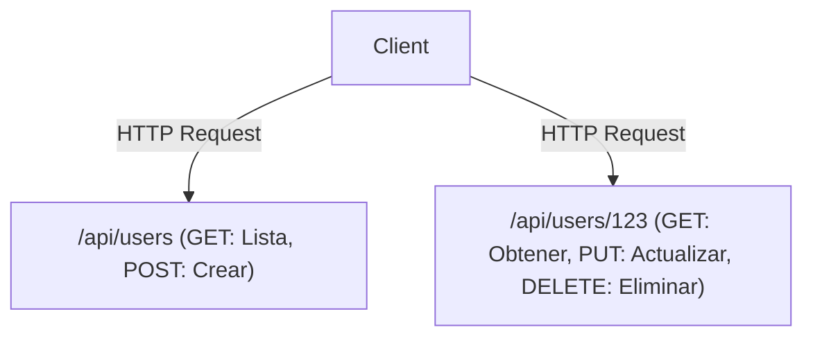

# GraphQL vs. REST API: La colisión y convergencia de las filosofías de diseño

En el desarrollo de software moderno, el diseño de la API que conecta el front-end y el back-end es un factor crítico que influye tanto en el rendimiento general del sistema como en la experiencia del desarrollador. REST (Representational State Transfer) ha reinado durante mucho tiempo como el estándar de facto, mientras que GraphQL ha surgido como un nuevo paradigma creado por Facebook (ahora Meta). En este artículo, profundizaremos en las diferencias fundamentales de sus filosofías de diseño, sus respectivas fortalezas y debilidades, y exploraremos cuál debería adoptarse en el desarrollo de productos del mundo real, o cómo podrían coexistir.

## La API REST ortodoxa: La belleza del diseño orientado a recursos y sin estado (Stateless)

REST es un estilo arquitectónico propuesto en la tesis doctoral de Roy Fielding en el año 2000. Maximiza los principios fundamentales del protocolo HTTP y define restricciones simples pero poderosas para escalar sistemas.

### Arquitectura orientada a recursos (ROA)
El núcleo de REST son los "recursos". Cada fragmento de datos tiene un URI (Identificador Uniforme de Recursos) único, y se utilizan métodos HTTP (GET, POST, PUT, DELETE, etc.) para realizar operaciones sobre estos recursos.



### Caché y escalabilidad
Al aprovechar las especificaciones estándar de HTTP, REST puede utilizar sin problemas los potentes mecanismos de almacenamiento en caché proporcionados por la infraestructura web existente, como navegadores, CDN y servidores proxy. Esta es una ventaja incalculable a la hora de manejar un tráfico masivo.

## La divergencia de la realidad: Los desafíos de la era móvil

Sin embargo, a medida que las aplicaciones móviles se generalizaron y las interfaces de usuario (UI) se volvieron más ricas y complejas, las API REST estrictamente orientadas a recursos comenzaron a exponer varias limitaciones.

### 1. Over-fetching (Sobrecarga de datos)
Este es el problema en el que un cliente solo necesita el "nombre del usuario", pero al llamar a `/api/users/123` se devuelve una cantidad masiva de datos innecesarios, como la URL de su imagen de perfil, fecha de nacimiento y dirección. En las redes móviles, esta transferencia de datos innecesaria provoca una degradación del rendimiento.

### 2. Under-fetching y el problema N+1
Cuando se requieren múltiples recursos para renderizar una pantalla, una sola solicitud de API no proporciona suficientes datos, lo que obliga al cliente a realizar solicitudes repetidamente.
Por ejemplo, si desea obtener "una lista de los artículos de un usuario y los 3 últimos comentarios de cada artículo":
1. Obtener la información del usuario
2. Obtener la lista de artículos del usuario
3. Obtener los comentarios de cada artículo (si hay N artículos, esto requiere N solicitudes)
Este es un factor que contribuye al infame problema N+1, provocando un aumento en la latencia.

## El nacimiento de GraphQL: Obtención de datos impulsada por el cliente

En 2012, Facebook se enfrentó a estos desafíos durante un proyecto para reconstruir su aplicación móvil, y creó GraphQL para resolverlos (se convirtió en código abierto en 2015).

GraphQL es un lenguaje de consulta que permite a los clientes describir con precisión la estructura de los "datos que desean".

```graphql
query GetUserPosts {
  user(id: "123") {
    name
    posts(first: 5) {
      title
      comments(first: 3) {
        author
        content
      }
    }
  }
}
```

### Resolviendo estructuras de grafos con Schemas y Resolvers
Un servidor GraphQL tiene un "Schema" (esquema) que define los datos de todo el sistema como una única estructura de grafo. Las consultas enviadas desde los clientes se analizan de acuerdo con el Schema, y las funciones "Resolver" correspondientes a cada campo recopilan los datos en el back-end. Esto permite al cliente obtener exactamente todos los datos que necesita —ni más, ni menos— enviando una sola solicitud a un único endpoint (generalmente `/graphql`).

## No hay una bala de plata perfecta: Las contrapartidas de GraphQL

Si bien GraphQL podría parecer una tecnología de ensueño para los desarrolladores front-end, introduce nuevas complejidades en el back-end.

### Dificultades con el caché
Mientras que REST podía utilizar de forma transparente los mecanismos de caché HTTP, GraphQL envía esencialmente todo como solicitudes POST a un único endpoint, lo que significa que el almacenamiento en caché a nivel HTTP es ineficaz. Requiere soluciones alternativas, como el almacenamiento en caché normalizado utilizando bibliotecas de clientes como Apollo, o el almacenamiento en caché de consultas en el borde (edge) de la CDN.

### Persisted Queries (Consultas persistentes)
Como una solución práctica a los desafíos de seguridad y almacenamiento en caché, las "Persisted Queries" se utilizan a menudo en entornos de producción. Este es un mecanismo donde los valores hash de las consultas emitidas por el cliente se registran en el servidor en el momento de la compilación, y solo los valores hash se envían (a través de solicitudes GET) en tiempo de ejecución. Esto previene consultas maliciosas masivas al tiempo que permite el uso de la caché HTTP.

## Conclusión: De la colisión a la convergencia

Ni REST ni GraphQL erradicarán completamente al otro.

- **Casos en los que REST es adecuado:** API públicas para uso externo, comunicación entre microservicios, cargas/descargas de archivos binarios y sistemas centrados en operaciones CRUD simples.
- **Casos en los que GraphQL es adecuado:** Aplicaciones móviles y SPA con UI complejas, capas que agregan múltiples servicios back-end (BFF) y productos que necesitan adaptarse flexiblemente a requisitos que cambian rápidamente.

En las arquitecturas modernas, se está volviendo común una forma de "convergencia", donde los microservicios internos se comunican a través de gRPC o REST, mientras que la capa que se enfrenta al front-end (API Gateway o BFF) proporciona GraphQL. Comprender profundamente las características de cada tecnología y utilizarlas en los lugares adecuados es la clave para un diseño de sistemas superior.
