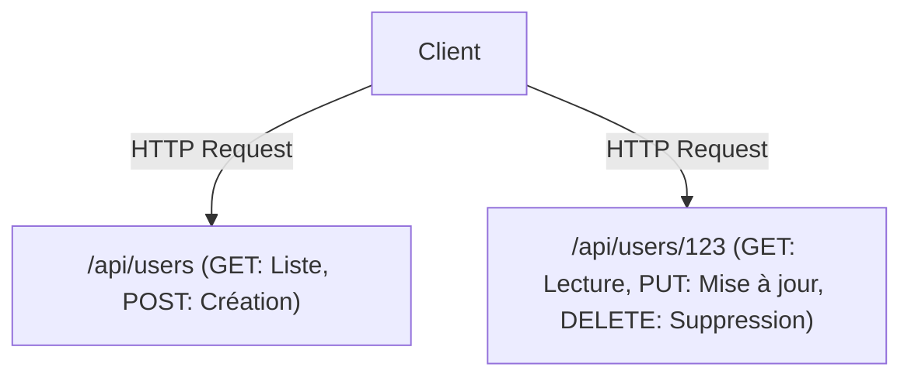

# GraphQL et API REST : Conflit et convergence des philosophies de conception

Dans le développement logiciel moderne, la conception des API qui relient le front-end et le back-end est un élément crucial qui détermine les performances et l'expérience de développement du système dans son ensemble. REST (Representational State Transfer) a longtemps régné en tant que standard de facto, tandis que GraphQL est un nouveau paradigme créé par Facebook (aujourd'hui Meta). Dans cet article, nous explorerons en profondeur les différences fondamentales dans leurs philosophies de conception respectives, leurs forces et faiblesses, et lequel devrait être adopté ou comment ils devraient coexister dans le développement de produits réels.

## L'origine de l'API REST : La beauté de l'orientation ressource et de l'apatridie (stateless)

REST est un style d'architecture proposé par Roy Fielding dans sa thèse de doctorat en 2000. Il a défini des contraintes simples mais puissantes pour faire évoluer les systèmes tout en tirant pleinement parti des principes fondamentaux du protocole HTTP.

### Architecture Orientée Ressources (ROA)
Le cœur de REST est la "ressource". Toutes les données ont un URI (Uniform Resource Identifier) unique, et des méthodes HTTP (GET, POST, PUT, DELETE, etc.) sont utilisées pour effectuer des opérations sur ces ressources.



### Cache et Scalabilité
En s'appuyant sur les spécifications standards de HTTP, il est possible d'utiliser directement les puissants mécanismes de cache fournis par l'infrastructure Web existante, tels que les navigateurs, les CDN et les serveurs proxy. C'est un avantage incommensurable lorsqu'il s'agit de traiter un trafic massif.

## L'écart avec la réalité : Les défis de l'ère mobile

Cependant, à mesure que les applications mobiles se sont démocratisées et que les interfaces utilisateur sont devenues plus riches et plus complexes, l'API REST strictement orientée ressources a commencé à montrer certaines de ses limites.

### 1. Sur-échantillonnage (Over-fetching)
Le client n'a besoin que du "nom de l'utilisateur", mais lorsqu'il appelle `/api/users/123`, une grande quantité de données inutiles, telles que l'URL de la photo de profil, la date de naissance et l'adresse, est également envoyée. Sur les réseaux mobiles, ce transfert de données inutile entraîne une baisse des performances.

### 2. Sous-échantillonnage (Under-fetching) et le problème N+1
Lorsque plusieurs ressources sont nécessaires pour afficher un écran, une seule requête API ne fournit pas suffisamment de données, et le problème est qu'il faut répéter la requête plusieurs fois.
Par exemple, pour récupérer "la liste des articles d'un utilisateur et les 3 derniers commentaires de chaque article" :
1. Récupérer les informations de l'utilisateur
2. Récupérer la liste des articles de l'utilisateur
3. Récupérer les commentaires pour chaque article (N requêtes s'il y a N articles)
C'est l'une des causes du célèbre problème N+1, entraînant une augmentation de la latence.

## La naissance de GraphQL : Récupération de données pilotée par le client

En 2012, Facebook a été confronté à ces défis lors d'un projet de refonte de son application mobile, et a créé GraphQL pour les résoudre (rendu open source en 2015).

GraphQL est un langage de requête qui permet au client de décrire précisément la structure des "données souhaitées".

```graphql
query GetUserPosts {
  user(id: "123") {
    name
    posts(first: 5) {
      title
      comments(first: 3) {
        author
        content
      }
    }
  }
}
```

### Résolution de la structure de graphe via Schema et Resolver
Un serveur GraphQL possède un "Schema" qui définit les données de l'ensemble du système comme une structure de graphe. Les requêtes envoyées par le client sont analysées en fonction de ce schéma, et les fonctions "Resolver" correspondant à chaque champ collectent les données en back-end. Ainsi, le client n'a besoin d'envoyer qu'une seule requête à un point d'accès unique (généralement `/graphql`) pour obtenir exactement toutes les données nécessaires, ni plus ni moins.

## Il n'y a pas de solution miracle : Le prix de GraphQL

Bien que GraphQL ressemble à une technologie de rêve pour les développeurs front-end, il apporte une nouvelle complexité côté back-end.

### La difficulté de la mise en cache
Alors que REST peut utiliser de manière transparente le mécanisme de mise en cache HTTP, GraphQL ne peut pas bénéficier du cache au niveau HTTP car, par défaut, tout est envoyé en tant que requêtes POST vers un seul point d'accès. Il est nécessaire de concevoir des solutions pour un cache normalisé à l'aide de bibliothèques clientes telles qu'Apollo, ou de mettre en cache les requêtes à la périphérie (edge) du CDN.

### Requêtes persistantes (Persisted Queries)
Comme solution pratique aux problèmes de sécurité et de cache, les "Persisted Queries" sont souvent utilisées en environnement de production. Il s'agit d'un mécanisme où les hachages des requêtes émises par le client sont enregistrés sur le serveur au moment de la compilation, et seul le hachage est envoyé (requête GET) lors de l'exécution. Cela permet de bloquer les requêtes massives malveillantes tout en tirant parti de la mise en cache HTTP.

## Conclusion : Du conflit à la convergence

REST et GraphQL ne sont pas destinés à se détruire mutuellement.

- **Cas où REST est approprié :** API publiques pour une exposition externe, communication entre microservices, téléchargement (upload/download) de fichiers binaires, systèmes principalement centrés sur des opérations CRUD simples.
- **Cas où GraphQL est approprié :** Applications mobiles et SPA (Single Page Applications) avec des interfaces utilisateur complexes, couche agrégant plusieurs services back-end (BFF), produits qui nécessitent de s'adapter avec souplesse à des exigences changeant rapidement.

Dans les architectures modernes, la tendance est à la "convergence" : les microservices internes communiquent via gRPC ou REST, et la couche frontale (API Gateway ou BFF) expose du GraphQL. Comprendre en profondeur les caractéristiques de ces technologies et les utiliser au bon endroit est la clé pour concevoir d'excellents systèmes.
