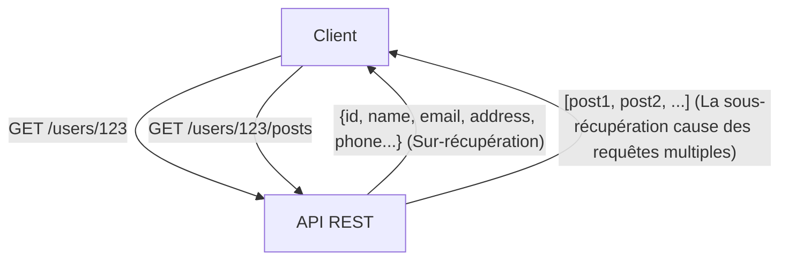
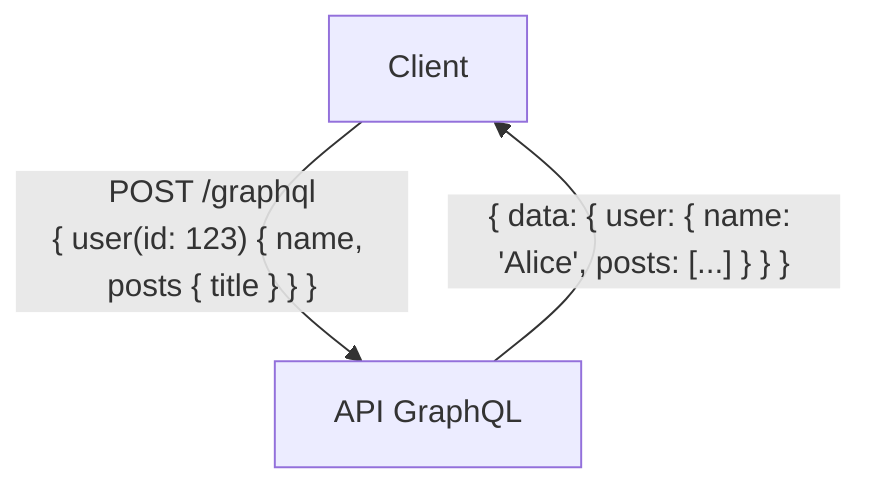

# GraphQL vs API REST : Différences fondamentales de conception et cas d'usage

Dans le développement moderne d'applications web et mobiles, la conception de l'« API » (Application Programming Interface), qui relie le back-end et le front-end, est un élément crucial qui impacte directement les performances et la maintenabilité de l'ensemble du système. Pendant longtemps, « REST » (Representational State Transfer) a régné en tant que standard de facto pour la conception d'API. Cependant, ces dernières années, « GraphQL » s'est rapidement imposé comme un nouveau paradigme pour répondre aux exigences de plus en plus complexes du front-end.

Dans cet article, du point de vue d'un ingénieur professionnel, nous explorerons en profondeur l'architecture originale de REST, les problèmes modernes que GraphQL tente de résoudre (tels que la sur-récupération ou overfetching, et la sous-récupération ou underfetching), ainsi que les avantages et les inconvénients de chaque approche en matière d'implémentation. Enfin, nous fournirons des directives détaillées sur « comment choisir l'une ou l'autre en fonction de votre projet ».

## 1. La philosophie et l'architecture de l'API REST

REST (Representational State Transfer) est un style d'architecture logicielle proposé par Roy Fielding en 2000 dans sa thèse de doctorat. REST n'est pas une simple spécification ou un protocole, mais un « ensemble de contraintes » pour construire des systèmes distribués (en particulier le World Wide Web) de manière évolutive et robuste.

### Principes fondamentaux de REST

Les principales contraintes de REST définies par Roy Fielding sont les suivantes :

1. **Séparation Client-Serveur (Client-Server)** :
   Sépare les préoccupations liées à l'interface utilisateur (client) de celles liées au stockage des données (serveur). Cela améliore la portabilité du code côté client et garantit l'évolutivité côté serveur.
2. **Sans état (Stateless)** :
   Le serveur ne conserve aucun état de session du client. Chaque requête provenant du client doit contenir toutes les informations nécessaires à son traitement. Cela réduit la charge sur le serveur et améliore la fiabilité du système.
3. **Mise en cache (Cacheability)** :
   Les réponses doivent explicitement indiquer si elles peuvent être mises en cache. Une utilisation appropriée du cache permet de réduire le nombre d'interactions entre le client et le serveur, améliorant ainsi considérablement l'efficacité du réseau.
4. **Interface uniforme (Uniform Interface)** :
   C'est la contrainte la plus importante qui définit REST. Les ressources sont identifiées de manière unique par des URI (Uniform Resource Identifier) et manipulées via des méthodes HTTP (GET, POST, PUT, DELETE, etc.) standardisées.
5. **Système en couches (Layered System)** :
   Le client n'a pas besoin de savoir s'il est connecté directement au serveur final ou à un intermédiaire tel qu'un proxy ou un équilibreur de charge.

### Avantages et limites des API REST

L'API REST présente l'énorme avantage de pouvoir tirer pleinement parti de l'infrastructure existante du protocole HTTP (serveurs de cache, proxys, CDN, etc.). Toutefois, dans les applications modernes aux interfaces utilisateur complexes, certaines limites ont commencé à se faire sentir.

#### Sur-récupération (Overfetching) et Sous-récupération (Underfetching)

- **Sur-récupération (Overfetching)** :
  C'est le problème de récupérer une grande quantité de données inutiles. Par exemple, si vous n'avez besoin que du nom et de l'avatar de l'utilisateur sur un écran, l'appel du point de terminaison `/users/{id}` peut tout de même renvoyer l'adresse, le numéro de téléphone, la date d'inscription, etc. Cela entraîne une dégradation critique des performances dans les environnements à bande passante limitée comme les réseaux mobiles.
- **Sous-récupération (Underfetching) (Problème N+1)** :
  Pour afficher un écran spécifique, vous devez d'abord appeler un point de terminaison initial (ex : `/users/{id}`), puis utiliser l'ID obtenu pour appeler plusieurs fois un autre point de terminaison (ex : `/users/{id}/posts`). Ce problème se produit lorsque les données requises ne sont pas regroupées dans une seule ressource, ce qui entraîne une augmentation de la latence.



## 2. La naissance de GraphQL et le changement de paradigme

Pour résoudre ces problèmes inhérents à REST, en particulier la récupération inefficace de données depuis des appareils mobiles, Facebook (aujourd'hui Meta) a développé « GraphQL » en interne en 2012, avant de le rendre open source en 2015.

### Philosophie de conception de GraphQL

GraphQL n'est pas un style architectural comme REST, mais un « langage de requête » pour les API et un « moteur d'exécution » (runtime) pour exécuter ces requêtes. Sa plus grande caractéristique est que **« le client peut demander précisément les données dont il a besoin, dans la structure souhaitée, en une seule requête »**.

### Système de types et développement axé sur le schéma

Au cœur de GraphQL se trouve un système de types (Type System) robuste. Les données pouvant être fournies par le serveur et leurs relations sont strictement définies en tant que « schéma ».

```graphql
type User {
  id: ID!
  name: String!
  email: String
  posts: [Post!]!
}

type Post {
  id: ID!
  title: String!
  content: String!
  author: User!
}

type Query {
  user(id: ID!): User
}
```

Ce schéma établit un « contrat » clair entre les ingénieurs front-end et back-end. Grâce à la fonction d'introspection (Introspection) de GraphQL, il est possible d'utiliser des outils de développement puissants basés sur le schéma (comme GraphiQL) et de générer du code automatiquement, ce qui améliore considérablement l'expérience développeur (DX).

### Point de terminaison unique et flexibilité des requêtes

Contrairement à REST, qui possède plusieurs points de terminaison par ressource, GraphQL n'en expose généralement qu'un seul, souvent `/graphql`. Le client envoie une requête POST contenant sa requête (query) à ce point de terminaison unique.

```graphql
# Exemple de requête provenant du client
query {
  user(id: "123") {
    name
    posts {
      title
    }
  }
}
```

En réponse à cette requête, le serveur renvoie un objet JSON contenant uniquement les champs spécifiés (`name` et `title` des `posts`). Ainsi, les problèmes de sur-récupération et de sous-récupération sont résolus de manière élégante.



## 3. Défis d'implémentation et stratégies de conception avancées

Si GraphQL est un outil magique pour le front-end, il introduit de nouveaux défis pour la conception et l'implémentation du back-end.

### L'apparition du problème N+1 et Dataloader

Avec GraphQL, au fur et à mesure que l'imbrication des requêtes s'approfondit, le risque de voir le nombre de requêtes de base de données exploser côté back-end augmente. C'est ce qu'on appelle le « problème N+1 ».
Par exemple, si une requête demande 10 utilisateurs et les 5 derniers articles de chacun, une implémentation naïve exécutera « 1 requête pour obtenir les utilisateurs » + « 10 requêtes pour obtenir les articles de chaque utilisateur », soit un total de 11 requêtes à la base de données.

L'approche standard pour résoudre ce problème est le modèle **Dataloader**. Dataloader regroupe par lots (batching) les demandes de récupération de données individuelles survenant au cours du cycle de vie d'une requête (les combinant en une seule requête de base de données) et les met en cache (évitant les requêtes en double dans la même requête), résolvant ainsi efficacement le problème N+1.

### Différences dans les stratégies de mise en cache

Dans une API REST, il est facile d'utiliser les mécanismes de cache standard HTTP (comme l'ETag ou l'en-tête Cache-Control pour les requêtes GET) au niveau du CDN ou du navigateur. L'URI de la ressource étant unique, la mise en cache au niveau de l'infrastructure est extrêmement efficace.

À l'inverse, avec GraphQL, la quasi-totalité des requêtes sont des requêtes POST envoyées à un point de terminaison unique (`/graphql`), ce qui rend difficile l'utilisation directe des mécanismes de cache HTTP. Par conséquent, la mise en cache avec GraphQL nécessite des stratégies aux niveaux suivants :

1. **Cache côté client** : Utilisation du cache en mémoire normalisé fourni par des bibliothèques clientes avancées comme Apollo Client ou Relay.
2. **Requêtes persistantes (Persisted Queries)** : Technique consistant à pré-enregistrer et hacher les requêtes volumineuses et fréquemment utilisées sur le serveur, afin qu'elles puissent être appelées par des requêtes GET, permettant ainsi la mise en cache au niveau du CDN.
3. **Cache applicatif côté serveur** : Utilisation d'outils comme Redis pour mettre en cache les données au niveau des résolveurs (resolvers).

### Sécurité et gestion de la complexité

Puisque GraphQL offre des capacités de requête puissantes aux clients, il existe un risque qu'un utilisateur malveillant envoie intentionnellement des requêtes lourdes et profondément imbriquées pour épuiser le CPU et la mémoire du serveur (attaque par déni de service, ou DoS).

Les stratégies de conception typiques pour s'en prémunir sont les suivantes :

- **Limite de profondeur de requête (Query Depth Limit)** : Analyser l'AST (Abstract Syntax Tree) et rejeter les requêtes dont la profondeur d'imbrication dépasse un certain seuil (par exemple : 5 niveaux).
- **Analyse de la complexité de la requête (Query Complexity Analysis)** : Assigner un « coût » à chaque champ et bloquer l'exécution si le coût total de la requête dépasse une limite définie.
- **Limitation de débit (Rate Limiting)** : Restreindre le coût total des requêtes exécutables dans un laps de temps donné, par adresse IP ou par utilisateur.

## 4. REST vs GraphQL : Trouver l'outil idéal pour chaque situation

REST et GraphQL ne sont pas destinés à s'évincer mutuellement. Il convient de choisir la solution appropriée en fonction des exigences spécifiques du projet.

### Quand choisir une API REST

- **Applications CRUD simples** : Lorsque la structure des ressources est plate et ne présente pas de relations de données complexes.
- **Fourniture d'une API publique** : Lors de l'exposition d'une API à un grand nombre de développeurs externes, REST reste la solution la plus standard. Elle présente une faible courbe d'apprentissage et peut être facilement appelée depuis n'importe quel langage ou environnement.
- **Transfert de fichiers et streaming** : La manipulation de données binaires, comme le téléchargement d'images ou le streaming vidéo, est plus simple et plus efficace avec REST (en utilisant par exemple les données de formulaire multipart).
- **Exigences strictes en matière de cache d'infrastructure** : Les systèmes axés sur la distribution de contenu qui doivent exploiter les CDN pour mettre en cache et gérer statiquement des millions de requêtes.

### Quand choisir GraphQL

- **Applications avec des UI et des exigences de données complexes** : Les applications modernes de type SPA (Single Page Application) et les applications mobiles qui nécessitent de collecter et d'intégrer des données provenant de plusieurs ressources sur un seul écran.
- **Développement multi-plateforme** : Lorsqu'il faut fournir efficacement des données via une seule API à plusieurs clients (Web, iOS, Android) qui exigent des formats de données différents.
- **Couche BFF (Backend For Frontend) pour microservices** : GraphQL excelle en tant que couche d'agrégation (API Gateway / BFF) qui regroupe plusieurs microservices épars et API REST existantes pour les présenter sous forme d'une structure de graphe unifiée, facile à utiliser pour le front-end.
- **Développement agile et orienté schéma** : Les projets où l'UI change fréquemment, entraînant de nombreuses demandes de modification de l'API. Le front-end peut librement ajouter ou supprimer les données requises dans ses requêtes sans attendre les modifications côté back-end.

## Conclusion

L'approche REST de Roy Fielding a mis de l'ordre dans les systèmes distribués et jeté les bases du Web tel que nous le connaissons aujourd'hui. D'autre part, GraphQL fournit une arme puissante pour répondre aux exigences sans cesse plus complexes du front-end, optimisant à la fois l'expérience développeur et les performances côté client.

Il ne faut pas tomber dans le dualisme simpliste consistant à dire que « REST est obsolète, GraphQL est moderne ». Un véritable architecte professionnel comprend profondément les différences fondamentales dans leurs philosophies de conception. Il évalue de manière globale les caractéristiques des données, les exigences du réseau, les types de clients et les compétences de l'équipe de développement afin de sélectionner l'architecture optimale. Dans certains cas, une approche hybride – consistant à concevoir le cœur du système avec REST et à adopter GraphQL uniquement comme couche BFF pour le front-end – peut s'avérer être un choix extrêmement puissant.
