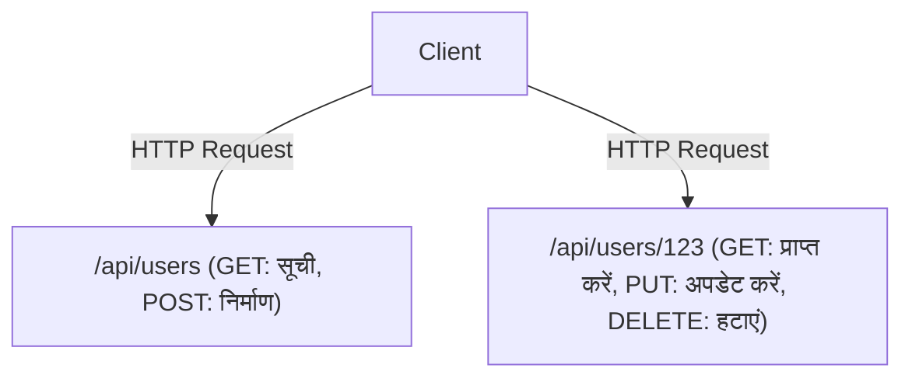

# GraphQL और REST API: डिज़ाइन दर्शन का टकराव और अभिसरण

आधुनिक सॉफ़्टवेयर विकास में, फ्रंटएंड और बैकएंड को जोड़ने वाली API का डिज़ाइन एक महत्वपूर्ण तत्व है जो पूरे सिस्टम के प्रदर्शन और विकास अनुभव को निर्धारित करता है। REST (Representational State Transfer), जो लंबे समय से वास्तविक मानक के रूप में राज कर रहा है, और GraphQL, फेसबुक (अब Meta) द्वारा बनाया गया एक नया प्रतिमान। इस लेख में, हम दोनों के बीच बुनियादी डिज़ाइन दर्शन के अंतर, उनकी संबंधित ताकत और कमजोरियों, और वास्तविक उत्पाद विकास में किसे अपनाना चाहिए, या वे कैसे सह-अस्तित्व में रह सकते हैं, इस पर गहराई से विचार करेंगे।

## REST API का मूल: संसाधन-उन्मुख और स्टेटलेस की सुंदरता

REST एक आर्किटेक्चरल शैली है जिसे वर्ष 2000 में Roy Fielding ने अपने डॉक्टरेट शोध प्रबंध में प्रस्तावित किया था। यह HTTP प्रोटोकॉल के मूल सिद्धांतों का अधिकतम लाभ उठाता है और सिस्टम को स्केल करने के लिए सरल और शक्तिशाली बाधाओं को परिभाषित करता है।

### संसाधन-उन्मुख आर्किटेक्चर (ROA)
REST का मूल "संसाधन" है। सभी डेटा का एक अद्वितीय URI (Uniform Resource Identifier) होता है, और संसाधनों पर संचालन HTTP विधियों (GET, POST, PUT, DELETE, आदि) का उपयोग करके किया जाता है।



### कैश और स्केलेबिलिटी
HTTP के मानक विनिर्देशों पर निर्भर होकर, आप वेब के मौजूदा बुनियादी ढांचे, जैसे ब्राउज़र, CDN और प्रॉक्सी सर्वर द्वारा प्रदान किए गए शक्तिशाली कैशिंग तंत्र का उपयोग कर सकते हैं। भारी ट्रैफ़िक को संभालने में यह एक असीमित लाभ है।

## वास्तविकता से विचलन: मोबाइल युग की चुनौतियाँ

हालाँकि, जैसे-जैसे मोबाइल ऐप लोकप्रिय हुए और UI अधिक समृद्ध और जटिल होते गए, सख्त संसाधन-उन्मुख REST API ने अपनी कुछ सीमाओं को उजागर करना शुरू कर दिया।

### 1. ओवर-फ़ेचिंग (Over-fetching)
क्लाइंट को केवल "उपयोगकर्ता का नाम" चाहिए, लेकिन `/api/users/123` को कॉल करने पर प्रोफ़ाइल चित्र URL, जन्म तिथि और पता जैसी अनावश्यक जानकारी भी बड़ी मात्रा में भेजी जाती है। मोबाइल नेटवर्क पर, यह अनावश्यक डेटा स्थानांतरण प्रदर्शन में गिरावट का कारण बनता है।

### 2. अंडर-फ़ेचिंग (Under-fetching) और N+1 समस्या
जब स्क्रीन प्रदर्शित करने के लिए कई संसाधनों की आवश्यकता होती है, तो एक API अनुरोध में पर्याप्त डेटा नहीं होता है, और आपको बार-बार अनुरोध दोहराने पड़ते हैं।
उदाहरण के लिए, "किसी विशिष्ट उपयोगकर्ता के लेखों की सूची और प्रत्येक लेख पर नवीनतम 3 टिप्पणियाँ" प्राप्त करने के लिए:
1. उपयोगकर्ता जानकारी प्राप्त करें
2. उपयोगकर्ता के लेखों की सूची प्राप्त करें
3. प्रत्येक लेख के लिए टिप्पणियाँ प्राप्त करें (यदि N लेख हैं तो N अनुरोध)
यह प्रसिद्ध N+1 समस्या का एक कारण है, जो विलंबता (latency) को बढ़ाता है।

## GraphQL का जन्म: क्लाइंट-संचालित डेटा फ़ेचिंग

2012 में, फेसबुक ने मोबाइल ऐप के पुनर्निर्माण प्रोजेक्ट के दौरान इन चुनौतियों का सामना किया, और उन्हें हल करने के लिए GraphQL बनाया (2015 में ओपन-सोर्स किया गया)।

GraphQL एक क्वेरी भाषा है जो क्लाइंट को "आवश्यक डेटा" की संरचना का सटीक वर्णन करने की अनुमति देती है।

```graphql
query GetUserPosts {
  user(id: "123") {
    name
    posts(first: 5) {
      title
      comments(first: 3) {
        author
        content
      }
    }
  }
}
```

### Schema और Resolver द्वारा ग्राफ संरचना का समाधान
GraphQL सर्वर में एक "Schema" होता है जो संपूर्ण सिस्टम के डेटा को एकल ग्राफ संरचना के रूप में परिभाषित करता है। क्लाइंट से भेजी गई क्वेरी का Schema के अनुसार विश्लेषण किया जाता है, और प्रत्येक फ़ील्ड से संबंधित "Resolver" फ़ंक्शन बैकएंड में डेटा एकत्र करता है। इसके परिणामस्वरूप, क्लाइंट एकल एंडपॉइंट (आमतौर पर `/graphql`) पर केवल एक अनुरोध भेजकर सभी आवश्यक डेटा को बिना किसी कमी या अधिकता के प्राप्त कर सकता है।

## कोई अचूक उपाय नहीं है: GraphQL की कीमत

GraphQL फ्रंटएंड डेवलपर्स के लिए एक सपनों की तकनीक की तरह लग सकता है, लेकिन यह बैकएंड पर नई जटिलता लाता है।

### कैशिंग की कठिनाई
REST, HTTP के कैशिंग तंत्र का पारदर्शी रूप से उपयोग कर सकता है, जबकि GraphQL मूल रूप से सभी POST अनुरोधों के रूप में एकल एंडपॉइंट पर भेजे जाते हैं, इसलिए HTTP स्तर की कैशिंग काम नहीं करती है। अपोलो (Apollo) जैसी क्लाइंट लाइब्रेरी का उपयोग करके सामान्यीकृत कैशिंग, और CDN एज पर क्वेरीज़ को कैश करने के लिए अतिरिक्त प्रयासों की आवश्यकता होती है।

### Persisted Queries (पूर्व-पंजीकृत क्वेरी)
सुरक्षा और कैशिंग चुनौतियों के व्यावहारिक समाधान के रूप में, उत्पादन परिवेशों में अक्सर "Persisted Queries" का उपयोग किया जाता है। यह एक ऐसा तंत्र है जहां क्लाइंट द्वारा जारी किए गए क्वेरी का हैश मान निर्माण (build) के समय सर्वर पर पंजीकृत किया जाता है, और निष्पादन (execution) के दौरान केवल हैश मान भेजा जाता है (GET अनुरोध)। यह दुर्भावनापूर्ण रूप से बड़ी क्वेरीज़ को रोकता है और HTTP कैशिंग का उपयोग करने में सक्षम बनाता है।

## निष्कर्ष: टकराव से अभिसरण तक

REST और GraphQL में से कोई भी एक दूसरे को पूरी तरह से प्रतिस्थापित नहीं करेगा।

- **मामले जहां REST उपयुक्त है:** बाहरी सार्वजनिक API, माइक्रो-सर्विसेज के बीच संचार, बाइनरी फ़ाइलों को अपलोड/डाउनलोड करना, और सरल CRUD संचालन-केंद्रित सिस्टम।
- **मामले जहां GraphQL उपयुक्त है:** जटिल UI वाले मोबाइल ऐप और SPA, कई बैकएंड सेवाओं (BFF) को एकत्रित करने वाली परतें, और ऐसे उत्पाद जिन्हें तेज़ी से बदलती आवश्यकताओं के लिए लचीले ढंग से अनुकूलित करने की आवश्यकता होती है।

आधुनिक आर्किटेक्चर में, "अभिसरण" का रूप मुख्यधारा बनता जा रहा है, जहां आंतरिक माइक्रो-सर्विसेज gRPC या REST के साथ संचार करते हैं, और फ्रंटएंड-फेसिंग परतें (API Gateway या BFF) GraphQL प्रदान करती हैं। तकनीकों की विशेषताओं को गहराई से समझना और उन्हें सही जगह पर उपयोग करना एक उत्कृष्ट सिस्टम डिज़ाइन की कुंजी होगी।
