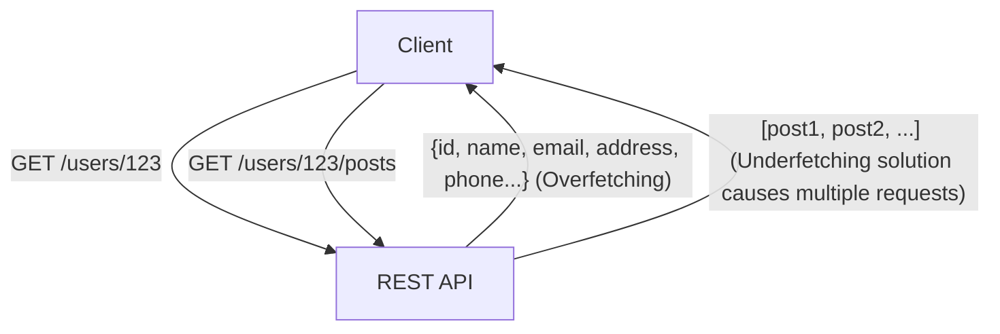
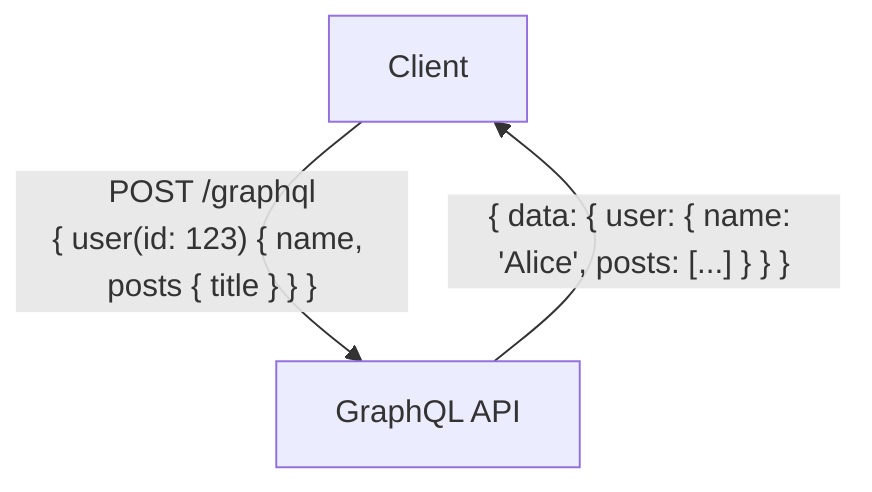

# ग्राफक्यूएल (GraphQL) बनाम रेस्ट (REST) एपीआई: डिज़ाइन दर्शन में मूलभूत अंतर और उनका उपयोग

आधुनिक वेब और मोबाइल एप्लिकेशन के विकास में, बैकएंड और फ्रंटएंड को जोड़ने वाले "एपीआई (Application Programming Interface)" का डिज़ाइन पूरे सिस्टम के प्रदर्शन और रखरखाव क्षमता से सीधे जुड़ा एक अत्यंत महत्वपूर्ण तत्व है। लंबे समय तक, "रेस्ट (Representational State Transfer)" एपीआई डिज़ाइन के वास्तविक मानक के रूप में राज करता रहा है, लेकिन हाल के वर्षों में, जटिल फ्रंटएंड आवश्यकताओं को पूरा करने के लिए एक नए प्रतिमान के रूप में "ग्राफक्यूएल (GraphQL)" तेजी से लोकप्रिय हो रहा है।

इस लेख में, एक पेशेवर तकनीकी दृष्टिकोण से, हम रेस्ट की मूल वास्तुकला शैली, ग्राफक्यूएल द्वारा हल की जा रही आधुनिक चुनौतियों (ओवरफेचिंग और अंडरफेचिंग), दोनों को लागू करने के फायदे और नुकसान, और "किस प्रोजेक्ट में किसका उपयोग करना चाहिए" जैसे दिशानिर्देशों पर विस्तार से और गहराई से चर्चा करेंगे।

## 1. रेस्ट (REST) एपीआई का दर्शन और वास्तुकला

रेस्ट (Representational State Transfer) एक सॉफ्टवेयर आर्किटेक्चरल शैली है जिसे रॉय फील्डिंग (Roy Fielding) ने 2000 में अपने डॉक्टरेट थीसिस में प्रस्तावित किया था। रेस्ट केवल एक विशिष्टता या प्रोटोकॉल नहीं है, बल्कि वितरित प्रणालियों (विशेष रूप से वर्ल्ड वाइड वेब) को स्केलेबल और मज़बूत बनाने के लिए "बाधाओं (constraints) का एक समूह" है।

### रेस्ट के मूल सिद्धांत

रॉय फील्डिंग द्वारा परिभाषित रेस्ट की प्रमुख बाधाओं में निम्नलिखित शामिल हैं:

1. **क्लाइंट-सर्वर पृथक्करण (Client-Server)**:
   यह उपयोगकर्ता इंटरफ़ेस (क्लाइंट) से संबंधित चिंताओं और डेटा भंडारण (सर्वर) से संबंधित चिंताओं को अलग करता है। यह क्लाइंट की पोर्टेबिलिटी में सुधार करता है और सर्वर की स्केलेबिलिटी सुनिश्चित करता है।
2. **स्टेटलेस (Stateless)**:
   सर्वर क्लाइंट के सेशन (सत्र) की स्थिति को बनाए नहीं रखता है। क्लाइंट के प्रत्येक अनुरोध में उस अनुरोध को संसाधित करने के लिए आवश्यक सभी जानकारी होनी चाहिए। यह सर्वर पर लोड कम करता है और सिस्टम की विश्वसनीयता में सुधार करता है।
3. **कैशे क्षमता (Cacheability)**:
   प्रतिक्रियाओं (रिस्पॉन्स) में यह जानकारी शामिल होनी चाहिए कि वे कैश करने योग्य हैं या नहीं। कैशिंग का उचित उपयोग क्लाइंट और सर्वर के बीच संचार की संख्या को कम कर सकता है और नेटवर्क दक्षता में नाटकीय रूप से सुधार कर सकता है।
4. **समान इंटरफ़ेस (Uniform Interface)**:
   यह वह सबसे महत्वपूर्ण बाधा है जो रेस्ट को रेस्ट बनाती है। संसाधनों (Resources) की पहचान विशिष्ट रूप से URI (Uniform Resource Identifier) ​​द्वारा की जाती है, और HTTP विधियों (GET, POST, PUT, DELETE, आदि) का उपयोग करके मानकीकृत संचालन (standardized operations) किए जाते हैं।
5. **स्तरित प्रणाली (Layered System)**:
   क्लाइंट को यह जानने की आवश्यकता नहीं है कि वह सीधे एंड-सर्वर से जुड़ा है या किसी मध्यवर्ती प्रॉक्सी या लोड बैलेंसर से।

### रेस्ट एपीआई के लाभ और चुनौतियां

रेस्ट एपीआई का सबसे बड़ा लाभ यह है कि यह HTTP प्रोटोकॉल के मौजूदा बुनियादी ढांचे (जैसे कैश सर्वर, प्रॉक्सी और सीडीएन) का पूरी तरह से उपयोग कर सकता है। हालांकि, आधुनिक और जटिल यूआई वाले एप्लिकेशनों में, इसकी कुछ सीमाओं की ओर भी इशारा किया गया है।

#### ओवरफेचिंग (Overfetching) और अंडरफेचिंग (Underfetching)

- **ओवरफेचिंग (Overfetching)**:
  यह वह समस्या है जहां यदि आपको किसी स्क्रीन पर केवल उपयोगकर्ता के नाम और आइकन छवि की आवश्यकता है, लेकिन `/users/{id}` एंडपॉइंट को कॉल करने पर पता, फोन नंबर और पंजीकरण तिथि जैसे अनावश्यक डेटा की एक बड़ी मात्रा भी प्राप्त हो जाती है। मोबाइल नेटवर्क जैसे सीमित बैंडविड्थ वाले वातावरण में यह प्रदर्शन में भारी गिरावट का कारण बनता है।
- **अंडरफेचिंग (N+1 समस्या)**:
  किसी विशिष्ट स्क्रीन को प्रदर्शित करने के लिए, आपको पहले एंडपॉइंट (उदा: `/users/{id}`) को कॉल करना पड़ता है, और फिर वहां से प्राप्त आईडी का उपयोग करके अन्य एंडपॉइंट (उदा: `/users/{id}/posts`) को कई बार कॉल करना पड़ता है। यह तब होता है जब आवश्यक डेटा एक ही संसाधन में एक साथ समूहीकृत नहीं होता है, जिससे विलंबता (latency) बढ़ जाती है।



## 2. ग्राफक्यूएल (GraphQL) का जन्म और प्रतिमान बदलाव

रेस्ट की इन चुनौतियों को हल करने के लिए, विशेष रूप से मोबाइल उपकरणों से अक्षम डेटा पुनर्प्राप्ति को हल करने के लिए, फेसबुक (अब मेटा) ने 2012 में आंतरिक उपयोग के लिए "ग्राफक्यूएल" विकसित किया और इसे 2015 में ओपन-सोर्स किया।

### ग्राफक्यूएल का डिज़ाइन दर्शन

ग्राफक्यूएल रेस्ट की तरह कोई आर्किटेक्चरल शैली नहीं है, बल्कि एपीआई के लिए एक "क्वेरी भाषा (query language)" और उन क्वेरी को निष्पादित करने के लिए एक "रनटाइम (runtime)" है। इसकी सबसे बड़ी विशेषता यह है कि **"क्लाइंट अपनी आवश्यकता का डेटा, अपनी आवश्यक संरचना में, केवल एक ही अनुरोध में सटीक रूप से मांग सकता है।"**

### टाइप सिस्टम और स्कीमा-संचालित विकास

ग्राफक्यूएल के मूल में एक शक्तिशाली प्रकार प्रणाली (Type System) है। यह सर्वर साइड पर उपलब्ध डेटा और उनके संबंधों को "स्कीमा" के रूप में सख्ती से परिभाषित करता है।

```graphql
type User {
  id: ID!
  name: String!
  email: String
  posts: [Post!]!
}

type Post {
  id: ID!
  title: String!
  content: String!
  author: User!
}

type Query {
  user(id: ID!): User
}
```

यह स्कीमा फ्रंटएंड इंजीनियरों और बैकएंड इंजीनियरों के बीच "अनुबंध (contract)" को स्पष्ट करता है। ग्राफक्यूएल की इंट्रोस्पेक्शन (Introspection) सुविधा स्कीमा जानकारी के आधार पर शक्तिशाली विकास उपकरण (जैसे GraphiQL) और स्वचालित कोड जनरेशन को सक्षम बनाती है, जिससे विकास का अनुभव (DX) काफी बेहतर हो जाता है।

### एकल एंडपॉइंट और क्वेरी लचीलापन

जबकि रेस्ट में प्रत्येक संसाधन के लिए कई एंडपॉइंट होते हैं, ग्राफक्यूएल में आमतौर पर केवल एक ही एंडपॉइंट होता है जैसे `/graphql`। क्लाइंट इस एंडपॉइंट पर पोस्ट (POST) अनुरोध के साथ एक क्वेरी भेजता है।

```graphql
# क्लाइंट से अनुरोध का उदाहरण
query {
  user(id: "123") {
    name
    posts {
      title
    }
  }
}
```

उपरोक्त अनुरोध के जवाब में, सर्वर एक JSON प्रतिक्रिया देता है जिसमें केवल निर्दिष्ट फ़ील्ड (जैसे `name` और `posts` के `title`) शामिल होते हैं। यह ओवरफेचिंग और अंडरफेचिंग की समस्याओं को शानदार ढंग से हल करता है।



## 3. कार्यान्वयन चुनौतियां और उन्नत डिज़ाइन रणनीतियां

यद्यपि ग्राफक्यूएल फ्रंटएंड के लिए एक जादुई उपकरण की तरह है, यह बैकएंड डिज़ाइन और कार्यान्वयन में नई चुनौतियां लाता है।

### N+1 समस्या की अभिव्यक्ति और Dataloader

ग्राफक्यूएल में, जैसे-जैसे क्वेरी की नेस्टिंग गहरी होती जाती है, "N+1 समस्या" के उत्पन्न होने की बहुत अधिक संभावना होती है, जहां बैकएंड में डेटाबेस क्वेरीज़ की संख्या बहुत तेज़ी से बढ़ती है।
उदाहरण के लिए, यदि एक ऐसी क्वेरी भेजी जाती है जो 10 उपयोगकर्ताओं और प्रत्येक उपयोगकर्ता द्वारा लिखी गई नवीनतम 5 पोस्टों को लाती है, तो एक साधारण कार्यान्वयन में कुल 11 डेटाबेस क्वेरीज़ निष्पादित होंगी ("उपयोगकर्ताओं को लाने के लिए 1 बार" + "प्रत्येक उपयोगकर्ता की पोस्ट लाने के लिए 10 बार")।

इसे हल करने के लिए मानक दृष्टिकोण **Dataloader** पैटर्न है। Dataloader अनुरोध जीवनचक्र के भीतर होने वाले व्यक्तिगत डेटा फ़ेच अनुरोधों को बैचिंग (उन्हें एक एकल डेटाबेस क्वेरी में संयोजित करके) और कैशिंग (एक ही अनुरोध के भीतर डुप्लिकेट क्वेरी को रोककर) द्वारा N+1 समस्या को कुशलतापूर्वक हल करता है।

### कैशिंग रणनीतियों में अंतर

रेस्ट एपीआई के साथ, HTTP के मानक कैशिंग तंत्र (जैसे ETag और GET अनुरोधों के लिए Cache-Control हेडर) को CDN या ब्राउज़र के माध्यम से आसानी से उपयोग किया जा सकता है। चूंकि संसाधनों के URI अद्वितीय होते हैं, इसलिए बुनियादी ढांचे के स्तर पर कैशिंग अत्यंत प्रभावी होती है।

दूसरी ओर, ग्राफक्यूएल में, चूंकि मूल रूप से सभी अनुरोध एक एकल एंडपॉइंट (`/graphql`) पर POST अनुरोध होते हैं, इसलिए HTTP-स्तर के कैशिंग तंत्र का सीधे उपयोग करना मुश्किल है। इसलिए, ग्राफक्यूएल में कैशिंग को निम्नलिखित परतों पर प्रबंधित किया जाना चाहिए:

1. **क्लाइंट-साइड कैश**: Apollo Client या Relay जैसी उन्नत क्लाइंट लाइब्रेरी द्वारा प्रदान किए गए सामान्यीकृत इन-मेमोरी कैश का उपयोग करें।
2. **परसिस्टेड क्वेरीज़ (Persisted Queries)**: सामान्य रूप से उपयोग की जाने वाली बड़ी क्वेरीज़ को सर्वर पर पहले से पंजीकृत और हैश करके रखा जाता है ताकि उन्हें GET अनुरोधों द्वारा कॉल किया जा सके, जिससे CDN पर कैशिंग संभव हो सके।
3. **सर्वर-साइड एप्लिकेशन कैश**: रिसॉल्वर (resolver) स्तर पर डेटा को कैश करने के लिए Redis आदि का उपयोग करें।

### सुरक्षा और जटिलता के खिलाफ उपाय

चूंकि ग्राफक्यूएल क्लाइंट को शक्तिशाली क्वेरी क्षमताएं प्रदान करता है, इसलिए दुर्भावनापूर्ण उपयोगकर्ताओं द्वारा जानबूझकर बहुत अधिक नेस्ट की गई और भारी क्वेरी भेजने का जोखिम होता है, जिससे सर्वर के CPU या मेमोरी की कमी हो सकती है और DoS (Denial of Service) हमले हो सकते हैं।

इसे रोकने के लिए विशिष्ट डिज़ाइन रणनीतियां निम्नलिखित हैं:

- **क्वेरी गहराई सीमा (Query Depth Limit)**: AST (Abstract Syntax Tree) का विश्लेषण करके, एक निश्चित स्तर (उदा: 5 स्तर) से अधिक नेस्टिंग वाली क्वेरी को अस्वीकार कर दिया जाता है।
- **क्वेरी जटिलता सीमा (Query Complexity Analysis)**: प्रत्येक फ़ील्ड को एक "लागत (cost)" सौंपी जाती है, और यदि पूरी क्वेरी की कुल लागत ऊपरी सीमा से अधिक हो जाती है, तो निष्पादन रोक दिया जाता है।
- **दर सीमा (Rate Limiting)**: यह सीमित करता है कि प्रति IP पते या उपयोगकर्ता द्वारा एक निश्चित समय अवधि के भीतर कुल कितनी लागत वाली क्वेरीज़ निष्पादित की जा सकती हैं।

## 4. रेस्ट बनाम ग्राफक्यूएल: उपयुक्त उपयोग के मामले

रेस्ट और ग्राफक्यूएल एक दूसरे को पूरी तरह से प्रतिस्थापित नहीं करते हैं, बल्कि आपको अपनी परियोजना की आवश्यकताओं के आधार पर उपयुक्त विकल्प चुनना चाहिए।

### रेस्ट (REST) एपीआई कब चुनें

- **सरल CRUD एप्लिकेशन**: जहां संसाधन संरचना समतल (flat) है और कोई जटिल डेटा संबंध नहीं हैं।
- **सार्वजनिक API प्रदान करना**: जब आप बड़ी संख्या में अज्ञात डेवलपर्स को API प्रदान कर रहे हों। रेस्ट सबसे मानक है, इसकी सीखने की लागत कम है, और इसे किसी भी भाषा या वातावरण से आसानी से कॉल किया जा सकता है।
- **फ़ाइल स्थानांतरण या स्ट्रीमिंग**: चित्र अपलोड करने या वीडियो स्ट्रीमिंग जैसे बाइनरी डेटा को संभालने के लिए रेस्ट (जैसे मल्टीपार्ट फॉर्म डेटा) का उपयोग करना अधिक सरल और कुशल है।
- **मजबूत बुनियादी ढांचा कैशिंग आवश्यकताएं**: सामग्री वितरण-केंद्रित प्रणालियाँ जहाँ लाखों अनुरोधों को स्थिर रूप से कैश करने और CDN का उपयोग करके संभालने की आवश्यकता होती है।

### ग्राफक्यूएल (GraphQL) कब चुनें

- **जटिल UI और डेटा आवश्यकताओं वाले एप्लिकेशन**: आधुनिक SPA (Single Page Applications) और मोबाइल ऐप जिन्हें एक ही स्क्रीन पर कई संसाधनों से डेटा एकत्र करने और एकीकृत करने की आवश्यकता होती है।
- **मल्टी-प्लेटफ़ॉर्म तैनाती**: जब आप वेब, iOS और एंड्रॉइड जैसे विभिन्न डेटा आकार की मांग करने वाले कई क्लाइंट्स को एक API के साथ कुशलतापूर्वक डेटा प्रदान करना चाहते हैं।
- **माइक्रोसर्विसेज के लिए BFF (Backend For Frontend) परत**: यह एक एकत्रीकरण परत (API Gateway/BFF) के रूप में उत्कृष्ट है, जो बैकएंड में फैली कई माइक्रोसर्विसेज या मौजूदा रेस्ट API को एक साथ बांधता है और उन्हें फ्रंटएंड के लिए उपयोग में आसान एकल ग्राफ संरचना के रूप में प्रदान करता है।
- **एजाइल विकास और स्कीमा-संचालित**: ऐसे प्रोजेक्ट जहाँ बार-बार UI में बदलाव होते हैं और परिणामस्वरूप API में लगातार बदलाव की मांग होती है। फ्रंटएंड, बैकएंड में बदलाव की प्रतीक्षा किए बिना स्वतंत्र रूप से अपनी आवश्यकतानुसार डेटा को क्वेरी में जोड़ या हटा सकता है।

## निष्कर्ष

रॉय फील्डिंग के रेस्ट (REST) ने वितरित प्रणालियों में व्यवस्था लाई और आज के वेब की नींव रखी। दूसरी ओर, ग्राफक्यूएल (GraphQL) ने फ्रंटएंड की बढ़ती जटिल मांगों को पूरा करने, डेवलपर अनुभव में सुधार लाने और क्लाइंट के प्रदर्शन को अनुकूलित करने के लिए एक शक्तिशाली उपकरण प्रदान किया है।

हमें "रेस्ट पुराना है, और ग्राफक्यूएल नया है" जैसे सरल द्वैतवाद में नहीं पड़ना चाहिए। वास्तव में एक पेशेवर आर्किटेक्ट दोनों के डिज़ाइन दर्शन में मूलभूत अंतर को गहराई से समझता है, और डेटा विशेषताओं, नेटवर्क आवश्यकताओं, क्लाइंट प्रकारों और विकास टीम के कौशल सेट का व्यापक मूल्यांकन करने के बाद ही इष्टतम वास्तुकला का चयन करता है। कुछ मामलों में, एक हाइब्रिड दृष्टिकोण, जहां सिस्टम के कोर को रेस्ट का उपयोग करके बनाया जाता है और ग्राफक्यूएल को केवल फ्रंटएंड के लिए BFF परत के रूप में अपनाया जाता है, एक बहुत शक्तिशाली विकल्प हो सकता है।
