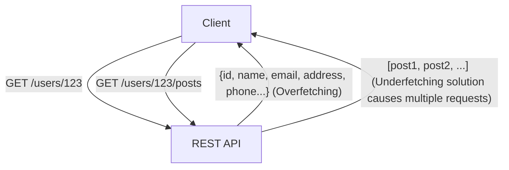
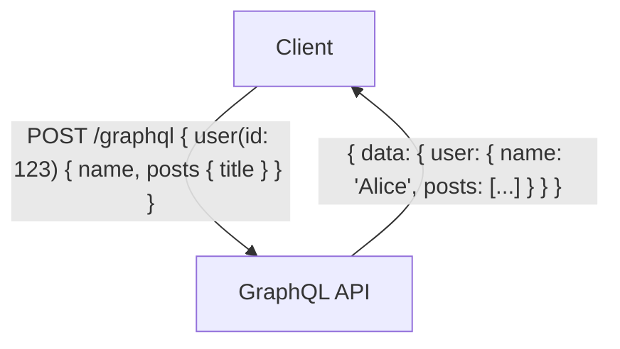

# GraphQL vs REST API: Perbedaan Mendasar dalam Filosofi Desain dan Penggunaannya

Dalam pengembangan aplikasi web dan seluler modern, desain "API" (Application Programming Interface) yang menghubungkan backend dan frontend adalah elemen sangat krusial yang berdampak langsung pada performa dan pemeliharaan keseluruhan sistem. Untuk waktu yang lama, "REST" (Representational State Transfer) telah berkuasa sebagai standar de facto untuk desain API. Namun, dalam beberapa tahun terakhir, "GraphQL" telah berkembang pesat sebagai paradigma baru untuk memenuhi tuntutan frontend yang semakin kompleks.

Artikel ini akan membahas secara mendalam dan terperinci dari perspektif teknisi profesional, mulai dari gaya arsitektur yang menjadi asal mula REST, hingga masalah modern yang coba diselesaikan oleh GraphQL (seperti overfetching dan underfetching). Selain itu, kami juga akan mengeksplorasi kelebihan dan kekurangan dari masing-masing implementasi, serta memberikan panduan tentang "pada proyek seperti apa sebaiknya kita memilih salah satunya".

## 1. Filosofi dan Arsitektur REST API

REST (Representational State Transfer) adalah gaya arsitektur perangkat lunak yang diusulkan oleh Roy Fielding dalam tesis doktoralnya pada tahun 2000. REST bukanlah sekadar spesifikasi atau protokol, melainkan "kumpulan batasan (constraints)" untuk membangun sistem terdistribusi (terutama World Wide Web) agar dapat berskala besar (scalable) dan tangguh.

### Prinsip Dasar REST

Beberapa batasan utama REST yang didefinisikan oleh Roy Fielding mencakup hal-hal berikut:

1. **Pemisahan Klien-Server (Client-Server)**:
   Memisahkan urusan antarmuka pengguna (klien) dari urusan penyimpanan data (server). Hal ini meningkatkan portabilitas klien dan memastikan skalabilitas server.
2. **Stateless**:
   Server tidak menyimpan status sesi dari klien. Setiap permintaan dari klien harus berisi semua informasi yang diperlukan untuk memproses permintaan tersebut. Ini mengurangi beban server dan meningkatkan keandalan sistem.
3. **Dapat Di-cache (Cacheability)**:
   Respons harus memuat informasi yang menyatakan apakah respons tersebut dapat di-cache atau tidak. Dengan memanfaatkan cache secara tepat, jumlah komunikasi antara klien dan server dapat dikurangi, sehingga secara drastis meningkatkan efisiensi jaringan.
4. **Antarmuka Seragam (Uniform Interface)**:
   Ini adalah batasan paling penting yang menjadikan REST sebagai REST. Sumber daya (resource) diidentifikasi secara unik oleh URI (Uniform Resource Identifier), dan operasi standar dilakukan menggunakan metode HTTP (GET, POST, PUT, DELETE, dll.).
5. **Sistem Berlapis (Layered System)**:
   Klien tidak perlu tahu apakah ia terhubung langsung ke server akhir, atau ke proxy / load balancer di tengah-tengahnya.

### Kelebihan dan Tantangan REST API

REST API memiliki keunggulan yang luar biasa karena dapat secara langsung memanfaatkan infrastruktur protokol HTTP yang sudah ada (seperti server cache, proxy, CDN, dll.). Namun, pada aplikasi modern dengan UI yang kompleks, beberapa batasan mulai terlihat.

#### Overfetching dan Underfetching

- **Overfetching**:
  Bahkan jika sebuah layar hanya membutuhkan nama dan gambar profil pengguna, melakukan permintaan ke endpoint `/users/{id}` akan mengambil sejumlah besar data yang tidak diperlukan, seperti alamat, nomor telepon, dan tanggal pendaftaran. Di lingkungan dengan bandwidth terbatas seperti jaringan seluler, hal ini dapat menyebabkan penurunan performa yang fatal.
- **Underfetching (Masalah N+1)**:
  Untuk menampilkan layar tertentu, Anda harus memanggil endpoint pertama (misalnya: `/users/{id}`) lalu menggunakan ID yang didapat dari sana untuk memanggil endpoint lain secara berulang-kali (misalnya: `/users/{id}/posts`). Hal ini terjadi karena data yang dibutuhkan tidak terkumpul dalam satu sumber daya (resource), yang akhirnya menyebabkan peningkatan latensi.



## 2. Lahirnya GraphQL dan Pergeseran Paradigma

Untuk memecahkan masalah REST ini—terutama pengambilan data yang tidak efisien dari perangkat seluler—Facebook (kini Meta) mengembangkan "GraphQL" untuk penggunaan internal pada tahun 2012 dan menjadikannya open source pada tahun 2015.

### Filosofi Desain GraphQL

GraphQL bukanlah gaya arsitektur seperti REST, melainkan "bahasa kueri" (query language) untuk API beserta "runtime" untuk mengeksekusi kueri tersebut. Ciri terbesarnya adalah **"Klien dapat meminta dengan tepat data yang mereka butuhkan, dalam struktur yang mereka butuhkan, hanya dengan satu permintaan"**.

### Sistem Tipe (Type System) dan Pengembangan Berbasis Skema (Schema-Driven)

Inti dari GraphQL adalah Sistem Tipe (Type System) yang kuat. Data yang dapat disediakan oleh server dan hubungan antar data tersebut didefinisikan secara ketat sebagai "skema".

```graphql
type User {
  id: ID!
  name: String!
  email: String
  posts: [Post!]!
}

type Post {
  id: ID!
  title: String!
  content: String!
  author: User!
}

type Query {
  user(id: ID!): User
}
```

Dengan skema ini, "kontrak" antara engineer frontend dan backend menjadi jelas. Melalui fitur GraphQL Introspection, alat pengembangan (development tools) yang handal (seperti GraphiQL) dan pembuatan kode otomatis dapat digunakan, sehingga meningkatkan pengalaman pengembang (Developer Experience / DX) secara signifikan.

### Endpoint Tunggal dan Fleksibilitas Kueri

Jika REST memiliki banyak endpoint untuk setiap sumber daya, GraphQL biasanya hanya memiliki satu endpoint, seperti `/graphql`. Klien mengirimkan kueri ke endpoint ini menggunakan permintaan POST.

```graphql
# Contoh permintaan dari klien
query {
  user(id: "123") {
    name
    posts {
      title
    }
  }
}
```

Sebagai respons terhadap permintaan di atas, server hanya mengembalikan respons JSON yang berisi field-field yang diminta (seperti `name` dan `title` dari `posts`). Hal ini dengan sangat baik menyelesaikan masalah overfetching dan underfetching.



## 3. Tantangan Implementasi dan Strategi Desain Tingkat Lanjut

Meskipun GraphQL terasa seperti keajaiban bagi frontend, ia membawa tantangan baru bagi desain dan implementasi backend.

### Kemunculan Masalah N+1 dan Dataloader

Dalam GraphQL, seiring dengan semakin dalamnya sarang kueri (query nesting), "masalah N+1" menjadi lebih rentan terjadi, di mana kueri ke database meledak secara eksponensial di backend.
Sebagai contoh, jika sebuah kueri diluncurkan untuk mengambil 10 pengguna dan 5 postingan terbaru yang ditulis oleh masing-masing pengguna tersebut, sebuah implementasi sederhana akan menjalankan kueri DB sebanyak 1 kali untuk "mengambil pengguna" ditambah 10 kali untuk "mengambil postingan masing-masing pengguna", dengan total 11 kueri DB.

Pendekatan standar untuk mengatasi hal ini adalah dengan pola **Dataloader**. Dataloader memecahkan masalah N+1 secara efisien dengan melakukan batching (menggabungkannya menjadi satu kueri DB) dan caching (mencegah kueri duplikat dalam permintaan yang sama) untuk setiap permintaan pengambilan data yang terjadi dalam satu siklus hidup permintaan (request lifecycle).

### Perbedaan Strategi Cache

Pada REST API, mekanisme cache HTTP standar (seperti ETag atau header Cache-Control pada permintaan GET) dapat dengan mudah digunakan pada CDN atau browser. Karena URI dari suatu sumber daya bersifat unik, caching pada tingkat infrastruktur sangatlah efektif.

Di sisi lain, pada GraphQL, pada dasarnya semua permintaan adalah permintaan POST yang dikirim ke satu endpoint tunggal (`/graphql`), sehingga sulit untuk menggunakan mekanisme cache tingkat HTTP apa adanya. Oleh karena itu, caching pada GraphQL perlu dirancang pada lapisan-lapisan berikut:

1. **Cache Sisi Klien (Client-side Cache)**: Memanfaatkan in-memory cache yang dinormalisasi, yang disediakan oleh library klien tingkat lanjut seperti Apollo Client atau Relay.
2. **Kueri yang Disimpan (Persisted Queries)**: Sebuah teknik di mana kueri besar yang sering digunakan didaftarkan ke server terlebih dahulu dan di-hash, sehingga dapat dipanggil melalui permintaan GET. Ini memungkinkan kueri tersebut untuk di-cache oleh CDN.
3. **Cache Aplikasi Sisi Server (Server-side Application Cache)**: Menggunakan Redis atau sejenisnya untuk menyimpan cache data di tingkat resolver.

### Solusi untuk Keamanan dan Kompleksitas

Karena GraphQL memberikan kemampuan kueri yang kuat kepada klien, ada risiko pengguna jahat akan dengan sengaja mengirim kueri berat yang bersarang dalam (deeply nested) untuk menghabiskan CPU dan memori server, yang bisa mengarah pada serangan DoS (Denial of Service).

Strategi desain umum untuk mencegah hal ini adalah sebagai berikut:

- **Batas Kedalaman Kueri (Query Depth Limit)**: Menganalisis pohon sintaksis abstrak (AST) dan menolak kueri yang sarangnya melebihi batas kedalaman tertentu (contoh: 5 tingkat).
- **Batas Kompleksitas Kueri (Query Complexity Analysis)**: Menetapkan "biaya" pada setiap field, dan memblokir eksekusi jika total biaya keseluruhan kueri melebihi batas atas.
- **Pembatasan Laju (Rate Limiting)**: Membatasi total biaya kueri yang dapat dieksekusi dalam periode waktu tertentu berdasarkan alamat IP atau pengguna.

## 4. REST vs GraphQL: Use Case yang Tepat pada Tempatnya

REST dan GraphQL tidak saling menyingkirkan satu sama lain secara sepenuhnya; sebaliknya, teknologi yang tepat harus dipilih berdasarkan persyaratan proyek.

### Kapan Harus Memilih REST API

- **Aplikasi CRUD Sederhana**: Ketika struktur sumber daya datar dan tidak memiliki relasi data yang kompleks.
- **Menyediakan API Publik**: Saat menyediakan API bagi banyak pengembang secara publik, REST adalah pendekatan paling standar, kurva belajarnya rendah, dan mudah dipanggil dari bahasa pemrograman atau lingkungan apa pun.
- **Transfer File atau Streaming**: Penanganan data biner, seperti mengunggah gambar atau streaming video, jauh lebih sederhana dan efisien menggunakan REST (misalnya menggunakan multipart form data).
- **Kebutuhan Caching Infrastruktur yang Kuat**: Sistem yang berpusat pada pengiriman konten di mana jutaan permintaan harus di-cache secara statis menggunakan CDN.

### Kapan Harus Memilih GraphQL

- **Aplikasi dengan UI dan Kebutuhan Data yang Kompleks**: Aplikasi seluler atau SPA (Single Page Application) modern yang perlu mengumpulkan dan mengintegrasikan data dari beberapa sumber daya pada satu layar.
- **Penyebaran Multi-Platform**: Saat Anda ingin menyediakan data secara efisien melalui satu API untuk beberapa klien dengan bentuk data yang berbeda, seperti Web, iOS, dan Android.
- **Lapisan BFF (Backend For Frontend) pada Microservices**: Sangat baik digunakan sebagai lapisan agregasi (API Gateway/BFF) yang menggabungkan banyak microservices yang tersebar di backend atau REST API yang sudah ada ke dalam struktur grafik (graph) tunggal yang mudah digunakan oleh frontend.
- **Pengembangan Agile dan Schema-Driven**: Proyek di mana perubahan UI sering terjadi, yang berdampak pada seringnya perubahan persyaratan API. Frontend dapat dengan bebas menambah atau menghapus data yang mereka butuhkan pada kueri tanpa harus menunggu perubahan dari sisi backend.

## Kesimpulan

REST dari Roy Fielding membawa keteraturan pada sistem terdistribusi dan membangun fondasi web saat ini. Di sisi lain, GraphQL memberikan senjata yang kuat untuk memenuhi tuntutan frontend yang makin kompleks serta mengoptimalkan pengalaman pengembang dan performa klien.

Kita tidak boleh terjebak pada dikotomi sederhana bahwa "REST itu usang dan GraphQL itu baru". Seorang arsitek perangkat lunak yang benar-benar profesional memahami secara mendalam perbedaan fundamental dalam filosofi desain di antara keduanya, mengevaluasi karakteristik data secara menyeluruh, persyaratan jaringan, tipe klien, serta kemampuan teknis tim pengembang sebelum memilih arsitektur terbaik. Dalam beberapa kasus, pendekatan hibrida—membangun inti sistem dengan REST dan mengadopsi GraphQL hanya sebagai lapisan BFF bagi frontend—dapat menjadi pilihan yang sangat tangguh.
