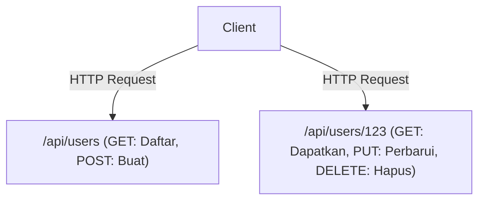

# GraphQL dan REST API: Benturan dan Fusi Filosofi Desain

Dalam pengembangan perangkat lunak modern, desain API yang menghubungkan frontend dan backend merupakan elemen krusial yang menentukan keseluruhan performa sistem serta pengalaman pengembangan. REST (Representational State Transfer) telah lama menjadi standar *de facto*, dan GraphQL hadir sebagai paradigma baru yang diciptakan oleh Facebook (sekarang Meta). Artikel ini akan membahas secara mendalam perbedaan mendasar dalam filosofi desain di antara keduanya, kelebihan dan kekurangan masing-masing, serta teknologi mana yang sebaiknya diadopsi atau bagaimana keduanya harus berdampingan dalam pengembangan produk di dunia nyata.

## Asal Mula REST API: Berorientasi Sumber Daya dan Keindahan Stateless

REST adalah gaya arsitektur yang diusulkan pada tesis doktoral Roy Fielding di tahun 2000. Konsep ini memaksimalkan prinsip dasar protokol HTTP dan mendefinisikan batasan yang sederhana namun kuat untuk menskalakan sistem.

### Arsitektur Berorientasi Sumber Daya (ROA)
Inti dari REST adalah "sumber daya". Semua data memiliki URI (Uniform Resource Identifier) yang unik, dan operasi pada sumber daya dilakukan dengan menggunakan metode HTTP (GET, POST, PUT, DELETE, dll.).



### Cache dan Skalabilitas
Dengan menggunakan standar protokol HTTP, mekanisme caching yang kuat dari infrastruktur web yang ada, seperti peramban (browser), CDN, dan server proksi dapat langsung digunakan. Hal ini memberikan manfaat yang tak terukur saat memproses trafik dalam jumlah masif.

## Kesenjangan dengan Realitas: Tantangan di Era Mobile

Namun, seiring dengan menjamurnya aplikasi seluler dan Antarmuka Pengguna (UI) yang semakin kaya serta kompleks, API REST yang berorientasi ketat pada sumber daya mulai menampakkan beberapa keterbatasannya.

### 1. Over-fetching
Klien hanya membutuhkan "nama pengguna", tetapi saat memanggil `/api/users/123`, data yang tidak diperlukan seperti URL gambar profil, tanggal lahir, dan alamat ikut terkirim dalam jumlah besar. Pada jaringan seluler, transfer data yang sia-sia ini akan mengakibatkan penurunan performa.

### 2. Under-fetching dan Masalah N+1
Ketika berbagai sumber daya dibutuhkan untuk menampilkan sebuah layar, satu permintaan API tunggal belum cukup menyediakan data sehingga klien terpaksa harus mengulangi permintaan berkali-kali.
Misalnya, saat mengambil "daftar artikel pengguna dan 3 komentar terbaru pada tiap artikel":
1. Mengambil informasi pengguna
2. Mengambil daftar artikel pengguna
3. Mengambil komentar dari setiap artikel (jika ada N artikel, maka diperlukan N permintaan)
Hal ini menjadi penyebab salah satu masalah N+1 yang terkenal, yang juga memicu lonjakan latensi (latency).

## Lahirnya GraphQL: Pengambilan Data yang Didorong oleh Klien

Pada tahun 2012, Facebook berhadapan dengan masalah ini di tengah proyek pembaruan aplikasi seluler mereka dan akhirnya melahirkan GraphQL untuk menyelesaikan tantangan-tantangan tersebut (dirilis sebagai *open-source* pada 2015).

GraphQL merupakan bahasa kueri yang memungkinkan klien dengan akurat mendeskripsikan struktur "data yang diinginkan".

```graphql
query GetUserPosts {
  user(id: "123") {
    name
    posts(first: 5) {
      title
      comments(first: 3) {
        author
        content
      }
    }
  }
}
```

### Resolusi Struktur Graf Menggunakan Schema dan Resolver
Server GraphQL memiliki "Schema" yang mendefinisikan seluruh data di dalam sistem sebagai sebuah struktur graf. Kueri yang dikirim dari klien dianalisis menurut Schema, dan fungsi "Resolver" yang sesuai untuk setiap bidang (*field*) mengumpulkan data di bagian backend. Dengan demikian, klien hanya perlu mengirimkan satu permintaan menuju *endpoint* tunggal (umumnya `/graphql`) dan bisa mendapatkan seluruh data yang dibutuhkan dengan presisi tanpa kurang maupun lebih.

## Tidak Ada Solusi yang Sempurna: Pengorbanan GraphQL

GraphQL terlihat seperti teknologi impian bagi pengembang *frontend*, tetapi ia membawa kerumitan yang baru pada bagian *backend*.

### Kesulitan Caching
Jika REST secara langsung memanfaatkan mekanisme cache HTTP, GraphQL pada dasarnya berjalan dengan mengirim seluruh permintaan menggunakan *method* POST menuju satu *endpoint* sehingga level cache HTTP menjadi tidak efektif. Maka diperlukan suatu penanganan tambahan menggunakan *normalized cache* lewat *library* klien semacam Apollo atau kiat-kiat agar kueri tersimpan di CDN *edge*.

### Persisted Queries (Kueri yang Terdaftar)
Sebagai sebuah penyelesaian nyata untuk menangani masalah keamanan serta mekanisme cache, "Persisted Queries" amat sering dipakai pada area produksi (*production*). Melalui sistem ini, nilai *hash* dari kueri klien telah lebih dahulu terdaftar dalam server saat waktu pembentukan aplikasi (*build time*), sehingga ketika eksekusi berlangsung hanyalah nilai *hash* saja yang dikirim (sebagai *GET request*). Dengan begitu, kueri yang berniat jahat dapat dicegah, seraya tetap dapat menerapkan cache HTTP.

## Kesimpulan: Dari Benturan Menuju Fusi

REST dan GraphQL tidak saling menyingkirkan satu sama lain seutuhnya.

- **Kasus yang cocok dengan REST:** API Publik untuk konsumsi eksternal, interaksi komunikasi antar layanan mikro (*microservices*), operasi penambahan/pengunduhan *file* biner, dan sebuah sistem yang menonjolkan fitur CRUD sederhana.
- **Kasus yang cocok dengan GraphQL:** Aplikasi berbasis seluler maupun SPA yang sarat akan UI kompleks, merupakan lapisan untuk menampung pelayanan dari bermacam *backend* (BFF), serta produk yang menuntut fleksibilitas cepat bagi tiap-tiap persyaratan.

Dalam bentuk rancangan arsitektur modern, "Fusi" di mana *microservices* bagian dalam berinteraksi menggunakan gRPC/REST selagi lapisan yang bersebelahan dengan frontend (API Gateway atau BFF) menyediakan fitur GraphQL mulai berubah menjadi aliran arus utama yang jamak dipilih. Keahlian untuk memilah yang terbaik serta paham kapan mesti mengaplikasikannya di tempat yang pas akan menjadi kunci yang utama bagi perancangan sistem yang brilian.
