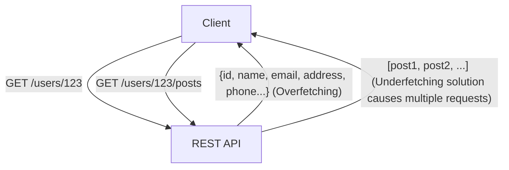
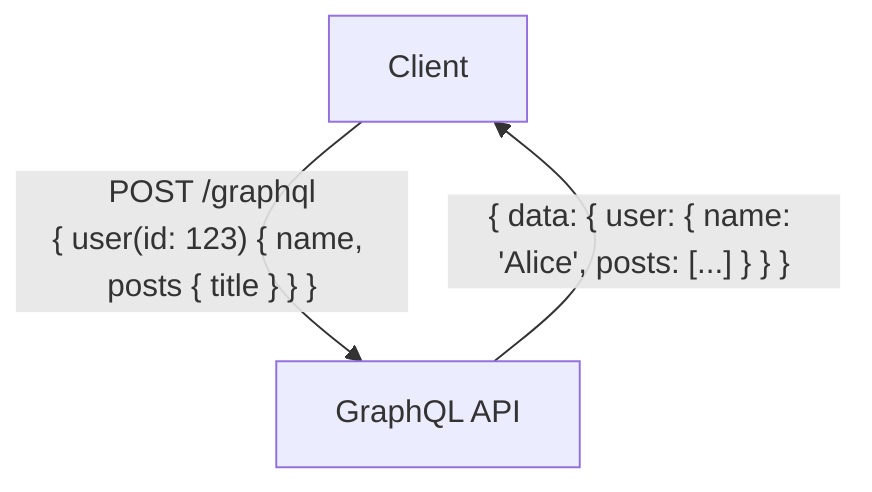

# GraphQL vs REST API: 설계 사상의 근본적인 차이와 활용 방법

현대의 웹 애플리케이션이나 모바일 앱 개발에 있어서, 백엔드와 프론트엔드를 연결하는 'API(Application Programming Interface)' 설계는 시스템 전체의 성능이나 유지보수성과 직결되는 매우 중요한 요소입니다. 오랫동안 API 설계의 사실상 표준(de facto standard)으로 군림해 온 것은 'REST(Representational State Transfer)'입니다만, 최근 복잡해지는 프론트엔드의 요구에 부응하기 위한 새로운 패러다임으로서 'GraphQL'이 급속도로 보급되고 있습니다.

본 기사에서는 전문 엔지니어의 관점에서, REST의 원점이 되는 아키텍처 스타일부터 GraphQL이 해결하고자 하는 현대적인 과제(오버페칭과 언더페칭), 나아가 양측의 구현상 장단점, 그리고 '어떤 프로젝트에서 어떤 것을 도입해야 하는가'라는 활용 지침까지 상세하고 깊이 있게 해설합니다.

## 1. REST API의 철학과 아키텍처

REST(Representational State Transfer)는 2000년 Roy Fielding이 자신의 박사 논문에서 제창한 소프트웨어 아키텍처 스타일입니다. REST는 단순한 사양이나 프로토콜이 아니라, 분산 시스템(특히 월드 와이드 웹)을 확장 가능하고 견고하게 구축하기 위한 '제약 조건의 집합'입니다.

### REST의 기본 원칙

Roy Fielding이 정의한 REST의 주요 제약 조건에는 다음이 포함됩니다.

1. **클라이언트-서버 분리(Client-Server)**:
   사용자 인터페이스에 관한 관심사(클라이언트)와 데이터 저장에 관한 관심사(서버)를 분리합니다. 이를 통해 클라이언트의 이식성이 향상되고 서버의 확장성이 확보됩니다.
2. **무상태성(Stateless)**:
   서버는 클라이언트의 세션 상태를 유지하지 않습니다. 클라이언트로부터의 각 요청에는 그 요청을 처리하는 데 필요한 모든 정보가 포함되어야 합니다. 이로 인해 서버의 부하가 경감되고 시스템의 신뢰성이 향상됩니다.
3. **캐시 가능성(Cacheability)**:
   응답에는 그것이 캐시 가능한지에 대한 정보가 포함되어야 합니다. 적절히 캐시를 활용함으로써 클라이언트와 서버 간의 통신 횟수를 줄이고 네트워크 효율을 극적으로 높일 수 있습니다.
4. **일관된 인터페이스(Uniform Interface)**:
   REST를 REST답게 만드는 가장 중요한 제약 조건입니다. 리소스는 URI(Uniform Resource Identifier)에 의해 고유하게 식별되며, HTTP 메서드(GET, POST, PUT, DELETE 등)를 사용하여 표준화된 조작을 수행합니다.
5. **계층화 시스템(Layered System)**:
   클라이언트는 직접 최종 서버에 연결되어 있는지, 아니면 중간의 프록시나 로드 밸런서에 연결되어 있는지 의식할 필요가 없습니다.

### REST API의 장점과 과제

REST API는 HTTP 프로토콜의 기존 인프라스트럭처(캐시 서버, 프록시, CDN 등)를 그대로 활용할 수 있다는 절대적인 장점이 있습니다. 그러나 현대의 복잡한 UI를 가진 애플리케이션에서는 몇 가지 한계점도 지적되고 있습니다.

#### 오버페칭(Overfetching)과 언더페칭(Underfetching)

- **오버페칭(Overfetching)**:
  어떤 화면에서 사용자의 이름과 프로필 이미지만 필요한 경우에도 `/users/{id}`라는 엔드포인트를 호출하면 주소, 전화번호, 가입일 등 불필요한 데이터까지 대량으로 가져오게 되는 문제입니다. 이는 모바일 네트워크처럼 대역폭이 제한된 환경에서는 치명적인 성능 저하를 초래합니다.
- **언더페칭(Underfetching, N+1 문제)**:
  특정 화면을 표시하기 위해 첫 번째 엔드포인트(예: `/users/{id}`)를 호출하고, 거기서 얻은 ID를 사용하여 또 다른 엔드포인트(예: `/users/{id}/posts`)를 여러 번 호출해야 하는 문제입니다. 필요한 데이터가 하나의 리소스에 모여 있지 않기 때문에 발생하며, 지연 시간(Latency)의 증가를 야기합니다.



## 2. GraphQL의 탄생과 패러다임 시프트

이러한 REST의 과제, 특히 모바일 기기에서의 비효율적인 데이터 조회를 해결하기 위해 Facebook(현 Meta)이 2012년에 사내용으로 개발하고 2015년에 오픈 소스로 공개한 것이 'GraphQL'입니다.

### GraphQL의 설계 사상

GraphQL은 REST와 같은 아키텍처 스타일이 아니라, API를 위한 '쿼리 언어'이자 그 쿼리를 실행하기 위한 '런타임'입니다. 가장 큰 특징은 **"클라이언트가 필요한 데이터를, 필요한 구조로, 단 한 번의 요청으로 정확하게 요구할 수 있다"**는 점에 있습니다.

### 타입 시스템과 스키마 주도 개발

GraphQL의 핵심을 이루는 것은 강력한 타입 시스템(Type System)입니다. 서버 측에서 제공 가능한 데이터와 그 관계성을 '스키마(Schema)'로서 엄격하게 정의합니다.

```graphql
type User {
  id: ID!
  name: String!
  email: String
  posts: [Post!]!
}

type Post {
  id: ID!
  title: String!
  content: String!
  author: User!
}

type Query {
  user(id: ID!): User
}
```

이 스키마를 통해 프론트엔드 엔지니어와 백엔드 엔지니어 간의 '계약'이 명확해집니다. GraphQL Introspection(자기 검사) 기능 덕분에 스키마 정보를 바탕으로 한 강력한 개발 도구(GraphiQL 등)나 자동 코드 생성을 활용할 수 있게 되어, 개발자 경험(DX)이 비약적으로 향상됩니다.

### 단일 엔드포인트와 쿼리의 유연성

REST가 리소스마다 여러 개의 엔드포인트를 가지는 것에 비해, GraphQL은 일반적으로 `/graphql`이라는 단일 엔드포인트만을 가집니다. 클라이언트는 이 엔드포인트에 대해 POST 요청으로 쿼리를 전송합니다.

```graphql
# 클라이언트의 요청 예시
query {
  user(id: "123") {
    name
    posts {
      title
    }
  }
}
```

위의 요청에 대해 서버는 지정된 필드(`name`과 `posts`의 `title`)만 포함하는 JSON 응답을 반환합니다. 이를 통해 오버페칭과 언더페칭 문제가 멋지게 해결됩니다.



## 3. 구현상 과제와 고도화된 설계 전략

GraphQL은 프론트엔드에게 마법 같은 도구이지만, 백엔드의 설계와 구현에는 새로운 과제를 가져옵니다.

### N+1 문제의 현재화와 Dataloader

GraphQL에서는 쿼리의 중첩(Nest)이 깊어질수록 백엔드에서 데이터베이스로의 쿼리가 폭발적으로 증가하는 'N+1 문제'가 발생하기 쉽습니다.
예를 들어 10명의 사용자와 각 사용자가 작성한 최신 게시물 5건을 가져오는 쿼리가 전달될 경우, 단순한 구현에서는 "사용자 조회 1번" + "각 사용자의 게시물 조회 10번"으로 총 11번의 DB 쿼리가 실행됩니다.

이를 해결하기 위한 표준적인 접근 방식이 **Dataloader** 패턴입니다. Dataloader는 요청의 라이프사이클 내에서 발생하는 개별 데이터 패치(Fetch) 요구를 일괄 처리(배치화하여 하나의 DB 쿼리로 만듦) 및 캐시(동일 요청 내에서의 중복 쿼리 방지)함으로써 N+1 문제를 효율적으로 해소합니다.

### 캐시 전략의 차이

REST API에서는 HTTP의 표준적인 캐시 메커니즘(GET 요청에 대한 ETag나 Cache-Control 헤더)을 CDN이나 브라우저에서 쉽게 이용할 수 있습니다. 리소스의 URI가 고유하기 때문에 인프라 수준에서의 캐시가 매우 효과적입니다.

반면 GraphQL에서는 기본적으로 모든 요청이 단일 엔드포인트(`/graphql`)에 대한 POST 요청이 되므로 HTTP 수준의 캐시 메커니즘을 그대로 이용하기가 어렵습니다. 따라서 GraphQL에서의 캐시는 다음과 같은 계층에서 고안해야 합니다.

1. **클라이언트 사이드 캐시**: Apollo Client나 Relay 같은 고도의 클라이언트 라이브러리가 제공하는 정규화된 인메모리 캐시를 활용합니다.
2. **지속 쿼리(Persisted Queries)**: 자주 사용되는 거대한 쿼리를 사전에 서버에 등록하여 해시화하고, GET 요청으로 호출할 수 있게 함으로써 CDN에서의 캐시를 가능하게 하는 기법입니다.
3. **서버 사이드 애플리케이션 캐시**: Redis 등을 이용하여 리졸버(Resolver) 수준에서 데이터를 캐시합니다.

### 보안과 복잡성에 대한 대책

GraphQL은 클라이언트에게 강력한 쿼리 능력을 부여하기 때문에, 악의적인 사용자가 의도적으로 깊게 중첩된 무거운 쿼리를 전송하여 서버의 CPU나 메모리를 고갈시키는 DoS 공격(Denial of Service)의 위험이 있습니다.

이를 방지하기 위한 대표적인 설계 전략은 다음과 같습니다.

- **쿼리 깊이 제한(Query Depth Limit)**: AST(추상 구문 트리)를 분석하여 중첩 깊이가 일정 수준(예: 5단계)을 초과하는 쿼리를 거부합니다.
- **쿼리 복잡도 제한(Query Complexity Analysis)**: 각 필드에 '비용(Cost)'을 할당하고 쿼리 전체의 총비용이 상한을 초과한 경우에는 실행을 차단합니다.
- **처리율 제한(Rate Limiting)**: IP 주소나 사용자별로 일정 시간 내에 실행 가능한 쿼리의 총비용을 제한합니다.

## 4. REST vs GraphQL: 적재적소의 사용 사례 (Use Cases)

REST와 GraphQL은 어느 한쪽이 다른 한쪽을 완전히 대체하는 것이 아니며, 프로젝트의 요구사항에 따라 적절한 것을 선택해야 합니다.

### REST API를 선택해야 하는 경우

- **단순한 CRUD 애플리케이션**: 리소스의 구조가 평면적이고 복잡한 데이터 관계성을 가지지 않는 경우.
- **퍼블릭 API 제공**: 불특정 다수의 개발자를 위한 API를 제공할 경우, REST가 가장 표준적이고 학습 비용이 낮으며 모든 언어·환경에서 쉽게 호출할 수 있습니다.
- **파일 전송 및 스트리밍**: 이미지 업로드나 동영상 스트리밍 등 바이너리 데이터 처리는 REST(멀티파트 폼 데이터 등) 방식이 더 단순하고 효율적입니다.
- **강력한 인프라 캐시 요구사항**: CDN을 활용하여 수백만 건의 요청을 정적으로 캐시하여 처리해야 하는 콘텐츠 전송 중심의 시스템.

### GraphQL을 선택해야 하는 경우

- **복잡한 UI와 데이터 요구사항을 가진 애플리케이션**: 한 화면에서 여러 리소스의 데이터를 수집하고 통합해야 하는 모던 SPA(Single Page Application)나 모바일 앱.
- **멀티 플랫폼 전개**: Web, iOS, Android 등 요구하는 데이터의 형태가 다른 여러 클라이언트에 대해 하나의 API로 효율적으로 데이터를 제공하고 싶은 경우.
- **마이크로서비스의 BFF(Backend For Frontend) 계층**: 백엔드에 흩어져 있는 여러 마이크로서비스나 기존의 REST API를 묶어 프론트엔드가 사용하기 쉬운 단일 그래프 구조로 제공하는 집계 계층(API Gateway/BFF)으로서 매우 뛰어납니다.
- **애자일한 개발과 스키마 주도 개발**: 빈번하게 UI 변경이 발생하고 그에 따른 API 변경 요구가 많은 프로젝트. 프론트엔드는 백엔드의 변경을 기다리지 않고 필요한 데이터를 자유롭게 쿼리에 추가/삭제할 수 있습니다.

## 결론

Roy Fielding의 REST는 분산 시스템에 질서를 가져왔고, 오늘날 웹의 기반을 다졌습니다. 한편 GraphQL은 복잡해지는 프론트엔드의 요구에 부응하며 개발자 경험과 클라이언트의 성능을 최적화하기 위한 강력한 무기를 제공했습니다.

"REST는 낡았고 GraphQL이 새롭다"라는 단순한 이분법에 빠져서는 안 됩니다. 진정한 전문 아키텍트는 양쪽의 설계 사상의 근본적인 차이를 깊이 이해하고, 데이터의 특성, 네트워크 요구사항, 클라이언트의 종류, 그리고 개발팀의 스킬 셋을 종합적으로 평가한 후 최적의 아키텍처를 선택하는 것입니다. 경우에 따라서는 시스템의 핵심을 REST로 구축하고 프론트엔드를 위한 BFF 계층으로만 GraphQL을 도입하는 하이브리드 접근 방식 또한 매우 강력한 선택지가 될 것입니다.
