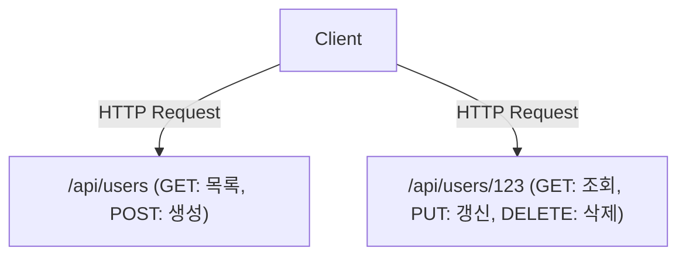

# GraphQL과 REST API: 설계 사상의 충돌과 융합

현대 소프트웨어 개발에서 프론트엔드와 백엔드를 연결하는 API 설계는 시스템 전체의 성능과 개발 경험을 좌우하는 중요한 요소입니다. 오랫동안 사실상의 표준(De facto standard)으로 군림해 온 REST(Representational State Transfer)와 Facebook(현 Meta)이 만들어낸 새로운 패러다임인 GraphQL. 본 기사에서는 양쪽의 근본적인 설계 사상의 차이점, 각각의 강점과 약점, 그리고 실제 프로덕트 개발에 있어서 어떤 것을 채택해야 할지, 혹은 어떻게 공존시켜야 할지를 깊이 파헤쳐 보겠습니다.

## REST API의 원전: 리소스 지향과 무상태성(Stateless)의 아름다움

REST는 2000년에 Roy Fielding의 박사 논문에서 제창된 아키텍처 스타일입니다. HTTP 프로토콜의 기본 원칙을 최대한 활용하여 시스템을 확장(Scale)시키기 위한 단순하면서도 강력한 제약을 정의했습니다.

### 리소스 지향 아키텍처 (ROA)
REST의 핵심은 "리소스"입니다. 모든 데이터는 고유한 URI(Uniform Resource Identifier)를 가지며, HTTP 메서드(GET, POST, PUT, DELETE 등)를 사용하여 리소스에 대한 조작을 수행합니다.



### 캐시와 스케일러빌리티(Scalability)
HTTP의 표준 사양을 따름으로써, 브라우저, CDN, 프록시 서버 등 웹의 기존 인프라가 제공하는 강력한 캐시 메커니즘을 그대로 이용할 수 있습니다. 이는 거대한 트래픽을 처리하는 데 있어 헤아릴 수 없는 장점입니다.

## 현실과의 괴리: 모바일 시대의 과제

그러나 모바일 앱이 보급되고 UI가 더욱 풍부하고 복잡해짐에 따라, 엄격한 리소스 지향적인 REST API는 몇 가지 한계를 드러내기 시작했습니다.

### 1. 오버패칭 (Over-fetching)
클라이언트가 필요로 하는 것은 "사용자의 이름"뿐인데, `/api/users/123` 을 호출하면 프로필 이미지 URL, 생년월일, 주소 등 불필요한 데이터까지 대량으로 전송되는 문제입니다. 모바일 네트워크에서는 이러한 불필요한 데이터 전송이 성능 저하를 초래합니다.

### 2. 언더패칭 (Under-fetching)과 N+1 문제
화면을 표시하기 위해 여러 리소스가 필요한 경우, 한 번의 API 요청으로는 데이터가 충분하지 않아 여러 번 요청을 반복해야 하는 문제입니다.
예를 들어, "어떤 사용자의 게시물 목록과 각 게시물의 최신 댓글 3개"를 가져오는 경우:
1. 사용자 정보를 가져옴
2. 사용자의 게시물 목록을 가져옴
3. 각 게시물의 댓글을 가져옴 (게시물이 N개라면 N번의 요청)
이것이 유명한 N+1 문제의 원인 중 하나가 되며, 대기 시간(Latency)의 증가를 야기합니다.

## GraphQL의 탄생: 클라이언트 주도의 데이터 패칭

2012년, Facebook은 모바일 앱 재구축 프로젝트 과정에서 이러한 과제에 직면했고, 이를 해결하기 위해 GraphQL을 만들어냈습니다(2015년에 오픈 소스화).

GraphQL은 클라이언트가 "원하는 데이터"의 구조를 정확하게 기술할 수 있는 쿼리 언어입니다.

```graphql
query GetUserPosts {
  user(id: "123") {
    name
    posts(first: 5) {
      title
      comments(first: 3) {
        author
        content
      }
    }
  }
}
```

### Schema와 Resolver에 의한 그래프 구조 해결
GraphQL 서버는 시스템 전체의 데이터를 하나의 그래프 구조로 정의하는 "Schema"를 가집니다. 클라이언트로부터 전송된 쿼리는 Schema에 따라 분석되고, 각 필드에 대응하는 "Resolver" 함수가 백엔드에서 데이터를 수집합니다. 이로써 클라이언트는 단일 엔드포인트(일반적으로 `/graphql`)에 대해 한 번의 요청을 보내는 것만으로 필요한 모든 데이터를 남김없이 얻을 수 있습니다.

## 완벽한 은탄환은 없다: GraphQL의 대가

GraphQL은 프론트엔드 개발자에게는 꿈같은 기술로 보이지만, 백엔드 측에는 새로운 복잡성을 가져옵니다.

### 캐시의 어려움
REST가 HTTP의 캐시 메커니즘을 투명하게 이용할 수 있었던 반면, GraphQL은 기본적으로 모든 요청이 POST 요청으로서 단일 엔드포인트로 전송되기 때문에 HTTP 수준의 캐시가 작동하지 않습니다. Apollo(아폴로) 등의 클라이언트 라이브러리를 사용한 정규화 캐시나, CDN 엣지에서 쿼리를 캐시하기 위한 기술적 고안이 필요해집니다.

### Persisted Queries (사전 등록 쿼리)
보안과 캐시 문제에 대한 현실적인 해답으로서, 프로덕션 환경에서는 "Persisted Queries"가 자주 사용됩니다. 이는 빌드 시점에 클라이언트가 발행하는 쿼리의 해시값을 서버에 등록해 두고, 실행 시에는 해시값만을 전송(GET 요청)하는 구조입니다. 이를 통해 악의적인 거대한 쿼리를 방지하면서 HTTP 캐시를 활용할 수 있게 됩니다.

## 결론: 충돌에서 융합으로

REST와 GraphQL은 어느 한쪽이 다른 한쪽을 완전히 몰아내는 것이 아닙니다.

- **REST가 적합한 경우:** 외부 공개용 Public API, 마이크로서비스 간의 통신, 바이너리 파일 업로드/다운로드, 단순한 CRUD 작업 중심의 시스템.
- **GraphQL이 적합한 경우:** 복잡한 UI를 가진 모바일 앱이나 SPA, 여러 백엔드 서비스(BFF)를 집약하는 계층, 변화가 심한 요구사항에 유연하게 대응해야 하는 프로덕트.

현대 아키텍처에서는 내부 마이크로서비스는 gRPC나 REST로 통신하고, 프론트엔드와 맞닿은 계층(API Gateway나 BFF)에서 GraphQL을 제공하는 식의 "융합" 형태가 주류가 되어가고 있습니다. 기술의 특성을 깊이 이해하고 적재적소에 구분하여 사용하는 것만이 훌륭한 시스템 설계의 핵심이 될 것입니다.
