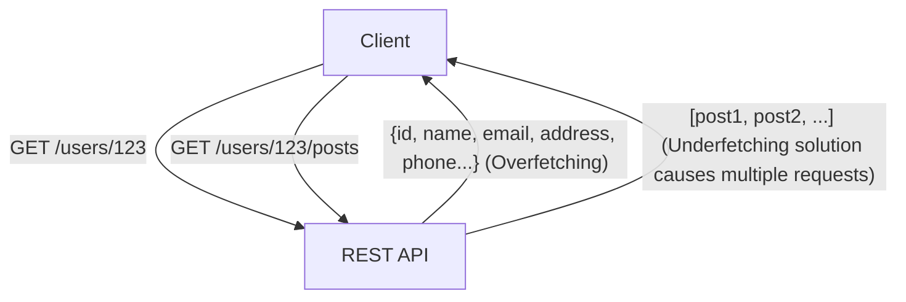
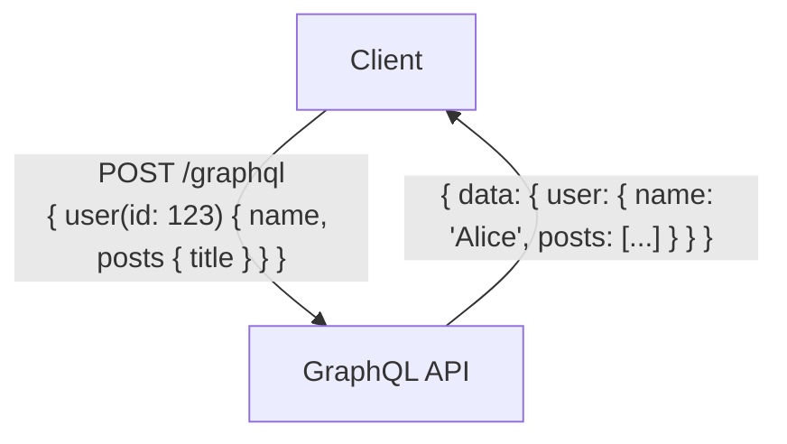

# GraphQL vs REST API：設計思想の根本的な違いと使い分け

現代のWebアプリケーションやモバイルアプリの開発において、バックエンドとフロントエンドを繋ぐ「API（Application Programming Interface）」の設計は、システム全体のパフォーマンスや保守性に直結する極めて重要な要素です。長らくAPI設計のデファクトスタンダードとして君臨してきたのが「REST（Representational State Transfer）」ですが、近年、複雑化するフロントエンドの要求に応えるための新たなパラダイムとして「GraphQL」が急速に普及しています。

本記事では、プロの技術者の視点から、RESTの原点となるアーキテクチャスタイルから、GraphQLが解決しようとしている現代的な課題（オーバーフェッチやアンダーフェッチ）、さらには両者の実装上のメリット・デメリット、そして「どのようなプロジェクトでどちらを採用すべきか」という使い分けの指針までを、詳細かつ深く掘り下げて解説します。

## 1. REST APIの哲学とアーキテクチャ

REST（Representational State Transfer）は、2000年にRoy Fielding氏が自身の博士論文で提唱したソフトウェアアーキテクチャのスタイルです。RESTは単なる仕様やプロトコルではなく、分散システム（特にWorld Wide Web）をスケーラブルかつ堅牢に構築するための「制約の集合」です。

### RESTの基本原則

Roy Fielding氏が定義したRESTの主要な制約には以下のものがあります。

1. **クライアント・サーバー分離（Client-Server）**:
   ユーザーインターフェースに関する関心事（クライアント）と、データストレージに関する関心事（サーバー）を分離します。これにより、クライアントの移植性が向上し、サーバーのスケーラビリティが確保されます。
2. **ステートレス（Stateless）**:
   サーバーはクライアントのセッション状態を保持しません。クライアントからの各リクエストには、そのリクエストを処理するために必要なすべての情報が含まれている必要があります。これにより、サーバーの負荷が軽減され、システムの信頼性が向上します。
3. **キャッシュ可能性（Cacheability）**:
   レスポンスには、それがキャッシュ可能かどうかの情報を含める必要があります。適切にキャッシュを利用することで、クライアント・サーバー間の通信回数を減らし、ネットワークの効率を劇的に高めることができます。
4. **統一インターフェース（Uniform Interface）**:
   RESTをRESTたらしめる最も重要な制約です。リソースはURI（Uniform Resource Identifier）によって一意に識別され、HTTPメソッド（GET, POST, PUT, DELETEなど）を用いて標準化された操作を行います。
5. **階層化システム（Layered System）**:
   クライアントは、直接エンドサーバーに接続しているのか、中間のプロキシやロードバランサーに接続しているのかを意識する必要がありません。

### REST APIのメリットと課題

REST APIは、HTTPプロトコルの既存のインフラストラクチャ（キャッシュサーバー、プロキシ、CDNなど）をそのまま活用できるという絶大なメリットがあります。しかし、現代の複雑なUIを持つアプリケーションにおいては、いくつかの限界も指摘されるようになりました。

#### オーバーフェッチ（Overfetching）とアンダーフェッチ（Underfetching）

- **オーバーフェッチ**:
  ある画面でユーザーの名前とアイコン画像だけが必要な場合でも、`/users/{id}` というエンドポイントを叩くと、住所や電話番号、登録日など、不要なデータまで大量に取得してしまう問題です。これはモバイル回線など帯域幅が限られた環境では致命的なパフォーマンス低下を招きます。
- **アンダーフェッチ（N+1問題）**:
  特定の画面を表示するために、最初のエンドポイント（例：`/users/{id}`）を叩き、そこで得たIDを使ってさらに別のエンドポイント（例：`/users/{id}/posts`）を複数回叩かなければならない問題です。必要なデータが1つのリソースにまとまっていないために発生し、レイテンシの増大を引き起こします。



## 2. GraphQLの誕生とパラダイムシフト

これらのRESTの課題、特にモバイルデバイスからの非効率なデータ取得を解決するために、Facebook（現Meta）が2012年に社内向けに開発し、2015年にオープンソース化したのが「GraphQL」です。

### GraphQLの設計思想

GraphQLは、RESTのようなアーキテクチャスタイルではなく、APIのための「クエリ言語」およびそのクエリを実行するための「ランタイム」です。最大の特徴は、**「クライアントが必要なデータを、必要な構造で、一度のリクエストで正確に要求できる」**という点にあります。

### 型システムとスキーマ駆動開発

GraphQLの中核をなすのが、強力な型システム（Type System）です。サーバー側で提供可能なデータとその関連性を「スキーマ」として厳密に定義します。

```graphql
type User {
  id: ID!
  name: String!
  email: String
  posts: [Post!]!
}

type Post {
  id: ID!
  title: String!
  content: String!
  author: User!
}

type Query {
  user(id: ID!): User
}
```

このスキーマにより、フロントエンドエンジニアとバックエンドエンジニアの間の「契約」が明確になります。GraphQL Introspection（自己検査）機能により、スキーマ情報を元にした強力な開発ツール（GraphiQLなど）や自動コード生成が利用可能になり、開発体験（DX）が飛躍的に向上します。

### 単一エンドポイントとクエリの柔軟性

RESTがリソースごとに複数のエンドポイントを持つのに対し、GraphQLは通常 `/graphql` という単一のエンドポイントのみを持ちます。クライアントは、このエンドポイントに対してPOSTリクエストでクエリを送信します。

```graphql
# クライアントからのリクエスト例
query {
  user(id: "123") {
    name
    posts {
      title
    }
  }
}
```

上記のリクエストに対し、サーバーは指定されたフィールド（`name`と`posts`の`title`）のみを含むJSONレスポンスを返します。これにより、オーバーフェッチとアンダーフェッチの問題が見事に解決されます。



## 3. 実装上の課題と高度な設計戦略

GraphQLはフロントエンドにとって魔法のようなツールですが、バックエンドの設計と実装には新たな課題をもたらします。

### N+1問題の顕在化とDataloader

GraphQLでは、クエリのネストが深くなるにつれてバックエンドでデータベースへのクエリが爆発的に増加する「N+1問題」が発生しやすくなります。
例えば、10人のユーザーとそれぞれのユーザーが書いた最新の投稿5件を取得するクエリが投げられた場合、素朴な実装では「ユーザー取得に1回」＋「各ユーザーの投稿取得に10回」で合計11回のDBクエリが走ります。

これを解決するための標準的なアプローチが **Dataloader** パターンです。Dataloaderは、リクエストのライフサイクル内で発生する個々のデータフェッチ要求をバッチ化（まとめて1つのDBクエリにする）およびキャッシュ（同一リクエスト内での重複クエリを防ぐ）することで、N+1問題を効率的に解消します。

### キャッシュ戦略の違い

REST APIでは、HTTPの標準的なキャッシュ機構（GETリクエストに対するETagやCache-Controlヘッダー）をCDNやブラウザで容易に利用できます。リソースのURIが一意であるため、インフラレベルでのキャッシュが極めて効果的です。

一方GraphQLでは、基本的にすべてのリクエストが単一のエンドポイント（`/graphql`）へのPOSTリクエストとなるため、HTTPレベルのキャッシュ機構をそのまま利用することが困難です。そのため、GraphQLにおけるキャッシュは以下の層で工夫する必要があります。

1. **クライアントサイドキャッシュ**: Apollo ClientやRelayといった高度なクライアントライブラリが提供する、正規化されたインメモリキャッシュを活用します。
2. **パーシステッドクエリ（Persisted Queries）**: よく使われる巨大なクエリを事前にサーバーに登録してハッシュ化し、GETリクエストで呼び出せるようにすることで、CDNでのキャッシュを可能にする手法です。
3. **サーバーサイドのアプリケーションキャッシュ**: Redisなどを利用し、リゾルバレベルでデータをキャッシュします。

### セキュリティと複雑性への対策

GraphQLはクライアントに強力なクエリ能力を与えるため、悪意のあるユーザーが意図的に深くネストされた重いクエリを送信し、サーバーのCPUやメモリを枯渇させるDoS攻撃（Denial of Service）のリスクがあります。

これを防ぐための代表的な設計戦略は以下の通りです。

- **クエリの深さ制限（Query Depth Limit）**: AST（抽象構文木）を解析し、ネストの深さが一定（例：5階層）を超えるクエリを拒否します。
- **クエリの複雑度制限（Query Complexity Analysis）**: 各フィールドに「コスト」を割り当て、クエリ全体の総コストが上限を超えた場合は実行をブロックします。
- **レート制限**: IPアドレスやユーザーごとに、一定時間内に実行可能なクエリの総コストを制限します。

## 4. REST vs GraphQL：適材適所のユースケース

RESTとGraphQLは、どちらかが他方を完全に駆逐するものではなく、プロジェクトの要件に応じて適切なものを選択すべきです。

### REST APIを選択すべきケース

- **シンプルなCRUDアプリケーション**: リソースの構造がフラットで、複雑なデータの関係性を持たない場合。
- **パブリックAPIの提供**: 不特定多数の開発者に向けたAPIを提供する場合、RESTは最も標準的で学習コストが低く、あらゆる言語・環境から容易に呼び出すことができます。
- **ファイル転送やストリーミング**: 画像のアップロードや動画のストリーミングなど、バイナリデータの扱いはREST（マルチパートフォームデータなど）の方がシンプルかつ効率的です。
- **強力なインフラキャッシュ要件**: CDNを活用して数百万のリクエストを静的にキャッシュしてさばく必要がある、コンテンツ配信中心のシステム。

### GraphQLを選択すべきケース

- **複雑なUIとデータ要件を持つアプリケーション**: 1つの画面で複数のリソースからデータを収集・統合する必要があるモダンなSPA（Single Page Application）やモバイルアプリ。
- **マルチプラットフォーム展開**: Web、iOS、Androidなど、要求するデータの形が異なる複数のクライアントに対して1つのAPIで効率的にデータを提供したい場合。
- **マイクロサービスのBFF（Backend For Frontend）層**: バックエンドに散らばる複数のマイクロサービスや既存のREST APIを束ね、フロントエンドにとって使いやすい単一のグラフ構造として提供するアグリゲーション層（API Gateway/BFF）として非常に優れています。
- **アジャイルな開発とスキーマ駆動**: 頻繁にUIの変更が発生し、それに伴うAPIの変更要求が多いプロジェクト。フロントエンドはバックエンドの変更を待たずに、必要なデータを自由にクエリに追加・削除できます。

## 結論

Roy FieldingのRESTは分散システムに秩序をもたらし、今日のWebの基盤を築きました。一方、GraphQLは複雑化するフロントエンドの要求に応え、開発者体験とクライアントのパフォーマンスを最適化するための強力な武器を提供しました。

「RESTは古く、GraphQLが新しい」という単純な二元論に陥るべきではありません。真にプロフェッショナルなアーキテクトは、両者の設計思想の根本的な違いを深く理解し、データの特性、ネットワーク要件、クライアントの種類、そして開発チームのスキルセットを総合的に評価した上で、最適なアーキテクチャを選択するのです。場合によっては、システムの中核をRESTで構築し、フロントエンドのためのBFF層としてのみGraphQLを採用するハイブリッドなアプローチも、非常に強力な選択肢となるでしょう。
