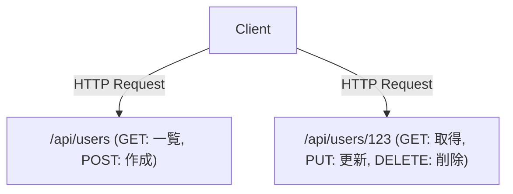

# GraphQLとREST API：設計思想の衝突と融合

現代のソフトウェア開発において、フロントエンドとバックエンドを繋ぐAPIの設計は、システム全体のパフォーマンスと開発体験を左右する重要な要素です。長らくデファクトスタンダードとして君臨してきたREST（Representational State Transfer）と、Facebook（現Meta）が生み出した新しいパラダイムであるGraphQL。本記事では、両者の根本的な設計思想の違い、それぞれの強みと弱み、そして現実のプロダクト開発においてどちらを採用すべきか、あるいはどのように共存させるべきかを深く掘り下げます。

## REST APIの原典：リソース指向とステートレスの美しさ

RESTは、2000年にRoy Fieldingの博士論文で提唱されたアーキテクチャスタイルです。HTTPプロトコルの基本原則を最大限に活かし、システムをスケールさせるためのシンプルかつ強力な制約を定義しました。

### リソース指向アーキテクチャ（ROA）
RESTの核心は「リソース」です。すべてのデータは一意のURI（Uniform Resource Identifier）を持ち、HTTPメソッド（GET, POST, PUT, DELETEなど）を用いてリソースに対する操作を行います。



### キャッシュとスケーラビリティ
HTTPの標準仕様に乗っかることで、ブラウザ、CDN、プロキシサーバーなど、Webの既存インフラが提供する強力なキャッシュ機構をそのまま利用できます。これは巨大なトラフィックを処理する上で計り知れないメリットです。

## 現実との乖離：モバイル時代の課題

しかし、モバイルアプリが普及し、UIがよりリッチで複雑になるにつれ、厳格なリソース指向のREST APIはいくつかの限界を露呈し始めました。

### 1. オーバーフェッチ（Over-fetching）
クライアントが必要とするのは「ユーザーの名前」だけなのに、`/api/users/123` を叩くと、プロフィール画像URL、生年月日、住所など、不要なデータまで大量に送られてくる問題です。モバイル回線では、この無駄なデータ転送がパフォーマンス低下を招きます。

### 2. アンダーフェッチ（Under-fetching）と N+1 問題
画面を表示するために複数のリソースが必要な場合、一度のAPIリクエストではデータが足りず、何度もリクエストを繰り返さなければならない問題です。
例えば、「あるユーザーの記事一覧と、それぞれの記事への最新コメント3件」を取得する場合：
1. ユーザー情報を取得
2. ユーザーの記事一覧を取得
3. 各記事のコメントを取得（記事がN個あればN回のリクエスト）
これが有名なN+1問題の一因となり、レイテンシの増大を引き起こします。

## GraphQLの誕生：クライアント主導のデータフェッチ

2012年、Facebookはモバイルアプリの再構築プロジェクトの中でこれらの課題に直面し、それを解決するためにGraphQLを生み出しました（2015年にオープンソース化）。

GraphQLは、クライアントが「欲しいデータ」の構造を正確に記述できるクエリ言語です。

```graphql
query GetUserPosts {
  user(id: "123") {
    name
    posts(first: 5) {
      title
      comments(first: 3) {
        author
        content
      }
    }
  }
}
```

### SchemaとResolverによるグラフ構造の解決
GraphQLのサーバーは、システム全体のデータを一つのグラフ構造として定義する「Schema」を持ちます。クライアントから送られたクエリは、Schemaに従って解析され、各フィールドに対応する「Resolver」関数がバックエンドでデータを収集します。これにより、クライアントは単一のエンドポイント（通常は `/graphql`）に対して1回のリクエストを送るだけで、必要なすべてのデータを過不足なく取得できます。

## 完璧な銀の弾丸はない：GraphQLの代償

GraphQLはフロントエンド開発者にとって夢のような技術に見えますが、バックエンド側には新たな複雑さをもたらします。

### キャッシュの難しさ
RESTがHTTPのキャッシュ機構を透過的に利用できたのに対し、GraphQLは基本的にすべてPOSTリクエストとして単一のエンドポイントへ送られるため、HTTPレベルのキャッシュが効きません。アポロ（Apollo）などのクライアントライブラリを用いた正規化キャッシュや、CDNエッジでクエリをキャッシュするための工夫が必要になります。

### Persisted Queries（事前登録クエリ）
セキュリティとキャッシュの課題に対する現実的な解として、プロダクション環境では「Persisted Queries」がよく使われます。これは、ビルド時にクライアントが発行するクエリのハッシュ値をサーバーに登録しておき、実行時はハッシュ値のみを送信（GETリクエスト）する仕組みです。これにより、悪意のある巨大なクエリを防ぎつつ、HTTPキャッシュを活用できるようになります。

## 結論：衝突から融合へ

RESTとGraphQLは、どちらかがもう一方を完全に駆逐するものではありません。

- **RESTが適しているケース:** 外部公開用のPublic API、マイクロサービス間の通信、バイナリファイルのアップロード/ダウンロード、シンプルなCRUD操作中心のシステム。
- **GraphQLが適しているケース:** 複雑なUIを持つモバイルアプリやSPA、複数のバックエンドサービス（BFF）を集約するレイヤー、変化の激しい要件に柔軟に対応する必要があるプロダクト。

現代のアーキテクチャでは、内部のマイクロサービスはgRPCやRESTで通信し、フロントエンドに面するレイヤー（API GatewayやBFF）でGraphQLを提供するといった「融合」の形が主流になりつつあります。技術の特性を深く理解し、適材適所で使い分けることこそが、優れたシステム設計の鍵となるでしょう。
