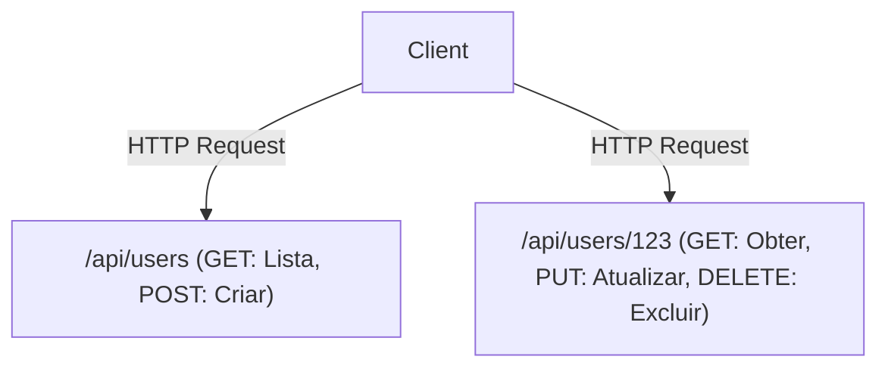

# GraphQL e REST API: O Choque e a Fusão de Filosofias de Design

No desenvolvimento de software moderno, o design da API que conecta o frontend e o backend é um elemento crítico que determina o desempenho geral e a experiência de desenvolvimento do sistema. O REST (Representational State Transfer), que reinou como padrão de fato por muito tempo, e o GraphQL, um novo paradigma criado pelo Facebook (agora Meta). Neste artigo, aprofundaremos as diferenças fundamentais de filosofia de design entre os dois, os pontos fortes e fracos de cada um, e qual deles você deve adotar ou como devem coexistir no desenvolvimento de produtos no mundo real.

## A Origem do REST API: Orientado a Recursos e a Beleza do Stateless

O REST é um estilo de arquitetura proposto na tese de doutorado de Roy Fielding em 2000. Ele maximizou os princípios básicos do protocolo HTTP e definiu restrições simples, mas poderosas, para escalar o sistema.

### Arquitetura Orientada a Recursos (ROA)
O núcleo do REST é o "recurso". Todos os dados possuem um URI (Uniform Resource Identifier) único, e operações no recurso são realizadas usando métodos HTTP (GET, POST, PUT, DELETE, etc.).



### Cache e Escalabilidade
Ao basear-se na especificação padrão do HTTP, o REST pode utilizar mecanismos de cache poderosos fornecidos pela infraestrutura web existente, como navegadores, CDNs e servidores proxy, de forma transparente. Este é um benefício inestimável ao lidar com tráfego massivo.

## Divergência da Realidade: Desafios na Era Mobile

No entanto, à medida que os aplicativos móveis se tornaram onipresentes e as interfaces de usuário (UIs) se tornaram mais ricas e complexas, as APIs REST orientadas a recursos, com suas restrições estritas, começaram a revelar algumas limitações.

### 1. Over-fetching
O cliente só precisa do "nome do usuário", mas ao chamar `/api/users/123`, uma enorme quantidade de dados desnecessários, como URL da foto de perfil, data de nascimento e endereço, é enviada. Em redes móveis, essa transferência inútil de dados resulta na degradação do desempenho.

### 2. Under-fetching e o Problema N+1
Quando múltiplos recursos são necessários para exibir uma tela, uma única requisição de API não fornece dados suficientes, e o cliente precisa fazer várias requisições repetidamente.
Por exemplo, para obter "a lista de posts de um usuário e os 3 comentários mais recentes para cada post":
1. Obter informações do usuário
2. Obter a lista de posts do usuário
3. Obter os comentários de cada post (se houver N posts, serão feitas N requisições)
Isso se torna uma causa do famoso problema N+1, provocando o aumento da latência.

## O Nascimento do GraphQL: Busca de Dados Orientada pelo Cliente

Em 2012, o Facebook enfrentou esses desafios durante o projeto de reconstrução do seu aplicativo móvel e, para resolvê-los, criou o GraphQL (lançado como código aberto em 2015).

O GraphQL é uma linguagem de consulta que permite que os clientes descrevam com precisão a estrutura dos "dados que desejam".

```graphql
query GetUserPosts {
  user(id: "123") {
    name
    posts(first: 5) {
      title
      comments(first: 3) {
        author
        content
      }
    }
  }
}
```

### Resolução de Estrutura de Grafo por meio de Schema e Resolver
Um servidor GraphQL possui um "Schema" que define os dados de todo o sistema como uma estrutura de grafo. As consultas enviadas do cliente são analisadas de acordo com o Schema, e as funções "Resolver" correspondentes a cada campo coletam os dados no backend. Como resultado, o cliente só precisa enviar uma requisição para um único endpoint (geralmente `/graphql`), obtendo todos os dados necessários sem faltar ou sobrar informações.

## Não Existe Bala de Prata Perfeita: O Preço do GraphQL

O GraphQL pode parecer uma tecnologia dos sonhos para desenvolvedores frontend, mas traz uma nova complexidade para o backend.

### A Dificuldade do Cache
Enquanto o REST utiliza o mecanismo de cache do HTTP de forma transparente, o GraphQL, que envia basicamente tudo como requisições POST para um único endpoint, inutiliza o cache em nível HTTP. Soluções como o cache normalizado usando bibliotecas de clientes como Apollo ou técnicas para armazenar em cache as consultas na borda (edge CDN) são necessárias.

### Persisted Queries (Consultas Pré-registradas)
Como uma solução prática para os desafios de segurança e cache, as "Persisted Queries" (Consultas Persistentes) são frequentemente utilizadas em ambientes de produção. É um mecanismo no qual os valores de hash das consultas emitidas pelo cliente durante o tempo de construção (build) são registradas no servidor. Durante a execução, apenas o valor de hash é enviado (como requisição GET). Isso previne consultas maliciosas e gigantescas e permite aproveitar os caches HTTP.

## Conclusão: Do Choque à Fusão

O REST e o GraphQL não farão com que um elimine o outro completamente.

- **Casos em que o REST é adequado:** Public APIs destinadas a divulgação externa, comunicação entre microsserviços, upload/download de arquivos binários e sistemas centrados em operações CRUD simples.
- **Casos em que o GraphQL é adequado:** Aplicativos móveis ou SPAs com UIs complexas, camadas que agregam múltiplos serviços de backend (BFF) e produtos que precisam de flexibilidade para responder a requisitos que mudam rapidamente.

Na arquitetura moderna, formas de "fusão" estão se tornando dominantes, onde os microsserviços internos se comunicam via gRPC ou REST, enquanto a camada voltada para o frontend (API Gateway ou BFF) oferece GraphQL. Entender profundamente as características dessas tecnologias e saber aplicá-las nos lugares certos será a chave para um excelente design de sistemas.
