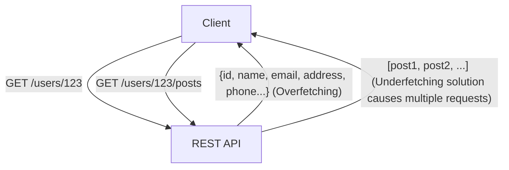
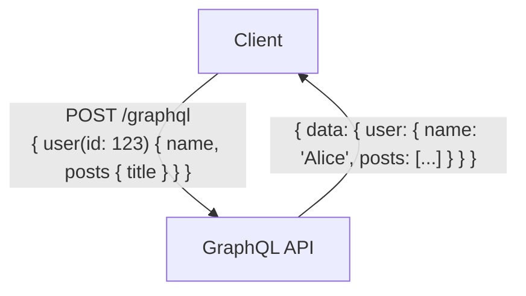

# GraphQL vs REST API: Diferenças Fundamentais de Design e Quando Usar Cada Um

No desenvolvimento de aplicações web e aplicativos móveis modernos, o design da API (Application Programming Interface) que conecta o backend ao frontend é um elemento crucial que impacta diretamente a performance e a manutenibilidade de todo o sistema. Por muito tempo, o REST (Representational State Transfer) reinou como o padrão de fato para o design de APIs. No entanto, nos últimos anos, o GraphQL vem se popularizando rapidamente como um novo paradigma para atender às crescentes e complexas demandas do frontend.

Neste artigo, a partir da perspectiva de um engenheiro profissional, exploraremos detalhadamente e em profundidade o estilo arquitetural original do REST, os problemas modernos que o GraphQL tenta resolver (overfetching e underfetching), as vantagens e desvantagens de implementação de ambos e, por fim, diretrizes práticas sobre qual adotar em cada tipo de projeto.

## 1. A Filosofia e a Arquitetura do REST API

REST (Representational State Transfer) é um estilo de arquitetura de software proposto por Roy Fielding em sua tese de doutorado no ano 2000. REST não é apenas uma especificação ou um protocolo, mas um conjunto de restrições para a construção de sistemas distribuídos (especialmente a World Wide Web) de forma escalável e robusta.

### Princípios Básicos do REST

As principais restrições do REST definidas por Roy Fielding incluem:

1. **Separação Cliente-Servidor (Client-Server)**:
   Separa as preocupações de interface de usuário (cliente) das preocupações de armazenamento de dados (servidor). Isso melhora a portabilidade do cliente e garante a escalabilidade do servidor.
2. **Stateless (Sem Estado)**:
   O servidor não mantém o estado da sessão do cliente. Cada solicitação do cliente deve conter todas as informações necessárias para que seja processada. Isso reduz a carga do servidor e melhora a confiabilidade do sistema.
3. **Capacidade de Cache (Cacheability)**:
   As respostas devem conter informações sobre se podem ou não ser armazenadas em cache. O uso adequado do cache pode reduzir drasticamente o número de comunicações entre cliente e servidor, aumentando muito a eficiência da rede.
4. **Interface Uniforme (Uniform Interface)**:
   Esta é a restrição mais importante que torna o REST o que ele é. Os recursos são identificados unicamente por URIs (Uniform Resource Identifiers) e as operações padronizadas são realizadas usando métodos HTTP (GET, POST, PUT, DELETE, etc.).
5. **Sistema em Camadas (Layered System)**:
   O cliente não precisa saber se está conectado diretamente ao servidor final ou a um proxy/balanceador de carga intermediário.

### Vantagens e Desafios da REST API

A grande vantagem da REST API é que ela pode utilizar a infraestrutura existente do protocolo HTTP (servidores de cache, proxies, CDNs, etc.) como está. Contudo, em aplicações modernas com interfaces de usuário complexas, algumas limitações começaram a ser apontadas.

#### Overfetching (Busca Excessiva) e Underfetching (Busca Insuficiente)

- **Overfetching**:
  Ocorre quando apenas o nome e a imagem de ícone do usuário são necessários em uma tela, mas ao acessar o endpoint `/users/{id}`, uma grande quantidade de dados desnecessários, como endereço, telefone e data de registro, é obtida. Isso causa uma degradação fatal de performance em ambientes com largura de banda limitada, como redes móveis.
- **Underfetching (Problema N+1)**:
  Ocorre quando, para exibir uma tela específica, é necessário acessar um endpoint inicial (ex: `/users/{id}`) e, em seguida, usar o ID obtido para acessar outro endpoint (ex: `/users/{id}/posts`) várias vezes. Isso acontece porque os dados necessários não estão consolidados em um único recurso, causando um aumento na latência.



## 2. O Nascimento do GraphQL e a Mudança de Paradigma

Para resolver esses problemas do REST, especialmente a obtenção ineficiente de dados em dispositivos móveis, o Facebook (atual Meta) desenvolveu o GraphQL para uso interno em 2012 e o abriu em código aberto em 2015.

### Filosofia de Design do GraphQL

O GraphQL não é um estilo arquitetural como o REST, mas sim uma linguagem de consulta para APIs e um runtime (tempo de execução) para executar essas consultas. A sua principal característica é que **o cliente pode solicitar exatamente os dados de que precisa, na estrutura de que precisa, em uma única solicitação**.

### Sistema de Tipos e Desenvolvimento Orientado por Schema

O núcleo do GraphQL é o seu poderoso sistema de tipos (Type System). Os dados que o servidor pode fornecer e suas relações são estritamente definidos como um schema.

```graphql
type User {
  id: ID!
  name: String!
  email: String
  posts: [Post!]!
}

type Post {
  id: ID!
  title: String!
  content: String!
  author: User!
}

type Query {
  user(id: ID!): User
}
```

Esse schema torna claro o contrato entre os engenheiros de frontend e backend. Com a funcionalidade de Introspection (autoinspeção) do GraphQL, ferramentas de desenvolvimento poderosas (como o GraphiQL) e a geração automática de código baseada nas informações do schema tornam-se possíveis, melhorando drasticamente a experiência do desenvolvedor (DX).

### Endpoint Único e Flexibilidade de Consulta

Enquanto o REST tem vários endpoints para cada recurso, o GraphQL geralmente possui apenas um único endpoint, como `/graphql`. O cliente envia consultas para este endpoint através de requisições POST.

```graphql
# Exemplo de requisição do cliente
query {
  user(id: "123") {
    name
    posts {
      title
    }
  }
}
```

Em resposta à requisição acima, o servidor retorna uma resposta JSON contendo apenas os campos especificados (`name` e o `title` dentro de `posts`). Isso resolve perfeitamente os problemas de overfetching e underfetching.



## 3. Desafios de Implementação e Estratégias de Design Avançadas

Embora o GraphQL seja como mágica para o frontend, ele traz novos desafios para o design e a implementação do backend.

### O Surgimento do Problema N+1 e o Dataloader

No GraphQL, à medida que o aninhamento de consultas se torna mais profundo, o Problema N+1, no qual as consultas ao banco de dados no backend aumentam exponencialmente, ocorre mais facilmente.
Por exemplo, se uma consulta for enviada para obter 10 usuários e as 5 postagens mais recentes de cada um, uma implementação ingênua resultaria em 1 consulta para buscar os usuários e 10 consultas (uma para cada usuário) para buscar as postagens, totalizando 11 consultas ao banco de dados.

A abordagem padrão para resolver isso é o padrão **Dataloader**. O Dataloader resolve eficientemente o problema N+1 ao agrupar (batching) as requisições individuais de obtenção de dados que ocorrem durante o ciclo de vida de uma requisição em uma única consulta ao banco de dados, e também ao armazená-las em cache (caching) para evitar consultas duplicadas na mesma requisição.

### Diferenças nas Estratégias de Cache

Na API REST, o mecanismo de cache padrão do HTTP (ETag ou cabeçalho Cache-Control para solicitações GET) pode ser facilmente utilizado por CDNs e navegadores. Como a URI do recurso é exclusiva, o cache no nível da infraestrutura é extremamente eficaz.

Por outro lado, no GraphQL, como todas as solicitações são basicamente requisições POST para um único endpoint (`/graphql`), é difícil usar os mecanismos de cache HTTP diretamente. Portanto, o cache no GraphQL precisa ser projetado e otimizado nas seguintes camadas:

1. **Cache no Lado do Cliente (Client-side Cache)**: Utilização de caches em memória normalizados fornecidos por bibliotecas de cliente avançadas, como Apollo Client e Relay.
2. **Consultas Persistidas (Persisted Queries)**: Uma técnica em que consultas enormes frequentemente usadas são pré-registradas no servidor e codificadas em hash, permitindo que sejam chamadas com solicitações GET. Isso possibilita o cache em CDNs.
3. **Cache de Aplicação no Lado do Servidor (Server-side Application Cache)**: Utilização do Redis ou ferramentas semelhantes para armazenar dados em cache no nível do resolver.

### Segurança e Contramedidas para Complexidade

Como o GraphQL dá um poderoso poder de consulta ao cliente, existe o risco de um ataque DoS (Denial of Service), onde usuários mal-intencionados enviam intencionalmente consultas pesadas e profundamente aninhadas para esgotar a CPU ou a memória do servidor.

As principais estratégias de design para evitar isso são as seguintes:

- **Limite de Profundidade da Consulta (Query Depth Limit)**: Analisa a AST (Abstract Syntax Tree) e rejeita consultas cujo aninhamento excede um certo limite (ex: 5 níveis).
- **Análise de Complexidade da Consulta (Query Complexity Analysis)**: Atribui um custo a cada campo e bloqueia a execução se o custo total de toda a consulta exceder o limite superior.
- **Limitação de Taxa (Rate Limiting)**: Limita o custo total das consultas que podem ser executadas dentro de um certo período de tempo por endereço IP ou usuário.

## 4. REST vs GraphQL: Casos de Uso para a Ferramenta Certa no Lugar Certo

REST e GraphQL não visam substituir completamente um ao outro. Você deve escolher o apropriado dependendo dos requisitos do seu projeto.

### Quando Você Deve Escolher REST API

- **Aplicações CRUD Simples**: Quando a estrutura de recursos é plana e não tem relações de dados complexas.
- **Fornecimento de APIs Públicas (Public APIs)**: Ao oferecer uma API para um grande número de desenvolvedores, o REST é o padrão mais estabelecido, possui uma curva de aprendizado baixa e pode ser facilmente chamado de qualquer linguagem ou ambiente.
- **Transferência de Arquivos e Streaming**: Para lidar com dados binários, como uploads de imagens ou streaming de vídeos, o REST (por exemplo, multipart form data) é mais simples e eficiente.
- **Fortes Requisitos de Cache na Infraestrutura**: Sistemas focados em entrega de conteúdo que precisam usar CDNs para armazenar em cache e lidar com milhões de requisições estaticamente.

### Quando Você Deve Escolher GraphQL

- **Aplicações com UI e Requisitos de Dados Complexos**: SPAs (Single Page Applications) modernas ou aplicativos móveis em que é necessário coletar e integrar dados de vários recursos em uma única tela.
- **Desenvolvimento Multiplataforma**: Quando você deseja fornecer dados eficientemente através de uma única API para vários clientes que exigem formatos de dados diferentes, como Web, iOS e Android.
- **Camada BFF (Backend For Frontend) para Microsserviços**: O GraphQL é excelente como uma camada de agregação (API Gateway/BFF) que reúne múltiplos microsserviços espalhados no backend ou APIs REST existentes e os fornece como uma única estrutura de grafo fácil de usar para o frontend.
- **Desenvolvimento Ágil e Orientado por Schema**: Projetos onde ocorrem frequentes mudanças na UI, levando a muitos pedidos de alteração na API. O frontend pode adicionar ou remover livremente os dados necessários na consulta, sem precisar esperar pelas mudanças no backend.

## Conclusão

O REST de Roy Fielding trouxe ordem aos sistemas distribuídos e construiu a base da Web atual. Por outro lado, o GraphQL forneceu uma arma poderosa para atender às demandas complexas do frontend, otimizando a experiência do desenvolvedor e o desempenho do cliente.

Não devemos cair na dicotomia simplista de que "REST é antigo e GraphQL é novo". Um arquiteto verdadeiramente profissional entende profundamente as diferenças fundamentais nas filosofias de design de ambos e escolhe a arquitetura ideal após avaliar de forma abrangente as características dos dados, os requisitos de rede, os tipos de clientes e o conjunto de habilidades da equipe de desenvolvimento. Em alguns casos, uma abordagem híbrida — onde o núcleo do sistema é construído em REST e o GraphQL é adotado apenas como a camada BFF para o frontend — também pode ser uma escolha extremamente poderosa.
