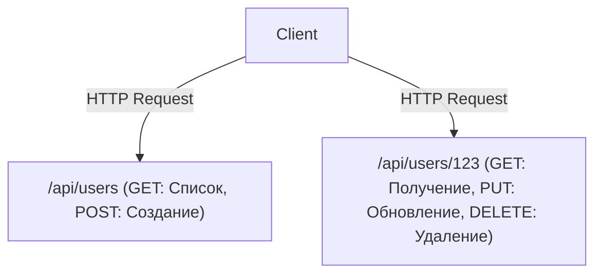

# GraphQL и REST API: Столкновение и слияние архитектурных концепций

В современной разработке программного обеспечения проектирование API, связывающего фронтенд и бэкенд, является ключевым фактором, определяющим общую производительность системы и удобство разработки (Developer Experience). Долгое время стандартом де-факто оставался REST (Representational State Transfer), на смену которому пришла новая парадигма, созданная Facebook (ныне Meta) — GraphQL. В этой статье мы подробно рассмотрим фундаментальные различия в их архитектурных концепциях, сильные и слабые стороны каждого подхода, а также разберемся, что следует выбрать для реальной разработки продукта или как заставить их сосуществовать.

## Оригинал REST API: Ресурсно-ориентированность и красота Stateless

REST — это архитектурный стиль, предложенный в докторской диссертации Роя Филдинга (Roy Fielding) в 2000 году. Он максимально использует базовые принципы протокола HTTP, определяя простые, но мощные ограничения для масштабирования систем.

### Ресурсно-ориентированная архитектура (ROA)
Суть REST заключается в «ресурсах». Все данные имеют уникальный идентификатор URI (Uniform Resource Identifier), и операции над ресурсами выполняются с использованием HTTP-методов (GET, POST, PUT, DELETE и т.д.).



### Кэширование и масштабируемость
Благодаря следованию стандартам HTTP, можно использовать мощные механизмы кэширования, предоставляемые существующей веб-инфраструктурой, такой как браузеры, CDN и прокси-серверы. Это неоценимое преимущество при обработке огромного трафика.

## Отрыв от реальности: Проблемы мобильной эры

Однако с распространением мобильных приложений и усложнением пользовательских интерфейсов строгий ресурсно-ориентированный REST API начал демонстрировать определенные ограничения.

### 1. Избыточная выборка данных (Over-fetching)
Это проблема, при которой клиенту нужно только «имя пользователя», но при обращении к `/api/users/123` отправляется огромное количество ненужных данных, таких как URL-адрес фотографии профиля, дата рождения и адрес. В мобильных сетях такая лишняя передача данных приводит к снижению производительности.

### 2. Недостаточная выборка данных (Under-fetching) и проблема N+1
Когда для отображения экрана требуется несколько ресурсов, одного API-запроса оказывается недостаточно, и запросы приходится повторять снова и снова.
Например, чтобы получить «список статей пользователя и 3 последних комментария к каждой статье»:
1. Получить информацию о пользователе
2. Получить список статей пользователя
3. Получить комментарии к каждой статье (если статей N, то потребуется N запросов)
Это является одной из причин известной проблемы N+1 и приводит к увеличению задержки (latency).

## Рождение GraphQL: Клиент-ориентированная выборка данных

В 2012 году Facebook столкнулся с этими проблемами во время проекта по перестройке своего мобильного приложения, и для их решения был создан GraphQL (открыт исходный код в 2015 году).

GraphQL — это язык запросов, который позволяет клиентам точно описывать структуру данных, которые они хотят получить.

```graphql
query GetUserPosts {
  user(id: "123") {
    name
    posts(first: 5) {
      title
      comments(first: 3) {
        author
        content
      }
    }
  }
}
```

### Разрешение графовых структур с помощью Schema и Resolver
Сервер GraphQL имеет "Schema" (Схему), которая определяет все данные системы как единую графовую структуру. Запрос, отправленный клиентом, анализируется в соответствии со Схемой, и функции "Resolver" (Резолверы), соответствующие каждому полю, собирают данные на бэкенде. Это позволяет клиентам получить все необходимые данные без избытка или недостатка всего за один запрос к единой конечной точке (обычно `/graphql`).

## Идеальной серебряной пули не существует: Цена GraphQL

Хотя GraphQL кажется фронтенд-разработчикам технологией мечты, он привносит новые сложности на стороне бэкенда.

### Сложность кэширования
В то время как REST может прозрачно использовать механизмы кэширования HTTP, GraphQL в основном отправляет всё как POST-запросы к единой конечной точке, поэтому кэширование на уровне HTTP не работает. Требуется применение нормализованного кэширования с использованием клиентских библиотек, таких как Apollo, или разработка механизмов кэширования запросов на границе CDN.

### Сохраненные запросы (Persisted Queries)
В качестве практического решения проблем безопасности и кэширования в производственных средах часто используются «Persisted Queries». Этот механизм заключается в том, что хэш-значения запросов, создаваемых клиентом на этапе сборки, регистрируются на сервере, а во время выполнения передается только хэш-значение (GET-запросом). Это предотвращает отправку вредоносных огромных запросов и позволяет использовать HTTP-кэширование.

## Заключение: От столкновения к слиянию

REST и GraphQL не исключают друг друга полностью.

- **Случаи, когда подходит REST:** Открытые Public API, взаимодействие между микросервисами, загрузка/скачивание бинарных файлов, системы, ориентированные на простые CRUD-операции.
- **Случаи, когда подходит GraphQL:** Мобильные приложения и SPA со сложными интерфейсами, уровни агрегации множества бэкенд-сервисов (BFF), продукты, требующие гибкой адаптации к быстро меняющимся требованиям.

В современных архитектурах основной тенденцией становится «слияние», при котором внутренние микросервисы взаимодействуют по gRPC или REST, а уровни, обращенные к фронтенду (API Gateway или BFF), предоставляют GraphQL. Глубокое понимание особенностей технологий и их применение в подходящих ситуациях является ключом к проектированию выдающихся систем.
