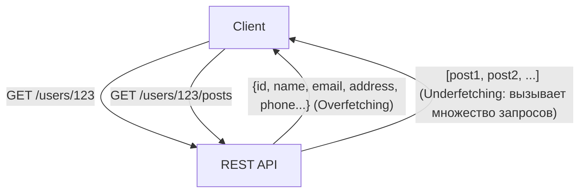
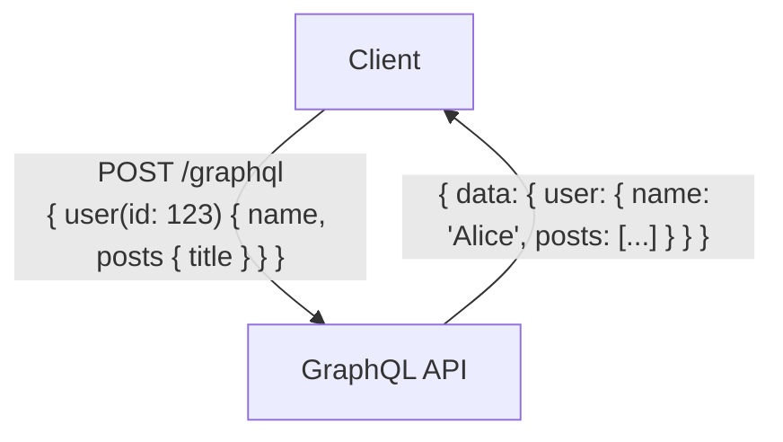

# GraphQL vs REST API: Фундаментальные отличия в философии дизайна и их применение

В разработке современных веб-приложений и мобильных приложений проектирование «API (Application Programming Interface)», связывающего бэкенд и фронтенд, является критически важным элементом, напрямую влияющим на производительность и ремонтопригодность всей системы. Долгое время де-факто стандартом проектирования API был «REST (Representational State Transfer)», однако в последние годы в качестве новой парадигмы для удовлетворения растущих требований фронтенда стремительно набирает популярность «GraphQL».

В этой статье с точки зрения профессионального инженера мы подробно и глубоко разберем архитектурный стиль, лежащий в основе REST, современные проблемы, которые пытается решить GraphQL (такие как overfetching и underfetching), преимущества и недостатки обеих технологий при их реализации, а также дадим рекомендации по их выбору: «в каких проектах следует использовать ту или иную технологию».

## 1. Философия и архитектура REST API

REST (Representational State Transfer) — это архитектурный стиль программного обеспечения, предложенный Роем Филдингом (Roy Fielding) в его докторской диссертации в 2000 году. REST — это не просто спецификация или протокол, а «набор ограничений» для создания масштабируемых и надежных распределенных систем (особенно World Wide Web).

### Основные принципы REST

Среди основных ограничений REST, определенных Роем Филдингом, можно выделить следующие:

1. **Разделение клиент-сервер (Client-Server)**:
   Разделяет задачи, связанные с пользовательским интерфейсом (клиент), и задачи, связанные с хранением данных (сервер). Это повышает переносимость клиента и обеспечивает масштабируемость сервера.
2. **Отсутствие состояния (Stateless)**:
   Сервер не сохраняет состояние сессии клиента. Каждый запрос от клиента должен содержать всю информацию, необходимую для его обработки. Это снижает нагрузку на сервер и повышает надежность системы.
3. **Кэшируемость (Cacheability)**:
   Ответы должны содержать информацию о том, можно ли их кэшировать. Правильное использование кэширования позволяет сократить количество взаимодействий между клиентом и сервером и кардинально повысить эффективность сети.
4. **Единообразный интерфейс (Uniform Interface)**:
   Самое важное ограничение, делающее REST таковым. Ресурсы однозначно идентифицируются с помощью URI (Uniform Resource Identifier), а стандартизированные операции выполняются с использованием HTTP-методов (GET, POST, PUT, DELETE и т.д.).
5. **Многоуровневая система (Layered System)**:
   Клиенту не нужно знать, подключен ли он напрямую к конечному серверу или к промежуточному прокси/балансировщику нагрузки.

### Преимущества и проблемы REST API

Огромным преимуществом REST API является возможность использования существующей инфраструктуры протокола HTTP (кэширующие серверы, прокси, CDN и т.д.) «как есть». Однако в приложениях со сложным современным UI стали проявляться определенные ограничения.

#### Избыточная выборка (Overfetching) и недостаточная выборка (Underfetching)

- **Избыточная выборка (Overfetching)**:
  Проблема, при которой, даже если для экрана требуются только имя пользователя и изображение профиля, обращение к эндпоинту `/users/{id}` возвращает большой объем ненужных данных, таких как адрес, номер телефона, дата регистрации и т.д. В условиях ограниченной пропускной способности, например, в мобильных сетях, это приводит к фатальному снижению производительности.
- **Недостаточная выборка (Underfetching и проблема N+1)**:
  Проблема, при которой для отображения определенного экрана необходимо сначала обратиться к первому эндпоинту (например, `/users/{id}`), а затем с помощью полученного ID выполнить несколько запросов к другому эндпоинту (например, `/users/{id}/posts`). Это происходит из-за того, что необходимые данные не собраны в одном ресурсе, что вызывает увеличение задержки (latency).



## 2. Появление GraphQL и смена парадигмы

Чтобы решить эти проблемы REST, особенно неэффективную выборку данных с мобильных устройств, в 2012 году компания Facebook (ныне Meta) разработала для внутреннего использования, а в 2015 году выпустила в open source технологию «GraphQL».

### Философия дизайна GraphQL

GraphQL — это не архитектурный стиль, как REST, а «язык запросов» для API и «среда выполнения» (runtime) для этих запросов. Главная особенность заключается в том, что **«клиент может запросить именно те данные, которые ему нужны, в нужной структуре, за один запрос»**.

### Система типов и разработка на основе схемы (Schema-driven)

Ядром GraphQL является мощная система типов (Type System). Данные, которые может предоставить сервер, и их взаимосвязи строго определяются в виде «схемы» (schema).

```graphql
type User {
  id: ID!
  name: String!
  email: String
  posts: [Post!]!
}

type Post {
  id: ID!
  title: String!
  content: String!
  author: User!
}

type Query {
  user(id: ID!): User
}
```

Эта схема служит четким «контрактом» между инженерами фронтенда и бэкенда. Благодаря функции интроспекции (Introspection) в GraphQL становятся доступными мощные инструменты разработки (например, GraphiQL) и автоматическая кодогенерация на основе схемы, что колоссально улучшает опыт разработчика (Developer Experience, DX).

### Единая конечная точка и гибкость запросов

В то время как REST имеет множество конечных точек (эндпоинтов) для каждого ресурса, GraphQL обычно использует только одну конечную точку, например `/graphql`. Клиент отправляет запрос к этому эндпоинту с помощью HTTP-метода POST.

```graphql
# Пример запроса от клиента
query {
  user(id: "123") {
    name
    posts {
      title
    }
  }
}
```

В ответ на вышеуказанный запрос сервер возвращает JSON-ответ, содержащий только запрошенные поля (`name` и `title` внутри `posts`). Таким образом, проблемы избыточной и недостаточной выборки данных изящно решаются.



## 3. Проблемы реализации и продвинутые стратегии проектирования

Хотя GraphQL является магическим инструментом для фронтенда, он привносит новые проблемы в проектирование и реализацию бэкенда.

### Проявление проблемы N+1 и Dataloader

В GraphQL по мере углубления вложенности запросов часто возникает «проблема N+1», при которой количество запросов к базе данных на бэкенде возрастает экспоненциально.
Например, если отправлен запрос на получение 10 пользователей и 5 их последних публикаций для каждого, при наивной реализации будет выполнено «1 запрос на получение пользователей» + «10 запросов на получение публикаций каждого пользователя», итого 11 запросов к БД.

Стандартным подходом к решению этой проблемы является паттерн **Dataloader**. Dataloader эффективно устраняет проблему N+1 путем пакетирования (batching) индивидуальных запросов на выборку данных в течение жизненного цикла запроса (объединяя их в один запрос к БД) и кэширования (предотвращая дублирование запросов в рамках одного реквеста).

### Различия в стратегиях кэширования

В REST API стандартные механизмы кэширования HTTP (например, ETag и заголовки Cache-Control для GET-запросов) легко используются на уровне CDN и браузеров. Поскольку URI ресурсов уникальны, кэширование на уровне инфраструктуры крайне эффективно.

С другой стороны, в GraphQL практически все запросы — это POST-запросы к единому эндпоинту (`/graphql`), поэтому использовать механизмы кэширования на уровне HTTP напрямую затруднительно. По этой причине кэширование в GraphQL требует ухищрений на следующих уровнях:

1. **Кэширование на стороне клиента**: Использование нормализованного in-memory кэша, предоставляемого продвинутыми клиентскими библиотеками, такими как Apollo Client или Relay.
2. **Персистентные запросы (Persisted Queries)**: Метод, при котором часто используемые объемные запросы заранее регистрируются на сервере, хешируются и вызываются через GET-запросы, что делает возможным кэширование в CDN.
3. **Кэширование приложения на стороне сервера**: Использование Redis и аналогичных систем для кэширования данных на уровне резолверов.

### Безопасность и борьба со сложностью

Поскольку GraphQL предоставляет клиенту мощные возможности для запросов, существует риск DoS-атак (Denial of Service), при которых злоумышленники намеренно отправляют тяжелые глубоко вложенные запросы для истощения ресурсов CPU и памяти сервера.

Ниже приведены основные стратегии проектирования для предотвращения этого:

- **Ограничение глубины запроса (Query Depth Limit)**: Анализ абстрактного синтаксического дерева (AST) и отклонение запросов, глубина вложенности которых превышает заданный лимит (например, 5 уровней).
- **Ограничение сложности запроса (Query Complexity Analysis)**: Каждому полю присваивается «стоимость» (cost), и выполнение блокируется, если общая стоимость запроса превышает установленный лимит.
- **Ограничение скорости (Rate Limiting)**: Ограничение суммарной стоимости запросов, которые могут быть выполнены с одного IP-адреса или пользователя за определенный период времени.

## 4. REST vs GraphQL: Применение в зависимости от ситуации

REST и GraphQL не исключают друг друга полностью; следует выбирать подходящую технологию в зависимости от требований проекта.

### Случаи, когда следует выбрать REST API

- **Простые CRUD-приложения**: Когда структура ресурсов плоская и не имеет сложных взаимосвязей между данными.
- **Предоставление публичного API**: При предоставлении API широкому кругу разработчиков REST является наиболее стандартным, имеет низкий порог входа и легко вызывается из любых языков и сред.
- **Передача файлов и потоковое вещание**: Работа с бинарными данными, например загрузка изображений или потоковое видео, реализуется в REST проще и эффективнее (например, multipart/form-data).
- **Строгие требования к инфраструктурному кэшированию**: Системы, ориентированные на доставку контента, где необходимо кэшировать и обрабатывать миллионы запросов с помощью CDN.

### Случаи, когда следует выбрать GraphQL

- **Приложения со сложным UI и требованиями к данным**: Современные SPA (Single Page Applications) и мобильные приложения, где необходимо собирать и объединять данные из множества ресурсов на одном экране.
- **Мультиплатформенная разработка**: Когда необходимо эффективно предоставлять данные через единый API нескольким клиентам с разными форматами требуемых данных (Web, iOS, Android).
- **Уровень BFF (Backend For Frontend) для микросервисов**: Отлично подходит в качестве слоя агрегации (API Gateway/BFF), который объединяет различные микросервисы или существующие REST API на бэкенде и предоставляет их фронтенду в виде удобной единой графовой структуры.
- **Agile-разработка и подход Schema-driven**: Проекты с частыми изменениями UI и, соответственно, частыми требованиями к изменению API. Фронтенд может свободно добавлять или удалять необходимые данные в запросах, не дожидаясь изменений на стороне бэкенда.

## Заключение

REST Роя Филдинга принес порядок в распределенные системы и заложил основу современного веба. В то же время GraphQL предоставил мощное оружие для удовлетворения растущих требований фронтенда, оптимизируя опыт разработчиков и производительность клиентских приложений.

Не стоит впадать в простую дихотомию: «REST — это старое, а GraphQL — новое». Поистине профессиональный архитектор глубоко понимает фундаментальные различия в философии дизайна обеих технологий и выбирает оптимальную архитектуру на основе комплексной оценки характеристик данных, сетевых требований, типов клиентов и навыков команды разработчиков. В некоторых случаях гибридный подход, при котором ядро системы построено на REST, а GraphQL используется исключительно как уровень BFF для фронтенда, может стать чрезвычайно мощным выбором.
