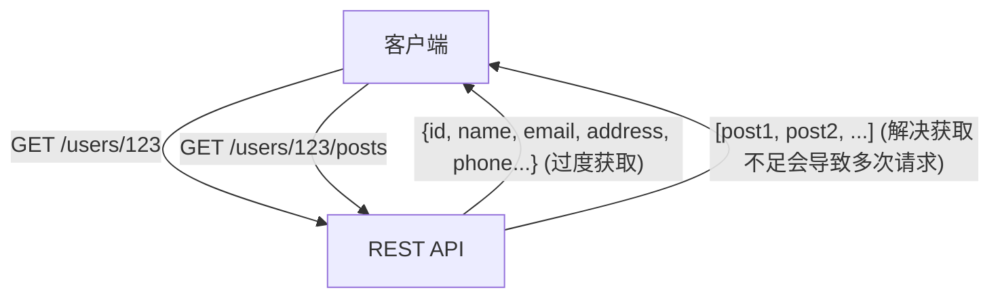
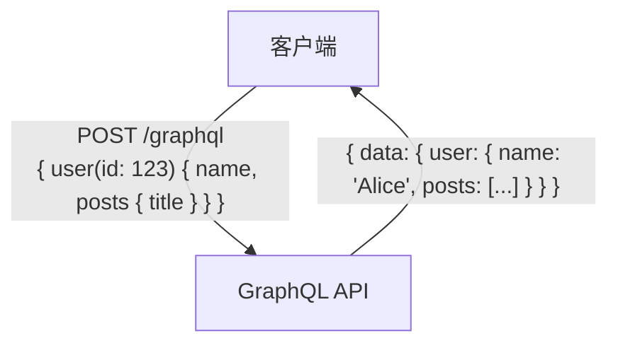

# GraphQL vs REST API：设计思想的根本区别与应用场景选择

现代 Web 应用程序和移动应用开发中，连接前端和后端的“API（应用程序编程接口）”设计是直接关系到整个系统性能和可维护性的极其重要的因素。长期以来，“REST（表述性状态转移）”作为 API 设计的事实标准占据主导地位，但近年来，为了满足前端日益复杂的需求，作为一种新的范式，“GraphQL”正在迅速普及。

本文将从专业技术人员的视角，深入浅出地详细解析从 REST 的架构风格起源，到 GraphQL 试图解决的现代难题（过度获取和获取不足），再到两者在实现上的优缺点，以及“什么样的项目应该采用哪种技术”的应用场景选择指南。

## 1. REST API 的哲学与架构

REST（Representational State Transfer，表述性状态转移）是 Roy Fielding 博士在 2000 年的博士论文中提出的一种软件架构风格。REST 并不仅仅是一种规范或协议，而是为了构建可扩展且健壮的分布式系统（特别是万维网）而制定的一组“约束集合”。

### REST 的基本原则

Roy Fielding 定义的 REST 主要约束包括以下几点：

1. **客户端-服务器分离（Client-Server）**:
   将关于用户界面的关注点（客户端）与关于数据存储的关注点（服务器）分离开来。这提高了客户端的可移植性，并确保了服务器的可扩展性。
2. **无状态（Stateless）**:
   服务器不保存客户端的会话状态。来自客户端的每个请求都必须包含处理该请求所需的全部信息。这减轻了服务器的负载，并提高了系统的可靠性。
3. **可缓存性（Cacheability）**:
   响应必须包含其是否可被缓存的信息。通过合理利用缓存，可以减少客户端与服务器之间的通信次数，从而极大地提高网络效率。
4. **统一接口（Uniform Interface）**:
   这是使 REST 成为 REST 的最重要的约束。资源通过 URI（统一资源标识符）进行唯一标识，并使用 HTTP 方法（如 GET、POST、PUT、DELETE 等）执行标准化的操作。
5. **分层系统（Layered System）**:
   客户端无需关心它是直接连接到终端服务器，还是连接到中间的代理或负载均衡器。

### REST API 的优势与挑战

REST API 具有能够直接利用 HTTP 协议现有基础设施（缓存服务器、代理、CDN 等）的巨大优势。然而，在具有现代复杂 UI 的应用程序中，也暴露出了一些局限性。

#### 过度获取（Overfetching）与获取不足（Underfetching）

- **过度获取**:
  即使某个界面只需要用户的名字和头像，但当调用 `/users/{id}` 端点时，也会获取到地址、电话号码、注册日期等大量不需要的数据。在移动网络等带宽受限的环境中，这会导致致命的性能下降。
- **获取不足（N+1 问题）**:
  为了显示特定界面，必须先调用第一个端点（例如 `/users/{id}`），然后使用在那里获取的 ID 多次调用另一个端点（例如 `/users/{id}/posts`）。这是由于所需数据未集中在一个资源中而引发的问题，会导致延迟增加。



## 2. GraphQL 的诞生与范式转变

为了解决 REST 的这些问题，特别是从移动设备进行数据获取效率低下的问题，Facebook（现为 Meta）在 2012 年面向内部开发，并于 2015 年开源了“GraphQL”。

### GraphQL 的设计思想

GraphQL 不同于 REST 那样的架构风格，而是用于 API 的“查询语言”以及执行该查询的“运行时”。其最大特点在于，**“客户端可以在一次请求中，精确地请求所需的数据及其所需的数据结构”**。

### 类型系统与模式驱动开发

GraphQL 的核心是强大的类型系统（Type System）。服务器端可提供的数据及其关联性被严格定义为“模式（Schema）”。

```graphql
type User {
  id: ID!
  name: String!
  email: String
  posts: [Post!]!
}

type Post {
  id: ID!
  title: String!
  content: String!
  author: User!
}

type Query {
  user(id: ID!): User
}
```

通过这一模式，前端工程师与后端工程师之间的“契约”变得明确。借助 GraphQL Introspection（内省）功能，可以使用基于模式信息的强大开发工具（如 GraphiQL 等）和自动代码生成，使开发体验（DX）得到飞跃性的提升。

### 单一端点与查询的灵活性

REST 针对每个资源拥有多个端点，而 GraphQL 通常只有一个名为 `/graphql` 的单一端点。客户端向该端点发送带有查询的 POST 请求。

```graphql
# 客户端请求示例
query {
  user(id: "123") {
    name
    posts {
      title
    }
  }
}
```

对于上述请求，服务器仅返回包含指定字段（`name` 和 `posts` 的 `title`）的 JSON 响应。这完美解决了过度获取和获取不足的问题。



## 3. 实现上的挑战与高级设计策略

虽然 GraphQL 对前端来说像是施了魔法般的工具，但它给后端的架构设计和实现带来了新的挑战。

### N+1 问题的显现与 Dataloader

在 GraphQL 中，随着查询嵌套深度的增加，后端对数据库的查询往往会呈爆炸式增长，极易引发“N+1 问题”。
例如，当发送一个获取 10 个用户及其每个人撰写的最新 5 篇文章的查询时，在朴素的实现中，将执行“获取用户 1 次”+“获取每个用户的文章 10 次”，总计 11 次数据库查询。

解决这个问题的标准方法是采用 **Dataloader** 模式。Dataloader 将请求生命周期内发生的各个数据获取请求进行批处理（合并为一个数据库查询）和缓存（防止同一请求内出现重复查询），从而高效地消除 N+1 问题。

### 缓存策略的差异

在 REST API 中，可以轻松地利用 CDN 或浏览器来实现 HTTP 的标准缓存机制（针对 GET 请求的 ETag 或 Cache-Control 头）。由于资源的 URI 是唯一的，因此基础设施级别的缓存极为有效。

另一方面，在 GraphQL 中，基本上所有的请求都是对单一端点（`/graphql`）的 POST 请求，因此很难直接利用 HTTP 级别的缓存机制。因此，GraphQL 中的缓存需要在以下几层下功夫：

1. **客户端缓存**: Apollo Client 或 Relay 等高级客户端库提供的规范化的内存缓存。
2. **持久化查询（Persisted Queries）**: 将常用的大型查询事先注册在服务器上进行哈希处理，并通过 GET 请求进行调用，从而使 CDN 缓存成为可能。
3. **服务器端的应用程序缓存**: 利用 Redis 等，在解析器（Resolver）级别缓存数据。

### 安全与复杂性的应对措施

由于 GraphQL 赋予了客户端强大的查询能力，恶意用户可能会故意发送嵌套极深的繁重查询，从而耗尽服务器的 CPU 或内存资源，存在 DoS（拒绝服务）攻击的风险。

防止这种情况的典型设计策略如下：

- **查询深度限制（Query Depth Limit）**: 解析 AST（抽象语法树），拒绝嵌套深度超过一定阈值（例如：5 层）的查询。
- **查询复杂度限制（Query Complexity Analysis）**: 为每个字段分配“成本（Cost）”，当整个查询的总成本超过上限时，则阻止执行。
- **速率限制**: 针对每个 IP 地址或用户，限制一定时间内可执行查询的总成本。

## 4. REST vs GraphQL：适得其所的应用场景

REST 和 GraphQL 并非谁彻底取代谁的关系，而应根据项目的需求选择合适的技术。

### 应选择 REST API 的场景

- **简单的 CRUD 应用程序**: 资源结构扁平，不包含复杂数据关系的情况。
- **提供公共 API**: 向广大不特定的开发者提供 API 时，REST 是最标准且学习成本最低的选择，可以从各种语言和环境中轻松调用。
- **文件传输或流媒体**: 处理图像上传或视频流等二进制数据时，使用 REST（如 multipart form data 等）更加简单高效。
- **强大的基础设施缓存需求**: 需要利用 CDN 静态缓存并处理数百万请求、以内容分发为中心的系统。

### 应选择 GraphQL 的场景

- **具有复杂 UI 和数据需求的应用程序**: 需要在一个界面中收集并集成来自多个资源的数据的现代 SPA（单页应用）或移动应用。
- **跨平台开发**: 希望通过一个 API 高效地向要求不同数据形态的多个客户端（Web、iOS、Android 等）提供数据时。
- **微服务的 BFF（Backend For Frontend）层**: 作为聚合层（API Gateway/BFF），将分散在后端的多个微服务或现有 REST API 聚合起来，为前端提供易于使用的单一图结构，GraphQL 表现极其出色。
- **敏捷开发与模式驱动**: UI 变更频繁且随之带来大量 API 变更请求的项目。前端无需等待后端的变更，即可自由地在查询中添加或删除所需的数据。

## 结论

Roy Fielding 提出的 REST 为分布式系统带来了秩序，并奠定了当今 Web 的基础。另一方面，GraphQL 满足了前端日益复杂的需求，为优化开发者体验和客户端性能提供了强大的武器。

我们不应陷入“REST 意味着过时，GraphQL 代表着先进”这种简单的二元论。真正专业的架构师会深刻理解两者设计思想的根本区别，并综合评估数据的特性、网络需求、客户端类型以及开发团队的技能储备，从而选择最佳的架构。在某些情况下，采用 REST 构建系统核心，仅将 GraphQL 作为前端的 BFF 层这种混合架构，也将是非常强大的选择。
