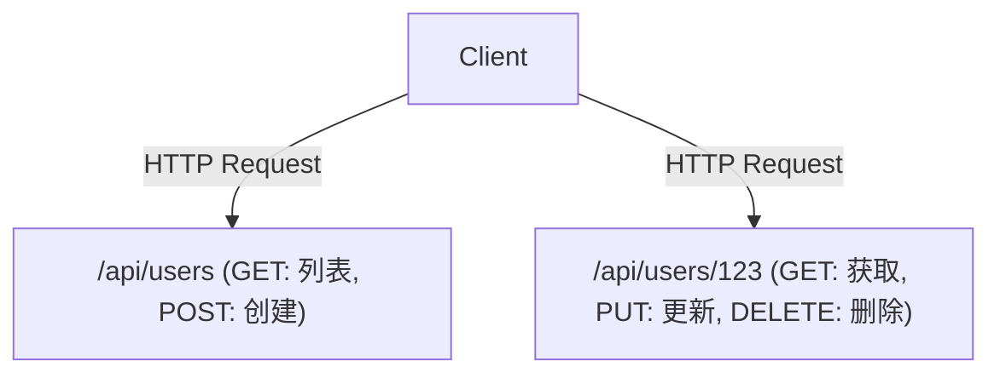

# GraphQL与REST API：设计思想的冲突与融合

在现代软件开发中，连接前端和后端的API设计是影响系统整体性能和开发体验的关键因素。长期以来作为事实标准存在的REST（Representational State Transfer），与Facebook（现Meta）创造的新范式GraphQL。本文将深入探讨两者在根本设计思想上的差异、各自的优缺点，以及在实际的产品开发中应该选择哪一方，或是如何让它们共存。

## REST API的经典：面向资源与无状态之美

REST是Roy Fielding在2000年的博士论文中提出的一种架构风格。它最大程度地发挥了HTTP协议的基本原则，并为了让系统具备可扩展性，定义了简单而强大的约束。

### 面向资源的架构（ROA）
REST的核心是“资源”。所有的数据都拥有一个唯一的URI（Uniform Resource Identifier），并使用HTTP方法（GET、POST、PUT、DELETE等）对资源进行操作。



### 缓存与可扩展性
基于HTTP标准规范，REST可以直接利用浏览器、CDN、代理服务器等Web现有基础设施提供的强大缓存机制。这在处理巨大流量时是不可估量的优势。

## 与现实的脱节：移动时代的挑战

然而，随着移动应用的普及，UI变得越来越丰富和复杂，严格面向资源的REST API开始暴露出一些局限性。

### 1. 过度获取（Over-fetching）
客户端只需要“用户名”，但是在请求 `/api/users/123` 时，却会接收到大量不需要的数据，如个人头像URL、出生日期、地址等。在移动网络环境下，这种无效的数据传输会导致性能下降。

### 2. 获取不足（Under-fetching）与 N+1 问题
当渲染页面需要多个资源时，一次API请求无法获取所有数据，必须重复多次发起请求的问题。
例如，如果要获取“某位用户的文章列表，以及每篇文章的最新3条评论”：
1. 获取用户信息
2. 获取该用户的文章列表
3. 获取每篇文章的评论（如果有N篇文章，就会发起N次请求）
这就成了著名的N+1问题的原因之一，会导致延迟增加。

## GraphQL的诞生：客户端主导的数据获取

2012年，Facebook在重构移动应用的项目中面临了这些挑战，为了解决它们，GraphQL应运而生（于2015年开源）。

GraphQL是一种能够让客户端精确描述“所需数据”结构的查询语言。

```graphql
query GetUserPosts {
  user(id: "123") {
    name
    posts(first: 5) {
      title
      comments(first: 3) {
        author
        content
      }
    }
  }
}
```

### 通过Schema和Resolver解析图结构
GraphQL服务器拥有一个“Schema”，用于将整个系统的数据定义为一个图结构。客户端发送的查询会根据Schema进行解析，后端与各个字段相对应的“Resolver”函数会收集数据。因此，客户端只需向单一端点（通常是 `/graphql`）发送一次请求，就能获取所有需要的数据，既不冗余也不短缺。

## 没有完美的银弹：GraphQL的代价

虽然GraphQL对前端开发者来说就像是梦幻般的技术，但它也给后端带来了新的复杂性。

### 缓存的难度
REST可以透明地利用HTTP的缓存机制，而GraphQL基本上所有的请求都作为POST请求发送到单一端点，因此HTTP级别的缓存不起作用。需要使用Apollo等客户端库进行标准化缓存（Normalized Cache），或者在CDN边缘节点缓存查询等方案。

### 持久化查询（Persisted Queries）
作为应对安全性和缓存挑战的现实方案，“持久化查询”在生产环境经常被使用。其机制是在构建时将客户端发起的查询哈希值注册到服务器，在运行时只发送哈希值（GET请求）。这样既能防止恶意的巨大查询，又能有效利用HTTP缓存。

## 结论：从冲突走向融合

REST和GraphQL并不是谁完全取代谁的关系。

- **适合REST的场景:** 用于对外公开的Public API、微服务之间的通信、二进制文件的上传/下载，以及以简单CRUD操作为主的系统。
- **适合GraphQL的场景:** 拥有复杂UI的移动应用或SPA、聚合多个后端服务的层（BFF）、需要灵活应对快速变化需求的产品。

在现代架构中，内部的微服务通过gRPC或REST进行通信，而在面向前端的层（API Gateway或BFF）提供GraphQL，这种“融合”的形态正逐渐成为主流。深刻理解各项技术的特性，并适才适所地使用，才是卓越系统设计的关键。
