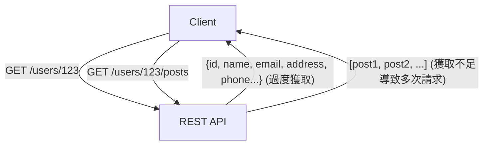
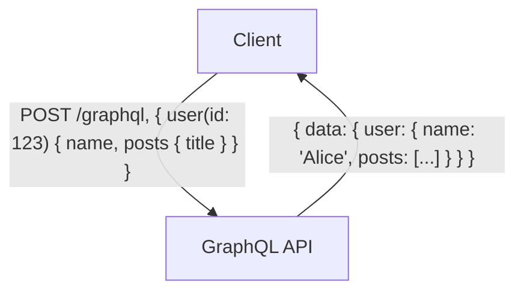

# GraphQL vs REST API：設計思想的根本差異與應用時機

在現代網頁與行動應用程式的開發中，連接後端與前端的「API（Application Programming Interface，應用程式介面）」設計，是直接影響系統整體效能與可維護性的極為重要元素。長期以來，「REST（Representational State Transfer，具象狀態傳輸）」一直是 API 設計的業界標準，然而近年來，為因應前端日益複雜的需求，「GraphQL」作為一種全新典範，正迅速普及。

本文將從專業技術人員的視角出發，深入剖析 REST 的架構風格起源、GraphQL 試圖解決的現代挑戰（如過度獲取與獲取不足問題），以及兩者在實作上的優缺點。最後，我們將詳細探討「在何種專案中應採用哪一種技術」的選擇準則。

## 1. REST API 的哲學與架構

REST（Representational State Transfer）是由 Roy Fielding 於 2000 年的博士論文中提出的軟體架構風格。REST 並非單純的規範或協定，而是一組「約束條件」，旨在將分散式系統（特別是全球資訊網 World Wide Web）建構得更具擴展性與強健性。

### REST 的基本原則

Roy Fielding 定義的 REST 核心約束條件包含以下幾項：

1. **主從式架構分離（Client-Server）**:
   將使用者介面的關注點（客戶端）與資料儲存的關注點（伺服器端）分離。這不僅提升了客戶端的可攜性，也確保了伺服器端的可擴展性。
2. **無狀態（Stateless）**:
   伺服器不會保存客戶端的工作階段（Session）狀態。客戶端發出的每個請求，都必須包含處理該請求所需的完整資訊。這能減輕伺服器負擔，並提升系統的可靠性。
3. **可快取性（Cacheability）**:
   回應訊息中必須包含是否可被快取的資訊。透過妥善利用快取，能減少客戶端與伺服器之間的通訊次數，大幅提升網路效率。
4. **統一介面（Uniform Interface）**:
   這是讓 REST 成為 REST 最重要的約束條件。資源透過 URI（Uniform Resource Identifier）進行唯一識別，並使用 HTTP 方法（如 GET、POST、PUT、DELETE 等）執行標準化的操作。
5. **分層系統（Layered System）**:
   客戶端無需意識到自己是直接連接到終端伺服器，還是連接到中間的代理伺服器或負載平衡器。

### REST API 的優勢與挑戰

REST API 最大的優勢在於，能直接善用 HTTP 協定現有的基礎設施（如快取伺服器、代理伺服器、CDN 等）。然而，在擁有複雜 UI 的現代應用程式中，REST API 的某些侷限性也開始浮現。

#### 過度獲取（Overfetching）與獲取不足（Underfetching）

- **過度獲取（Overfetching）**:
  即使某個畫面只需要使用者的姓名與大頭貼，呼叫 `/users/{id}` 端點時，卻會連同地址、電話號碼、註冊日期等不需要的資料也一併大量取得的問題。在行動網路等頻寬受限的環境中，這將導致致命的效能低落。
- **獲取不足（Underfetching / N+1 問題）**:
  為顯示特定畫面，必須先呼叫第一個端點（例如：`/users/{id}`），接著再使用取得的 ID 進行多次其他端點的呼叫（例如：`/users/{id}/posts`）。由於所需資料並未整合在單一資源中，因此會引發延遲（Latency）增加的問題。



## 2. GraphQL 的誕生與典範轉移

為了解決上述 REST 的課題，特別是來自行動裝置效率低下的資料獲取問題，Facebook（現 Meta）於 2012 年開發了內部使用的「GraphQL」，並於 2015 年將其開源。

### GraphQL 的設計思想

GraphQL 並非如 REST 般的架構風格，而是專為 API 設計的「查詢語言（Query Language）」以及執行該查詢的「執行環境（Runtime）」。其最大特色在於，**「客戶端能以單次請求，精確獲取所需結構的所需資料」**。

### 型別系統與結構描述驅動開發（Schema-Driven Development）

GraphQL 的核心是強大的型別系統（Type System）。伺服器端可提供的資料及其關聯性，會被嚴格定義為「結構描述（Schema）」。

```graphql
type User {
  id: ID!
  name: String!
  email: String
  posts: [Post!]!
}

type Post {
  id: ID!
  title: String!
  content: String!
  author: User!
}

type Query {
  user(id: ID!): User
}
```

透過這份 Schema，前端與後端工程師之間的「契約」變得十分明確。藉由 GraphQL Introspection（內省）功能，開發團隊可利用基於 Schema 資訊的強大開發工具（如 GraphiQL 等）與自動程式碼生成，使開發者體驗（DX, Developer Experience）獲得飛躍性的提升。

### 單一端點與查詢的彈性

相較於 REST 會為每個資源提供多個端點，GraphQL 通常只擁有單一端點 `/graphql`。客戶端會向這個端點發送包含查詢的 POST 請求。

```graphql
# 客戶端發送的請求範例
query {
  user(id: "123") {
    name
    posts {
      title
    }
  }
}
```

面對上述請求，伺服器只會回傳包含指定欄位（`name` 以及 `posts` 中的 `title`）的 JSON 回應。如此一來，過度獲取與獲取不足的問題便迎刃而解。



## 3. 實作上的挑戰與進階設計策略

雖然 GraphQL 對前端而言宛如魔法工具，但它也為後端的設計與實作帶來了全新的挑戰。

### N+1 問題的顯現與 Dataloader

在 GraphQL 中，隨著查詢巢狀深度的增加，後端對資料庫的查詢次數極易呈現爆炸性成長，這便是「N+1 問題」。
例如，當發送一個「取得 10 位使用者，以及每位使用者所撰寫的最新 5 篇文章」的查詢時，若採用直觀實作，將會觸發「1 次取得使用者」加上「10 次取得各使用者的文章」，共計 11 次資料庫查詢。

解決此問題的標準作法是 **Dataloader** 模式。Dataloader 能夠在請求的生命週期內，將各別的資料獲取需求進行批次化（Batching，合併為單一資料庫查詢），並進行快取（Caching，防止同一請求內的重複查詢），進而有效率地消除 N+1 問題。

### 快取策略的差異

在 REST API 中，可以輕易地透過 CDN 或瀏覽器來運用 HTTP 標準的快取機制（如針對 GET 請求的 ETag 或 Cache-Control 標頭）。由於資源的 URI 是唯一的，因此在基礎設施層級的快取極具成效。

相對地，由於 GraphQL 基本上所有請求都是對單一端點（`/graphql`）的 POST 請求，因此難以直接利用 HTTP 層級的快取機制。為此，GraphQL 的快取必須在以下幾個層級下工夫：

1. **客戶端快取（Client-side Cache）**: 活用 Apollo Client 或 Relay 等進階客戶端函式庫所提供的正規化記憶體快取。
2. **持久化查詢（Persisted Queries）**: 將常用且龐大的查詢預先註冊至伺服器並進行雜湊化，讓客戶端能透過 GET 請求進行呼叫，進而實現 CDN 快取的手法。
3. **伺服器端的應用程式快取**: 利用 Redis 等工具，在解析器（Resolver）層級對資料進行快取。

### 資訊安全與複雜度防範措施

由於 GraphQL 賦予了客戶端強大的查詢能力，惡意使用者可能會刻意發送深層巢狀、極度繁重的查詢，耗盡伺服器的 CPU 或記憶體，造成 DoS 攻擊（Denial of Service，阻斷服務攻擊）的風險。

防止此類問題的代表性設計策略如下：

- **查詢深度限制（Query Depth Limit）**: 解析 AST（抽象語法樹），拒絕巢狀深度超過一定限制（例如：5 層）的查詢。
- **查詢複雜度限制（Query Complexity Analysis）**: 為各個欄位分配「成本（Cost）」，當整體查詢的總成本超過上限時，便阻擋該執行。
- **頻率限制（Rate Limiting）**: 針對 IP 位址或使用者，限制在特定時間內可執行的查詢總成本。

## 4. REST vs GraphQL：適才適所的應用情境

REST 與 GraphQL 並不是誰完全取代誰的關係，而是應根據專案需求來選擇合適的技術。

### 應選擇 REST API 的情境

- **單純的 CRUD 應用程式**: 資源結構扁平，且不具備複雜資料關聯性的情況。
- **提供公開 API（Public API）**: 面向廣大未知開發者提供 API 時，REST 是最為標準且學習成本最低的選擇，能輕易從各種語言與環境中進行呼叫。
- **檔案傳輸或串流**: 處理圖片上傳或影片串流等二進位資料時，REST（如 Multipart form data 等）更為簡單高效。
- **強大的基礎設施快取需求**: 需要活用 CDN，靜態快取並處理數百萬次請求、以內容傳遞為核心的系統。

### 應選擇 GraphQL 的情境

- **具備複雜 UI 與資料需求的應用程式**: 需要在單一畫面中收集並整合多個資源資料的現代 SPA（Single Page Application）或行動應用程式。
- **跨平台開發**: 針對 Web、iOS、Android 等擁有多種資料格式需求的客戶端，希望能透過單一 API 高效提供資料時。
- **微服務的 BFF（Backend For Frontend）層**: 將後端分散的多個微服務或既有 REST API 進行統整，作為對前端友善的單一圖（Graph）結構提供的聚合層（API Gateway / BFF），表現極為出色。
- **敏捷開發與 Schema 驅動**: UI 變更頻繁，且隨之而來的 API 變更需求極多的專案。前端無需等待後端修改，即可自由地在查詢中新增或移除所需資料。

## 結論

Roy Fielding 的 REST 為分散式系統帶來了秩序，並奠定了今日 Web 的基礎。另一方面，GraphQL 則回應了前端日益複雜的需求，為優化開發者體驗與客戶端效能提供了強大的武器。

我們不應落入「REST 已經過時，GraphQL 才是新趨勢」這種簡單的二元對立。真正專業的架構師，會深入理解兩者設計思想的根本差異，綜合評估資料特性、網路需求、客戶端類型，以及開發團隊的技能組合，進而選擇最合適的架構。在某些情況下，系統核心採用 REST 建構，而僅在前端的 BFF 層導入 GraphQL 的混合式（Hybrid）策略，也會是非常強而有力的選擇。
