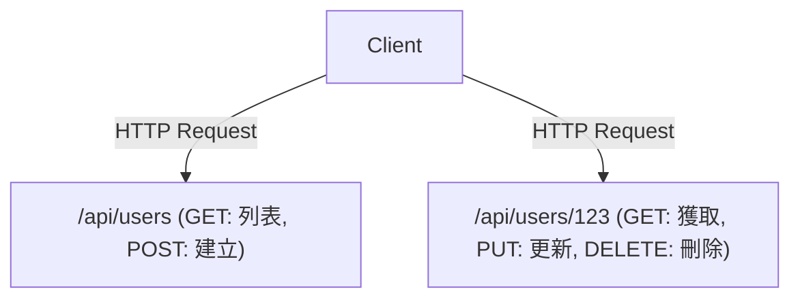

# GraphQL與REST API：設計思想的衝突與融合

在現代軟體開發中，連接前端與後端的API設計是影響系統整體效能和開發體驗的關鍵因素。長期以來作為事實標準存在的REST（Representational State Transfer），與Facebook（現Meta）創造的新範式GraphQL。本文將深入探討兩者在根本設計思想上的差異、各自的優缺點，以及在實際的產品開發中應該選擇哪一方，或是如何讓它們共存。

## REST API的經典：面向資源與無狀態之美

REST是Roy Fielding在2000年的博士論文中提出的一種架構風格。它最大程度地發揮了HTTP協定的基本原則，並為了讓系統具備可擴展性，定義了簡單而強大的約束。

### 面向資源的架構（ROA）
REST的核心是「資源」。所有的資料都擁有一個唯一的URI（Uniform Resource Identifier），並使用HTTP方法（GET、POST、PUT、DELETE等）對資源進行操作。



### 快取與可擴展性
基於HTTP標準規範，REST可以直接利用瀏覽器、CDN、代理伺服器等Web現有基礎設施提供的強大快取機制。這在處理巨大流量時是不可估量的優勢。

## 與現實的脫節：行動時代的挑戰

然而，隨著行動應用的普及，UI變得越來越豐富和複雜，嚴格面向資源的REST API開始暴露出一些侷限性。

### 1. 過度獲取（Over-fetching）
客戶端只需要「使用者名稱」，但是在請求 `/api/users/123` 時，卻會接收到大量不需要的資料，如個人頭像URL、出生日期、地址等。在行動網路環境下，這種無效的資料傳輸會導致效能下降。

### 2. 獲取不足（Under-fetching）與 N+1 問題
當渲染畫面需要多個資源時，一次API請求無法獲取所有資料，必須重複多次發起請求的問題。
例如，如果要獲取「某位使用者的文章列表，以及每篇文章的最新3則留言」：
1. 獲取使用者資訊
2. 獲取該使用者的文章列表
3. 獲取每篇文章的留言（如果有N篇文章，就會發起N次請求）
這就成了著名的N+1問題的原因之一，會導致延遲增加。

## GraphQL的誕生：客戶端主導的資料獲取

2012年，Facebook在重構行動應用的專案中面臨了這些挑戰，為了解決它們，GraphQL應運而生（於2015年開源）。

GraphQL是一種能夠讓客戶端精確描述「所需資料」結構的查詢語言。

```graphql
query GetUserPosts {
  user(id: "123") {
    name
    posts(first: 5) {
      title
      comments(first: 3) {
        author
        content
      }
    }
  }
}
```

### 透過Schema和Resolver解析圖結構
GraphQL伺服器擁有一個「Schema」，用於將整個系統的資料定義為一個圖結構。客戶端發送的查詢會根據Schema進行解析，後端與各個欄位相對應的「Resolver」函式會收集資料。因此，客戶端只需向單一端點（通常是 `/graphql`）發送一次請求，就能獲取所有需要的資料，既不冗餘也不短缺。

## 沒有完美的銀彈：GraphQL的代價

雖然GraphQL對前端開發者來說就像是夢幻般的技術，但它也給後端帶來了新的複雜性。

### 快取的難度
REST可以透明地利用HTTP的快取機制，而GraphQL基本上所有的請求都作為POST請求發送到單一端點，因此HTTP級別的快取不起作用。需要使用Apollo等客戶端套件進行標準化快取（Normalized Cache），或者在CDN邊緣節點快取查詢等方案。

### 持久化查詢（Persisted Queries）
作為應對安全性和快取挑戰的現實方案，「持久化查詢」在正式環境經常被使用。其機制是在建置時將客戶端發起的查詢雜湊值註冊到伺服器，在執行時只發送雜湊值（GET請求）。這樣既能防止惡意的巨大查詢，又能有效利用HTTP快取。

## 結論：從衝突走向融合

REST和GraphQL並不是誰完全取代誰的關係。

- **適合REST的場景:** 用於對外公開的Public API、微服務之間的通訊、二進位檔案的上傳/下載，以及以簡單CRUD操作為主的系統。
- **適合GraphQL的場景:** 擁有複雜UI的行動應用或SPA、聚合多個後端服務的層（BFF）、需要靈活應對快速變化需求的產品。

在現代架構中，內部的微服務透過gRPC或REST進行通訊，而在面向前端的層（API Gateway或BFF）提供GraphQL，這種「融合」的型態正逐漸成為主流。深刻理解各項技術的特性，並適才適所地使用，才是卓越系統設計的關鍵。
