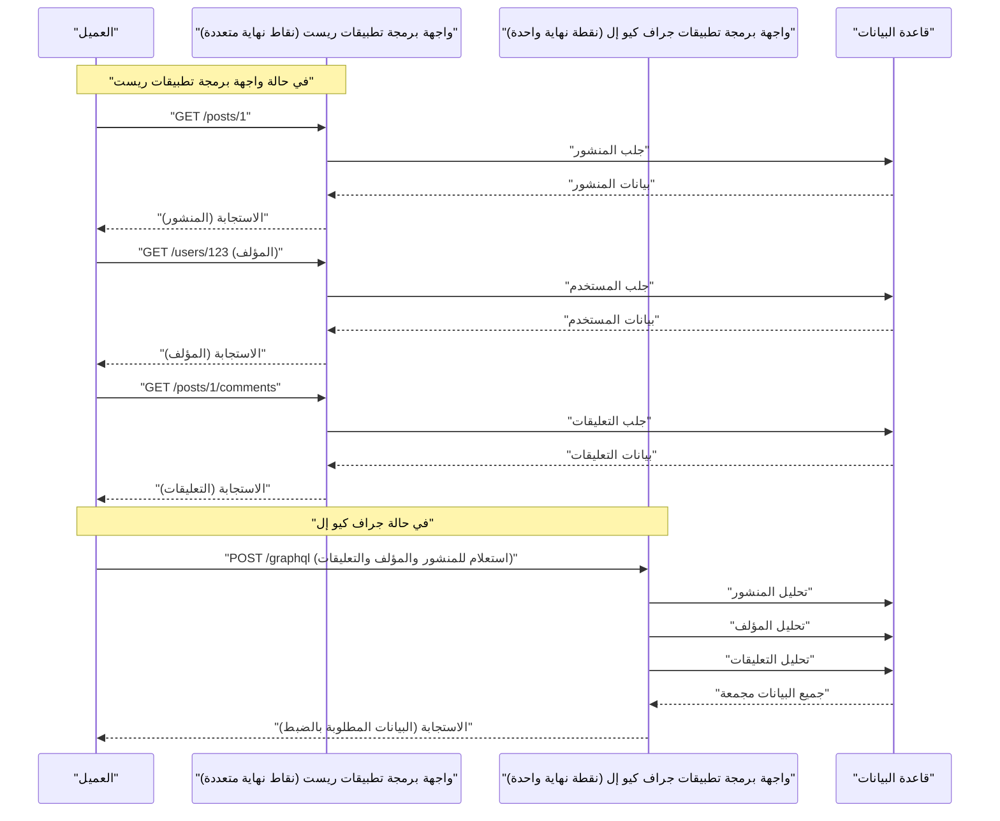

في تطوير الويب الحديث، يكون لاختيار بنية واجهة برمجة التطبيقات التي تربط النهاية الخلفية بالواجهة الأمامية تأثير هائل على أداء التطبيق وكفاءة التطوير وقابلية الصيانة. لقد انتشرت **REST API** ، التي تم تبنيها تاريخياً كمعيار، على نطاق واسع بسبب مبادئ التصميم البسيطة والبديهية الخاصة بها، ولكن مع التطور والتعقيد المتزايد للواجهات الأمامية، ظهرت تحديات مختلفة. في هذا المقال، سنشرح بالتفصيل وبشكل شامل حدود REST API والنهج المبتكر لـ **GraphQL** الذي ظهر لحلها، من منظور البنية وجلب البيانات وأمان النوع.

## 1. مبادئ النمط المعماري لـ REST API وحدودها

**REST** (نقل الحالة التمثيلية) هو نمط معماري اقترحه Roy Fielding في عام 2000. إنه يستفيد بشكل كامل من الوظائف الأساسية لبروتوكول HTTP ويقوم بتصميم موجه نحو الموارد.

### مبادئ التصميم الرئيسية لـ REST

عند تصميم واجهة برمجة تطبيقات REST، يعتبر من المثالي استيفاء القيود التالية (RESTful API).

1. **فصل العميل والخادم** (Client-Server): يفصل الاهتمامات المتعلقة بواجهة المستخدم عن الاهتمامات المتعلقة بتخزين البيانات، مما يسمح لهما بالتطور بشكل مستقل عن بعضهما البعض.
2. **عدم وجود حالة** (Stateless): لا يحتفظ الخادم بحالة جلسة العميل، ويجب أن يحتوي كل طلب على جميع المعلومات اللازمة لإكمال المعالجة بشكل مستقل.
3. **قابلية التخزين المؤقت** (Cacheable): لتحسين كفاءة الشبكة، يجب أن توضح الاستجابة من الخادم ما إذا كانت قابلة للتخزين المؤقت أم لا.
4. **واجهة موحدة** (Uniform Interface): توفر واجهة متسقة بشكل عام بناءً على مبادئ مثل تحديد الموارد (URI)، ومعالجة الموارد عبر التمثيلات، والرسائل الوصفية الذاتية، و HATEOAS (الوسائط التشعبية كمحرك لحالة التطبيق).
5. **نظام ذو طبقات** (Layered System): يمكن للعملاء التواصل دون الوعي بما إذا كانوا متصلين بالخادم مباشرة أو من خلال وكلاء وسيطين أو موازنات أحمال.

بفضل هذه المبادئ، بنى REST أساساً قوياً جداً على نطاق الويب. ومع ذلك، في الأجهزة المتنوعة ومتطلبات واجهة المستخدم المعقدة اليوم، فإنه يواجه التحديات الموضحة أدناه.

## 2. مشكلة الجلب الزائد والجلب الناقص

التحدي الأكثر بروزاً في REST API هو **الجلب الزائد** (Overfetching) و **الجلب الناقص** (Underfetching). وتنبع هذه من حقيقة أن REST يرجع هياكل بيانات ثابتة على أساس "المورد".

### الجلب الزائد (Overfetching)

الجلب الزائد هو ظاهرة يتم فيها إرسال بيانات أكثر مما يحتاجه العميل من الخادم.

على سبيل المثال، لنفترض أن هناك شاشة تعرض قائمة بـ "الاسم" و "صورة الأيقونة" للمستخدم فقط. عندما تضرب نقطة النهاية `/users` في REST API، فغالباً ما تُرجع ملف JSON يحتوي على كمية كبيرة من البيانات التي لا يتم استخدامها على الإطلاق على تلك الشاشة، مثل عنوان البريد الإلكتروني، وتاريخ الإنشاء، ومعلومات الملف الشخصي التفصيلية. في البيئات ذات النطاق الترددي المحدود مثل خطوط الهاتف المحمول، يعد نقل البيانات غير الضروري هذا سبباً مباشراً لتدهور الأداء.

### الجلب الناقص (Underfetching) ومشكلة طلب N+1

من ناحية أخرى، الجلب الناقص هو ظاهرة لا توفر فيها الاستجابة من نقطة نهاية واحدة بيانات كافية لبناء واجهة المستخدم، وتتطلب طلبات إضافية.

على سبيل المثال، لنفترض أن صفحة تفاصيل مقال مدونة تحتاج إلى عرض "نص المقال"، "معلومات المؤلف"، و "قائمة التعليقات على المقال". في REST API، من الشائع جداً إرسال طلبات إلى نقاط نهاية متعددة على النحو التالي.

1. جلب بيانات المقال من `/posts/1`
2. استخدام `author_id` الذي تم الحصول عليه لجلب معلومات المؤلف من `/users/{author_id}`
3. تقديم طلب إلى `/posts/1/comments` لجلب التعليقات على المقال

ونتيجة لذلك، يتراكم زمن انتقال الشبكة ويتأخر العرض الأولي. وهذا يؤدي إلى مشكلة **طلب N+1** في بناء واجهة المستخدم.

## 3. ما هو GraphQL؟ نهجه المبتكر

تم تطوير **GraphQL** بواسطة Facebook (المعروفة الآن باسم Meta) في عام 2012 وتم تحويله إلى مفتوح المصدر في عام 2015. وهو لغة استعلام لواجهات برمجة التطبيقات وبيئة تشغيل من جانب الخادم لتنفيذها.

### المفاهيم الأساسية لـ GraphQL

1. **نقطة نهاية واحدة**: بدلاً من امتلاك عناوين URL (نقاط نهاية) متعددة لكل مورد مثل REST، يستخدم GraphQL عادةً نقطة نهاية واحدة فقط تسمى `/graphql`.
2. **جلب البيانات التصريحي**: يصف العميل بالضبط بنية البيانات التي يحتاجها كاستعلام ويطلبها من الخادم. يرجع الخادم ملف JSON الذي يطابق البنية المطلوبة تماماً.
3. **كتابة قوية (مدفوعة بالمخطط)**: يتم تعريف مواصفات واجهة برمجة التطبيقات بصرامة وكتابتها باستخدام لغة تعريف مخطط GraphQL (SDL).

يتيح هذا للعملاء "الحصول على البيانات التي يحتاجونها، بقدر ما يحتاجون إليه"، مما يقضي بشكل كبير على الجلب الزائد والجلب الناقص.

## 4. مقارنة البنية (REST مقابل GraphQL)

يوضح الرسم البياني التالي الفرق في تدفق الطلب بين REST و GraphQL عند جلب "المقال" و "المؤلف" و "التعليقات" المذكورة أعلاه.



يمكن ملاحظة أنه بينما يتطلب REST رحلات ذهاب وإياب متعددة بين العميل والخادم، فإن GraphQL يحل جميع هياكل البيانات الضرورية ويرجعها في طلب واحد.

## 5. التطوير المدفوع بالمخطط ومقارنة هياكل البيانات

واحدة من أكبر ميزات GraphQL هي **التطوير المدفوع بالمخطط** (Schema-Driven Development). يقوم مهندسو الواجهة الأمامية والنهاية الخلفية أولاً بالاتفاق على مخطط GraphQL (SDL) وتعريفه. يعمل هذا المخطط كـ "عقد"، مما يسمح للجانبين بالمضي قدماً في التطوير بشكل متوازي.

### مثال على تعريف مخطط GraphQL (SDL)

```graphql
# type يعرف الكائن
type User {
  id: ID!
  name: String!
  email: String!
  avatarUrl: String
  posts: [Post!]!
}

type Comment {
  id: ID!
  body: String!
  author: User!
}

type Post {
  id: ID!
  title: String!
  content: String!
  author: User!
  comments: [Comment!]!
}

# نقطة الدخول للاستعلام
type Query {
  post(id: ID!): Post
  user(id: ID!): User
}
```

(`!` يشير إلى أن الحقل مطلوب وليس فارغاً)

### مقارنة الطلبات والاستجابات

**في حالة REST API (يلزم دمج عدة استجابات JSON)**

استجابة `/posts/1`:
```json
{
  "id": "1",
  "title": "مقدمة إلى جراف كيو إل",
  "content": "جراف كيو إل رائع...",
  "author_id": "123"
}
```
في هذا الوقت، على الرغم من أننا نريد فقط معرفة اسم `author`، يمكننا فقط الحصول على `author_id` في REST، وسنحتاج إما إلى جلب تفاصيل المستخدم بشكل منفصل أو إعداد نقطة نهاية مخصصة تم دمجها بشكل مصطنع على جانب النهاية الخلفية (مثل: `/posts/1?include=author`).

**في حالة GraphQL**

الاستعلام المرسل من قبل العميل:
```graphql
query GetPostDetails {
  post(id: "1") {
    title
    content
    author {
      name
    }
    comments {
      body
      author {
        name
      }
    }
  }
}
```

الاستجابة من الخادم:
```json
{
  "data": {
    "post": {
      "title": "مقدمة إلى جراف كيو إل",
      "content": "جراف كيو إل رائع...",
      "author": {
        "name": "تارو يامادا"
      },
      "comments": [
        {
          "body": "لقد كان مفيداً جداً!",
          "author": {
            "name": "هاناكو ساتو"
          }
        }
      ]
    }
  }
}
```
بهذه الطريقة، يتم إرجاع ملف JSON الذي يطابق البنية المطلوبة تماماً في طلب واحد. لا يتم تضمين أي حقول غير ضرورية (مثل البريد الإلكتروني).

## 6. تنفيذ المحللات ودور النهاية الخلفية

يقوم خادم GraphQL بتحليل الاستعلام من العميل وتشغيل دوال تسمى **المحللات** (Resolvers) المقابلة لكل حقل في المخطط لجمع البيانات.

دعنا نلقي نظرة على مثال لتنفيذ المحلل في Node.js (مثل Apollo Server).

```typescript
const resolvers = {
  Query: {
    // محلل استعلام post
    post: async (parent, args, context) => {
      return await context.db.Post.findById(args.id);
    },
  },
  Post: {
    // محلل حقل author لكائن Post
    author: async (parent, args, context) => {
      // يحتوي parent على بيانات Post الأصلية
      return await context.db.User.findById(parent.author_id);
    },
    comments: async (parent, args, context) => {
      return await context.db.Comment.find({ postId: parent.id });
    }
  },
  Comment: {
    author: async (parent, args, context) => {
      return await context.db.User.findById(parent.author_id);
    }
  }
};
```

بهذه الطريقة، يتم استدعاء المحللات بشكل متسلسل وكأنها تتتبع الرسم البياني للبيانات. يمكن لمطوري النهاية الخلفية التركيز على "كيفية وضع البيانات في هذا الحقل من هذا النوع" بدلاً من التفكير في "ماذا يجب أن نرجع في عنوان URL هذا".

## 7. مشكلة N+1 في النهاية الخلفية وحلها (DataLoader)

يحتوي تنفيذ المحلل أعلاه على عيب أداء خطير مخفي فيه. وهو مشكلة **N+1** في النهاية الخلفية.

على سبيل المثال، لنفترض أنك قمت بتنفيذ استعلام يجلب قائمة من 10 مقالات ويجلب `author` لكل منها.
1. يتم تشغيل الاستعلام لجلب 10 مقالات مرة واحدة (`SELECT * FROM posts LIMIT 10`)
2. لكل مقال، يتم استدعاء المحلل `Post.author`.
3. ونتيجة لذلك، يتم تشغيل الاستعلام لجلب المؤلف 10 مرات (`SELECT * FROM users WHERE id = ?` × 10)

إذا أصبح هذا 100 أو 1000، فإنه سيضع عبئاً هائلاً على قاعدة البيانات. ما يحل هذا هو نمط (مكتبة) تم تطويره بواسطة Facebook يسمى **DataLoader**.

### معالجة الدفعات والتخزين المؤقت بواسطة DataLoader

يستفيد DataLoader من حلقة أحداث JavaScript (طابور المهام الصغيرة) لتجميع طلبات الحصول على المفاتيح التي تحدث خلال وحدة زمنية واحدة في استعلام واحد.

```typescript
import DataLoader from 'dataloader';

// إنشاء مثيل DataLoader. تعريف دالة الدفعة.
const userLoader = new DataLoader(async (userIds) => {
  // يتم تمرير مصفوفة من المعرفات مثل [1, 2, 3]
  // الجلب معاً في استعلام IN واحد
  const users = await db.User.find({ id: { $in: userIds } });
  
  // يجب إرجاع مصفوفة مطابقة لترتيب userIds
  const userMap = users.reduce((acc, user) => {
    acc[user.id] = user;
    return acc;
  }, {});
  return userIds.map(id => userMap[id] || null);
});

// الاستخدام في المحلل
const resolvers = {
  Post: {
    author: (parent, args, context) => {
      // التحميل بتحديد المعرف، ولكن يتم تجميعه في الخلفية
      return context.loaders.userLoader.load(parent.author_id);
    }
  }
};
```

بهذا، حتى في المثال السابق، يتم تحسين الاستعلام لجلب المؤلفين إلى مرة واحدة فقط كالتالي `SELECT * FROM users WHERE id IN (?, ?, ...)`. من أجل توسيع نطاق GraphQL في بيئة إنتاج حقيقية، يعد إدخال DataLoader إلزامياً في الواقع.

## 8. أمان النوع النهائي الذي يوفره GraphQL Code Generator

يوفر نظام نوع GraphQL (المخطط) فوائد هائلة لتطوير الواجهة الأمامية. باستخدام أدوات مثل **GraphQL Code Generator**، يمكنك تلقائياً إنشاء تعريفات أنواع TypeScript وخطافات مخصصة (Custom Hooks) (في حالة React) لجلب البيانات من المخطط.

في REST API، من الممكن أيضاً إنشاء أنواع من Swagger (OpenAPI)، لكن ميزة GraphQL تتفوق بشكل ساحق حيث يمكنه حتى إنشاء تعريفات الأنواع في "الشكل الذي حدده العميل في الاستعلام".

1. قم بتحميل **ملف المخطط** و **سلسلة الاستعلام التي كتبها العميل (ملفات .graphql)**.
2. يقوم GraphQL Code Gen بإنشاء أنواع TypeScript (واجهات) تتطابق تماماً مع استجابة هذا الاستعلام.

```typescript
// مثال على استخدام Hooks التي تم إنشاؤها تلقائيًا (Apollo Client)
import { useGetPostDetailsQuery } from '../generated/graphql';

const PostPage = ({ postId }: { postId: string }) => {
  const { data, loading, error } = useGetPostDetailsQuery({
    variables: { id: postId }
  });

  if (loading) return <p>Loading...</p>;
  if (error) return <p>Error</p>;
  
  // يتم استنتاج نوع البيانات بشكل صارم كما هو محدد في الاستعلام!
  // يتم التعرف على data.post.title كنوع string
  // إذا حاولت الوصول إلى حقل غير مضمن في الاستعلام (مثل البريد الإلكتروني)، فسيحدث خطأ تجميع في TS
  return (
    <div>
      <h1>{data?.post?.title}</h1>
      <p>المؤلف: {data?.post?.author.name}</p>
    </div>
  );
};
```

هذا يجعل من الممكن تقريباً منع الأخطاء مثل "تعطل وقت التشغيل لأن الخاصية غير محددة (undefined)" من خلال التحليل الثابت (في وقت التجميع)، ويحسن بشكل كبير تجربة المطور (DX) في الواجهة الأمامية.

## 9. استراتيجيات التخزين المؤقت المتقدمة: Apollo Client و Relay

كانت إحدى مزايا REST API هي سهولة استخدام التخزين المؤقت القياسي لـ HTTP (ETag ، Cache-Control ، وما إلى ذلك). نظراً لأن GraphQL يستخدم أساساً طلبات POST ونقطة نهاية واحدة، فإن التخزين المؤقت على مستوى HTTP يكون صعباً (على الرغم من وجود طرق مثل الاستعلامات المستمرة - Persisted Queries).

بدلاً من ذلك، في النظام البيئي لـ GraphQL، تطورت مكتبات العملاء مع **تخزين مؤقت قوي من جانب العميل** (التخزين المؤقت العادي). ومن أبرز الأمثلة على ذلك **Apollo Client** و **Relay**.

### ما هو التخزين المؤقت الطبيعي (Normalized Cache)

عملاء GraphQL الأذكياء مثل Apollo Client لا يقومون بحفظ بنية الشجرة للاستجابة JSON كما هي، بل يحفظونها كمخزن سجلات مسطح.
يتم حفظ (تطبيع) كل كائن باستخدام مجموعة من `__typename` (اسم النوع) و `id` (المعرف الفريد) (على سبيل المثال: `Post:1`) كمفتاح.

توفر هذه الآلية فوائد مذهلة.
على سبيل المثال، لنفترض أن هناك استعلام "قائمة المنشورات" واستعلام "تفاصيل المنشور".
1. يفتح المستخدم شاشة "تفاصيل المنشور" ويعدل عنوان المنشور (Mutation).
2. يقوم الخادم بإرجاع استجابة بعنوان جديد (`id` و `title`).
3. يقوم Apollo Client تلقائياً بتحديث بيانات `Post:1` في المخزن.
4. بعد ذلك، سيتم أيضاً **إعادة عرض نفس معلومات `Post:1` المعروضة على شاشة "قائمة المنشورات" تلقائياً ومزامنتها مع الحالة الأحدث**.

لم يعد المهندسون بحاجة إلى كتابة رمز يدوي لتحديث إدارة الحالة (مثل [Redux](https://kenji.blog/ar/p/state-management-history-redux-context-recoil-zustand/))، وتضمن المكتبة اتساق البيانات عبر واجهة المستخدم بأكملها. هذا هو المجال الذي يتمتع فيه GraphQL بميزة حاسمة على REST في بناء تطبيقات الصفحة الواحدة (SPA) المعقدة.

### Relay - عميل GraphQL النهائي الذي تفخر به Facebook

يتخذ **Relay**، الذي تم إنشاؤه بواسطة Facebook (مبتكرو React)، نهجاً أكثر صرامة وموجهاً نحو الأداء من Apollo.
وهو يحدد البيانات اللازمة لكل مكون على أنها **شظية (Fragment)**، ويقوم المكون الأصل بتجميعها وإرسالها إلى الخادم كاستعلام ضخم واحد. نظراً لأن تبعيات البيانات مغلفة على مستوى المكون، فمن الممكن تحقيق بنية متقدمة للغاية تقضي تماماً على مشاكل مثل "تم حذف المكون ولكن لا تزال هناك حقول غير ضرورية في الاستعلام".

## 10. هل يجب أن تتبنى GraphQL؟ (المقايضات والخلاصة)

لقد ناقشنا الفوائد القوية لـ GraphQL حتى الآن، ولكنه بأي حال من الأحوال "رصاصة فضية أفضل دائماً من REST".

**عيوب GraphQL / عقبات التبني**
* **تكلفة التعلم**: تتطلب نقلة نوعية لكل من النهاية الخلفية والواجهة الأمامية، وهناك جدار في منحنى التعلم.
* **تنفيذ معقد للنهاية الخلفية**: تتطلب التطبيقات الدفاعية على جانب الخادم، مثل تصميم DataLoader لتجنب مشكلة N+1، وضبط الأداء للاستعلامات المعقدة (الطلبات المتكررة وذات التسلسل الهرمي العميق)، وحدود المعدل بناءً على تعقيد الاستعلام (Complexity).
* **مبالغ فيه لواجهات برمجة التطبيقات البسيطة**: إذا كانت متطلبات تحديث/جلب البيانات بسيطة وتعقيد واجهة المستخدم منخفضاً في تطبيقات صغيرة الحجم، فإن بساطة REST تفوز.

### خلاصة

لا يزال REST API يمثل بنية رائعة وسيظل خياراً قوياً لواجهات برمجة التطبيقات العامة والتواصل بين الخدمات (الخدمات المصغرة).

من ناحية أخرى، في تطبيقات الويب والجوال الحديثة التي تتميز بتفاعلية عالية ومتطلبات بيانات معقدة، توفر **GraphQL** تجربة مطور (DX) وتجربة مستخدم (UX) ساحقة من خلال "القضاء على الجلب الزائد/الناقص"، و "تطوير واجهة أمامية آمنة بفضل الاستدلال القوي للأنواع"، و "أتمتة إدارة الحالة بواسطة التخزين المؤقت الطبيعي".

سيصبح تقييم مجموعة مهارات فريق التطوير، وتعقيد المنتج، والنطاق المستقبلي بعناية واختيار البنية المثلى لواجهة برمجة التطبيقات أحد أهم القرارات في تطوير البرمجيات اليوم.
