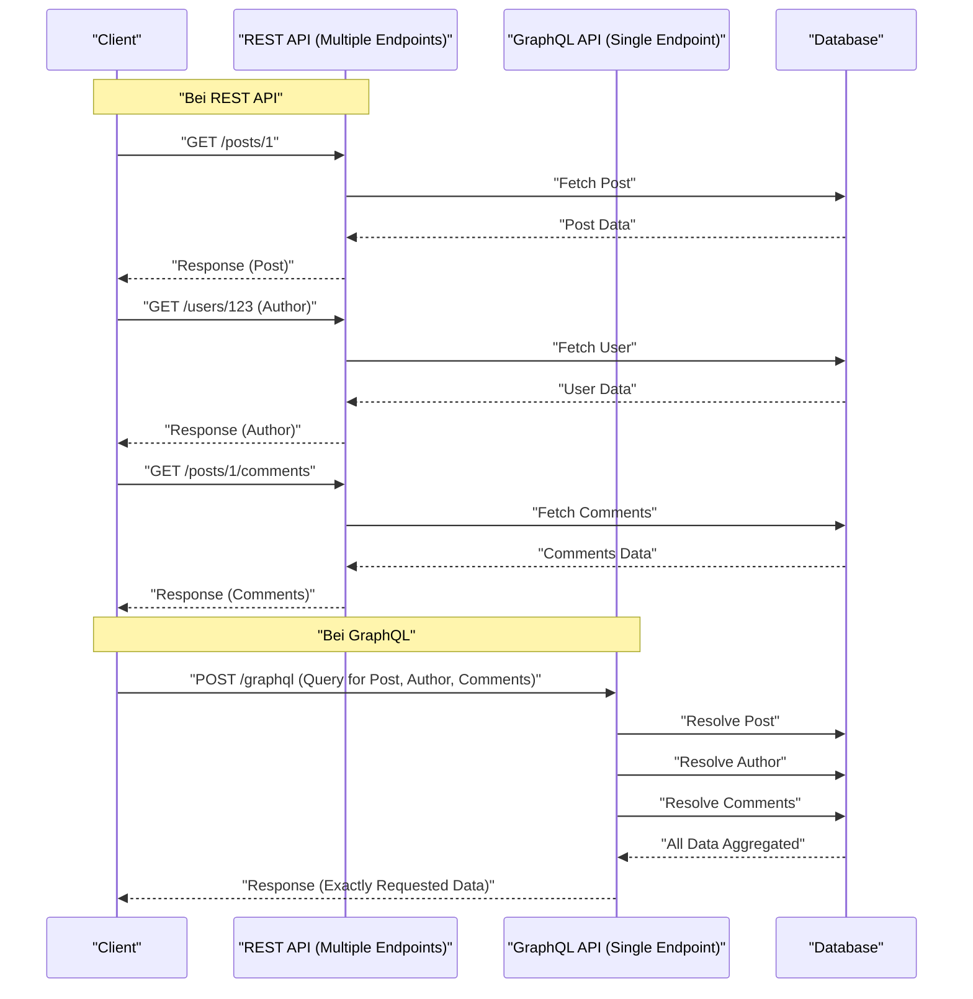

In der modernen Webentwicklung hat die Wahl der API-Architektur, die Backend und Frontend verbindet, einen enormen Einfluss auf die Leistung der Anwendung, die Entwicklungseffizienz und die Wartbarkeit. Die **REST API**, die sich historisch als Standard etabliert hat, ist aufgrund ihrer einfachen und intuitiven Entwurfsprinzipien weit verbreitet, aber mit der zunehmenden Komplexität und den höheren Anforderungen von Frontends sind verschiedene Herausforderungen offensichtlich geworden. In diesem Artikel werden die Grenzen der REST-API und der innovative Ansatz von **GraphQL**, der zu deren Lösung eingeführt wurde, aus der Perspektive von Architektur, Data-Fetching und Typsicherheit detailliert und gründlich erläutert.

## 1. Architekturprinzipien der REST-API und ihre Grenzen

**REST** (Representational State Transfer) ist ein Architekturstil, der im Jahr 2000 von Roy Fielding vorgeschlagen wurde. Er nutzt die grundlegenden Funktionen des HTTP-Protokolls optimal aus und sorgt für ein ressourcenorientiertes Design.

### Wichtige REST-Entwurfsprinzipien

Beim Entwurf einer REST-API ist es ideal, die folgenden Einschränkungen zu erfüllen (RESTful API).

1. **Client-Server-Trennung** (Client-Server): Die Belange der Benutzeroberfläche und die Belange der Datenspeicherung sind getrennt, sodass sie sich unabhängig voneinander weiterentwickeln können.
2. **[Zustand](https://kenji.blog/de/p/state-management-history-redux-context-recoil-zustand/)slosigkeit** (Stateless): Der Server speichert den Sitzungsstatus des Clients nicht. Jede Anfrage muss alle Informationen enthalten, die erforderlich sind, um die Verarbeitung unabhängig abzuschließen.
3. **Zwischenspeicherbarkeit** (Cacheable): Um die Netzwerkeffizienz zu erhöhen, müssen Serverantworten explizit angeben, ob sie zwischengespeichert werden können oder nicht.
4. **Einheitliche Schnittstelle** (Uniform Interface): Sie bietet eine durchgängig konsistente Schnittstelle basierend auf Prinzipien wie der Identifikation von Ressourcen (URI), der Manipulation von Ressourcen durch Darstellungen, selbstbeschreibenden Nachrichten und HATEOAS (Hypermedia as the Engine of Application State).
5. **Mehrschichtiges System** (Layered System): Ein Client kann kommunizieren, ohne zu wissen, ob er direkt mit dem Server oder über zwischengeschaltete Proxys oder Load Balancer verbunden ist.

Mit diesen Prinzipien hat REST ein sehr starkes Fundament im Maßstab des Webs geschaffen. Bei den vielfältigen Geräten und komplexen UI-Anforderungen von heute stößt es jedoch auf die im Folgenden beschriebenen Probleme.

## 2. Overfetching und Underfetching

Die auffälligsten Probleme von REST-APIs sind **Overfetching** und **Underfetching**. Diese resultieren aus der Tatsache, dass REST eine feste Datenstruktur pro „Ressourcen“-Einheit zurückgibt.

### Overfetching

Overfetching ist ein Phänomen, bei dem mehr Daten vom Server gesendet werden, als der Client benötigt.

Angenommen, es gibt einen Bildschirm, der nur den „Namen“ und das „Profilbild“ eines Benutzers in einer Liste anzeigt. Wenn Sie den Endpunkt `/users` in einer REST-API aufrufen, erhalten Sie oft ein JSON-Objekt, das eine große Menge an Daten enthält, die auf diesem Bildschirm überhaupt nicht verwendet werden, wie z. B. E-Mail-Adresse, Erstellungsdatum und detaillierte Profilinformationen. In Umgebungen mit begrenzter Bandbreite, wie z. B. bei mobilen Verbindungen, ist diese unnötige Datenübertragung eine direkte Ursache für Leistungseinbußen.

### Underfetching und N+1-Anfragen

Underfetching ist hingegen ein Phänomen, bei dem die Antwort von einem einzigen Endpunkt nicht genügend Daten liefert, um die Benutzeroberfläche aufzubauen, wodurch zusätzliche Anfragen erforderlich werden.

Angenommen, Sie müssen den „Text des Artikels“, „Informationen zum Autor“ und eine „Liste der Kommentare zum Artikel“ auf der Detailseite eines bestimmten Blogartikels anzeigen. Bei REST-APIs ist es oft erforderlich, Anfragen an mehrere Endpunkte wie folgt zu senden:

1. Rufen Sie die Artikeldaten mit `/posts/1` ab.
2. Rufen Sie die Autoreninformationen mit `/users/{author_id}` ab, wobei Sie die abgerufene `author_id` verwenden.
3. Senden Sie eine Anfrage an `/posts/1/comments`, um die Kommentare des Artikels abzurufen.

Dies führt zu einer Anhäufung von Netzwerklatenz, wodurch sich die anfängliche Anzeige verzögert. Dies führt zum **N+1-Anfragen-Problem** beim Aufbau von Benutzeroberflächen.

## 3. Was ist GraphQL? Sein innovativer Ansatz

**GraphQL** ist eine Abfragesprache (Query Language) für APIs und eine serverseitige Laufzeitumgebung zur Ausführung, die 2012 von Facebook (jetzt Meta) entwickelt und 2015 als Open Source veröffentlicht wurde.

### Kernkonzepte von GraphQL

1. **Einziger Endpunkt**: Anstatt wie bei REST mehrere URLs (Endpunkte) für jede Ressource bereitzustellen, verwendet GraphQL normalerweise nur einen einzigen Endpunkt, wie z. B. `/graphql`.
2. **Deklaratives Data-Fetching**: Der Client beschreibt genau als Anfrage (Query), welche Datenstruktur benötigt wird, und fordert diese beim Server an. Der Server gibt ein JSON zurück, das exakt mit der angeforderten Struktur übereinstimmt.
3. **Starke Typisierung (Schema-gesteuert)**: Die API-Spezifikationen werden durch die GraphQL Schema Definition Language (SDL) strikt typisiert und definiert.

Dadurch können Clients „genau die Daten abrufen, die sie benötigen, und nur so viel wie nötig“, was Overfetching und Underfetching drastisch reduziert.

## 4. Vergleich der Architekturen (REST vs. GraphQL)

Das folgende Diagramm zeigt den Unterschied im Request-Flow zwischen REST und GraphQL, wenn der oben erwähnte „Artikel“, „Autor“ und „Kommentare“ abgerufen werden.



Man kann erkennen, dass REST mehrere Roundtrips zwischen Client und Server erfordert, während GraphQL alle benötigten Datenstrukturen in einer einzigen Anfrage auflöst und zurückgibt.

## 5. Schema-gesteuerte Entwicklung und Vergleich von Datenstrukturen

Eines der größten Merkmale von GraphQL ist die **Schema-gesteuerte Entwicklung** (Schema-Driven Development). Frontend- und Backend-Ingenieure vereinbaren und definieren zunächst ein GraphQL-Schema (SDL). Dieses Schema dient als „Vertrag“, sodass beide Seiten parallel entwickeln können.

### Beispiel für eine GraphQL-Schemadefinition (SDL)

```graphql
# type definiert ein Objekt
type User {
  id: ID!
  name: String!
  email: String!
  avatarUrl: String
  posts: [Post!]!
}

type Comment {
  id: ID!
  body: String!
  author: User!
}

type Post {
  id: ID!
  title: String!
  content: String!
  author: User!
  comments: [Comment!]!
}

# Einstiegspunkt für Abfragen
type Query {
  post(id: ID!): Post
  user(id: ID!): User
}
```

(`!` zeigt an, dass das Feld erforderlich und nicht-null ist)

### Vergleich von Request und Response

**Bei REST API (Erfordert die Kombination mehrerer JSON-Objekte)**

Antwort von `/posts/1`:
```json
{
  "id": "1",
  "title": "Einführung in GraphQL",
  "content": "GraphQL ist großartig...",
  "author_id": "123"
}
```
Zu diesem Zeitpunkt möchten wir eigentlich nur den Namen des `author` wissen, aber bei REST erhalten wir nur `author_id`. Wir müssen zusätzliche Maßnahmen ergreifen, z. B. separate Benutzerdetails abrufen oder einen speziellen Endpunkt (z. B. `/posts/1?include=author`) bereitstellen, der die Daten auf der Serverseite erzwungenermaßen kombiniert.

**Bei GraphQL**

Vom Client gesendete Abfrage:
```graphql
query GetPostDetails {
  post(id: "1") {
    title
    content
    author {
      name
    }
    comments {
      body
      author {
        name
      }
    }
  }
}
```

Antwort vom Server:
```json
{
  "data": {
    "post": {
      "title": "Einführung in GraphQL",
      "content": "GraphQL ist großartig...",
      "author": {
        "name": "Taro Yamada"
      },
      "comments": [
        {
          "body": "Das war sehr hilfreich!",
          "author": {
            "name": "Hanako Sato"
          }
        }
      ]
    }
  }
}
```
Auf diese Weise wird ein JSON-Objekt, das exakt der angeforderten Struktur entspricht, in einer einzigen Anfrage zurückgegeben. Unnötige Felder (wie email) sind überhaupt nicht enthalten.

## 6. Implementierung von Resolvern und die Rolle des Backends

Der GraphQL-Server analysiert die Abfragen (Queries) der Clients und sammelt Daten, indem er Funktionen namens **Resolver** (Resolver) ausführt, die jedem Feld im Schema entsprechen.

Schauen wir uns ein Beispiel für die Implementierung eines Resolvers in Node.js (z. B. Apollo Server) an.

```typescript
const resolvers = {
  Query: {
    // Resolver für die post-Abfrage
    post: async (parent, args, context) => {
      return await context.db.Post.findById(args.id);
    },
  },
  Post: {
    // Resolver für das author-Feld des Post-Objekts
    author: async (parent, args, context) => {
      // parent enthält die übergeordneten Post-Daten
      return await context.db.User.findById(parent.author_id);
    },
    comments: async (parent, args, context) => {
      return await context.db.Comment.find({ postId: parent.id });
    }
  },
  Comment: {
    author: async (parent, args, context) => {
      return await context.db.User.findById(parent.author_id);
    }
  }
};
```

Auf diese Weise werden Resolver in einer Kette aufgerufen, als würde man den Datengraphen durchlaufen. Backend-Entwickler müssen sich nicht mehr überlegen, „was unter welcher URL zurückgegeben wird“, sondern können sich darauf konzentrieren, „wie sie Daten in dieses Feld dieses Typs einfügen“.

## 7. Das N+1-Problem im Backend und seine Lösung (DataLoader)

Die zuvor erwähnte Resolver-Implementierung birgt einen gravierenden Leistungsfehler. Dies ist das serverseitige **N+1-Problem**.

Angenommen, Sie führen eine Abfrage aus, um eine Liste von 10 Artikeln und den jeweiligen `author` abzurufen.
1. Die Abfrage zum Abrufen von 10 Artikeln wird einmal ausgeführt (`SELECT * FROM posts LIMIT 10`).
2. Der Resolver `Post.author` wird für jeden Artikel aufgerufen.
3. Infolgedessen wird die Abfrage zum Abrufen des Autors 10 Mal ausgeführt (`SELECT * FROM users WHERE id = ?` × 10).

Wenn es 100 oder 1000 Artikel gibt, entsteht eine enorme Belastung für die Datenbank. Dies wird durch das **DataLoader**-Muster (Bibliothek) gelöst, das von Facebook entwickelt wurde.

### Stapelverarbeitung (Batching) und Caching mit DataLoader

DataLoader nutzt die Ereignisschleife von JavaScript (Microtask Queue), um Schlüsselabrufanfragen, die innerhalb eines einzigen Ticks auftreten, in Stapeln (Batches) zusammenzufassen und zu einer einzigen Abfrage zu bündeln.

```typescript
import DataLoader from 'dataloader';

// Instanziierung von DataLoader. Definieren der Batch-Funktion.
const userLoader = new DataLoader(async (userIds) => {
  // Ein Array von IDs wie [1, 2, 3] wird übergeben
  // Gebündeltes Abrufen mit einer einzigen IN-Abfrage
  const users = await db.User.find({ id: { $in: userIds } });
  
  // Es muss ein Array zurückgegeben werden, das der Reihenfolge der userIds entspricht
  const userMap = users.reduce((acc, user) => {
    acc[user.id] = user;
    return acc;
  }, {});
  return userIds.map(id => userMap[id] || null);
});

// Verwendung im Resolver
const resolvers = {
  Post: {
    author: (parent, args, context) => {
      // Lädt durch Angabe der ID, aber im Hintergrund wird es in Stapeln (Batches) verarbeitet
      return context.loaders.userLoader.load(parent.author_id);
    }
  }
};
```

Dadurch wird, selbst in unserem vorherigen Beispiel, die Abfrage zum Abrufen von Autoren auf eine einzige Ausführung von `SELECT * FROM users WHERE id IN (?, ?, ...)` optimiert. Der Einsatz von DataLoader ist in einer produktiven GraphQL-Umgebung praktisch unerlässlich für die Skalierbarkeit.

## 8. Ultimative Typsicherheit durch GraphQL Code Generator

Das Typsystem (Schema) von GraphQL bietet immense Vorteile für die Frontend-Entwicklung. Durch die Verwendung von Tools wie **GraphQL Code Generator** können TypeScript-Typdefinitionen und benutzerdefinierte Hooks (z. B. für React) zum Abrufen von Daten automatisch aus dem Schema generiert werden.

Bei REST-APIs ist es auch möglich, Typen aus Swagger (OpenAPI) zu generieren, aber GraphQL ist weit überlegen, da es Typdefinitionen generieren kann, die exakt der vom Client „in der Abfrage angegebenen Form“ entsprechen.

1. Lesen Sie die **Schemadatei** und den **vom Client geschriebenen Abfrage-String (.graphql-Datei)** ein.
2. Der GraphQL Code Gen generiert TypeScript-Typen (Interfaces), die exakt mit der Antwort für diese Abfrage übereinstimmen.

```typescript
// Anwendungsbeispiel der automatisch generierten Hooks (Apollo Client)
import { useGetPostDetailsQuery } from '../generated/graphql';

const PostPage = ({ postId }: { postId: string }) => {
  const { data, loading, error } = useGetPostDetailsQuery({
    variables: { id: postId }
  });

  if (loading) return <p>Loading...</p>;
  if (error) return <p>Error</p>;
  
  // Der Typ von data wird streng gemäß den Angaben in der Abfrage abgeleitet!
  // data.post.title wird als Typ string erkannt
  // Der Versuch, auf Felder zuzugreifen, die nicht in der Abfrage enthalten sind (wie email), führt zu einem TS-Kompilierungsfehler
  return (
    <div>
      <h1>{data?.post?.title}</h1>
      <p>Author: {data?.post?.author.name}</p>
    </div>
  );
};
```

Dadurch ist es möglich, Fehler wie „Abstürze zur Laufzeit durch undefined-Eigenschaften“ bereits während der statischen Analyse (Kompilierzeit) fast vollständig zu vermeiden, was die Entwicklererfahrung (DX, Developer Experience) im Frontend dramatisch verbessert.

## 9. Fortgeschrittene Caching-Strategien: Apollo Client und Relay

Einer der Vorteile von REST-APIs war, dass Standard-HTTP-Caching (ETag, Cache-Control usw.) einfach zu verwenden ist. Da GraphQL grundsätzlich einen einzigen Endpunkt mit POST-Anfragen für alles verwendet, ist das Caching auf HTTP-Ebene schwierig (obwohl es Techniken wie Persisted Queries gibt).

Stattdessen haben sich im GraphQL-Ökosystem Client-Bibliotheken entwickelt, die mit starken **clientseitigen Caches** (normalisierten Caches) ausgestattet sind. Prominente Beispiele sind **Apollo Client** und **Relay**.

### Was ist ein normalisierter Cache (Normalized Cache)?

Intelligente GraphQL-Clients wie Apollo Client speichern die als Antwort empfangene JSON-Baumstruktur nicht unverändert, sondern als Speicher (Store) flacher Datensätze.
Jedes Objekt wird unter einer Kombination aus `__typename` (Typname) und `id` (eindeutiger Identifikator) als Schlüssel gespeichert (normalisiert) (z. B. `Post:1`).

Dieser Mechanismus bringt erstaunliche Vorteile mit sich.
Angenommen, es gibt eine Abfrage für die „Liste von Beiträgen“ und eine Abfrage für die „Beitragsdetails“.
1. Ein Benutzer öffnet den Bildschirm „Beitragsdetails“ und bearbeitet den Titel des Beitrags (Mutation).
2. Der Server sendet eine Antwort mit dem neuen Titel zurück (`id` und `title`).
3. Apollo Client aktualisiert automatisch die Daten von `Post:1` in seinem Speicher.
4. Folglich werden auch die gleichen `Post:1`-Informationen, die auf dem Bildschirm „Liste von Beiträgen“ angezeigt wurden, **automatisch neu gerendert und mit dem aktuellen Status synchronisiert**.

Ingenieure müssen keinen Code mehr schreiben, um die Statusverwaltung (wie in [Redux](https://kenji.blog/de/p/state-management-history-redux-context-recoil-zustand/)) manuell zu aktualisieren, und die Datenkonsistenz über die gesamte Benutzeroberfläche hinweg wird durch die Bibliothek gewährleistet. Dies ist ein Bereich, in dem GraphQL beim Erstellen komplexer SPAs (Single Page Applications) einen entscheidenden Vorteil gegenüber REST hat.

### Relay - Der ultimative GraphQL-Client von Facebook

**Relay**, entwickelt von Facebook, den Schöpfern von React, verfolgt einen noch strikteren und leistungsorientierteren Ansatz als Apollo.
Die von jeder Komponente benötigten Daten werden als **Fragment (Fragment)** definiert, und die übergeordnete Komponente fasst sie zusammen und sendet sie als eine riesige Abfrage an den Server. Da die Datenabhängigkeiten auf Komponentenebene gekapselt sind, können Probleme wie „unnötige Felder bleiben in Abfragen erhalten, obwohl die Komponente gelöscht wurde“ vollständig vermieden werden, was eine äußerst fortschrittliche Architektur ermöglicht.

## 10. Sollten Sie GraphQL einführen? (Kompromisse und Fazit)

Wir haben bisher die starken Vorteile von GraphQL dargelegt, aber es ist keine „Silberkugel, die immer besser ist als REST“.

**Nachteile von GraphQL / Hürden bei der Einführung**
* **Lernkosten (Learning Curve)**: Es erfordert einen Paradigmenwechsel sowohl im Backend als auch im Frontend, was mit einer gewissen Einarbeitungszeit verbunden ist.
* **Komplexe Backend-Implementierung**: Defensive serverseitige Implementierungen sind unerlässlich, wie z. B. die DataLoader-Architektur zur Vermeidung des N+1-Problems, Leistungsoptimierung für komplexe Abfragen (rekursive, tief verschachtelte Anfragen) und Ratenbegrenzung (Rate Limiting) basierend auf der Komplexität (Complexity) von Abfragen.
* **Übertrieben für einfache APIs**: Bei kleinen Anwendungen mit einfachen Anforderungen an die Datenaktualisierung und -abfrage und geringer UI-Komplexität überwiegt die Einfachheit von REST.

### Fazit

Die REST-API ist nach wie vor eine hervorragende Architektur und bleibt eine starke Option für öffentliche APIs und die Kommunikation zwischen Diensten ([Microservices](https://kenji.blog/de/p/microservices-architecture-bff-api-gateway/)).

Andererseits bietet **GraphQL** für hochgradig interaktive, moderne Web- und mobile Anwendungen mit komplexen Datenanforderungen eine überwältigende DX und UX durch „Eliminierung von Overfetching/Underfetching“, „sichere Frontend-Entwicklung durch starke Typinferenz“ und „Automatisierung der Statusverwaltung durch normalisiertes Caching“.

Eine sorgfältige Bewertung der Fähigkeiten des Entwicklungsteams, der Komplexität des Produkts und der zukünftigen Skalierbarkeit zur Auswahl der optimalen API-Architektur ist eine der wichtigsten Entscheidungen in der modernen Softwareentwicklung.
