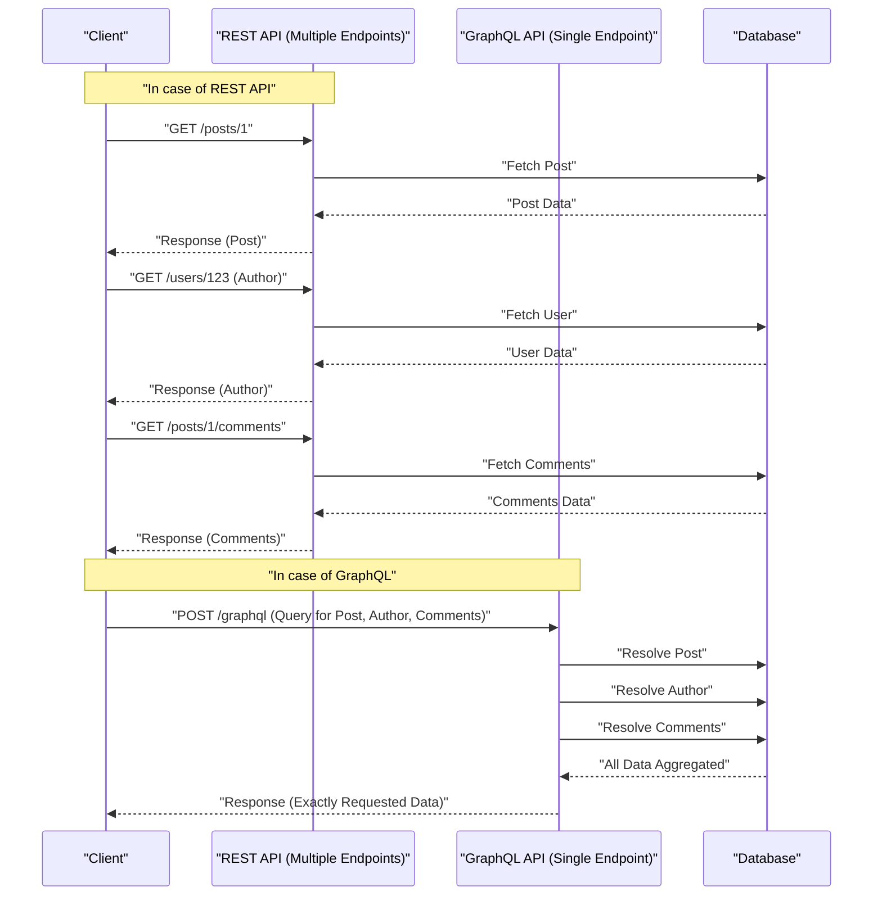

In modern web development, the choice of API architecture connecting the backend and frontend has a immense impact on application performance, development efficiency, and maintainability. **REST API**, historically adopted as a standard, has been widely popularized due to its simple and intuitive design principles, but as frontends become more sophisticated and complex, various challenges have surfaced. This article thoroughly and comprehensively explains the limitations of REST APIs and the innovative approach of **GraphQL** that emerged to solve them, from the perspectives of architecture, data fetching, and type safety.

## 1. REST API Architectural Style Principles and Limitations

**REST** (Representational State Transfer) is an architectural style proposed by Roy Fielding in 2000. It maximizes the basic features of the HTTP protocol and performs resource-oriented design.

### Key REST Design Principles

When designing a REST API, it is ideal to satisfy the following constraints (RESTful API).

1. **Client-Server Separation** (Client-Server): Separates user interface concerns from data storage concerns, allowing them to evolve independently.
2. **Stateless** (Stateless): The server does not hold the client's session state, and each request must contain all the information necessary to complete the processing independently.
3. **Cacheable** (Cacheable): To improve network efficiency, responses from the server must clearly indicate whether they are cacheable or not.
4. **Uniform Interface** (Uniform Interface): Provides an overall consistent interface based on principles such as resource identification (URIs), resource manipulation through representations, self-descriptive messages, and HATEOAS (Hypermedia as the Engine of Application State).
5. **Layered System** (Layered System): The client can communicate without being aware of whether it is directly connected to the server or via an intermediate proxy or load balancer.

These principles have built a very solid foundation for REST at web scale. However, it faces challenges as described below in modern diverse devices and complex UI requirements.

## 2. Overfetching and Underfetching Problems

The most prominent challenges of REST APIs are **overfetching** and **underfetching**. These stem from REST returning a fixed data structure on a per-"resource" basis.

### Overfetching

Overfetching is a phenomenon where the server sends more data than the client needs.

For example, suppose there is a screen that only lists the user's "name" and "icon image". When you hit the `/users` endpoint with a REST API, in many cases, a JSON containing a large amount of data not used on that screen at all, such as email addresses, creation dates, and detailed profile information, is returned. In environments with limited bandwidth like mobile networks, this unnecessary data transfer is a direct cause of performance degradation.

### Underfetching and N+1 Requests

On the other hand, underfetching is a phenomenon where the response from a single endpoint does not provide enough data to build the UI, requiring additional requests.

For example, suppose you need to display "article body", "author information", and "list of comments on the article" on an article details page of a blog. With a REST API, you often have to send requests to multiple endpoints as follows:

1. Fetch article data with `/posts/1`
2. Fetch author information with `/users/{author_id}` using the obtained `author_id`
3. Request `/posts/1/comments` to fetch comments for the article

As a result, network latency accumulates, and the initial display is delayed. This leads to the **N+1 requests problem** in UI construction.

## 3. What is GraphQL? Its Innovative Approach

**GraphQL** is a query language for APIs, developed by Facebook (now Meta) in 2012 and open-sourced in 2015, and a server-side runtime for executing it.

### Core Concepts of GraphQL

1. **Single Endpoint**: Instead of preparing multiple URLs (endpoints) for each resource like REST, GraphQL usually uses only a single endpoint, `/graphql`.
2. **Declarative Data Fetching**: The client accurately describes what data structure is needed as a query and requests it from the server. The server returns JSON that exactly matches the requested structure.
3. **Strong Typing (Schema-Driven)**: API specifications are strictly typed and defined by the GraphQL Schema Definition Language (SDL).

This allows clients to get "exactly the data they need, no more, no less," drastically eliminating overfetching and underfetching.

## 4. Architecture Comparison (REST vs GraphQL)

The diagram below illustrates the difference in request flows between REST and GraphQL when fetching the aforementioned "article," "author," and "comments."



You can see that while REST requires multiple round trips between the client and server, GraphQL resolves and returns all the necessary data structures in a single request.

## 5. Schema-Driven Development and Data Structure Comparison

One of the biggest features of GraphQL is **Schema-Driven Development**. Frontend and backend engineers first agree on and define a GraphQL schema (SDL). This schema acts as a "contract," allowing both sides to proceed with development in parallel.

### Example of GraphQL Schema Definition (SDL)

```graphql
# type defines an object
type User {
  id: ID!
  name: String!
  email: String!
  avatarUrl: String
  posts: [Post!]!
}

type Comment {
  id: ID!
  body: String!
  author: User!
}

type Post {
  id: ID!
  title: String!
  content: String!
  author: User!
  comments: [Comment!]!
}

# Entry point for queries
type Query {
  post(id: ID!): Post
  user(id: ID!): User
}
```

(`!` indicates required/non-null)

### Request and Response Comparison

**In case of REST API (Requires composing multiple JSONs)**

Response of `/posts/1`:
```json
{
  "id": "1",
  "title": "Introduction to GraphQL",
  "content": "GraphQL is wonderful...",
  "author_id": "123"
}
```
At this time, even though you really just want to know the `author`'s name, REST only gives you `author_id`, which means you have to deal with it by separately pulling user details or preparing a dedicated endpoint forcibly joined on the backend side (e.g., `/posts/1?include=author`).

**In case of GraphQL**

Query sent by the client:
```graphql
query GetPostDetails {
  post(id: "1") {
    title
    content
    author {
      name
    }
    comments {
      body
      author {
        name
      }
    }
  }
}
```

Response from the server:
```json
{
  "data": {
    "post": {
      "title": "Introduction to GraphQL",
      "content": "GraphQL is wonderful...",
      "author": {
        "name": "Taro Yamada"
      },
      "comments": [
        {
          "body": "This was very helpful!",
          "author": {
            "name": "Hanako Sato"
          }
        }
      ]
    }
  }
}
```
In this way, JSON that perfectly matches the requested structure is returned in a single request. Unnecessary fields (like email) are not included at all.

## 6. Implementing Resolvers and the Backend's Role

The GraphQL server parses queries from the client and collects data by executing functions called **resolvers** that correspond to each field in the schema.

Let's look at an example of resolver implementation in Node.js (like Apollo Server).

```typescript
const resolvers = {
  Query: {
    // Resolver for the post query
    post: async (parent, args, context) => {
      return await context.db.Post.findById(args.id);
    },
  },
  Post: {
    // Resolver for the author field of the Post object
    author: async (parent, args, context) => {
      // parent contains the parent's Post data
      return await context.db.User.findById(parent.author_id);
    },
    comments: async (parent, args, context) => {
      return await context.db.Comment.find({ postId: parent.id });
    }
  },
  Comment: {
    author: async (parent, args, context) => {
      return await context.db.User.findById(parent.author_id);
    }
  }
};
```

In this way, resolvers are called sequentially as if traversing the data graph. Backend implementers can focus on "how to put data into this field of this type" instead of thinking about "what to return at which URL".

## 7. Backend N+1 Problem and its Solution (DataLoader)

The resolver implementation described earlier has a severe performance flaw hidden within it. This is the **N+1 problem** on the backend side.

For example, suppose you execute a query to get a list of 10 articles and fetch the `author` for each.
1. The query to get 10 articles runs once (`SELECT * FROM posts LIMIT 10`)
2. The `Post.author` resolver is called for each article.
3. As a result, the query to fetch the author runs 10 times (`SELECT * FROM users WHERE id = ?` × 10)

If this becomes 100 or 1000 items, a massive load will be placed on the database. To solve this, a pattern (library) called **DataLoader**, developed by Facebook, is used.

### Batch Processing and Caching with DataLoader

DataLoader leverages the JavaScript event loop (microtask queue) to batch key retrieval requests generated within a single tick and combines them into a single query.

```typescript
import DataLoader from 'dataloader';

// Instantiate DataLoader. Define a batch function.
const userLoader = new DataLoader(async (userIds) => {
  // An array of IDs like [1, 2, 3] is passed in
  // Fetch all together in a single IN query
  const users = await db.User.find({ id: { $in: userIds } });
  
  // Need to return an array that corresponds to the order of userIds
  const userMap = users.reduce((acc, user) => {
    acc[user.id] = user;
    return acc;
  }, {});
  return userIds.map(id => userMap[id] || null);
});

// Using it in a resolver
const resolvers = {
  Post: {
    author: (parent, args, context) => {
      // Load by specifying ID, but it's batched behind the scenes
      return context.loaders.userLoader.load(parent.author_id);
    }
  }
};
```

With this, even in the previous example, the query to fetch the author is optimized to just one: `SELECT * FROM users WHERE id IN (?, ?, ...)`. To scale GraphQL in a production environment, introducing DataLoader is practically mandatory.

## 8. Ultimate Type Safety Brought by GraphQL Code Generator

The GraphQL type system (schema) brings immense benefits to frontend development. By using tools like **GraphQL Code Generator**, you can auto-generate TypeScript type definitions and custom hooks for data fetching (in the case of React) from the schema.

With REST APIs, it is possible to generate types from Swagger (OpenAPI), but with GraphQL, it is overwhelmingly superior because you can generate type definitions up to the "shape specified by the client in the query."

1. Read the **schema file** and the **query string written by the client (.graphql file)**.
2. GraphQL Code Gen generates a TypeScript type (Interface) that exactly matches the response of that query.

```typescript
// Example usage of auto-generated Hooks (Apollo Client)
import { useGetPostDetailsQuery } from '../generated/graphql';

const PostPage = ({ postId }: { postId: string }) => {
  const { data, loading, error } = useGetPostDetailsQuery({
    variables: { id: postId }
  });

  if (loading) return <p>Loading...</p>;
  if (error) return <p>Error</p>;
  
  // The type of data is strictly inferred exactly as specified in the query!
  // data.post.title is recognized as string type
  // If you try to access a field not included in the query (like email), it will cause a TS compile error
  return (
    <div>
      <h1>{data?.post?.title}</h1>
      <p>Author: {data?.post?.author.name}</p>
    </div>
  );
};
```

This makes it possible to almost entirely prevent bugs like "crashing due to properties being undefined at runtime" during static analysis (compile time), leading to a dramatic improvement in frontend DX (Developer Experience).

## 9. Advanced Caching Strategy: Apollo Client and Relay

One of the strengths of REST APIs was that it was easy to utilize standard HTTP caching (ETag, Cache-Control, etc.). Since GraphQL essentially utilizes a single endpoint with POST requests, HTTP-level caching is difficult (although there are techniques like Persisted Queries).

Instead, within the GraphQL ecosystem, client libraries equipped with powerful **client-side caching** (normalized cache) have evolved. Prominent examples are **Apollo Client** and **Relay**.

### What is Normalized Cache?

Smart GraphQL clients like Apollo Client don't just save the tree structure of the received JSON response as is, but save it as a flat store of records.
Each object is saved (normalized) using a combination of `__typename` (type name) and `id` (unique identifier) as a key (e.g., `Post:1`).

Through this mechanism, astonishing benefits can be achieved.
For example, suppose there was a "post list" query and a "post details" query.
1. A user opens the "post details" screen and edits the post title (Mutation).
2. A response containing the new title (`id` and `title`) is returned from the server.
3. Apollo Client automatically updates the data for `Post:1` in the store.
4. Then, the information of the same `Post:1` displayed on the "post list" screen is also **automatically re-rendered and synchronized to the latest state**.

Engineers no longer need to write code to manually update state management (like [Redux](https://kenji.blog/en/p/state-management-history-redux-context-recoil-zustand/)), and the overall UI data consistency is guaranteed by the library. This is an area where GraphQL holds a decisive advantage over REST when building complex SPAs (Single Page Applications).

### Relay - Facebook's Ultimate GraphQL Client

**Relay**, created by Facebook, the developer of React, takes an even stricter and more performance-focused approach than Apollo.
The necessary data for each component is defined as a **Fragment**, and the parent component aggregates them to send to the server as a single massive query. Because data dependencies are encapsulated per component, you can achieve an extremely advanced architecture that completely eliminates problems like "unnecessary fields remaining in the query even after deleting a component."

## 10. Should You Adopt GraphQL? (Trade-offs and Conclusion)

We have stated the powerful benefits of GraphQL so far, but it is by no means a "silver bullet that is always superior to REST."

**Disadvantages / Hurdles for Adopting GraphQL**
* **Learning Cost**: A paradigm shift is required for both backend and frontend, and there is a learning curve barrier.
* **Complex Backend Implementation**: Defensive implementations on the server side are mandatory, such as designing DataLoader to avoid N+1 problems, performance tuning for complex queries (recursive, deep hierarchical requests), and rate limiting based on query complexity.
* **Overkill for Simple APIs**: If the data update/fetch requirements are simple and it is a small application with low UI complexity, the simplicity of REST wins.

### Conclusion

REST API remains an excellent architecture and continues to be a strong choice for public APIs and inter-service communication (microservices).

On the other hand, in modern web and mobile applications that are highly interactive and have complex data requirements, **GraphQL** provides overwhelming DX and UX through "eliminating overfetching/underfetching," "safe frontend development via strong type inference," and "automation of state management via normalized caching."

Carefully evaluating the development team's skill set, product complexity, and future scale to choose the optimal API architecture will likely be one of the most critical decisions in modern software development.
