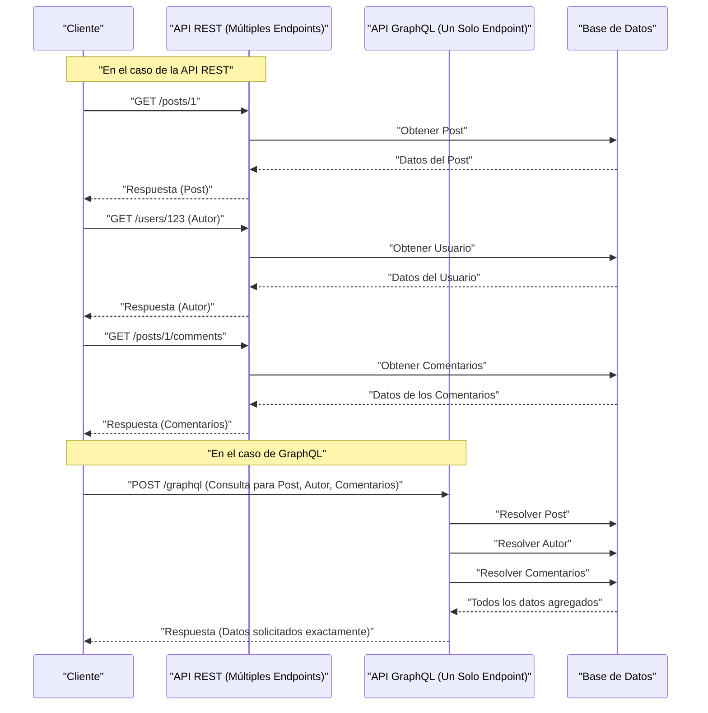

En el desarrollo web moderno, la elección de la arquitectura de la API que conecta el backend y el frontend tiene un impacto profundo en el rendimiento de la aplicación, la eficiencia del desarrollo y la mantenibilidad. La **API REST**, que ha sido adoptada históricamente como el estándar, se ha generalizado gracias a sus principios de diseño simples e intuitivos; sin embargo, con la sofisticación y complejidad de los frontends, han surgido diversos desafíos. En este artículo, explicaremos de forma detallada y exhaustiva los límites a los que se enfrenta la API REST y el enfoque innovador de **GraphQL**, que surgió para resolverlos, desde las perspectivas de la arquitectura, la recuperación de datos (data fetching) y la seguridad de tipos.

## 1. Principios de estilo de arquitectura de la API REST y sus límites

**REST** (Representational State Transfer) es un estilo de arquitectura propuesto por Roy Fielding en el año 2000. Aprovecha al máximo las funciones básicas del protocolo HTTP para realizar un diseño orientado a recursos.

### Principios de diseño principales de REST

Al diseñar una API REST, lo ideal es cumplir con las siguientes restricciones (API RESTful).

1. **Separación Cliente-Servidor** (Client-Server): Separa las preocupaciones relacionadas con la interfaz de usuario de las preocupaciones sobre el almacenamiento de datos, permitiéndoles evolucionar de forma independiente.
2. **Sin estado** (Stateless): El servidor no mantiene el estado de la sesión del cliente, y cada solicitud debe contener toda la información necesaria para completar su procesamiento de forma independiente.
3. **Almacenable en caché** (Cacheable): Para mejorar la eficiencia de la red, las respuestas del servidor deben indicar explícitamente si se pueden almacenar en caché o no.
4. **Interfaz uniforme** (Uniform Interface): Proporciona una interfaz globalmente consistente basada en principios como la identificación de recursos (URI), la manipulación de recursos a través de representaciones, mensajes autodescriptivos y HATEOAS (Hypermedia as the Engine of Application State).
5. **Sistema en capas** (Layered System): El cliente puede comunicarse sin tener que saber si está conectado directamente al servidor o a través de intermediarios como proxies o balanceadores de carga.

Gracias a estos principios, REST ha construido una base muy sólida a la escala de la Web. Sin embargo, en los diversos dispositivos y los requisitos de interfaces de usuario (UI) complejas de la actualidad, se enfrenta a los problemas que se describen a continuación.

## 2. El problema del Overfetching y Underfetching

Los problemas más notables de la API REST son el **overfetching** (sobrebúsqueda) y el **underfetching** (subbúsqueda). Estos se derivan de que REST devuelve estructuras de datos fijas por unidad de "recurso".

### Overfetching (Sobrebúsqueda)

El overfetching es el fenómeno por el cual el servidor envía más datos de los que el cliente necesita.

Por ejemplo, supongamos que hay una pantalla que solo muestra una lista con el "nombre" y la "imagen de icono" del usuario. Al llamar al endpoint `/users` en una API REST, a menudo se devuelve un JSON que contiene una gran cantidad de datos que no se utilizan en absoluto en esa pantalla, como la dirección de correo electrónico, la fecha de creación y la información detallada del perfil. En entornos con ancho de banda limitado, como redes móviles, esta transferencia de datos innecesaria es una causa directa de degradación del rendimiento.

### Underfetching (Subbúsqueda) y el problema de N+1 consultas

Por otro lado, el underfetching es un fenómeno en el que la respuesta de un solo endpoint no proporciona los datos suficientes para construir la UI, lo que requiere solicitudes adicionales.

Por ejemplo, supongamos que en la página de detalles de una publicación de blog se debe mostrar el "cuerpo del artículo", "información del autor" y "lista de comentarios del artículo". En una API REST, a menudo es necesario enviar solicitudes a múltiples endpoints como se muestra a continuación:

1. Obtener los datos del artículo en `/posts/1`
2. Usar el `author_id` obtenido para recuperar la información del autor en `/users/{author_id}`
3. Hacer una solicitud a `/posts/1/comments` para obtener los comentarios del artículo

Como resultado, se acumula latencia en la red y la visualización inicial se retrasa. Esto lleva al **problema de N+1 solicitudes** en la construcción de la UI.

## 3. ¿Qué es GraphQL? Su enfoque innovador

**GraphQL** es un lenguaje de consultas para APIs y un entorno de ejecución del lado del servidor para ejecutarlas, desarrollado por Facebook (ahora Meta) en 2012 y de código abierto en 2015.

### Conceptos centrales de GraphQL

1. **Un único endpoint**: En lugar de preparar múltiples URLs (endpoints) para cada recurso como en REST, GraphQL generalmente usa solo un único endpoint, como `/graphql`.
2. **Recuperación de datos declarativa**: El cliente describe exactamente qué estructura de datos necesita como una consulta, y la solicita al servidor. El servidor devuelve un JSON que coincide exactamente con la estructura solicitada.
3. **Fuertemente tipado (Basado en esquemas)**: Las especificaciones de la API están tipadas de manera estricta y definidas mediante GraphQL Schema Definition Language (SDL).

Esto permite a los clientes recuperar "solo los datos necesarios, en la cantidad necesaria", resolviendo drásticamente los problemas de overfetching y underfetching.

## 4. Comparación de arquitecturas (REST vs GraphQL)

El diagrama a continuación ilustra la diferencia en el flujo de peticiones entre REST y GraphQL al obtener el "artículo", "autor" y "comentarios" mencionados anteriormente.



Se puede observar que en REST se producen múltiples viajes de ida y vuelta (round trips) entre el cliente y el servidor, mientras que en GraphQL, se resuelven y devuelven todas las estructuras de datos necesarias en una sola petición.

## 5. Desarrollo basado en esquemas y comparación de estructuras de datos

Una de las características más importantes de GraphQL es el **desarrollo basado en esquemas** (Schema-Driven Development). Los ingenieros de frontend y backend primero acuerdan y definen un esquema de GraphQL (SDL). Este esquema se convierte en el "contrato", permitiendo a ambas partes avanzar en el desarrollo en paralelo.

### Ejemplo de definición del esquema GraphQL (SDL)

```graphql
# type define un objeto
type User {
  id: ID!
  name: String!
  email: String!
  avatarUrl: String
  posts: [Post!]!
}

type Comment {
  id: ID!
  body: String!
  author: User!
}

type Post {
  id: ID!
  title: String!
  content: String!
  author: User!
  comments: [Comment!]!
}

# Punto de entrada de las consultas
type Query {
  post(id: ID!): Post
  user(id: ID!): User
}
```

(El `!` indica que es obligatorio / no nulo)

### Comparación de solicitud y respuesta

**En el caso de API REST (necesidad de componer múltiples JSONs)**

Respuesta de `/posts/1`:
```json
{
  "id": "1",
  "title": "Introducción a GraphQL",
  "content": "GraphQL es maravilloso...",
  "author_id": "123"
}
```
En este caso, a pesar de que en realidad solo queremos saber el nombre del `author`, REST solo nos proporciona el `author_id`. Esto nos obliga a realizar acciones adicionales, como buscar los detalles del usuario por separado, o preparar endpoints dedicados en el lado del backend que unan forzosamente la información (ej. `/posts/1?include=author`).

**En el caso de GraphQL**

Consulta enviada por el cliente:
```graphql
query GetPostDetails {
  post(id: "1") {
    title
    content
    author {
      name
    }
    comments {
      body
      author {
        name
      }
    }
  }
}
```

Respuesta del servidor:
```json
{
  "data": {
    "post": {
      "title": "Introducción a GraphQL",
      "content": "GraphQL es maravilloso...",
      "author": {
        "name": "Juan Pérez"
      },
      "comments": [
        {
          "body": "¡Me fue de mucha ayuda!",
          "author": {
            "name": "María García"
          }
        }
      ]
    }
  }
}
```
De esta manera, el JSON que coincide perfectamente con la estructura solicitada se devuelve en una sola petición. No se incluye en absoluto ningún campo innecesario (como el email).

## 6. Implementación de Resolvers y el papel del backend

El servidor GraphQL analiza la consulta del cliente y ejecuta funciones llamadas **Resolvers** (Resolutores) que corresponden a cada campo del esquema para recopilar los datos.

Veamos un ejemplo de implementación de resolutores en Node.js (con Apollo Server, por ejemplo).

```typescript
const resolvers = {
  Query: {
    // Resolutor para la consulta post
    post: async (parent, args, context) => {
      return await context.db.Post.findById(args.id);
    },
  },
  Post: {
    // Resolutor del campo author del objeto Post
    author: async (parent, args, context) => {
      // parent contiene los datos del Post padre
      return await context.db.User.findById(parent.author_id);
    },
    comments: async (parent, args, context) => {
      return await context.db.Comment.find({ postId: parent.id });
    }
  },
  Comment: {
    author: async (parent, args, context) => {
      return await context.db.User.findById(parent.author_id);
    }
  }
};
```

Como se puede ver, los resolutores se llaman en cadena, siguiendo el grafo de datos. Quien implementa el backend puede enfocarse en "cómo introducir datos en este campo de este tipo" en lugar de pensar "qué devolver en qué URL".

## 7. El problema N+1 del backend y su solución (DataLoader)

La implementación de resolutores anterior esconde un defecto crítico de rendimiento. Este es el **problema N+1** del lado del backend.

Por ejemplo, supongamos que se ejecuta una consulta para obtener una lista de 10 artículos y el `author` de cada uno.
1. Se ejecuta 1 consulta para obtener los 10 artículos (`SELECT * FROM posts LIMIT 10`)
2. Para cada artículo, se llama al resolutor `Post.author`.
3. Como resultado, la consulta para buscar al autor se ejecuta 10 veces (`SELECT * FROM users WHERE id = ?` × 10)

Si fueran 100 o 1000 registros, esto supondría una carga inmensa para la base de datos. Para resolver esto, existe un patrón (biblioteca) desarrollado por Facebook llamado **DataLoader**.

### Procesamiento por lotes y almacenamiento en caché con DataLoader

DataLoader aprovecha el bucle de eventos (cola de microtareas) de JavaScript para procesar por lotes (batching) las solicitudes de obtención de claves que se generan en un solo tick y agruparlas en una sola consulta.

```typescript
import DataLoader from 'dataloader';

// Instanciación de DataLoader. Se define la función por lotes.
const userLoader = new DataLoader(async (userIds) => {
  // Se pasa un arreglo de IDs como [1, 2, 3]
  // Se recuperan todos juntos en una sola consulta IN
  const users = await db.User.find({ id: { $in: userIds } });
  
  // Es necesario devolver un arreglo que corresponda al orden de userIds
  const userMap = users.reduce((acc, user) => {
    acc[user.id] = user;
    return acc;
  }, {});
  return userIds.map(id => userMap[id] || null);
});

// Uso en el resolutor
const resolvers = {
  Post: {
    author: (parent, args, context) => {
      // Se carga especificando el id, pero internamente se procesa por lotes
      return context.loaders.userLoader.load(parent.author_id);
    }
  }
};
```

Con esto, en el ejemplo anterior, la consulta para extraer al autor se optimiza a solo 1 vez con `SELECT * FROM users WHERE id IN (?, ?, ...)`. Para escalar GraphQL en un entorno de producción real, la adopción de DataLoader es prácticamente indispensable.

## 8. La máxima seguridad de tipos gracias a GraphQL Code Generator

El sistema de tipos de GraphQL (esquema) proporciona enormes ventajas para el desarrollo del frontend. Utilizando herramientas como **GraphQL Code Generator**, se pueden generar automáticamente las definiciones de tipos de TypeScript o Custom Hooks para la obtención de datos (en el caso de React) a partir del esquema.

En las API REST también es posible generar tipos desde Swagger (OpenAPI), pero en el caso de GraphQL, la gran ventaja es que se puede generar la definición de tipos exactamente en la "forma especificada por la consulta" del cliente.

1. Se carga el **archivo de esquema** y la **cadena de consulta escrita por el cliente (archivo .graphql)**.
2. GraphQL Code Gen genera el tipo de TypeScript (Interface) que coincide perfectamente con la respuesta de esa consulta.

```typescript
// Ejemplo de uso de Hooks generados automáticamente (Apollo Client)
import { useGetPostDetailsQuery } from '../generated/graphql';

const PostPage = ({ postId }: { postId: string }) => {
  const { data, loading, error } = useGetPostDetailsQuery({
    variables: { id: postId }
  });

  if (loading) return <p>Cargando...</p>;
  if (error) return <p>Error</p>;
  
  // ¡El tipo de data se infiere estrictamente tal como se especificó en la consulta!
  // data.post.title se reconoce como de tipo string
  // Si intentas acceder a un campo no incluido en la consulta (como email, etc.), resultará en un error de compilación de TS
  return (
    <div>
      <h1>{data?.post?.title}</h1>
      <p>Autor: {data?.post?.author.name}</p>
    </div>
  );
};
```

De este modo, es posible prevenir de manera casi total en el análisis estático (en tiempo de compilación) fallos como "caídas de la aplicación porque una propiedad es undefined en tiempo de ejecución", mejorando de manera espectacular la DX (Experiencia del Desarrollador) en el frontend.

## 9. Estrategias avanzadas de caché: Apollo Client y Relay

Una de las ventajas de las APIs REST es la facilidad de uso del almacenamiento en caché HTTP estándar (como ETag, Cache-Control, etc.). Dado que GraphQL usa en principio un único endpoint para todas las peticiones POST, el almacenamiento en caché a nivel HTTP es complicado (aunque existen técnicas como Persisted Queries).

En su lugar, el ecosistema de GraphQL ha evolucionado desarrollando potentes librerías de clientes con **caché del lado del cliente** (caché normalizada). Los más representativos son **Apollo Client** y **Relay**.

### ¿Qué es la Caché Normalizada (Normalized Cache)?

Clientes GraphQL inteligentes como Apollo Client no almacenan la estructura de árbol del JSON recibido como respuesta tal cual, sino que la guardan como un almacén (store) de registros planos.
Cada objeto se guarda (normaliza) utilizando la combinación de `__typename` (nombre del tipo) e `id` (identificador único) como clave (ej. `Post:1`).

Gracias a este mecanismo, se obtienen increíbles beneficios.
Por ejemplo, supongamos que hay una consulta para la "Lista de publicaciones" y otra para los "Detalles de la publicación".
1. El usuario abre la pantalla de "Detalles de la publicación" y edita el título de la publicación (Mutation).
2. El servidor devuelve una respuesta con el nuevo título (`id` y `title`).
3. Apollo Client actualiza automáticamente los datos de `Post:1` en el almacén.
4. En consecuencia, la información del mismo `Post:1` que se estaba mostrando en la pantalla de "Lista de publicaciones" **también se renderiza automáticamente de nuevo y se sincroniza con el estado más reciente**.

Ya no es necesario que los ingenieros escriban código para actualizar manualmente la gestión del estado (como con [Redux](https://kenji.blog/es/p/state-management-history-redux-context-recoil-zustand/)), garantizando la consistencia de los datos en toda la UI gracias a la librería. Esta es un área donde GraphQL tiene una ventaja decisiva sobre REST a la hora de construir complejas SPAs (Single Page Applications).

### Relay: El cliente GraphQL definitivo del que Facebook se enorgullece

**Relay**, creado por Facebook (los desarrolladores de React), adopta un enfoque mucho más estricto y enfocado en el rendimiento que Apollo.
Define los datos necesarios para cada componente como un **Fragmento (Fragment)**, y un componente padre los agrupa enviándolos como una sola gran consulta al servidor. Al estar las dependencias de datos encapsuladas por componente, es posible implementar una arquitectura sumamente avanzada que elimina por completo problemas como "quedan campos innecesarios en la consulta a pesar de haber eliminado el componente".

## 10. ¿Deberías adoptar GraphQL? (Compensaciones y conclusiones)

Hasta aquí se han descrito los poderosos beneficios de GraphQL, pero de ninguna manera es "una bala de plata que siempre es superior a REST".

**Desventajas de GraphQL / Obstáculos para su adopción**
* **Curva de aprendizaje**: Se requiere un cambio de paradigma tanto en el backend como en el frontend, y hay un muro de aprendizaje importante.
* **Implementación compleja en el backend**: Es imprescindible implementar medidas defensivas del lado del servidor, como el diseño de DataLoader para evitar el problema de N+1, la optimización del rendimiento para consultas complejas (solicitudes recursivas de jerarquía profunda) y la limitación de la tasa de peticiones (rate limit) basada en la complejidad de la consulta (Complexity).
* **Excesivo para APIs simples**: En el caso de aplicaciones a pequeña escala donde los requisitos de obtención y actualización de datos son simples, y la complejidad de la UI es baja, la simplicidad de REST es superior.

### Resumen

La API REST sigue siendo una arquitectura excelente y continuará siendo una opción poderosa para APIs públicas y la comunicación entre servicios (microservicios).

Por otro lado, en aplicaciones web y móviles modernas, que son altamente interactivas y con requisitos de datos complejos, **GraphQL** ofrece una UX y DX abrumadoras gracias a "la erradicación del overfetching/underfetching", "el desarrollo frontend seguro mediante una inferencia de tipos potente", y "la automatización de la gestión del estado mediante el almacenamiento en caché normalizado".

Evaluar cuidadosamente las habilidades del equipo de desarrollo, la complejidad del producto y su escalabilidad futura para seleccionar la arquitectura de API óptima será, sin duda, una de las decisiones más importantes en el desarrollo de software actual.
