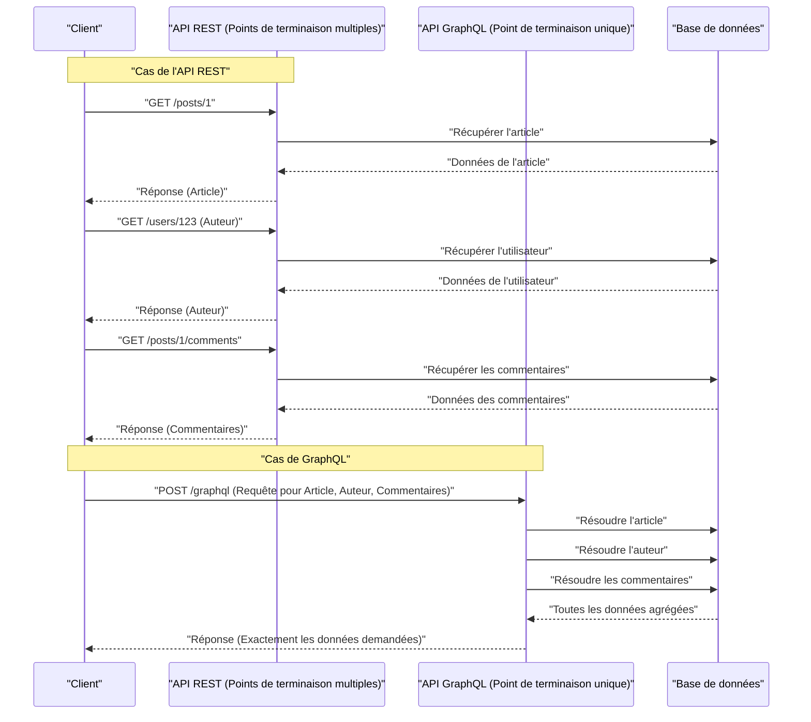

Dans le développement web moderne, le choix de l'architecture API qui relie le back-end au front-end a un impact considérable sur les performances de l'application, l'efficacité du développement et la maintenabilité. L'**API REST**, historiquement adoptée comme norme, s'est largement répandue grâce à ses principes de conception simples et intuitifs. Cependant, avec la sophistication et la complexification du front-end, divers problèmes ont fait surface. Cet article explique en détail et de manière exhaustive les limites rencontrées par l'API REST et l'approche innovante de **GraphQL**, apparu pour les résoudre, du point de vue de l'architecture, de la récupération de données et de la sécurité du typage.

## 1. Principes du style d'architecture de l'API REST et ses limites

**REST** (Representational State Transfer) est un style d'architecture proposé par Roy Fielding en 2000. Il tire pleinement parti des fonctionnalités de base du protocole HTTP et adopte une conception orientée ressources.

### Principaux principes de conception de REST

Lors de la conception d'une API REST, il est idéal de satisfaire aux contraintes suivantes (API RESTful).

1. **Séparation Client-Serveur** (Client-Server) : Sépare les préoccupations liées à l'interface utilisateur de celles liées au stockage des données, permettant à chacun d'évoluer indépendamment.
2. **Sans état** (Stateless) : Le serveur ne conserve pas l'état de la session du client, et chaque requête doit contenir toutes les informations nécessaires pour accomplir son traitement indépendamment.
3. **Mise en cache** (Cacheable) : Pour améliorer l'efficacité du réseau, les réponses du serveur doivent indiquer explicitement si elles peuvent être mises en cache ou non.
4. **Interface uniforme** (Uniform Interface) : Fournit une interface globalement cohérente basée sur des principes tels que l'identification des ressources (URI), la manipulation des ressources via des représentations, des messages auto-descriptifs et HATEOAS (Hypermedia as the Engine of Application State).
5. **Système en couches** (Layered System) : Le client peut communiquer sans se soucier s'il est connecté directement au serveur ou via des proxys ou des équilibreurs de charge intermédiaires.

Grâce à ces principes, REST a construit une base extrêmement solide à l'échelle du Web. Cependant, avec la diversité des appareils modernes et les exigences complexes des interfaces utilisateur, il est confronté aux défis décrits ci-dessous.

## 2. Le problème de sur-récupération et sous-récupération

Les problèmes les plus notables de l'API REST sont la **sur-récupération** (Overfetching) et la **sous-récupération** (Underfetching). Ceux-ci résultent du fait que REST renvoie des structures de données fixes par unité de "ressource".

### Sur-récupération (Overfetching)

La sur-récupération est le phénomène où le serveur envoie plus de données que ce dont le client a besoin.

Par exemple, supposons qu'il y ait un écran affichant une liste avec seulement le "nom" et "l'image de profil" de l'utilisateur. Lorsqu'on interroge le point de terminaison `/users` avec une API REST, on reçoit souvent un JSON contenant une grande quantité de données qui ne seront pas du tout utilisées sur cet écran, telles que l'adresse e-mail, la date de création et les informations détaillées du profil. Dans des environnements où la bande passante est limitée, comme les réseaux mobiles, ce transfert de données inutile est une cause directe de baisse de performances.

### Sous-récupération (Underfetching) et requêtes N+1

D'autre part, la sous-récupération est le phénomène où la réponse d'un seul point de terminaison ne fournit pas suffisamment de données pour construire l'interface utilisateur, nécessitant ainsi des requêtes supplémentaires.

Par exemple, supposons que sur la page de détails d'un article de blog, vous deviez afficher "le corps de l'article", "les informations de l'auteur" et "la liste des commentaires sur l'article". Avec une API REST, il est souvent nécessaire d'envoyer des requêtes à plusieurs points de terminaison comme suit.

1. Récupérer les données de l'article via `/posts/1`
2. Utiliser le `author_id` récupéré pour obtenir les informations de l'auteur via `/users/{author_id}`
3. Envoyer une requête à `/posts/1/comments` pour obtenir les commentaires de l'article

En conséquence, la latence du réseau s'accumule, retardant l'affichage initial. Cela conduit au **problème des requêtes N+1** dans la construction de l'interface utilisateur.

## 3. Qu'est-ce que GraphQL ? Son approche innovante

**GraphQL** est un langage de requête pour les API développé par Facebook (aujourd'hui Meta) en 2012 et rendu open source en 2015, ainsi qu'un environnement d'exécution côté serveur pour l'exécuter.

### Concepts de base de GraphQL

1. **Point de terminaison unique** : Au lieu de fournir plusieurs URL (points de terminaison) par ressource comme dans REST, GraphQL utilise généralement un seul point de terminaison, `/graphql`.
2. **Récupération déclarative des données** : Le client décrit exactement quelle structure de données il a besoin sous forme de requête et la demande au serveur. Le serveur renvoie un JSON correspondant parfaitement à la structure demandée.
3. **Typage fort (piloté par le schéma)** : Les spécifications de l'API sont strictement typées et définies par le GraphQL Schema Definition Language (SDL).

Cela permet au client de récupérer "les données nécessaires, et uniquement celles-ci", éliminant ainsi drastiquement la sur-récupération et la sous-récupération.

## 4. Comparaison d'architecture (REST vs GraphQL)

Le schéma suivant illustre la différence de flux de requêtes entre REST et GraphQL lors de la récupération de "l'article", "l'auteur" et "les commentaires" mentionnés précédemment.



Dans REST, de multiples allers-retours se produisent entre le client et le serveur, tandis qu'avec GraphQL, on peut voir que toutes les structures de données nécessaires sont résolues et renvoyées en une seule requête.

## 5. Comparaison du développement piloté par le schéma et de la structure des données

L'une des plus grandes caractéristiques de GraphQL est le **développement piloté par le schéma** (Schema-Driven Development). Les ingénieurs front-end et back-end se mettent d'abord d'accord sur et définissent le schéma GraphQL (SDL). Ce schéma devient un "contrat", permettant aux deux parties de procéder au développement en parallèle.

### Exemple de définition de schéma GraphQL (SDL)

```graphql
# type définit un objet
type User {
  id: ID!
  name: String!
  email: String!
  avatarUrl: String
  posts: [Post!]!
}

type Comment {
  id: ID!
  body: String!
  author: User!
}

type Post {
  id: ID!
  title: String!
  content: String!
  author: User!
  comments: [Comment!]!
}

# Point d'entrée des requêtes
type Query {
  post(id: ID!): Post
  user(id: ID!): User
}
```

(`!` indique qu'il est obligatoire / non-null)

### Comparaison des requêtes et réponses

**Dans le cas de l'API REST (nécessite de combiner plusieurs JSON)**

Réponse de `/posts/1` :
```json
{
  "id": "1",
  "title": "Introduction à GraphQL",
  "content": "GraphQL est formidable...",
  "author_id": "123"
}
```
À ce moment-là, même si on ne veut connaître que le nom de `author`, REST ne fournit que `author_id`. Il faut alors effectuer une requête séparée pour les détails de l'utilisateur, ou le back-end doit fournir un point de terminaison dédié (ex: `/posts/1?include=author`) joignant les données de force.

**Dans le cas de GraphQL**

Requête envoyée par le client :
```graphql
query GetPostDetails {
  post(id: "1") {
    title
    content
    author {
      name
    }
    comments {
      body
      author {
        name
      }
    }
  }
}
```

Réponse du serveur :
```json
{
  "data": {
    "post": {
      "title": "Introduction à GraphQL",
      "content": "GraphQL est formidable...",
      "author": {
        "name": "Taro Yamada"
      },
      "comments": [
        {
          "body": "C'était très utile !",
          "author": {
            "name": "Hanako Sato"
          }
        }
      ]
    }
  }
}
```
Ainsi, un JSON correspondant exactement à la structure demandée est renvoyé en une seule requête. Aucun champ inutile (comme l'email) n'est inclus.

## 6. Implémentation des résolveurs et rôle du back-end

Le serveur GraphQL analyse la requête du client et exécute des fonctions appelées **résolveurs** (Resolver) correspondant à chaque champ du schéma pour collecter les données.

Voyons un exemple d'implémentation de résolveur en Node.js (avec Apollo Server, etc.).

```typescript
const resolvers = {
  Query: {
    // Résolveur pour la requête post
    post: async (parent, args, context) => {
      return await context.db.Post.findById(args.id);
    },
  },
  Post: {
    // Résolveur du champ author de l'objet Post
    author: async (parent, args, context) => {
      // parent contient les données Post parentes
      return await context.db.User.findById(parent.author_id);
    },
    comments: async (parent, args, context) => {
      return await context.db.Comment.find({ postId: parent.id });
    }
  },
  Comment: {
    author: async (parent, args, context) => {
      return await context.db.User.findById(parent.author_id);
    }
  }
};
```

De cette façon, les résolveurs sont appelés en chaîne, parcourant le graphe de données. Les développeurs back-end n'ont pas à penser "quoi retourner pour quelle URL", mais peuvent se concentrer sur "comment fournir les données pour ce champ de ce type".

## 7. Le problème N+1 du back-end et sa solution (DataLoader)

L'implémentation des résolveurs vue précédemment cache un grave défaut de performance. C'est le **problème N+1** côté back-end.

Par exemple, supposons que l'on exécute une requête pour obtenir une liste de 10 articles et récupérer le `author` pour chacun d'eux.
1. La requête pour obtenir 10 articles est exécutée une fois (`SELECT * FROM posts LIMIT 10`)
2. Le résolveur `Post.author` est appelé pour chaque article.
3. En conséquence, la requête pour récupérer l'auteur est exécutée 10 fois (`SELECT * FROM users WHERE id = ?` × 10)

Si on a 100 ou 1000 éléments, cela met une charge énorme sur la base de données. Ce qui résout ce problème est le modèle (bibliothèque) **DataLoader** développé par Facebook.

### Traitement par lots et mise en cache avec DataLoader

DataLoader utilise la boucle d'événements JavaScript (file de microtâches) pour regrouper les requêtes de récupération de clés générées dans un seul cycle en une seule requête (batching).

```typescript
import DataLoader from 'dataloader';

// Instanciation de DataLoader. Définition de la fonction de lot.
const userLoader = new DataLoader(async (userIds) => {
  // Un tableau d'identifiants comme [1, 2, 3] est passé
  // Récupérer tout en une fois avec une seule requête IN
  const users = await db.User.find({ id: { $in: userIds } });
  
  // Il est nécessaire de renvoyer un tableau correspondant à l'ordre de userIds
  const userMap = users.reduce((acc, user) => {
    acc[user.id] = user;
    return acc;
  }, {});
  return userIds.map(id => userMap[id] || null);
});

// Utilisation dans un résolveur
const resolvers = {
  Post: {
    author: (parent, args, context) => {
      // Le charger en spécifiant l'id, mais il sera traité par lots en arrière-plan
      return context.loaders.userLoader.load(parent.author_id);
    }
  }
};
```

Ainsi, dans l'exemple précédent, la requête pour récupérer l'auteur est optimisée à une seule exécution : `SELECT * FROM users WHERE id IN (?, ?, ...)`. L'adoption de DataLoader est pratiquement indispensable pour faire évoluer GraphQL dans un environnement de production.

## 8. La sécurité ultime du typage apportée par GraphQL Code Generator

Le système de types de GraphQL (schéma) offre d'énormes avantages pour le développement front-end. En utilisant des outils tels que **GraphQL Code Generator**, il est possible de générer automatiquement des définitions de types TypeScript et des Hooks personnalisés (pour React) à partir du schéma.

Bien qu'il soit également possible de générer des types à partir de Swagger (OpenAPI) pour les API REST, GraphQL est nettement supérieur car le client peut générer des définitions de types "sous la forme spécifiée dans la requête".

1. Charger le **fichier de schéma** et la **chaîne de requête écrite par le client (fichier .graphql)**.
2. GraphQL Code Gen génère un type TypeScript (Interface) qui correspond parfaitement à la réponse de cette requête.

```typescript
// Exemple d'utilisation des Hooks générés automatiquement (Apollo Client)
import { useGetPostDetailsQuery } from '../generated/graphql';

const PostPage = ({ postId }: { postId: string }) => {
  const { data, loading, error } = useGetPostDetailsQuery({
    variables: { id: postId }
  });

  if (loading) return <p>Chargement...</p>;
  if (error) return <p>Erreur</p>;
  
  // Le type de data est inféré de manière stricte comme spécifié dans la requête !
  // data.post.title est reconnu comme un type string
  // Si on essaie d'accéder à un champ non inclus dans la requête (comme email), cela produira une erreur de compilation TS
  return (
    <div>
      <h1>{data?.post?.title}</h1>
      <p>Auteur : {data?.post?.author.name}</p>
    </div>
  );
};
```

Grâce à cela, il est possible d'éviter presque tous les bugs liés aux "propriétés undefined lors de l'exécution provoquant des plantages" grâce à l'analyse statique (à la compilation), ce qui améliore considérablement l'expérience développeur (DX) front-end.

## 9. Stratégies de cache avancées : Apollo Client et Relay

L'un des avantages de l'API REST est la facilité d'utilisation de la mise en cache standard HTTP (ETag, Cache-Control, etc.). GraphQL utilisant généralement un point de terminaison unique et des requêtes POST, la mise en cache au niveau HTTP est difficile (bien qu'il existe des méthodes telles que les requêtes persistantes).

À la place, l'écosystème GraphQL a vu l'évolution de bibliothèques clientes dotées d'un **cache côté client** puissant (cache normalisé). Les plus représentatives sont **Apollo Client** et **Relay**.

### Qu'est-ce que le cache normalisé (Normalized Cache) ?

Les clients GraphQL intelligents comme Apollo Client ne sauvegardent pas l'arborescence JSON reçue en réponse telle quelle, mais la sauvegardent en tant que magasin d'enregistrements plats.
Chaque objet est sauvegardé (normalisé) avec une clé combinant `__typename` (nom du type) et `id` (identifiant unique) (ex : `Post:1`).

Ce mécanisme offre des avantages étonnants.
Par exemple, supposons qu'il y ait une requête "liste des articles" et une requête "détails de l'article".
1. L'utilisateur ouvre l'écran "détails de l'article" et modifie le titre de l'article (Mutation).
2. Le serveur renvoie une réponse avec le nouveau titre (`id` et `title`).
3. Apollo Client met à jour automatiquement les données de `Post:1` dans le magasin.
4. Ainsi, les informations du même `Post:1` affiché sur l'écran "liste des articles" **sont automatiquement re-rendues et synchronisées avec le dernier état**.

Les ingénieurs n'ont plus à écrire de code pour mettre à jour manuellement la gestion d'état (comme [Redux](https://kenji.blog/fr/p/state-management-history-redux-context-recoil-zustand/)), et la cohérence des données sur l'ensemble de l'interface utilisateur est garantie par la bibliothèque. C'est là que GraphQL possède un avantage décisif sur REST pour la construction de SPA (Single Page Applications) complexes.

### Relay - Le client GraphQL ultime dont Facebook est fier

**Relay**, créé par Facebook (le créateur de React), adopte une approche encore plus stricte et axée sur les performances qu'Apollo.
Il définit les données requises pour chaque composant en tant que **Fragment**, que le composant parent agrège et envoie au serveur sous forme d'une requête unique et massive. Les dépendances de données étant encapsulées par composant, on peut mettre en place une architecture extrêmement avancée, éliminant totalement des problèmes tels que "des champs inutiles restent dans la requête même après la suppression du composant".

## 10. Faut-il adopter GraphQL ? (Compromis et conclusion)

Bien que nous ayons décrit les puissants avantages de GraphQL jusqu'à présent, il ne s'agit en aucun cas d'une "balle d'argent toujours supérieure à REST".

**Inconvénients / Obstacles à l'adoption de GraphQL**
* **Coût d'apprentissage** : Un changement de paradigme est requis pour le back-end et le front-end, impliquant une courbe d'apprentissage.
* **Implémentation complexe du back-end** : Des implémentations défensives côté serveur sont indispensables, telles que la conception de DataLoader pour éviter le problème N+1, le réglage des performances pour les requêtes complexes (requêtes récursives et hiérarchiques profondes), ou la limitation de taux basée sur la complexité des requêtes (Complexity).
* **Excessif pour des API simples** : Pour les applications à petite échelle avec des exigences simples de mise à jour et de récupération de données, et une faible complexité d'interface utilisateur, la simplicité de REST l'emporte.

### Résumé

L'API REST reste une excellente architecture et continue d'être un choix solide pour les API publiques ou les communications entre services (microservices).

Cependant, dans les applications web et mobiles modernes, hautement interactives avec des exigences de données complexes, **GraphQL** offre une DX et une UX inégalées grâce à "l'éradication de la sur-récupération/sous-récupération", un "développement front-end sécurisé grâce à une inférence de type forte" et une "automatisation de la gestion d'état via le cache normalisé".

L'évaluation prudente des compétences de l'équipe de développement, de la complexité du produit et de l'évolutivité future pour sélectionner l'architecture d'API optimale restera l'une des décisions les plus critiques dans le développement logiciel moderne.
