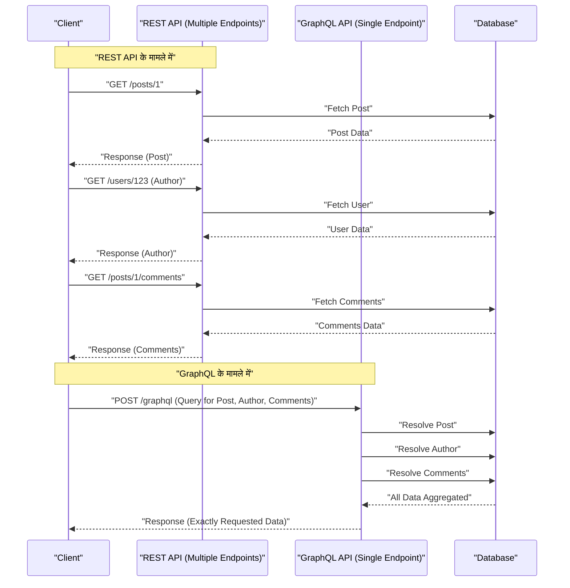

आधुनिक वेब विकास में, बैकएंड और फ्रंटएंड को जोड़ने वाले API आर्किटेक्चर का चुनाव एप्लिकेशन के प्रदर्शन, विकास दक्षता और रखरखाव पर भारी प्रभाव डालता है। ऐतिहासिक रूप से मानक के रूप में अपनाया गया **REST API**, अपने सरल और सहज डिज़ाइन सिद्धांतों के कारण व्यापक रूप से लोकप्रिय हुआ, लेकिन फ्रंटएंड के उन्नत और जटिल होने के साथ, विभिन्न चुनौतियाँ सामने आई हैं। इस लेख में, हम REST API की सीमाओं और उन्हें हल करने के लिए पेश किए गए **GraphQL** के अभिनव दृष्टिकोण पर आर्किटेक्चर, डेटा फ़ेचिंग और टाइप सेफ्टी के दृष्टिकोण से विस्तृत और गहन चर्चा करेंगे।

## 1. REST API के आर्किटेक्चर स्टाइल के सिद्धांत और इसकी सीमाएँ

**REST** (Representational State Transfer) एक आर्किटेक्चरल स्टाइल है जिसे 2000 में Roy Fielding ने प्रस्तावित किया था। यह HTTP प्रोटोकॉल की बुनियादी कार्यक्षमता का अधिकतम लाभ उठाते हुए संसाधन-उन्मुख (resource-oriented) डिज़ाइन का उपयोग करता है।

### REST के मुख्य डिज़ाइन सिद्धांत

REST API डिज़ाइन करते समय, निम्नलिखित बाधाओं को पूरा करना आदर्श माना जाता है (RESTful API)।

1. **क्लाइंट-सर्वर सेपरेशन** (Client-Server): यूजर इंटरफ़ेस से संबंधित चिंताओं और डेटा स्टोरेज से संबंधित चिंताओं को अलग करें, ताकि वे एक-दूसरे से स्वतंत्र रूप से विकसित हो सकें।
2. **स्टेटलेस** (Stateless): सर्वर क्लाइंट की सेशन स्थिति को नहीं रखता है, और प्रत्येक अनुरोध में स्वतंत्र रूप से प्रसंस्करण पूरा करने के लिए सभी जानकारी शामिल होनी चाहिए।
3. **कैशे योग्य** (Cacheable): नेटवर्क दक्षता में सुधार करने के लिए, सर्वर से प्रतिक्रिया को स्पष्ट रूप से इंगित करना चाहिए कि क्या इसे कैश किया जा सकता है।
4. **यूनिफ़ॉर्म इंटरफ़ेस** (Uniform Interface): संसाधनों की पहचान (URI), अभ्यावेदन के माध्यम से संसाधन हेरफेर, स्व-वर्णनात्मक संदेश, और HATEOAS (Hypermedia as the Engine of Application State) जैसे सिद्धांतों के आधार पर समग्र रूप से एक सुसंगत इंटरफ़ेस प्रदान करता है।
5. **लेयर्ड सिस्टम** (Layered System): क्लाइंट बिना इस बात की जानकारी के संचार कर सकता है कि वह सीधे सर्वर से जुड़ा है या किसी मध्यस्थ प्रॉक्सी या लोड बैलेंसर के माध्यम से।

इन सिद्धांतों के साथ, REST ने वेब के पैमाने पर एक बहुत मजबूत नींव बनाई। हालांकि, आज के विविध उपकरणों और जटिल UI आवश्यकताओं में, इसे नीचे वर्णित चुनौतियों का सामना करना पड़ता है।

## 2. ओवरफेचिंग और अंडरफेचिंग की समस्या

REST API की सबसे प्रमुख चुनौतियाँ **ओवरफेचिंग** (Overfetching) और **अंडरफेचिंग** (Underfetching) हैं। ये REST द्वारा "संसाधन" के आधार पर एक निश्चित डेटा संरचना वापस करने के कारण होते हैं।

### ओवरफेचिंग (Overfetching)

ओवरफेचिंग वह स्थिति है जहाँ सर्वर से क्लाइंट की आवश्यकता से अधिक डेटा भेजा जाता है।

उदाहरण के लिए, मान लें कि एक स्क्रीन है जो केवल उपयोगकर्ता का "नाम" और "आइकन चित्र" सूची में दिखाती है। REST API में `/users` एंडपॉइंट को हिट करने पर, अक्सर एक JSON वापस आता है जिसमें ईमेल पता, निर्माण तिथि, और विस्तृत प्रोफ़ाइल जानकारी जैसे भारी मात्रा में डेटा शामिल होता है जिसका उस स्क्रीन में बिल्कुल भी उपयोग नहीं किया जाता है। मोबाइल नेटवर्क जैसे सीमित बैंडविड्थ वाले वातावरण में, यह अनावश्यक डेटा स्थानांतरण प्रदर्शन में गिरावट का सीधा कारण है।

### अंडरफेचिंग (Underfetching) और N+1 अनुरोध

दूसरी ओर, अंडरफेचिंग तब होती है जब एक एंडपॉइंट से प्रतिक्रिया UI बनाने के लिए पर्याप्त डेटा प्रदान नहीं करती है, जिससे अतिरिक्त अनुरोधों की आवश्यकता होती है।

उदाहरण के लिए, मान लें कि आपको एक ब्लॉग पोस्ट के विवरण पृष्ठ पर "लेख का मुख्य भाग", "लेखक की जानकारी", और "लेख पर टिप्पणियों की सूची" प्रदर्शित करने की आवश्यकता है। REST API के साथ, आपको अक्सर नीचे दिए गए अनुसार कई एंडपॉइंट पर अनुरोध भेजने पड़ते हैं।

1. `/posts/1` के माध्यम से लेख डेटा प्राप्त करें
2. प्राप्त `author_id` का उपयोग करके `/users/{author_id}` के माध्यम से लेखक की जानकारी प्राप्त करें
3. लेख की टिप्पणियाँ प्राप्त करने के लिए `/posts/1/comments` पर अनुरोध करें

परिणामस्वरूप, नेटवर्क लेटेंसी जमा होती है, जिससे प्रारंभिक प्रदर्शन में देरी होती है। यही UI निर्माण में **N+1 अनुरोध समस्या** की ओर ले जाता है।

## 3. GraphQL क्या है? इसका अभिनव दृष्टिकोण

**GraphQL** एक क्वेरी भाषा है जिसे 2012 में Facebook (अब Meta) द्वारा विकसित किया गया था और 2015 में API के लिए ओपन-सोर्स किया गया था, साथ ही इसे निष्पादित करने के लिए एक सर्वर-साइड रनटाइम भी है।

### GraphQL के मूल सिद्धांत

1. **सिंगल एंडपॉइंट**: REST की तरह प्रति संसाधन कई URL (एंडपॉइंट) होने के बजाय, GraphQL आमतौर पर `/graphql` नामक केवल एक सिंगल एंडपॉइंट का उपयोग करता है।
2. **डिक्लेरेटिव डेटा फ़ेचिंग**: क्लाइंट सटीक रूप से क्वेरी के रूप में वर्णन करता है कि किस डेटा संरचना की आवश्यकता है और सर्वर से अनुरोध करता है। सर्वर एक JSON लौटाता है जो अनुरोधित संरचना से पूरी तरह मेल खाता है।
3. **मजबूत टाइपिंग (स्कीमा-संचालित)**: API विनिर्देश सख्ती से टाइप किए जाते हैं और GraphQL Schema Definition Language (SDL) का उपयोग करके परिभाषित किए जाते हैं।

यह क्लाइंट को "केवल वही डेटा प्राप्त करने की अनुमति देता है जिसकी उन्हें आवश्यकता है, उतनी ही मात्रा में", जो ओवरफेचिंग और अंडरफेचिंग को नाटकीय रूप से समाप्त करता है।

## 4. आर्किटेक्चर की तुलना (REST बनाम GraphQL)

नीचे दिया गया आरेख पहले बताए गए "लेख", "लेखक", और "टिप्पणियाँ" प्राप्त करते समय REST और GraphQL के अनुरोध प्रवाह के बीच के अंतर को दर्शाता है।



यह देखा जा सकता है कि जबकि REST के साथ क्लाइंट और सर्वर के बीच कई राउंड ट्रिप होती हैं, GraphQL एक ही अनुरोध में सभी आवश्यक डेटा संरचनाओं को हल करता है और वापस कर देता है।

## 5. स्कीमा-संचालित विकास और डेटा संरचना की तुलना

GraphQL की सबसे बड़ी विशेषताओं में से एक **स्कीमा-संचालित विकास** (Schema-Driven Development) है। फ्रंटएंड और बैकएंड इंजीनियर पहले एक GraphQL स्कीमा (SDL) पर सहमत होते हैं और उसे परिभाषित करते हैं। यह स्कीमा एक "अनुबंध" बन जाता है, जिससे दोनों पक्ष समानांतर में विकास के साथ आगे बढ़ सकते हैं।

### GraphQL स्कीमा परिभाषा (SDL) का उदाहरण

```graphql
# type एक ऑब्जेक्ट को परिभाषित करता है
type User {
  id: ID!
  name: String!
  email: String!
  avatarUrl: String
  posts: [Post!]!
}

type Comment {
  id: ID!
  body: String!
  author: User!
}

type Post {
  id: ID!
  title: String!
  content: String!
  author: User!
  comments: [Comment!]!
}

# क्वेरी का एंट्री पॉइंट
type Query {
  post(id: ID!): Post
  user(id: ID!): User
}
```

(`!` इंगित करता है कि यह अनिवार्य/गैर-शून्य (non-null) है)

### अनुरोध और प्रतिक्रिया की तुलना

**REST API के मामले में (कई JSON को संयोजित करने की आवश्यकता होती है)**

`/posts/1` की प्रतिक्रिया:
```json
{
  "id": "1",
  "title": "GraphQL का परिचय",
  "content": "GraphQL अद्भुत है...",
  "author_id": "123"
}
```
इस समय, हम वास्तव में केवल `author` का नाम जानना चाहते हैं, लेकिन REST के साथ, हम केवल `author_id` प्राप्त कर सकते हैं। इसके लिए हमें या तो अलग से उपयोगकर्ता विवरण प्राप्त करना होगा, या बैकएंड पक्ष पर एक जबरन संयोजित कस्टम एंडपॉइंट (जैसे: `/posts/1?include=author`) प्रदान करने की आवश्यकता होगी।

**GraphQL के मामले में**

क्लाइंट द्वारा भेजी गई क्वेरी:
```graphql
query GetPostDetails {
  post(id: "1") {
    title
    content
    author {
      name
    }
    comments {
      body
      author {
        name
      }
    }
  }
}
```

सर्वर से प्रतिक्रिया:
```json
{
  "data": {
    "post": {
      "title": "GraphQL का परिचय",
      "content": "GraphQL अद्भुत है...",
      "author": {
        "name": "राम कुमार"
      },
      "comments": [
        {
          "body": "यह बहुत उपयोगी था!",
          "author": {
            "name": "सीता शर्मा"
          }
        }
      ]
    }
  }
}
```
इस प्रकार, जो JSON अनुरोधित संरचना से पूरी तरह मेल खाता है वह एक ही अनुरोध में वापस आ जाता है। अनावश्यक फ़ील्ड (जैसे कि ईमेल) बिल्कुल शामिल नहीं हैं।

## 6. रिज़ॉल्वर का कार्यान्वयन और बैकएंड की भूमिका

GraphQL सर्वर क्लाइंट से क्वेरी को पार्स करता है और डेटा एकत्र करने के लिए स्कीमा के प्रत्येक फ़ील्ड के अनुरूप **रिज़ॉल्वर** (Resolver) नामक फ़ंक्शन को निष्पादित करता है।

आइए Node.js (Apollo Server आदि) में रिज़ॉल्वर कार्यान्वयन का एक उदाहरण देखें।

```typescript
const resolvers = {
  Query: {
    // post क्वेरी के लिए रिज़ॉल्वर
    post: async (parent, args, context) => {
      return await context.db.Post.findById(args.id);
    },
  },
  Post: {
    // Post ऑब्जेक्ट के author फ़ील्ड के लिए रिज़ॉल्वर
    author: async (parent, args, context) => {
      // parent में पैरेंट का Post डेटा होता है
      return await context.db.User.findById(parent.author_id);
    },
    comments: async (parent, args, context) => {
      return await context.db.Comment.find({ postId: parent.id });
    }
  },
  Comment: {
    author: async (parent, args, context) => {
      return await context.db.User.findById(parent.author_id);
    }
  }
};
```

इस तरह, रिज़ॉल्वर को डेटा ग्राफ़ का अनुसरण करते हुए क्रमिक रूप से कॉल किया जाता है। बैकएंड लागू करने वाले "किस URL पर क्या लौटाना है" के बारे में सोचने के बजाय "इस प्रकार के इस फ़ील्ड में डेटा कैसे रखा जाए" पर ध्यान केंद्रित कर सकते हैं।

## 7. बैकएंड की N+1 समस्या और उसका समाधान (DataLoader)

उपर्युक्त रिज़ॉल्वर कार्यान्वयन में एक गंभीर प्रदर्शन दोष छिपा है। यह बैकएंड पक्ष पर **N+1 समस्या** है।

उदाहरण के लिए, मान लें कि आप 10 लेखों की सूची प्राप्त करते हैं और प्रत्येक के लिए `author` प्राप्त करने के लिए एक क्वेरी चलाते हैं।
1. 10 लेख प्राप्त करने की क्वेरी एक बार चलती है (`SELECT * FROM posts LIMIT 10`)
2. प्रत्येक लेख के लिए `Post.author` रिज़ॉल्वर को बुलाया जाता है।
3. परिणामस्वरूप, लेखक को लाने की क्वेरी 10 बार चलती है (`SELECT * FROM users WHERE id = ?` × 10)

यदि यह 100 या 1000 आइटम हो जाता है, तो यह डेटाबेस पर भारी भार डालेगा। इसे Facebook द्वारा विकसित **DataLoader** नामक पैटर्न (लाइब्रेरी) द्वारा हल किया जाता है।

### DataLoader का उपयोग करके बैचिंग और कैशिंग

DataLoader जावास्क्रिप्ट के इवेंट लूप (माइक्रोटास्क कतार) का लाभ उठाता है ताकि एक ही टिक में होने वाले प्रमुख अधिग्रहण अनुरोधों को बैच किया जा सके और उन्हें एक ही क्वेरी में जोड़ा जा सके।

```typescript
import DataLoader from 'dataloader';

// DataLoader का इंस्टेंटिएशन। बैच फ़ंक्शन को परिभाषित करता है।
const userLoader = new DataLoader(async (userIds) => {
  // [1, 2, 3] जैसे ID का एरे पास किया जाता है
  // एक ही IN क्वेरी में एक साथ प्राप्त किया जाता है
  const users = await db.User.find({ id: { $in: userIds } });
  
  // userIds के क्रम के अनुसार एरे को वापस करना आवश्यक है
  const userMap = users.reduce((acc, user) => {
    acc[user.id] = user;
    return acc;
  }, {});
  return userIds.map(id => userMap[id] || null);
});

// रिज़ॉल्वर में उपयोग
const resolvers = {
  Post: {
    author: (parent, args, context) => {
      // id निर्दिष्ट करके लोड करता है, लेकिन बैकग्राउंड में बैच किया जाता है
      return context.loaders.userLoader.load(parent.author_id);
    }
  }
};
```

इसके साथ, लेखक को प्राप्त करने की क्वेरी को `SELECT * FROM users WHERE id IN (?, ?, ...)` की केवल 1 निष्पादन के लिए अनुकूलित किया गया है, यहां तक कि पिछले उदाहरण में भी। उत्पादन वातावरण में GraphQL को स्केल करने के लिए DataLoader का परिचय लगभग आवश्यक है।

## 8. GraphQL Code Generator द्वारा प्रदान की जाने वाली अंतिम टाइप सेफ्टी

GraphQL की टाइप प्रणाली (स्कीमा) फ्रंटएंड विकास के लिए अत्यधिक लाभ लाती है। **GraphQL Code Generator** जैसे टूल का उपयोग करके, आप स्कीमा से टाइपस्क्रिप्ट प्रकार की परिभाषाएँ और डेटा फ़ेचिंग (React के मामले में) के लिए कस्टम हुक स्वचालित रूप से उत्पन्न कर सकते हैं।

REST API के साथ Swagger (OpenAPI) से प्रकार उत्पन्न करना भी संभव है, लेकिन GraphQL के मामले में, यह इस मायने में कहीं बेहतर है कि यह क्लाइंट द्वारा "क्वेरी में निर्दिष्ट किए गए आकार" में प्रकार की परिभाषाएँ उत्पन्न कर सकता है।

1. **स्कीमा फ़ाइल** और **क्लाइंट द्वारा लिखी गई क्वेरी स्ट्रिंग (.graphql फ़ाइल)** को पढ़ें।
2. GraphQL Code Gen TypeScript प्रकार (इंटरफ़ेस) उत्पन्न करता है जो उस क्वेरी की प्रतिक्रिया से पूरी तरह मेल खाता है।

```typescript
// ऑटो-जेनरेटेड हुक्स के उपयोग का उदाहरण (Apollo Client)
import { useGetPostDetailsQuery } from '../generated/graphql';

const PostPage = ({ postId }: { postId: string }) => {
  const { data, loading, error } = useGetPostDetailsQuery({
    variables: { id: postId }
  });

  if (loading) return <p>Loading...</p>;
  if (error) return <p>Error</p>;
  
  // data का प्रकार ठीक वैसे ही अनुमित होता है जैसा कि क्वेरी में निर्दिष्ट किया गया है!
  // data.post.title को string प्रकार के रूप में पहचाना जाता है
  // यदि आप किसी ऐसे फ़ील्ड (जैसे email) को एक्सेस करने का प्रयास करते हैं जो क्वेरी में शामिल नहीं है, तो TS संकलन त्रुटि होगी
  return (
    <div>
      <h1>{data?.post?.title}</h1>
      <p>Author: {data?.post?.author.name}</p>
    </div>
  );
};
```

इससे उन बगों को रोकना लगभग संभव हो जाता है जैसे "गुण के अपरिभाषित (undefined) होने के कारण रनटाइम पर क्रैश होना" स्थिर विश्लेषण (संकलन समय) पर, जो फ्रंटएंड के DX (डेवलपर अनुभव) में काफी सुधार करता है।

## 9. उन्नत कैशिंग रणनीति: Apollo Client और Relay

REST API के लाभों में से एक यह था कि मानक HTTP कैशिंग (ETag, Cache-Control, आदि) का उपयोग करना आसान था। सिद्धांत रूप में, GraphQL सभी POST अनुरोधों के लिए एक ही एंडपॉइंट का उपयोग करता है, जिससे HTTP-स्तर की कैशिंग मुश्किल हो जाती है (यद्यपि Persisted Queries जैसी तकनीकें हैं)।

इसके बजाय, GraphQL पारिस्थितिकी तंत्र ने शक्तिशाली **क्लाइंट-साइड कैशिंग** (सामान्यीकृत कैशिंग) के साथ क्लाइंट लाइब्रेरी विकसित की हैं। प्रतिनिधि **Apollo Client** और **Relay** हैं।

### सामान्यीकृत कैश (Normalized Cache) क्या है?

Apollo Client जैसे स्मार्ट GraphQL क्लाइंट प्रतिक्रिया के रूप में प्राप्त JSON के ट्री स्ट्रक्चर को सहेजते नहीं हैं, बल्कि उन्हें फ्लैट रिकॉर्ड स्टोर के रूप में सहेजते हैं।
प्रत्येक ऑब्जेक्ट को `__typename` (प्रकार का नाम) और `id` (अद्वितीय पहचानकर्ता) के संयोजन (जैसे: `Post:1`) को एक कुंजी के रूप में सहेज कर (सामान्यीकृत) किया जाता है।

यह तंत्र अद्भुत लाभ प्रदान करता है।
उदाहरण के लिए, मान लें कि "पोस्ट सूची" और "पोस्ट विवरण" के लिए एक क्वेरी थी।
1. उपयोगकर्ता "पोस्ट विवरण" स्क्रीन खोलता है और पोस्ट का शीर्षक (Mutation) संपादित करता है।
2. सर्वर एक प्रतिक्रिया (`id` और `title`) लौटाता है जिसमें नया शीर्षक शामिल है।
3. Apollo Client स्टोर में `Post:1` के डेटा को स्वचालित रूप से अपडेट करता है।
4. तब, "पोस्ट सूची" स्क्रीन पर प्रदर्शित वही `Post:1` जानकारी **स्वचालित रूप से फिर से प्रस्तुत हो जाएगी और नवीनतम स्थिति के साथ समन्वयित हो जाएगी**।

इंजीनियरों को अब मैन्युअल रूप से स्थिति प्रबंधन (जैसे [Redux](https://kenji.blog/hi/p/state-management-history-redux-context-recoil-zustand/)) को अपडेट करने के लिए कोड लिखने की आवश्यकता नहीं है, और संपूर्ण UI में डेटा की स्थिरता लाइब्रेरी द्वारा सुनिश्चित की जाती है। यह वह क्षेत्र है जहाँ जटिल SPA (Single Page Application) बनाने में REST पर GraphQL का निर्णायक लाभ है।

## 10. क्या GraphQL को अपनाना चाहिए? (ट्रेड-ऑफ़ और निष्कर्ष)

अब तक, हमने GraphQL के शक्तिशाली लाभों का उल्लेख किया है, लेकिन यह कभी भी "REST से हमेशा बेहतर रहने वाली चांदी की गोली (silver bullet)" नहीं है।

**GraphQL के नुकसान / अपनाने में बाधाएं**
* **सीखने की लागत (Learning Cost)**: बैकएंड और फ्रंटएंड दोनों में प्रतिमान बदलाव (paradigm shift) की आवश्यकता होती है, और सीखने का एक बड़ा منحنی (curve) है।
* **जटिल बैकएंड कार्यान्वयन**: सर्वर-साइड रक्षात्मक कार्यान्वयन आवश्यक हैं, जैसे N+1 समस्याओं से बचने के लिए DataLoader को डिज़ाइन करना, जटिल प्रश्नों के लिए प्रदर्शन ट्यूनिंग (पुनरावर्ती और गहरी पदानुक्रमित अनुरोध), और क्वेरी जटिलता (Complexity) के आधार पर दर सीमा (rate limits)।
* **सरल API के लिए अत्यधिक**: यदि डेटा अपडेट और पुनर्प्राप्ति आवश्यकताएं सरल हैं, और UI जटिलता कम है तो एक छोटे पैमाने के एप्लिकेशन के लिए REST की सादगी जीत जाती है।

### निष्कर्ष

REST API अभी भी एक बेहतरीन आर्किटेक्चर है और सार्वजनिक API और सेवा-से-सेवा संचार (माइक्रोसर्विसेस) आदि के लिए एक मजबूत विकल्प बना रहेगा।

दूसरी ओर, अत्यधिक संवादात्मक और जटिल डेटा आवश्यकताओं वाले आधुनिक वेब और मोबाइल एप्लिकेशन में, **GraphQL** एक असाधारण DX और UX प्रदान करता है जैसे कि "ओवरफेचिंग/अंडरफेचिंग का उन्मूलन", "शक्तिशाली प्रकार के अनुमान के माध्यम से सुरक्षित फ्रंटएंड विकास", और "सामान्यीकृत कैशिंग के माध्यम से राज्य प्रबंधन का स्वचालन"।

विकास दल के कौशल सेट, उत्पाद की जटिलता और भविष्य के पैमाने का सावधानीपूर्वक मूल्यांकन करके सर्वोत्तम API आर्किटेक्चर का चयन करना आधुनिक सॉफ्टवेयर विकास में सबसे महत्वपूर्ण निर्णयों में से एक होगा।
