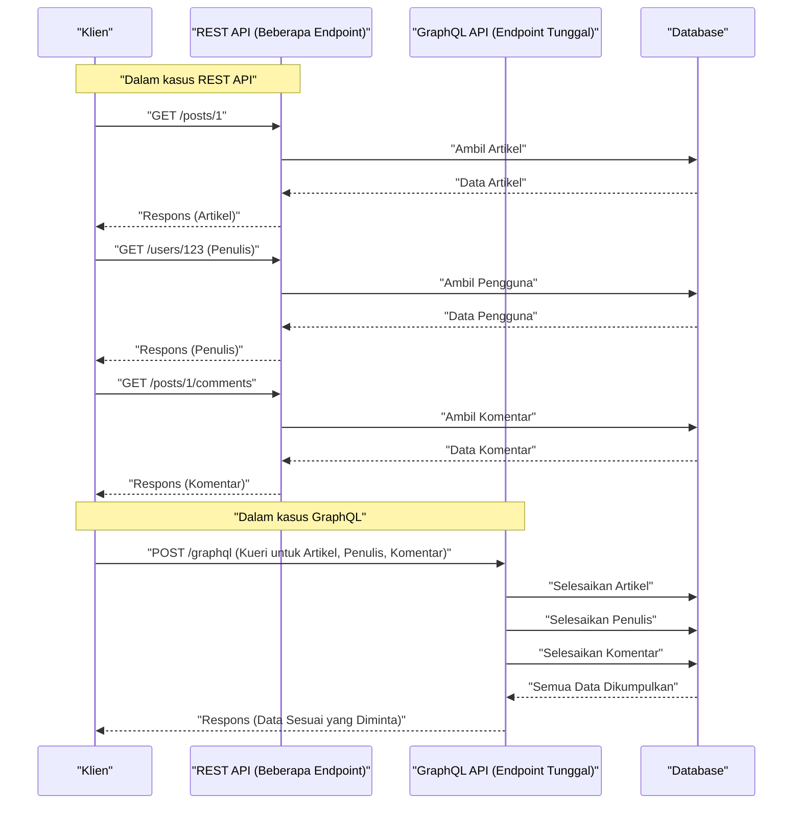

Dalam pengembangan web modern, pilihan arsitektur API yang menghubungkan backend dan frontend berdampak besar pada performa aplikasi, efisiensi pengembangan, dan pemeliharaan. **REST API** , yang secara historis diadopsi sebagai standar, telah digunakan secara luas karena prinsip desainnya yang sederhana dan intuitif, tetapi dengan semakin canggih dan kompleksnya frontend, berbagai masalah mulai bermunculan. Artikel ini akan menjelaskan secara rinci dan menyeluruh batasan dari REST API dan pendekatan inovatif dari **GraphQL** yang muncul untuk menyelesaikannya, dari sudut pandang arsitektur, pengambilan data (data fetching), dan keamanan tipe (type safety).

## 1. Prinsip Gaya Arsitektur REST API dan Keterbatasannya

**REST** (Representational State Transfer) adalah gaya arsitektur yang diusulkan oleh Roy Fielding pada tahun 2000. Gaya ini memaksimalkan fitur dasar dari protokol HTTP dan berfokus pada desain berorientasi sumber daya.

### Prinsip Desain Utama REST

Saat merancang REST API, sangat ideal untuk memenuhi batasan-batasan berikut (RESTful API).

1. **Pemisahan Klien dan Server** (Client-Server): Memisahkan perhatian mengenai antarmuka pengguna dari penyimpanan data, sehingga keduanya dapat berkembang secara independen.
2. **Tanpa Status** (Stateless): Server tidak menyimpan status sesi klien, dan setiap permintaan harus berisi semua informasi yang diperlukan untuk menyelesaikan pemrosesan secara independen.
3. **Dapat Di-cache** (Cacheable): Untuk meningkatkan efisiensi jaringan, respons dari server harus secara eksplisit menyatakan apakah respons tersebut dapat di-cache atau tidak.
4. **Antarmuka Seragam** (Uniform Interface): Menyediakan antarmuka yang konsisten secara keseluruhan, berdasarkan prinsip-prinsip seperti identifikasi sumber daya (URI), manipulasi sumber daya melalui representasi, pesan yang mendeskripsikan diri sendiri, dan HATEOAS (Hypermedia as the Engine of Application State).
5. **Sistem Berlapis** (Layered System): Klien dapat berkomunikasi tanpa perlu menyadari apakah ia terhubung langsung ke server atau melalui proxy maupun load balancer perantara.

Prinsip-prinsip ini telah memungkinkan REST untuk membangun fondasi yang sangat kuat dalam skala Web. Namun, dalam menghadapi beragam perangkat modern dan persyaratan UI yang kompleks, arsitektur ini menghadapi tantangan seperti yang dijelaskan di bawah ini.

## 2. Masalah Overfetching dan Underfetching

Tantangan paling menonjol dari REST API adalah **Overfetching** dan **Underfetching**. Hal ini disebabkan oleh kenyataan bahwa REST mengembalikan struktur data tetap berdasarkan unit "sumber daya" (resource).

### Overfetching

Overfetching adalah fenomena di mana lebih banyak data yang dikirim dari server daripada yang sebenarnya dibutuhkan oleh klien.

Misalnya, ada layar yang hanya menampilkan daftar "nama" dan "gambar ikon" pengguna. Ketika mengakses endpoint `/users` dengan REST API, dalam banyak kasus, JSON yang dikembalikan akan berisi sejumlah besar data yang sama sekali tidak digunakan pada layar tersebut, seperti alamat email, waktu pembuatan, dan informasi profil terperinci. Di lingkungan dengan bandwidth terbatas seperti jaringan seluler, transfer data yang sia-sia ini menjadi penyebab langsung dari penurunan performa.

### Underfetching dan Permintaan N+1

Di sisi lain, underfetching adalah fenomena di mana respons dari satu endpoint saja tidak menyediakan data yang cukup untuk membangun UI, sehingga diperlukan permintaan tambahan.

Misalnya, pada halaman detail sebuah artikel blog, Anda perlu menampilkan "isi artikel", "informasi penulis", dan "daftar komentar pada artikel". Dalam REST API, Anda sering kali harus mengirim permintaan ke beberapa endpoint seperti berikut ini:

1. Mengambil data artikel melalui `/posts/1`
2. Mengambil informasi penulis melalui `/users/{author_id}` menggunakan `author_id` yang diperoleh sebelumnya
3. Mengirim permintaan ke `/posts/1/comments` untuk mengambil komentar pada artikel

Akibatnya, latensi jaringan akan menumpuk dan tampilan awal menjadi tertunda. Hal ini mengarah pada masalah **Permintaan N+1** (N+1 Request Problem) dalam pembangunan UI.

## 3. Apa itu GraphQL? Pendekatan Inovatifnya

**GraphQL** adalah bahasa kueri untuk API dan runtime sisi server untuk mengeksekusinya, yang dikembangkan oleh Facebook (sekarang Meta) pada tahun 2012 dan dijadikan open source pada tahun 2015.

### Konsep Inti GraphQL

1. **Endpoint Tunggal**: Alih-alih menyediakan beberapa URL (endpoint) untuk setiap sumber daya seperti REST, GraphQL biasanya hanya menggunakan satu endpoint yaitu `/graphql`.
2. **Pengambilan Data Deklaratif**: Klien mendeskripsikan dengan tepat struktur data apa yang dibutuhkan sebagai sebuah kueri dan memintanya dari server. Server mengembalikan JSON yang benar-benar sesuai dengan struktur yang diminta.
3. **Pengetikan Kuat (Berbasis Skema)**: Spesifikasi API didefinisikan dengan pengetikan yang ketat menggunakan GraphQL Schema Definition Language (SDL).

Hal ini memungkinkan klien untuk mengambil "hanya data yang dibutuhkan, dan sebanyak yang dibutuhkan", yang secara dramatis mengatasi masalah overfetching dan underfetching.

## 4. Perbandingan Arsitektur (REST vs GraphQL)

Diagram berikut menunjukkan perbedaan alur permintaan antara REST dan GraphQL ketika mengambil "artikel", "penulis", dan "komentar" seperti yang disebutkan sebelumnya.



Anda dapat melihat bahwa REST membutuhkan beberapa perjalanan bolak-balik (round trip) antara klien dan server, sementara GraphQL menyelesaikan dan mengembalikan semua struktur data yang diperlukan dalam satu permintaan.

## 5. Pengembangan Berbasis Skema dan Perbandingan Struktur Data

Salah satu fitur terbesar dari GraphQL adalah **Pengembangan Berbasis Skema** (Schema-Driven Development). Insinyur frontend dan backend pertama-tama menyepakati dan mendefinisikan skema GraphQL (SDL). Skema ini bertindak sebagai "kontrak", memungkinkan kedua belah pihak untuk melanjutkan pengembangan secara paralel.

### Contoh Definisi Skema GraphQL (SDL)

```graphql
# type mendefinisikan sebuah objek
type User {
  id: ID!
  name: String!
  email: String!
  avatarUrl: String
  posts: [Post!]!
}

type Comment {
  id: ID!
  body: String!
  author: User!
}

type Post {
  id: ID!
  title: String!
  content: String!
  author: User!
  comments: [Comment!]!
}

# Titik masuk kueri
type Query {
  post(id: ID!): Post
  user(id: ID!): User
}
```

( `!` menunjukkan bahwa kolom tersebut wajib/bukan null)

### Perbandingan Permintaan dan Respons

**Dalam Kasus REST API (Perlu menggabungkan beberapa JSON)**

Respons dari `/posts/1`:
```json
{
  "id": "1",
  "title": "Pengenalan GraphQL",
  "content": "GraphQL itu luar biasa...",
  "author_id": "123"
}
```
Pada titik ini, meskipun Anda sebenarnya hanya ingin mengetahui nama dari `author`, dengan REST Anda hanya mendapatkan `author_id`. Anda perlu mengambil detail pengguna secara terpisah, atau meminta backend untuk menyediakan endpoint khusus yang menggabungkan data secara paksa (contoh: `/posts/1?include=author`).

**Dalam Kasus GraphQL**

Kueri yang dikirim oleh klien:
```graphql
query GetPostDetails {
  post(id: "1") {
    title
    content
    author {
      name
    }
    comments {
      body
      author {
        name
      }
    }
  }
}
```

Respons dari server:
```json
{
  "data": {
    "post": {
      "title": "Pengenalan GraphQL",
      "content": "GraphQL itu luar biasa...",
      "author": {
        "name": "Taro Yamada"
      },
      "comments": [
        {
          "body": "Sangat bermanfaat!",
          "author": {
            "name": "Hanako Sato"
          }
        }
      ]
    }
  }
}
```
Seperti ini, JSON yang benar-benar cocok dengan struktur yang diminta akan dikembalikan dalam satu permintaan. Kolom yang tidak perlu (seperti email) tidak akan disertakan sama sekali.

## 6. Implementasi Resolver dan Peran Backend

Server GraphQL menganalisis kueri dari klien dan mengumpulkan data dengan menjalankan fungsi yang disebut **Resolver**, yang sesuai dengan setiap kolom dalam skema.

Mari kita lihat contoh implementasi resolver pada Node.js (seperti Apollo Server).

```typescript
const resolvers = {
  Query: {
    // Resolver untuk kueri post
    post: async (parent, args, context) => {
      return await context.db.Post.findById(args.id);
    },
  },
  Post: {
    // Resolver untuk kolom author pada objek Post
    author: async (parent, args, context) => {
      // parent berisi data Post dari induk
      return await context.db.User.findById(parent.author_id);
    },
    comments: async (parent, args, context) => {
      return await context.db.Comment.find({ postId: parent.id });
    }
  },
  Comment: {
    author: async (parent, args, context) => {
      return await context.db.User.findById(parent.author_id);
    }
  }
};
```

Dengan cara ini, resolver dipanggil secara berantai seolah-olah menelusuri grafik data. Implementator backend tidak perlu memikirkan "apa yang harus dikembalikan pada URL mana", melainkan dapat berkonsentrasi pada "bagaimana cara memasukkan data ke kolom ini untuk tipe ini".

## 7. Masalah N+1 di Backend dan Solusinya (DataLoader)

Implementasi resolver yang disebutkan sebelumnya menyimpan kekurangan performa yang fatal. Hal tersebut adalah **Masalah N+1** di sisi backend.

Misalnya, bayangkan Anda mengambil daftar berisi 10 artikel dan mengeksekusi kueri untuk mengambil masing-masing `author`.
1. Kueri untuk mengambil 10 artikel dijalankan sebanyak 1 kali ( `SELECT * FROM posts LIMIT 10` )
2. Resolver `Post.author` dipanggil untuk setiap artikel.
3. Akibatnya, kueri untuk mengambil penulis dijalankan sebanyak 10 kali ( `SELECT * FROM users WHERE id = ?` × 10 )

Jika ini menjadi 100 atau 1000 item, maka beban pada database akan sangat besar. Untuk menyelesaikan hal ini, sebuah pola (pustaka) bernama **DataLoader** yang dikembangkan oleh Facebook digunakan.

### Pemrosesan Batch dan Caching dengan DataLoader

DataLoader memanfaatkan siklus peristiwa (antrean mikrotugas / microtask queue) di JavaScript untuk menggabungkan permintaan pengambilan kunci yang terjadi dalam satu ketukan (tick) menjadi satu kueri batch.

```typescript
import DataLoader from 'dataloader';

// Instansiasi DataLoader. Mendefinisikan fungsi batch.
const userLoader = new DataLoader(async (userIds) => {
  // Array ID seperti [1, 2, 3] dilemparkan ke sini
  // Mengambil semuanya sekaligus dengan 1 kueri IN
  const users = await db.User.find({ id: { $in: userIds } });
  
  // Perlu mengembalikan array yang sesuai dengan urutan userIds
  const userMap = users.reduce((acc, user) => {
    acc[user.id] = user;
    return acc;
  }, {});
  return userIds.map(id => userMap[id] || null);
});

// Penggunaan pada resolver
const resolvers = {
  Post: {
    author: (parent, args, context) => {
      // Memuat dengan menentukan id, tetapi akan di-batch di balik layar
      return context.loaders.userLoader.load(parent.author_id);
    }
  }
};
```

Dengan ini, bahkan pada contoh sebelumnya, kueri untuk mengambil penulis dioptimalkan menjadi hanya 1 kali eksekusi dari `SELECT * FROM users WHERE id IN (?, ?, ...)`. Untuk membuat GraphQL diskalakan di lingkungan produksi, pengenalan DataLoader bisa dibilang sangat wajib.

## 8. Keamanan Tipe Ekstrem yang Dihadirkan oleh GraphQL Code Generator

Sistem tipe (skema) GraphQL membawa manfaat yang luar biasa untuk pengembangan frontend. Dengan menggunakan alat seperti **GraphQL Code Generator**, Anda dapat secara otomatis menghasilkan definisi tipe TypeScript atau custom Hooks untuk pengambilan data (dalam kasus React) dari skema tersebut.

Dalam REST API, Anda juga mungkin menghasilkan tipe dari Swagger (OpenAPI), tetapi dalam GraphQL hal ini jauh lebih unggul karena ia bahkan dapat menghasilkan definisi tipe untuk "bentuk yang ditentukan dalam kueri" oleh klien.

1. Memuat **file skema** dan **string kueri yang ditulis oleh klien (file .graphql)**.
2. GraphQL Code Gen akan menghasilkan tipe (Interface) TypeScript yang benar-benar cocok dengan respons dari kueri tersebut.

```typescript
// Contoh penggunaan Hooks yang dihasilkan secara otomatis (Apollo Client)
import { useGetPostDetailsQuery } from '../generated/graphql';

const PostPage = ({ postId }: { postId: string }) => {
  const { data, loading, error } = useGetPostDetailsQuery({
    variables: { id: postId }
  });

  if (loading) return <p>Loading...</p>;
  if (error) return <p>Error</p>;
  
  // Tipe dari data disimpulkan secara ketat sesuai dengan yang ditentukan dalam kueri!
  // data.post.title dikenali sebagai tipe string
  // Jika mencoba mengakses kolom yang tidak disertakan dalam kueri (seperti email), maka akan terjadi error kompilasi TS
  return (
    <div>
      <h1>{data?.post?.title}</h1>
      <p>Author: {data?.post?.author.name}</p>
    </div>
  );
};
```

Dengan demikian, hal ini memungkinkan Anda untuk hampir sepenuhnya mencegah bug seperti "crash karena properti undefined pada saat runtime" melalui analisis statis (saat kompilasi), dan meningkatkan DX (Developer Experience) di frontend secara drastis.

## 9. Strategi Caching Lanjutan: Apollo Client dan Relay

Salah satu kelebihan dari REST API adalah kemudahan dalam memanfaatkan caching HTTP standar (ETag, Cache-Control, dll.). Karena GraphQL pada prinsipnya menggunakan satu endpoint dengan permintaan POST untuk semuanya, caching di level HTTP menjadi sulit (meskipun ada metode seperti Persisted Queries).

Sebagai gantinya, pustaka klien dengan **Cache Sisi Klien** (Cache Ternormalisasi) yang kuat telah berkembang dalam ekosistem GraphQL. Contoh yang paling representatif adalah **Apollo Client** dan **Relay**.

### Apa itu Cache Ternormalisasi (Normalized Cache)?

Klien GraphQL cerdas seperti Apollo Client tidak sekadar menyimpan struktur pohon (tree structure) JSON yang diterima sebagai respons apa adanya, melainkan menyimpannya sebagai penyimpan record yang datar.

Setiap objek disimpan (dinormalisasi) menggunakan kombinasi `__typename` (nama tipe) dan `id` (pengidentifikasi unik) sebagai kunci (contoh: `Post:1`).

Mekanisme ini memberikan manfaat yang menakjubkan.

Misalnya, Anda memiliki kueri untuk "Daftar Postingan" dan kueri untuk "Detail Postingan".

1. Anggaplah pengguna membuka layar "Detail Postingan" dan mengedit (Mutation) judul postingan.
2. Server mengembalikan respons (berisi `id` dan `title`) dengan judul yang baru.
3. Apollo Client secara otomatis memperbarui data `Post:1` di dalam penyimpanannya (store).
4. Kemudian, informasi `Post:1` yang sama yang ditampilkan pada layar "Daftar Postingan" juga **dirender ulang secara otomatis dan disinkronkan ke status terbaru**.

Insinyur tidak perlu lagi menulis kode untuk memperbarui manajemen status secara manual (seperti dengan [Redux](https://kenji.blog/id/p/state-management-history-redux-context-recoil-zustand/)), dan konsistensi data di seluruh UI akan dijamin oleh pustaka. Inilah bagian di mana GraphQL memiliki keunggulan mutlak dibandingkan REST dalam membangun SPA (Single Page Application) yang kompleks.

### Relay - Klien GraphQL Terbaik Kebanggaan Facebook

**Relay**, yang dibuat oleh Facebook selaku pengembang React, menggunakan pendekatan yang bahkan lebih ketat dan berfokus pada performa daripada Apollo.

Data yang dibutuhkan untuk setiap komponen didefinisikan sebagai sebuah **Fragment**, dan komponen induk menggabungkannya lalu mengirimkannya sebagai satu kueri raksasa ke server. Karena dependensi data dienkapsulasi pada level komponen, masalah seperti "kolom yang tidak diperlukan tetap ada di dalam kueri meskipun komponennya telah dihapus" dapat sepenuhnya dihilangkan, sehingga memungkinkan realisasi dari arsitektur yang sangat canggih.

## 10. Haruskah Mengadopsi GraphQL? (Pertukaran dan Kesimpulan)

Sejauh ini saya telah memaparkan manfaat kuat dari GraphQL, tetapi ia sama sekali bukan "peluru perak yang selalu lebih baik daripada REST".

**Kekurangan GraphQL / Hambatan Adopsi**

* **Biaya Pembelajaran**: Baik backend maupun frontend memerlukan pergeseran paradigma, sehingga ada kurva pembelajaran yang harus dihadapi.
* **Implementasi Backend yang Kompleks**: Implementasi defensif di sisi server adalah suatu keharusan, seperti desain DataLoader untuk menghindari masalah N+1, penyesuaian performa (performance tuning) untuk kueri yang kompleks (permintaan rekursif dan berhierarki dalam), serta pembatasan rasio (rate limiting) berdasarkan Kompleksitas (Complexity) dari kueri.
* **Berlebihan untuk API Sederhana**: Jika aplikasi berukuran kecil dengan persyaratan pembaruan dan pengambilan data yang sederhana, serta kompleksitas UI yang rendah, maka kesederhanaan REST akan lebih unggul.

### Ringkasan

REST API masih merupakan arsitektur yang luar biasa dan akan terus menjadi pilihan yang kuat untuk API publik maupun komunikasi antar layanan (layanan mikro / microservices).

Di sisi lain, pada aplikasi web dan seluler modern yang sangat interaktif dan memiliki persyaratan data yang kompleks, **GraphQL** memberikan DX (Pengalaman Pengembang) dan UX (Pengalaman Pengguna) yang luar biasa melalui "Pemberantasan overfetching/underfetching", "Pengembangan frontend yang aman melalui inferensi tipe yang kuat", dan "Otomatisasi manajemen status dengan cache ternormalisasi".

Mengevaluasi secara cermat keahlian tim pengembang, kompleksitas produk, serta skala di masa depan untuk memilih arsitektur API yang paling optimal, akan menjadi salah satu keputusan terpenting dalam pengembangan perangkat lunak modern.
