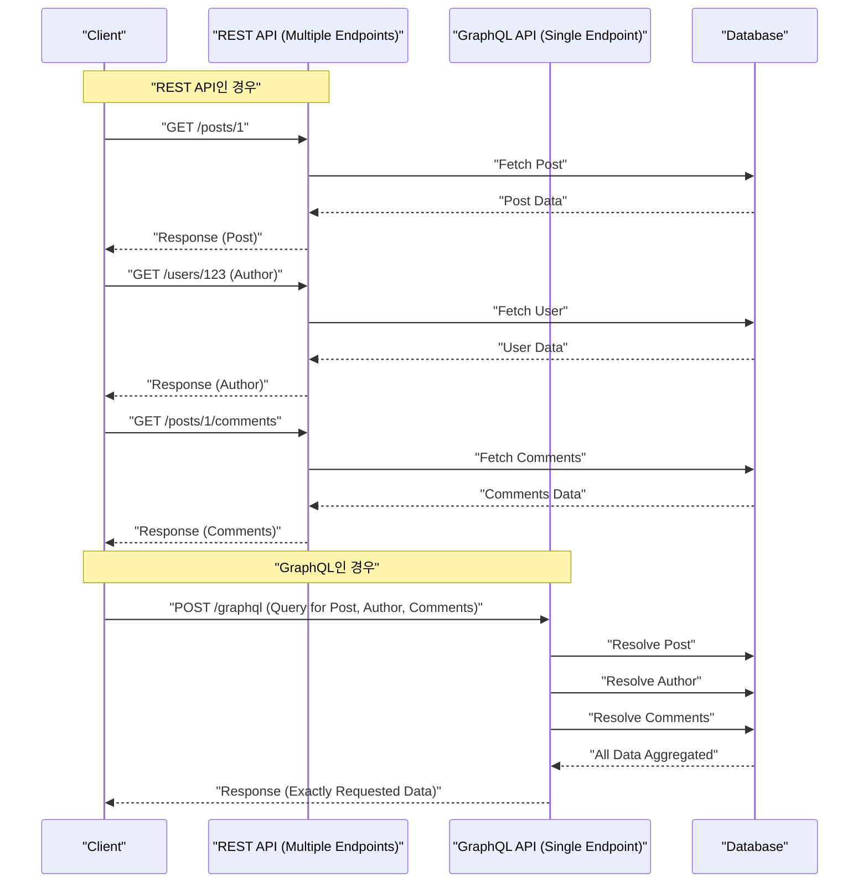

현대의 Web 개발에서 백엔드와 프론트엔드를 연결하는 API 아키텍처의 선택은 애플리케이션의 성능, 개발 효율, 그리고 유지 보수성에 막대한 영향을 미칩니다. 역사적으로 표준으로 채택되어 온 **REST API** 는 단순하고 직관적인 설계 원칙으로 널리 보급되었으나, 프론트엔드의 고도화 및 복잡화에 따라 다양한 과제가 표면화되었습니다. 본 기사에서는 REST API가 안고 있는 한계와 이를 해결하기 위해 등장한 **GraphQL** 의 혁신적인 접근 방식을 아키텍처, 데이터 페칭, 타입 안정성의 관점에서 상세하고 철저하게 해설합니다.

## 1. REST API의 아키텍처 스타일 원칙과 그 한계

**REST** (Representational State Transfer)는 Roy Fielding이 2000년에 제창한 아키텍처 스타일입니다. HTTP 프로토콜의 기본 기능을 최대한 활용하여 리소스 지향적인 설계를 수행합니다.

### REST의 주요 설계 원칙

REST API를 설계할 때, 다음의 제약을 충족하는 것이 이상적입니다 (RESTful API).

1. **클라이언트-서버 분리** (Client-Server): 사용자 인터페이스에 관한 관심사와 데이터 스토리지에 관한 관심사를 분리하여, 서로 독립적으로 진화할 수 있도록 합니다.
2. **무상태성** (Stateless): 서버는 클라이언트의 세션 상태를 유지하지 않으며, 각 요청은 독립적으로 처리를 완결하기 위한 모든 정보를 포함하고 있어야 합니다.
3. **캐시 가능성** (Cacheable): 네트워크 효율을 높이기 위해 서버의 응답은 캐시 가능 여부를 명시해야 합니다.
4. **통일된 인터페이스** (Uniform Interface): 리소스 식별 (URI), 표현을 통한 리소스 조작, 자기 기술적 메시지, HATEOAS (Hypermedia as the Engine of Application State) 등의 원칙을 기반으로 전체적으로 일관된 인터페이스를 제공합니다.
5. **계층화 시스템** (Layered System): 클라이언트는 서버에 직접 연결되어 있는지, 중간의 프록시나 로드 밸런서를 거치고 있는지 의식하지 않고 통신할 수 있습니다.

이러한 원칙으로 인해, REST는 Web 스케일에서 매우 견고한 기반을 구축했습니다. 하지만 현대의 다양한 기기나 복잡한 UI 요구사항에 있어서는 아래에 서술할 과제에 직면하고 있습니다.

## 2. 오버페칭과 언더페칭 문제

REST API의 가장 두드러진 과제는 **오버페칭** (Overfetching)과 **언더페칭** (Underfetching)입니다. 이는 REST가 "리소스" 단위로 고정된 데이터 구조를 반환하는 데 기인합니다.

### 오버페칭 (Overfetching)

오버페칭이란, 클라이언트가 필요로 하는 것 이상의 데이터가 서버로부터 전송되는 현상입니다.

예를 들어, 사용자의 "이름"과 "아이콘 이미지"만을 목록으로 표시하는 화면이 있다고 합시다. REST API로 `/users` 엔드포인트를 호출하면, 많은 경우 이메일 주소, 생성 일시, 상세한 프로필 정보 등 그 화면에서는 전혀 사용하지 않는 대량의 데이터가 포함된 JSON이 반환됩니다. 모바일 회선 등 대역폭이 제한된 환경에서는 이 쓸모없는 데이터 전송이 성능 저하의 직접적인 원인이 됩니다.

### 언더페칭 (Underfetching)과 N+1 요청

반면 언더페칭이란, 1개의 엔드포인트로부터의 응답만으로는 UI를 구축하는 데 충분한 데이터를 얻을 수 없어, 추가 요청이 필요해지는 현상입니다.

예를 들어, 어떤 블로그 기사의 상세 페이지에서 "기사 본문", "작성자 정보", "기사에 대한 댓글 목록"을 표시해야 한다고 합시다. REST API에서는 다음과 같이 여러 엔드포인트로 요청을 보내야 하는 경우가 많습니다.

1. `/posts/1` 에서 기사 데이터를 가져옴
2. 가져온 `author_id` 를 사용하여 `/users/{author_id}` 에서 작성자 정보를 가져옴
3. 기사의 댓글을 가져오기 위해 `/posts/1/comments` 에 요청

그 결과, 네트워크 지연 시간이 누적되어 초기 표시가 지연됩니다. 이것이 UI 구축에서의 **N+1 요청 문제** 로 이어집니다.

## 3. GraphQL이란? 그 혁신적인 접근 방식

**GraphQL** 은 2012년에 Facebook(현 Meta)에서 개발되어 2015년에 오픈소스로 공개된 API용 쿼리 언어, 그리고 이를 실행하기 위한 서버 사이드 런타임입니다.

### GraphQL의 핵심 개념

1. **단일 엔드포인트** : REST처럼 리소스마다 여러 URL(엔드포인트)을 준비하는 것이 아니라, GraphQL에서는 통상 `/graphql` 이라는 단일 엔드포인트만 사용합니다.
2. **선언적 데이터 페칭** : 클라이언트는 어떤 데이터 구조가 필요한지를 정확하게 쿼리로 기술하여 서버에 요청합니다. 서버는 요청된 구조와 완전히 일치하는 JSON을 반환합니다.
3. **강한 타입 지정 (스키마 주도)** : API 사양은 GraphQL Schema Definition Language (SDL)에 의해 엄격하게 타입이 지정되어 정의됩니다.

이를 통해 클라이언트는 "필요한 데이터를, 필요한 만큼만" 가져올 수 있게 되어, 오버페칭과 언더페칭이 극적으로 해소됩니다.

## 4. 아키텍처 비교 (REST vs GraphQL)

아래 그림은 앞서 언급한 "기사", "작성자", "댓글"을 가져올 때 REST와 GraphQL의 요청 흐름의 차이를 나타냅니다.



REST에서는 클라이언트와 서버 간에 여러 번의 라운드 트립이 발생하지만, GraphQL에서는 1번의 요청으로 필요한 데이터 구조를 모두 해결하여 반환한다는 것을 알 수 있습니다.

## 5. 스키마 주도 개발과 데이터 구조의 비교

GraphQL의 가장 큰 특징 중 하나는 **스키마 주도 개발** (Schema-Driven Development)입니다. 프론트엔드와 백엔드 엔지니어는 먼저 GraphQL 스키마(SDL)를 합의하여 정의합니다. 이 스키마가 "계약"이 되어, 양측이 병행하여 개발을 진행할 수 있습니다.

### GraphQL 스키마 정의 (SDL)의 예

```graphql
# type 은 객체를 정의합니다
type User {
  id: ID!
  name: String!
  email: String!
  avatarUrl: String
  posts: [Post!]!
}

type Comment {
  id: ID!
  body: String!
  author: User!
}

type Post {
  id: ID!
  title: String!
  content: String!
  author: User!
  comments: [Comment!]!
}

# 쿼리의 진입점
type Query {
  post(id: ID!): Post
  user(id: ID!): User
}
```

( `!` 는 필수, non-null임을 나타냅니다)

### 요청과 응답의 비교

**REST API인 경우 (여러 JSON을 합성해야 함)**

`/posts/1` 의 응답:
```json
{
  "id": "1",
  "title": "GraphQL 도입",
  "content": "GraphQL은 훌륭하다...",
  "author_id": "123"
}
```
이때, 실제로는 `author` 의 이름만 알고 싶은데도 REST에서는 `author_id` 만 얻을 수 있어, 별도로 사용자 세부 정보를 조회하거나 백엔드 측에서 억지로 결합한 전용 엔드포인트(예: `/posts/1?include=author`)를 준비하는 등의 대응이 필요해집니다.

**GraphQL인 경우**

클라이언트가 전송하는 쿼리:
```graphql
query GetPostDetails {
  post(id: "1") {
    title
    content
    author {
      name
    }
    comments {
      body
      author {
        name
      }
    }
  }
}
```

서버로부터의 응답:
```json
{
  "data": {
    "post": {
      "title": "GraphQL 도입",
      "content": "GraphQL은 훌륭하다...",
      "author": {
        "name": "야마다 타로"
      },
      "comments": [
        {
          "body": "매우 참고가 되었습니다!",
          "author": {
            "name": "사토 하나코"
          }
        }
      ]
    }
  }
}
```
이와 같이 요청한 구조와 완전히 일치하는 JSON이 1번의 요청으로 반환됩니다. 불필요한 필드(이메일 등)는 전혀 포함되지 않습니다.

## 6. 리졸버 구현과 백엔드의 역할

GraphQL 서버는 클라이언트로부터의 쿼리를 분석하고, 스키마의 각 필드에 대응하는 **리졸버** (Resolver)라는 함수를 실행하여 데이터를 수집합니다.

Node.js(Apollo Server 등)에서의 리졸버 구현 예를 살펴봅시다.

```typescript
const resolvers = {
  Query: {
    // post 쿼리에 대한 리졸버
    post: async (parent, args, context) => {
      return await context.db.Post.findById(args.id);
    },
  },
  Post: {
    // Post 객체의 author 필드 리졸버
    author: async (parent, args, context) => {
      // parent 에는 부모인 Post 데이터가 들어 있습니다
      return await context.db.User.findById(parent.author_id);
    },
    comments: async (parent, args, context) => {
      return await context.db.Comment.find({ postId: parent.id });
    }
  },
  Comment: {
    author: async (parent, args, context) => {
      return await context.db.User.findById(parent.author_id);
    }
  }
};
```

이와 같이 리졸버는 데이터 그래프를 따라가듯 연쇄적으로 호출됩니다. 백엔드 구현자는 "어떤 URL에서 무엇을 반환할지"를 생각하는 것이 아니라, "이 타입의 이 필드에는 어떻게 데이터를 넣을지"에 집중할 수 있습니다.

## 7. 백엔드의 N+1 문제와 그 해결책 (DataLoader)

앞서 언급한 리졸버 구현에는 성능상 중대한 결함이 숨어 있습니다. 바로 백엔드 측의 **N+1 문제** 입니다.

예를 들어, 10건의 기사 목록을 가져오고 각각의 `author` 를 가져오는 쿼리를 실행했다고 합시다.
1. 10건의 기사를 가져오는 쿼리가 1번 실행됨 ( `SELECT * FROM posts LIMIT 10` )
2. 각 기사에 대해 `Post.author` 리졸버가 호출됨.
3. 결과적으로, 작성자를 조회하는 쿼리가 10번 실행됨 ( `SELECT * FROM users WHERE id = ?` × 10 )

이것이 100건, 1000건이 되면 데이터베이스에 막대한 부하가 걸립니다. 이를 해결하는 것이 Facebook에서 개발한 **DataLoader** 라는 패턴(라이브러리)입니다.

### DataLoader에 의한 배치 처리와 캐시

DataLoader는 JavaScript의 이벤트 루프(마이크로태스크 큐)를 활용하여, 1번의 틱 내에서 발생한 키 조회 요청을 배치화하여 1개의 쿼리로 묶어줍니다.

```typescript
import DataLoader from 'dataloader';

// DataLoader 인스턴스화. 배치 함수를 정의합니다.
const userLoader = new DataLoader(async (userIds) => {
  // [1, 2, 3] 과 같은 ID 배열이 전달됩니다
  // 1번의 IN 쿼리로 한꺼번에 조회
  const users = await db.User.find({ id: { $in: userIds } });
  
  // userIds 의 순서에 대응하는 배열을 반환해야 합니다
  const userMap = users.reduce((acc, user) => {
    acc[user.id] = user;
    return acc;
  }, {});
  return userIds.map(id => userMap[id] || null);
});

// 리졸버에서의 이용
const resolvers = {
  Post: {
    author: (parent, args, context) => {
      // id를 지정하여 로드하지만, 이면에서는 배치화됩니다
      return context.loaders.userLoader.load(parent.author_id);
    }
  }
};
```

이를 통해 앞선 예제에서도 작성자를 조회하는 쿼리는 `SELECT * FROM users WHERE id IN (?, ?, ...)` 라는 1번으로 최적화됩니다. GraphQL을 실제 서비스 환경에서 스케일링하기 위해서는 DataLoader의 도입이 사실상 필수적이라고 할 수 있습니다.

## 8. GraphQL Code Generator가 가져다주는 궁극의 타입 안정성

GraphQL의 타입 시스템(스키마)은 프론트엔드 개발에 막대한 이점을 가져다줍니다. **GraphQL Code Generator** 와 같은 도구를 사용하면 스키마로부터 TypeScript의 타입 정의나 데이터 페칭용 커스텀 Hooks(React의 경우)를 자동 생성할 수 있습니다.

REST API에서는 Swagger(OpenAPI)에서 타입을 생성하는 것도 가능하지만, GraphQL의 경우 클라이언트가 "쿼리에서 지정한 형태"의 타입 정의까지 생성할 수 있다는 점이 압도적으로 뛰어납니다.

1. **스키마 파일** 과 **클라이언트가 작성한 쿼리 문자열 (.graphql 파일)** 을 읽어 들인다.
2. GraphQL Code Gen이 해당 쿼리의 응답과 완전히 일치하는 TypeScript 타입(Interface)을 생성한다.

```typescript
// 자동 생성된 Hooks의 사용 예 (Apollo Client)
import { useGetPostDetailsQuery } from '../generated/graphql';

const PostPage = ({ postId }: { postId: string }) => {
  const { data, loading, error } = useGetPostDetailsQuery({
    variables: { id: postId }
  });

  if (loading) return <p>Loading...</p>;
  if (error) return <p>Error</p>;
  
  // data 의 타입은 쿼리에서 지정한 대로 엄격하게 추론됩니다!
  // data.post.title 은 string 타입으로 인식됩니다
  // 만약 쿼리에 포함되지 않은 필드(email 등)에 접근하려고 하면, TS 컴파일 에러가 발생합니다
  return (
    <div>
      <h1>{data?.post?.title}</h1>
      <p>Author: {data?.post?.author.name}</p>
    </div>
  );
};
```

이를 통해 "런타임에 프로퍼티가 undefined여서 크래시가 발생한다"와 같은 버그를 정적 분석(컴파일 시) 단계에서 거의 방지할 수 있게 되어, 프론트엔드의 DX(Developer Experience)가 비약적으로 향상됩니다.

## 9. 고도의 캐시 전략: Apollo Client와 Relay

REST API의 장점 중 하나는 HTTP의 표준적인 캐싱(ETag, Cache-Control 등)을 이용하기 쉽다는 점이었습니다. GraphQL은 원칙적으로 모두 POST 요청으로 단일 엔드포인트를 이용하기 때문에, HTTP 레벨의 캐싱이 어렵습니다(Persisted Queries 등의 기법은 있습니다만).

대신, GraphQL 생태계에서는 강력한 **클라이언트 사이드 캐시** (정규화 캐시)를 갖춘 클라이언트 라이브러리가 발전했습니다. 대표적인 것이 **Apollo Client** 와 **Relay** 입니다.

### 정규화 캐시 (Normalized Cache) 란

Apollo Client 등의 스마트한 GraphQL 클라이언트는 응답으로 받은 JSON의 트리 구조를 그대로 저장하는 것이 아니라, 평탄한 레코드 스토어 형태로 저장합니다.
각 객체는 `__typename` (타입명)과 `id` (고유 식별자)의 조합(예: `Post:1` )을 키로 저장(정규화)됩니다.

이러한 메커니즘을 통해 놀라운 혜택을 얻을 수 있습니다.
예를 들어, "게시글 목록" 쿼리와 "게시글 상세" 쿼리가 있었다고 합시다.
1. 사용자가 "게시글 상세" 화면을 열어 게시글 제목을 편집(Mutation)했다고 가정합니다.
2. 서버로부터 새로운 제목이 포함된 응답( `id` 와 `title` )이 반환됩니다.
3. Apollo Client는 스토어 내의 `Post:1` 데이터를 자동으로 업데이트합니다.
4. 그러면 "게시글 목록" 화면에 표시되어 있던 동일한 `Post:1` 정보도 **자동으로 리렌더링되어 최신 상태로 동기화** 되는 것입니다.

엔지니어가 수동으로 상태 관리([Redux](https://kenji.blog/ko/p/state-management-history-redux-context-recoil-zustand/) 등)를 업데이트하는 코드를 작성할 필요가 없어지며, UI 전체의 데이터 일관성이 라이브러리에 의해 보장됩니다. 이것은 복잡한 SPA(Single Page Application)를 구축함에 있어 REST에 비해 GraphQL이 결정적인 우위를 가지는 부분입니다.

### Relay - Facebook이 자랑하는 궁극의 GraphQL 클라이언트

React의 개발사인 Facebook이 만든 **Relay** 는 Apollo보다 더욱 엄격하고 성능에 특화된 접근 방식을 취합니다.
컴포넌트마다 필요한 데이터를 **Fragment(프래그먼트)** 로 정의하고, 부모 컴포넌트가 이를 집약하여 1개의 거대한 쿼리로 서버에 전송합니다. 데이터의 의존 관계가 컴포넌트 단위로 캡슐화되기 때문에, "컴포넌트를 삭제했는데 쿼리에 불필요한 필드가 계속 남아 있다"와 같은 문제를 완전히 배제할 수 있는, 매우 고도화된 아키텍처를 구현할 수 있습니다.

## 10. GraphQL을 도입해야 할까? (트레이드오프와 결론)

지금까지 GraphQL의 강력한 장점을 서술해 왔지만, 결코 "항상 REST보다 뛰어난 은탄환"은 아닙니다.

**GraphQL의 단점 / 도입의 장벽**
* **학습 비용** : 백엔드, 프론트엔드 모두 패러다임 전환이 요구되며 학습 곡선의 장벽이 있습니다.
* **복잡한 백엔드 구현** : N+1 문제를 회피하는 DataLoader 설계, 복잡한 쿼리(재귀적이고 깊은 계층의 요청)에 대한 성능 튜닝, 쿼리 복잡도(Complexity)에 따른 속도 제한(Rate Limit) 등 서버 측의 방어적인 구현이 필수적입니다.
* **단순한 API에는 과도함** : 데이터의 업데이트 및 조회 요구사항이 단순하고 UI의 복잡성이 낮은 소규모 애플리케이션이라면 REST의 단순함이 더 유리합니다.

### 요약

REST API는 여전히 훌륭한 아키텍처이며, 퍼블릭 API나 서비스 간 통신(마이크로서비스) 등에서 강력한 선택지로 남을 것입니다.

반면, 고도로 상호작용적이고 데이터 요구사항이 복잡한 모던 Web 및 모바일 애플리케이션에서 **GraphQL** 은 "오버페칭/언더페칭 근절", "강력한 타입 추론을 통한 안전한 프론트엔드 개발", "정규화 캐시를 통한 상태 관리 자동화"라는 압도적인 DX와 UX를 제공합니다.

개발팀의 스킬셋, 제품의 복잡도, 미래의 스케일을 신중하게 평가하여 최적의 API 아키텍처를 선택하는 것이 현대 소프트웨어 개발에서 가장 중요한 의사결정 중 하나가 될 것입니다.
