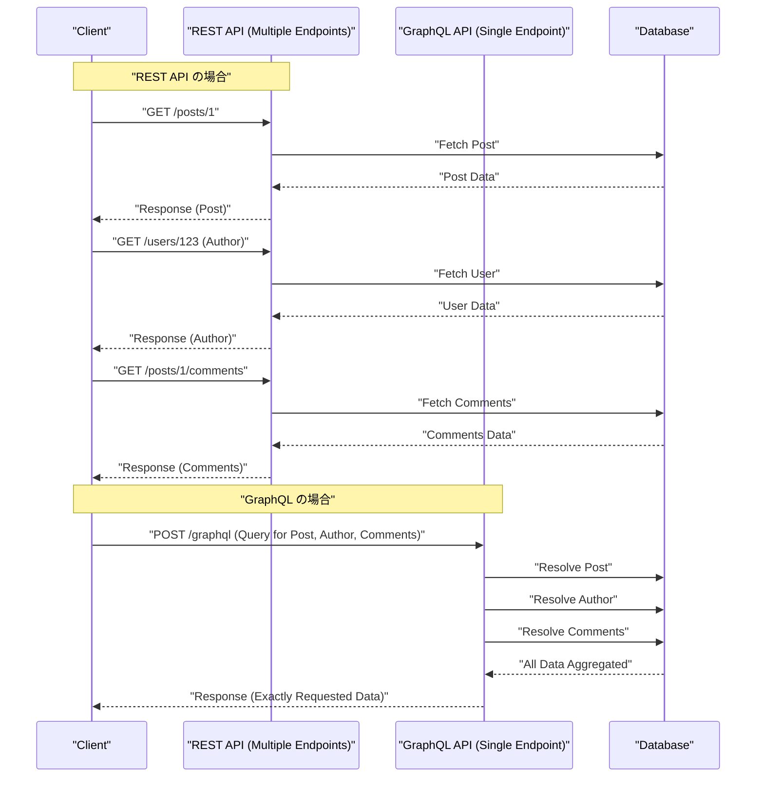

現代のWeb開発において、バックエンドとフロントエンドを繋ぐAPIアーキテクチャの選択は、アプリケーションのパフォーマンス、開発効率、そして保守性に甚大な影響を与えます。歴史的に標準として採用されてきた **REST API** は、シンプルで直感的な設計原則により広く普及しましたが、フロントエンドの高度化・複雑化に伴い、様々な課題が表面化してきました。本記事では、REST APIが抱える限界と、それを解決するために登場した **GraphQL** の革新的なアプローチについて、アーキテクチャ、データフェッチ、型安全の観点から詳細かつ徹底的に解説します。

## 1. REST API のアーキテクチャスタイル原則とその限界

**REST** （Representational State Transfer）は、Roy Fieldingが2000年に提唱したアーキテクチャスタイルです。HTTPプロトコルの基本機能を最大限に活かし、リソース指向の設計を行います。

### RESTの主要な設計原則

REST APIを設計する際、以下の制約を満たすことが理想とされます（RESTful API）。

1. **クライアント・サーバー分離** （Client-Server）: ユーザーインターフェースに関する関心事とデータストレージに関する関心事を分離し、互いに独立して進化できるようにします。
2. **ステートレス** （Stateless）: サーバーはクライアントのセッション状態を保持せず、各リクエストは独立して処理を完結するためのすべての情報を含んでいなければなりません。
3. **キャッシュ可能** （Cacheable）: ネットワーク効率を高めるため、サーバーからのレスポンスはキャッシュ可能であるか否かを明示する必要があります。
4. **統一インターフェース** （Uniform Interface）: リソースの識別（URI）、表現を介したリソースの操作、自己記述的メッセージ、HATEOAS（Hypermedia as the Engine of Application State）などの原則に基づき、全体的に一貫したインターフェースを提供します。
5. **階層化システム** （Layered System）: クライアントは直接サーバーに接続しているか、中間のプロキシやロードバランサを介しているかを意識することなく通信できます。

これらの原則により、RESTはWebのスケールにおいて非常に強固な基盤を築きました。しかし、現代の多様なデバイスや複雑なUI要件においては、以下に述べるような課題に直面しています。

## 2. オーバーフェッチとアンダーフェッチ問題

REST APIの最も顕著な課題は、**オーバーフェッチ** （Overfetching）と **アンダーフェッチ** （Underfetching）です。これらは、RESTが「リソース」単位で固定のデータ構造を返すことに起因します。

### オーバーフェッチ（Overfetching）

オーバーフェッチとは、クライアントが必要とする以上のデータがサーバーから送信される現象です。

例えば、ユーザーの「名前」と「アイコン画像」だけをリスト表示する画面があるとします。REST APIで `/users` エンドポイントを叩くと、多くの場合、メール[アドレス](https://kenji.blog/p/c-language-pointers-memory-management-stack-heap/)、作成日時、詳細なプロフィール情報など、その画面では全く使用しない大量のデータが含まれたJSONが返ってきます。モバイル回線などの帯域幅が限られた環境では、この無駄なデータ転送がパフォーマンス低下の直接的な原因となります。

### アンダーフェッチ（Underfetching）と N+1 リクエスト

一方、アンダーフェッチとは、1つのエンドポイントからのレスポンスだけではUIを構築するのに十分なデータが得られず、追加のリクエストが必要になる現象です。

例えば、あるブログ記事の詳細ページで「記事の本文」「著者の情報」「記事に対するコメント一覧」を表示する必要があるとします。REST APIでは以下のように複数のエンドポイントにリクエストを送らなければならないことがよくあります。

1. `/posts/1` で記事データを取得
2. 取得した `author_id` を使って `/users/{author_id}` で著者情報を取得
3. 記事のコメントを取得するために `/posts/1/comments` にリクエスト

この結果、ネットワークのレイテンシが蓄積し、初期表示が遅延します。これがUI構築における **N+1 リクエスト問題** に繋がります。

## 3. GraphQL とは？ その革新的なアプローチ

**GraphQL** は、2012年にFacebook（現Meta）によって開発され、2015年にオープンソース化されたAPI向けのクエリ言語、およびそれを実行するためのサーバーサイドのランタイムです。

### GraphQLのコアコンセプト

1. **単一のエンドポイント** : RESTのようにリソースごとに複数のURL（エンドポイント）を用意するのではなく、GraphQLでは通常 `/graphql` という単一のエンドポイントのみを使用します。
2. **宣言的なデータフェッチ** : クライアントは、どのようなデータ構造が必要かを正確にクエリとして記述し、サーバーに要求します。サーバーは要求された構造と完全に一致するJSONを返します。
3. **強い型付け（スキーマ駆動）** : APIの仕様は GraphQL Schema Definition Language (SDL) によって厳格に型付けされて定義されます。

これにより、クライアントは「必要なデータを、必要なだけ」取得できるようになり、オーバーフェッチとアンダーフェッチが劇的に解消されます。

## 4. アーキテクチャの比較（REST vs GraphQL）

以下の図は、前述の「記事」「著者」「コメント」を取得する際の、RESTとGraphQLのリクエストフローの違いを表しています。



RESTではクライアントとサーバー間で複数回のラウンドトリップが発生しますが、GraphQLでは1回のリクエストで必要なデータ構造をすべて解決して返していることが分かります。

## 5. スキーマ駆動開発とデータ構造の比較

GraphQLの最大の特徴の1つは、**スキーマ駆動開発** （Schema-Driven Development）です。フロントエンドとバックエンドのエンジニアは、まずGraphQLスキーマ（SDL）を合意して定義します。このスキーマが「契約」となり、双方が並行して開発を進めることができます。

### GraphQL スキーマ定義 (SDL) の例

```graphql
# type はオブジェクトを定義します
type User {
  id: ID!
  name: String!
  email: String!
  avatarUrl: String
  posts: [Post!]!
}

type Comment {
  id: ID!
  body: String!
  author: User!
}

type Post {
  id: ID!
  title: String!
  content: String!
  author: User!
  comments: [Comment!]!
}

# クエリのエントリポイント
type Query {
  post(id: ID!): Post
  user(id: ID!): User
}
```

（ `!` は必須・非nullであることを示します）

### リクエストとレスポンスの比較

**REST API の場合（複数のJSONを合成する必要がある）**

`/posts/1` のレスポンス:
```json
{
  "id": "1",
  "title": "GraphQLの導入",
  "content": "GraphQLは素晴らしい...",
  "author_id": "123"
}
```
この時、本当は `author` の名前だけが知りたいのに、RESTでは `author_id` しか得られず、別途ユーザー詳細を引くか、バックエンド側で無理やり結合した専用エンドポイント（例: `/posts/1?include=author`）を用意するなどの対応が必要になります。

**GraphQL の場合**

クライアントが送信するクエリ:
```graphql
query GetPostDetails {
  post(id: "1") {
    title
    content
    author {
      name
    }
    comments {
      body
      author {
        name
      }
    }
  }
}
```

サーバーからのレスポンス:
```json
{
  "data": {
    "post": {
      "title": "GraphQLの導入",
      "content": "GraphQLは素晴らしい...",
      "author": {
        "name": "山田 太郎"
      },
      "comments": [
        {
          "body": "とても参考になりました！",
          "author": {
            "name": "佐藤 花子"
          }
        }
      ]
    }
  }
}
```
このように、要求した構造と完全に一致するJSONが1度のリクエストで返されます。無駄なフィールド（emailなど）は一切含まれません。

## 6. リゾルバの実装とバックエンドの役割

GraphQLサーバーは、クライアントからのクエリを解析し、スキーマの各フィールドに対応する **リゾルバ** （Resolver）と呼ばれる関数を実行してデータを収集します。

Node.js（Apollo Serverなど）でのリゾルバの実装例を見てみましょう。

```typescript
const resolvers = {
  Query: {
    // post クエリに対するリゾルバ
    post: async (parent, args, context) => {
      return await context.db.Post.findById(args.id);
    },
  },
  Post: {
    // Post オブジェクトの author フィールドのリゾルバ
    author: async (parent, args, context) => {
      // parent には親の Post データが入っている
      return await context.db.User.findById(parent.author_id);
    },
    comments: async (parent, args, context) => {
      return await context.db.Comment.find({ postId: parent.id });
    }
  },
  Comment: {
    author: async (parent, args, context) => {
      return await context.db.User.findById(parent.author_id);
    }
  }
};
```

このように、リゾルバはデータ[グラフ](https://kenji.blog/p/tree-graph-data-structures-search-dfs-bfs-dijkstra/)を辿るように連鎖的に呼び出されます。バックエンドの実装者は「どのURLで何を返すか」を考えるのではなく、「この型のこのフィールドにはどうやってデータを入れるか」に集中できます。

## 7. バックエンドの N+1 問題とその解決策（DataLoader）

前述のリゾルバ実装には、重大なパフォーマンス上の欠陥が潜んでいます。それがバックエンド側の **N+1問題** です。

例えば、10件の記事のリストを取得し、それぞれの `author` を取得するクエリを実行したとします。
1. 10件の記事を取得するクエリが1回走る（ `SELECT * FROM posts LIMIT 10` ）
2. 各記事に対して `Post.author` リゾルバが呼び出される。
3. 結果として、著者を引くクエリが10回走る（ `SELECT * FROM users WHERE id = ?` × 10 ）

これが100件、1000件となればデータベースに多大な負荷がかかります。これを解決するのが、Facebookが開発した **DataLoader** というパターン（ライブラリ）です。

### DataLoaderによるバッチ処理とキャッシュ

DataLoaderは、JavaScriptのイベントループ（マイクロタスクキュー）を活用し、1回のティック内で発生したキーの取得リクエストをバッチ化して、1つのクエリにまとめます。

```typescript
import DataLoader from 'dataloader';

// DataLoaderのインスタンス化。バッチ関数を定義する。
const userLoader = new DataLoader(async (userIds) => {
  // [1, 2, 3] のような ID の配列が渡される
  // 1回のINクエリでまとめて取得
  const users = await db.User.find({ id: { $in: userIds } });
  
  // userIds の順序に対応した配列を返す必要がある
  const userMap = users.reduce((acc, user) => {
    acc[user.id] = user;
    return acc;
  }, {});
  return userIds.map(id => userMap[id] || null);
});

// リゾルバでの利用
const resolvers = {
  Post: {
    author: (parent, args, context) => {
      // idを指定してロードするが、裏側ではバッチ化される
      return context.loaders.userLoader.load(parent.author_id);
    }
  }
};
```

これにより、先ほどの例でも著者を引くクエリは `SELECT * FROM users WHERE id IN (?, ?, ...)` の1回のみに最適化されます。GraphQLを実運用環境でスケールさせるためには、DataLoaderの導入は事実上必須と言えます。

## 8. GraphQL Code Generator がもたらす究極の型安全

GraphQLの型システム（スキーマ）は、フロントエンド開発に絶大なメリットをもたらします。**GraphQL Code Generator** のようなツールを使うことで、スキーマからTypeScriptの型定義やデータフェッチ用のカスタムHooks（Reactの場合）を自動生成できます。

REST APIでは、Swagger（OpenAPI）から型を生成することも可能ですが、GraphQLの場合はクライアントが「クエリで指定した形」の型定義まで生成できる点が圧倒的に優れています。

1. **スキーマファイル** と **クライアントが書いたクエリ文字列（.graphql ファイル）** を読み込ませる。
2. GraphQL Code Genが、そのクエリのレスポンスに完全に一致する TypeScript の型（Interface）を生成する。

```typescript
// 自動生成されたHooksの利用例 (Apollo Client)
import { useGetPostDetailsQuery } from '../generated/graphql';

const PostPage = ({ postId }: { postId: string }) => {
  const { data, loading, error } = useGetPostDetailsQuery({
    variables: { id: postId }
  });

  if (loading) return <p>Loading...</p>;
  if (error) return <p>Error</p>;
  
  // data の型はクエリで指定した通りに厳格に推論される！
  // data.post.title は string 型として認識される
  // もしクエリに含めていないフィールド(email等)にアクセスしようとすると、TSのコンパイルエラーになる
  return (
    <div>
      <h1>{data?.post?.title}</h1>
      <p>Author: {data?.post?.author.name}</p>
    </div>
  );
};
```

これにより、「実行時にプロパティが undefined でクラッシュする」といった不具合を静的解析（コンパイル時）にほぼ防ぐことが可能になり、フロントエンドの DX（Developer Experience）が飛躍的に向上します。

## 9. 高度なキャッシュ戦略: Apollo Client と Relay

REST API の長所の1つに、HTTPの標準的なキャッシング（ETag, Cache-Control など）が利用しやすいという点がありました。GraphQLは原則として全てPOSTリクエストで単一エンドポイントを利用するため、HTTPレベルのキャッシングは困難です（Persisted Queriesなどの手法はありますが）。

代わりに、GraphQLエコシステムでは強力な **クライアントサイド・キャッシュ** （正規化キャッシュ）を備えたクライアントライブラリが進化しました。代表的なものが **Apollo Client** と **Relay** です。

### 正規化キャッシュ (Normalized Cache) とは

Apollo Client などのスマートなGraphQLクライアントは、レスポンスとして受け取ったJSONの[木構造](https://kenji.blog/p/tree-graph-data-structures-search-dfs-bfs-dijkstra/)をそのまま保存するのではなく、フラットなレコードのストアとして保存します。
各オブジェクトは `__typename` （型名）と `id` （一意の識別子）の組み合わせ（例: `Post:1` ）をキーとして保存（正規化）されます。

この仕組みにより、驚くべき恩恵が得られます。
例えば、「投稿一覧」のクエリと、「投稿詳細」のクエリがあったとします。
1. ユーザーが「投稿詳細」画面を開き、投稿タイトルを編集（Mutation）したとする。
2. サーバーから新しいタイトルの入ったレスポンス（ `id` と `title` ）が返る。
3. Apollo Clientは、ストア内の `Post:1` のデータを自動的に更新する。
4. すると、「投稿一覧」画面で表示されていた同じ `Post:1` の情報も **自動的に再レンダリングされ、最新状態に同期される** のです。

エンジニアが手動で[状態管理](https://kenji.blog/p/state-management-history-redux-context-recoil-zustand/)（[Redux](https://kenji.blog/p/state-management-history-redux-context-recoil-zustand/)など）を更新するコードを書く必要がなくなり、UI全体のデータの一貫性がライブラリによって保証されます。これは、複雑なSPA（Single Page Application）を構築する上で、RESTに対してGraphQLが決定的な優位性を持つ部分です。

### Relay - Facebookが誇る究極のGraphQLクライアント

Reactの開発元であるFacebookが作っている **Relay** は、Apolloよりもさらに厳格でパフォーマンスに特化したアプローチを取ります。
コンポーネントごとに必要なデータを **Fragment（フラグメント）** として定義し、親コンポーネントがそれを集約して1つの巨大なクエリとしてサーバーに送信します。データの依存関係がコンポーネント単位でカプセル化されるため、「コンポーネントを削除したのにクエリに不要なフィールドが残り続ける」といった問題を完全に排除できる、極めて高度なアーキテクチャを実現可能です。

## 10. GraphQLを採用すべきか？（トレードオフと結論）

ここまでGraphQLの強力なメリットを述べてきましたが、決して「常にRESTより優れている銀の弾丸」ではありません。

**GraphQLのデメリット / 導入のハードル**
* **学習コスト** : バックエンド、フロントエンド共にパラダイムシフトが求められ、学習曲線の壁があります。
* **複雑なバックエンド実装** : N+1問題を回避するDataLoaderの設計、複雑なクエリ（再帰的で深い階層のリクエスト）に対するパフォーマンスチューニング、クエリの複雑度（Complexity）によるレートリミットなど、サーバー側の防御的実装が必須となります。
* **シンプルなAPIには過剰** : データの更新・取得要件がシンプルで、UIの複雑性が低い小規模アプリケーションであれば、RESTのシンプルさが勝ります。

### まとめ

REST APIは依然として素晴らしいアーキテクチャであり、パブリックなAPIやサービス間通信（[マイクロサービス](https://kenji.blog/p/microservices-architecture-bff-api-gateway/)）などで強力な選択肢であり続けます。

一方で、高度にインタラクティブでデータ要件が複雑なモダンWeb・モバイルアプリケーションにおいて、 **GraphQL** は「オーバーフェッチ/アンダーフェッチの撲滅」「強力な型推論による安全なフロントエンド開発」「正規化キャッシュによる状態管理の自動化」という圧倒的なDXとUXを提供します。

開発チームのスキルセット、プロダクトの複雑さ、将来的なスケールを慎重に評価し、最適なAPIアーキテクチャを選択することが、現代のソフトウェア開発において最も重要な意思決定の1つとなるでしょう。
