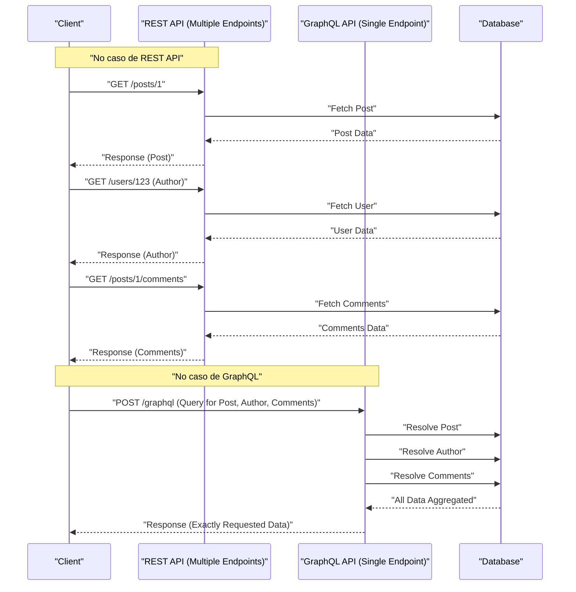

No desenvolvimento web moderno, a escolha da arquitetura de API que conecta o back-end ao front-end tem um impacto profundo no desempenho, na eficiência do desenvolvimento e na manutenibilidade da aplicação. A **API REST**, que tem sido historicamente adotada como padrão, tornou-se amplamente utilizada devido aos seus princípios de design simples e intuitivos. No entanto, à medida que os front-ends se tornam mais avançados e complexos, vários desafios vieram à tona. Neste artigo, explicaremos em detalhes e de forma abrangente as limitações das APIs REST e a abordagem inovadora do **GraphQL** que surgiu para resolvê-las, sob as perspectivas de arquitetura, busca de dados e segurança de tipos.

## 1. Princípios do Estilo Arquitetural da API REST e Suas Limitações

**REST** (Representational State Transfer) é um estilo de arquitetura proposto por Roy Fielding em 2000. Ele aproveita ao máximo as funções básicas do protocolo HTTP para um design orientado a recursos.

### Princípios Principais de Design do REST

Ao projetar uma API REST, o ideal é satisfazer as seguintes restrições (API RESTful):

1. **Separação Cliente-Servidor** (Client-Server): Separa as preocupações sobre a interface do usuário das preocupações sobre o armazenamento de dados, permitindo que evoluam de forma independente.
2. **Stateless** (Sem estado): O servidor não mantém o estado da sessão do cliente, e cada requisição deve conter todas as informações necessárias para concluir o processamento de forma independente.
3. **Pode ser colocado em cache** (Cacheable): Para melhorar a eficiência da rede, as respostas do servidor devem indicar claramente se podem ou não ser armazenadas em cache.
4. **Interface Uniforme** (Uniform Interface): Fornece uma interface globalmente consistente baseada em princípios como identificação de recursos (URI), manipulação de recursos por meio de representações, mensagens autodescritivas e HATEOAS (Hypermedia as the Engine of Application State).
5. **Sistema em Camadas** (Layered System): O cliente pode se comunicar sem estar ciente se está conectado diretamente ao servidor ou através de um proxy ou balanceador de carga intermediário.

Esses princípios permitiram que o REST construísse uma base muito forte em escala Web. No entanto, com a variedade de dispositivos modernos e requisitos de interface do usuário complexos, ele enfrenta os desafios descritos abaixo.

## 2. O Problema do Overfetching e Underfetching

Os desafios mais notáveis das APIs REST são o **overfetching** (buscar dados em excesso) e o **underfetching** (buscar dados insuficientes). Isso ocorre porque o REST retorna uma estrutura de dados fixa por unidade de "recurso".

### Overfetching

Overfetching é o fenômeno em que mais dados são enviados do servidor do que o cliente precisa.

Por exemplo, suponha que haja uma tela que lista apenas o "nome" e a "imagem de ícone" de um usuário. Ao atingir o endpoint `/users` com uma API REST, você frequentemente receberá um JSON que inclui muitos dados que não serão usados de forma alguma nessa tela, como endereços de e-mail, datas de criação e informações detalhadas do perfil. Em ambientes com largura de banda limitada, como redes móveis, essa transferência de dados desnecessária é uma causa direta de degradação do desempenho.

### Underfetching e Requisições N+1

Por outro lado, o underfetching é o fenômeno em que a resposta de um único endpoint não fornece dados suficientes para construir a UI, exigindo solicitações adicionais.

Por exemplo, na página de detalhes de um artigo de blog, você pode precisar exibir o "corpo do artigo", "informações do autor" e "uma lista de comentários sobre o artigo". Com a API REST, muitas vezes é necessário enviar requisições para vários endpoints da seguinte forma:

1. Buscar os dados do artigo usando `/posts/1`
2. Usar o `author_id` obtido para buscar as informações do autor usando `/users/{author_id}`
3. Enviar uma requisição para `/posts/1/comments` para buscar os comentários do artigo

Como resultado, a latência da rede se acumula, atrasando a exibição inicial. Isso leva ao **problema de requisições N+1** na construção de UI.

## 3. O Que É GraphQL? Sua Abordagem Inovadora

O **GraphQL** é uma linguagem de consulta para APIs e um ambiente de execução no lado do servidor para executá-la, desenvolvida pelo Facebook (atualmente Meta) em 2012 e de código aberto em 2015.

### Conceitos Principais do GraphQL

1. **Ponto de Extremidade Único** (Single Endpoint): Em vez de fornecer vários URLs (endpoints) para cada recurso, como no REST, o GraphQL normalmente usa apenas um único endpoint chamado `/graphql`.
2. **Busca de Dados Declarativa** (Declarative Data Fetching): O cliente descreve exatamente qual estrutura de dados precisa como uma consulta e a solicita ao servidor. O servidor retorna um JSON que corresponde perfeitamente à estrutura solicitada.
3. **Tipagem Forte (Orientado a Esquema)**: As especificações da API são rigorosamente tipadas e definidas pela GraphQL Schema Definition Language (SDL).

Isso permite que o cliente busque "os dados necessários, na quantidade necessária", eliminando drasticamente o overfetching e o underfetching.

## 4. Comparação de Arquiteturas (REST vs GraphQL)

O diagrama a seguir ilustra a diferença no fluxo de solicitações entre REST e GraphQL ao buscar o "artigo", "autor" e "comentários" mencionados anteriormente.



Com o REST, ocorrem várias idas e vindas (round trips) entre o cliente e o servidor, enquanto o GraphQL resolve e retorna toda a estrutura de dados necessária em uma única solicitação.

## 5. Desenvolvimento Orientado a Esquema e Comparação de Estruturas de Dados

Uma das maiores características do GraphQL é o **desenvolvimento orientado a esquema** (Schema-Driven Development). Os engenheiros de front-end e back-end primeiro concordam e definem o esquema GraphQL (SDL). Esse esquema se torna um "contrato", permitindo que ambos os lados desenvolvam em paralelo.

### Exemplo de Definição de Esquema GraphQL (SDL)

```graphql
# type define um objeto
type User {
  id: ID!
  name: String!
  email: String!
  avatarUrl: String
  posts: [Post!]!
}

type Comment {
  id: ID!
  body: String!
  author: User!
}

type Post {
  id: ID!
  title: String!
  content: String!
  author: User!
  comments: [Comment!]!
}

# Ponto de entrada das consultas
type Query {
  post(id: ID!): Post
  user(id: ID!): User
}
```

(`!` indica que é obrigatório/não nulo)

### Comparação de Requisição e Resposta

**No caso de API REST (onde é necessário combinar vários JSONs)**

Resposta de `/posts/1`:
```json
{
  "id": "1",
  "title": "Introdução ao GraphQL",
  "content": "GraphQL é incrível...",
  "author_id": "123"
}
```
Neste ponto, embora você queira saber apenas o nome do `author`, o REST fornece apenas o `author_id`. Isso exige que você busque os detalhes do usuário separadamente ou que o lado do servidor forneça um endpoint dedicado forçado (por exemplo, `/posts/1?include=author`).

**No caso de GraphQL**

Consulta enviada pelo cliente:
```graphql
query GetPostDetails {
  post(id: "1") {
    title
    content
    author {
      name
    }
    comments {
      body
      author {
        name
      }
    }
  }
}
```

Resposta do servidor:
```json
{
  "data": {
    "post": {
      "title": "Introdução ao GraphQL",
      "content": "GraphQL é incrível...",
      "author": {
        "name": "Taro Yamada"
      },
      "comments": [
        {
          "body": "Foi muito útil!",
          "author": {
            "name": "Hanako Sato"
          }
        }
      ]
    }
  }
}
```
Dessa forma, um JSON que corresponde exatamente à estrutura solicitada é retornado em uma única solicitação. Nenhum campo desnecessário (como email, etc.) é incluído.

## 6. Implementação de Resolvers e o Papel do Back-end

O servidor GraphQL analisa a consulta do cliente e executa funções chamadas **resolvers** (Resolvedores) correspondentes a cada campo do esquema para coletar os dados.

Vejamos um exemplo de implementação de resolver em Node.js (como Apollo Server).

```typescript
const resolvers = {
  Query: {
    // Resolver para a consulta post
    post: async (parent, args, context) => {
      return await context.db.Post.findById(args.id);
    },
  },
  Post: {
    // Resolver para o campo author do objeto Post
    author: async (parent, args, context) => {
      // parent contém os dados originais do Post
      return await context.db.User.findById(parent.author_id);
    },
    comments: async (parent, args, context) => {
      return await context.db.Comment.find({ postId: parent.id });
    }
  },
  Comment: {
    author: async (parent, args, context) => {
      return await context.db.User.findById(parent.author_id);
    }
  }
};
```

Como você pode ver, os resolvers são chamados em cadeia para percorrer o grafo de dados. Os desenvolvedores de back-end podem se concentrar em "como inserir dados neste campo deste tipo" em vez de pensar em "o que retornar em qual URL".

## 7. O Problema N+1 do Back-end e Sua Solução (DataLoader)

A implementação do resolver mencionada acima esconde uma grave falha de desempenho. Esse é o **problema N+1** no lado do back-end.

Por exemplo, suponha que você execute uma consulta que busca uma lista de 10 artigos e obtém o `author` de cada um deles.
1. A consulta para buscar 10 artigos é executada uma vez (`SELECT * FROM posts LIMIT 10`).
2. O resolver `Post.author` é chamado para cada artigo.
3. Como resultado, a consulta para buscar os autores é executada 10 vezes (`SELECT * FROM users WHERE id = ?` × 10).

Se isso se tornar 100 ou 1.000 itens, colocará uma carga enorme no banco de dados. Isso é resolvido pelo padrão (biblioteca) **DataLoader** desenvolvido pelo Facebook.

### Processamento em Lote e Cache com DataLoader

O DataLoader utiliza o loop de eventos (fila de microtarefas) do JavaScript para agrupar solicitações de busca de chaves que ocorrem em um único ciclo (tick) e reuni-las em uma única consulta.

```typescript
import DataLoader from 'dataloader';

// Instanciando o DataLoader e definindo a função de lote (batch)
const userLoader = new DataLoader(async (userIds) => {
  // Um array de IDs como [1, 2, 3] é passado
  // Busca todos de uma vez com uma única consulta IN
  const users = await db.User.find({ id: { $in: userIds } });
  
  // É necessário retornar um array que corresponda à ordem de userIds
  const userMap = users.reduce((acc, user) => {
    acc[user.id] = user;
    return acc;
  }, {});
  return userIds.map(id => userMap[id] || null);
});

// Uso no resolver
const resolvers = {
  Post: {
    author: (parent, args, context) => {
      // Carrega especificando o id, mas é feito em lote nos bastidores
      return context.loaders.userLoader.load(parent.author_id);
    }
  }
};
```

Com isso, até no exemplo anterior, a consulta para buscar o autor é otimizada para apenas uma vez: `SELECT * FROM users WHERE id IN (?, ?, ...)`. A introdução do DataLoader é praticamente essencial para dimensionar o GraphQL em um ambiente de produção.

## 8. A Segurança de Tipos Extrema Trazida pelo GraphQL Code Generator

O sistema de tipos do GraphQL (esquema) traz benefícios enormes para o desenvolvimento front-end. Ao usar ferramentas como o **GraphQL Code Generator**, você pode gerar automaticamente definições de tipo TypeScript e Hooks personalizados (no caso do React) para busca de dados a partir do esquema.

Embora também seja possível gerar tipos do Swagger (OpenAPI) nas APIs REST, o GraphQL é muito superior porque pode gerar definições de tipo na "forma exata especificada pela consulta" do cliente.

1. Lê o **arquivo de esquema** e a **string de consulta escrita pelo cliente (arquivo .graphql)**.
2. O GraphQL Code Gen gera tipos TypeScript (Interfaces) que correspondem perfeitamente à resposta dessa consulta.

```typescript
// Exemplo de uso de Hooks gerados automaticamente (Apollo Client)
import { useGetPostDetailsQuery } from '../generated/graphql';

const PostPage = ({ postId }: { postId: string }) => {
  const { data, loading, error } = useGetPostDetailsQuery({
    variables: { id: postId }
  });

  if (loading) return <p>Loading...</p>;
  if (error) return <p>Error</p>;
  
  // O tipo de 'data' é inferido estritamente conforme especificado na consulta!
  // data.post.title é reconhecido como o tipo string
  // Se você tentar acessar um campo não incluído na consulta (como email, etc.), resultará em um erro de compilação TS
  return (
    <div>
      <h1>{data?.post?.title}</h1>
      <p>Author: {data?.post?.author.name}</p>
    </div>
  );
};
```

Isso torna possível evitar quase totalmente os bugs como "travar porque a propriedade é indefinida (undefined) em tempo de execução" por meio da análise estática (em tempo de compilação), o que melhora drasticamente a DX (Developer Experience - Experiência do Desenvolvedor) no front-end.

## 9. Estratégias Avançadas de Cache: Apollo Client e Relay

Uma das vantagens das APIs REST era que o cache HTTP padrão (ETag, Cache-Control, etc.) era fácil de usar. Como o GraphQL geralmente usa um único endpoint para todas as solicitações via POST, o cache em nível HTTP é difícil (embora existam métodos como Persisted Queries).

Em vez disso, no ecossistema GraphQL, evoluíram bibliotecas de cliente equipadas com um poderoso **cache do lado do cliente** (cache normalizado). Os representantes são **Apollo Client** e **Relay**.

### O Que É Cache Normalizado (Normalized Cache)?

Clientes GraphQL inteligentes como o Apollo Client não salvam a estrutura de árvore do JSON recebido como resposta como ela é, mas sim como um armazenamento plano de registros.
Cada objeto é salvo (normalizado) usando a combinação de `__typename` (nome do tipo) e `id` (identificador exclusivo) (ex: `Post:1`) como chave.

Esse mecanismo oferece benefícios surpreendentes.
Por exemplo, suponha que haja uma consulta de "lista de postagens" e uma consulta de "detalhes da postagem".
1. O usuário abre a tela "detalhes da postagem" e edita o título da postagem (Mutation).
2. O servidor retorna uma resposta com o novo título (`id` e `title`).
3. O Apollo Client atualiza automaticamente os dados de `Post:1` na store (armazenamento).
4. Então, as informações do mesmo `Post:1` que foram exibidas na tela de "lista de postagens" também **são renderizadas novamente e sincronizadas com o estado mais recente automaticamente**.

Os engenheiros não precisam mais escrever códigos para atualizar o gerenciamento de estado (como o [Redux](https://kenji.blog/pt/p/state-management-history-redux-context-recoil-zustand/)) manualmente, e a consistência de dados em toda a interface do usuário é garantida pela biblioteca. Esta é uma área onde o GraphQL tem uma vantagem decisiva sobre o REST na construção de SPAs (Single Page Applications) complexos.

### Relay - O Cliente GraphQL Definitivo do qual o Facebook se Orgulha

O **Relay**, criado pelo Facebook (o criador do React), adota uma abordagem ainda mais rigorosa e focada no desempenho do que o Apollo.
Os dados necessários para cada componente são definidos como **Fragment** (Fragmentos), e o componente pai os agrega e os envia ao servidor como uma única e enorme consulta. Como as dependências de dados são encapsuladas por componente, é possível alcançar uma arquitetura extremamente avançada que elimina completamente problemas como "campos desnecessários que permanecem na consulta mesmo após o componente ter sido excluído".

## 10. Você Deve Adotar o GraphQL? (Trade-offs e Conclusão)

Até agora descrevemos os benefícios poderosos do GraphQL, mas ele não é de forma alguma uma "bala de prata sempre superior ao REST".

**Desvantagens do GraphQL / Obstáculos de Adoção**
* **Custo de aprendizado**: É necessária uma mudança de paradigma tanto para o back-end quanto para o front-end, e há uma barreira na curva de aprendizado.
* **Implementação complexa no back-end**: A implementação de defesas do lado do servidor é essencial, como o design do DataLoader para evitar o problema N+1, o ajuste de desempenho para consultas complexas (solicitações recursivas e profundamente aninhadas) e a limitação de taxa com base na complexidade da consulta (Complexity).
* **Excesso para APIs simples**: Se os requisitos de atualização e busca de dados forem simples e a complexidade da UI for baixa para aplicativos de pequena escala, a simplicidade do REST prevalece.

### Conclusão

A API REST ainda é uma arquitetura fantástica e continua sendo uma escolha poderosa para APIs públicas e comunicação entre serviços (microsserviços).

Por outro lado, em aplicativos web e móveis modernos que são altamente interativos e possuem requisitos de dados complexos, o **GraphQL** oferece DX e UX excepcionais ao "eliminar o overfetching/underfetching", "fornecer desenvolvimento front-end seguro por meio de inferência de tipos forte" e "automatizar o gerenciamento de estado por meio de cache normalizado".

Avaliar cuidadosamente o conjunto de habilidades da equipe de desenvolvimento, a complexidade do produto e a escala futura para escolher a arquitetura de API ideal será uma das decisões mais importantes no desenvolvimento de software moderno.
