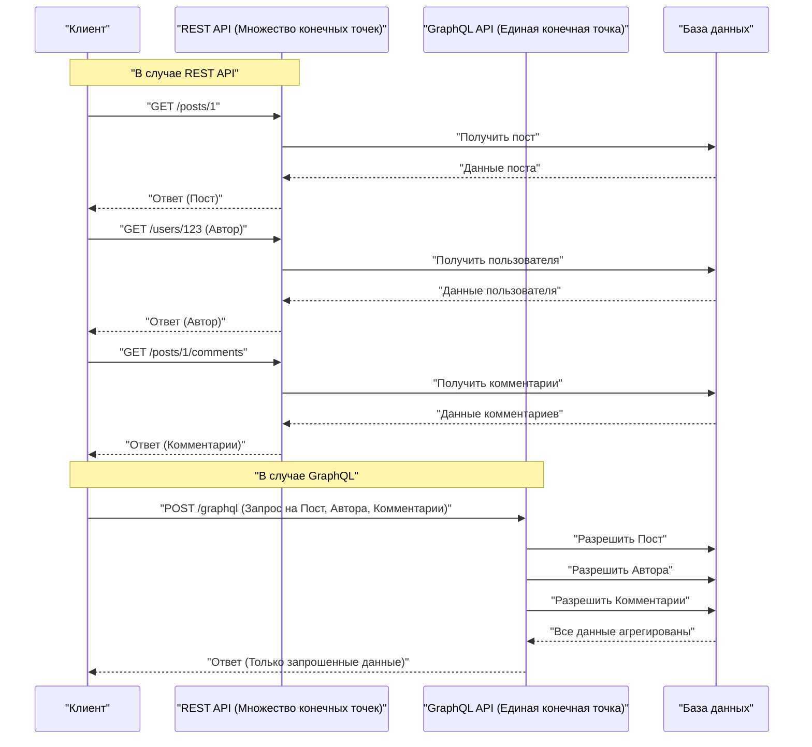

В современной веб-разработке выбор архитектуры API, связывающей бэкенд и фронтенд, оказывает колоссальное влияние на производительность приложения, эффективность разработки и поддерживаемость. Исторически принятый в качестве стандарта **REST API** получил широкое распространение благодаря своим простым и интуитивно понятным принципам проектирования, однако с усложнением фронтенда начали проявляться различные проблемы. В этой статье мы подробно и исчерпывающе рассмотрим ограничения REST API и инновационный подход **GraphQL**, появившегося для их решения, с точки зрения архитектуры, выборки данных (data fetching) и типобезопасности.

## 1. Принципы архитектурного стиля REST API и их ограничения

**REST** (Representational State Transfer) — это архитектурный стиль, предложенный Роем Филдингом в 2000 году. Он максимально использует базовые возможности протокола HTTP и ориентирован на ресурсы.

### Основные принципы проектирования REST

При проектировании REST API в идеале должны соблюдаться следующие ограничения (RESTful API):

1. **Разделение клиента и сервера** (Client-Server): Разделение задач, связанных с пользовательским интерфейсом, и задач, связанных с хранением данных, что позволяет им развиваться независимо друг от друга.
2. **Отсутствие состояния** (Stateless): Сервер не сохраняет состояние сессии клиента, и каждый запрос должен содержать всю информацию, необходимую для его независимой обработки.
3. **Кэшируемость** (Cacheable): Для повышения эффективности сети ответы от сервера должны явно указывать, могут ли они быть кэшированы.
4. **Единый интерфейс** (Uniform Interface): Обеспечение согласованного интерфейса на основе таких принципов, как идентификация ресурсов (URI), манипулирование ресурсами через их представления, самоописываемые сообщения и HATEOAS (Hypermedia as the Engine of Application State).
5. **Многоуровневая система** (Layered System): Клиент может взаимодействовать, не зная, подключен ли он к серверу напрямую или через промежуточные прокси-серверы и балансировщики нагрузки.

Благодаря этим принципам REST создал очень прочную основу для масштабирования в Интернете. Однако в контексте современных разнообразных устройств и сложных требований к UI, REST сталкивается с описанными ниже проблемами.

## 2. Проблема Overfetching и Underfetching

Наиболее заметной проблемой REST API является **overfetching** (избыточная выборка) и **underfetching** (недостаточная выборка). Это связано с тем, что REST возвращает фиксированную структуру данных для каждого "ресурса".

### Избыточная выборка (Overfetching)

Overfetching — это явление, при котором сервер отправляет больше данных, чем требуется клиенту.

Например, представьте экран, на котором отображается только список пользователей с их "именем" и "аватаркой". При обращении к эндпоинту `/users` в REST API часто возвращается JSON, содержащий огромный объем данных, таких как адрес электронной почты, дата регистрации, подробная информация профиля, которые вообще не используются на этом экране. В условиях ограниченной пропускной способности, таких как мобильные сети, эта передача ненужных данных становится прямой причиной снижения производительности.

### Недостаточная выборка (Underfetching) и проблема N+1 запросов

С другой стороны, underfetching — это ситуация, когда ответа от одного эндпоинта недостаточно для построения UI, и требуются дополнительные запросы.

Например, на странице с подробным описанием статьи в блоге нужно отобразить "текст статьи", "информацию об авторе" и "список комментариев к статье". В REST API часто приходится отправлять запросы к нескольким эндпоинтам:

1. Запрос к `/posts/1` для получения данных статьи.
2. Использование полученного `author_id` для получения информации об авторе через `/users/{author_id}`.
3. Запрос к `/posts/1/comments` для получения комментариев к статье.

В результате сетевая задержка накапливается, и первоначальное отображение замедляется. Это приводит к **проблеме N+1 запросов** при построении UI.

## 3. Что такое GraphQL? Его инновационный подход

**GraphQL** — это язык запросов для API и серверная среда выполнения для их обработки, разработанная Facebook (ныне Meta) в 2012 году и открытая в 2015 году.

### Основные концепции GraphQL

1. **Единая конечная точка** (Single Endpoint): В отличие от REST, где для каждого ресурса предоставляется свой URL, GraphQL обычно использует только одну конечную точку — `/graphql`.
2. **Декларативная выборка данных**: Клиент точно описывает в запросе, какая структура данных ему нужна, и запрашивает ее у сервера. Сервер возвращает JSON, полностью соответствующий запрошенной структуре.
3. **Строгая типизация (Schema-driven)**: Спецификация API строго типизируется и определяется с помощью языка определения схемы GraphQL (SDL).

Это позволяет клиентам получать "только нужные данные в нужном объеме", что радикально решает проблемы overfetching и underfetching.

## 4. Сравнение архитектур (REST против GraphQL)

Следующая диаграмма иллюстрирует разницу в потоках запросов между REST и GraphQL при получении "статьи", "автора" и "комментариев", описанных ранее.



Как видно, в REST происходит несколько циклов приема-передачи между клиентом и сервером, тогда как в GraphQL вся необходимая структура данных разрешается и возвращается за один запрос.

## 5. Разработка на основе схемы (Schema-Driven Development) и сравнение структур данных

Одной из важнейших особенностей GraphQL является **разработка на основе схемы** (Schema-Driven Development). Frontend- и backend-инженеры сначала согласовывают и определяют схему GraphQL (SDL). Эта схема становится "контрактом", позволяя обеим сторонам вести разработку параллельно.

### Пример определения схемы GraphQL (SDL)

```graphql
# type определяет объект
type User {
  id: ID!
  name: String!
  email: String!
  avatarUrl: String
  posts: [Post!]!
}

type Comment {
  id: ID!
  body: String!
  author: User!
}

type Post {
  id: ID!
  title: String!
  content: String!
  author: User!
  comments: [Comment!]!
}

# Точка входа для запросов
type Query {
  post(id: ID!): Post
  user(id: ID!): User
}
```

( `!` означает, что поле обязательно и не может быть null)

### Сравнение запросов и ответов

**В случае REST API (необходимость объединения нескольких JSON)**

Ответ на `/posts/1`:
```json
{
  "id": "1",
  "title": "Введение в GraphQL",
  "content": "GraphQL великолепен...",
  "author_id": "123"
}
```
В этом случае, если нам нужно узнать только имя `author`, в REST мы получаем только `author_id`. Приходится либо делать отдельный запрос за деталями пользователя, либо создавать на бэкенде специальный эндпоинт, который принудительно объединяет данные (например, `/posts/1?include=author`).

**В случае GraphQL**

Запрос, отправляемый клиентом:
```graphql
query GetPostDetails {
  post(id: "1") {
    title
    content
    author {
      name
    }
    comments {
      body
      author {
        name
      }
    }
  }
}
```

Ответ от сервера:
```json
{
  "data": {
    "post": {
      "title": "Введение в GraphQL",
      "content": "GraphQL великолепен...",
      "author": {
        "name": "Иван Иванов"
      },
      "comments": [
        {
          "body": "Очень полезно!",
          "author": {
            "name": "Мария Смирнова"
          }
        }
      ]
    }
  }
}
```
Таким образом, за один запрос возвращается JSON, который полностью соответствует запрошенной структуре. Ненужные поля (например, email) вообще не включаются.

## 6. Реализация резолверов и роль бэкенда

Сервер GraphQL анализирует запрос от клиента и собирает данные, выполняя функции, называемые **резолверами** (Resolver), которые соответствуют каждому полю в схеме.

Давайте рассмотрим пример реализации резолверов на Node.js (например, Apollo Server).

```typescript
const resolvers = {
  Query: {
    // Резолвер для запроса post
    post: async (parent, args, context) => {
      return await context.db.Post.findById(args.id);
    },
  },
  Post: {
    // Резолвер для поля author объекта Post
    author: async (parent, args, context) => {
      // parent содержит данные родительского Post
      return await context.db.User.findById(parent.author_id);
    },
    comments: async (parent, args, context) => {
      return await context.db.Comment.find({ postId: parent.id });
    }
  },
  Comment: {
    author: async (parent, args, context) => {
      return await context.db.User.findById(parent.author_id);
    }
  }
};
```

Таким образом, резолверы вызываются цепочкой, следуя графу данных. Разработчик бэкенда может сосредоточиться не на том, "что возвращать по какому URL", а на том, "как получить данные для этого поля этого типа".

## 7. Проблема N+1 на бэкенде и её решение (DataLoader)

В приведенной выше реализации резолверов скрыт серьезный недостаток производительности. Это **проблема N+1** на стороне сервера.

Например, предположим, что мы выполняем запрос на получение списка из 10 статей и получение `author` для каждой из них.
1. Выполняется один запрос для получения 10 статей ( `SELECT * FROM posts LIMIT 10` )
2. Для каждой статьи вызывается резолвер `Post.author`.
3. В результате выполняется 10 запросов для поиска автора ( `SELECT * FROM users WHERE id = ?` × 10 )

Если статей будет 100 или 1000, на базу данных ляжет огромная нагрузка. Эта проблема решается с помощью паттерна (и библиотеки) под названием **DataLoader**, разработанной Facebook.

### Пакетная обработка и кэширование с помощью DataLoader

DataLoader использует цикл событий JavaScript (очередь микрозадач) для группировки запросов по ключам, возникших в рамках одного тика (tick), и объединяет их в один пакетный запрос к базе данных.

```typescript
import DataLoader from 'dataloader';

// Создание экземпляра DataLoader. Определяем функцию пакетирования (batch).
const userLoader = new DataLoader(async (userIds) => {
  // Передается массив ID, например [1, 2, 3]
  // Извлекаем все сразу за один запрос с IN
  const users = await db.User.find({ id: { $in: userIds } });
  
  // Необходимо вернуть массив, соответствующий порядку userIds
  const userMap = users.reduce((acc, user) => {
    acc[user.id] = user;
    return acc;
  }, {});
  return userIds.map(id => userMap[id] || null);
});

// Использование в резолвере
const resolvers = {
  Post: {
    author: (parent, args, context) => {
      // Загружаем по id, но "под капотом" происходит пакетирование
      return context.loaders.userLoader.load(parent.author_id);
    }
  }
};
```

В результате, даже в предыдущем примере, запрос на поиск авторов будет оптимизирован до одного запроса: `SELECT * FROM users WHERE id IN (?, ?, ...)` . Внедрение DataLoader фактически является обязательным для масштабирования GraphQL в рабочей среде.

## 8. Абсолютная типобезопасность с помощью GraphQL Code Generator

Система типов (схема) GraphQL приносит огромную пользу фронтенд-разработке. Используя такие инструменты, как **GraphQL Code Generator**, вы можете автоматически генерировать определения типов TypeScript и пользовательские хуки (для React) для выборки данных непосредственно из схемы.

В REST API также возможно генерировать типы из Swagger (OpenAPI), но в случае с GraphQL преимущество заключается в том, что можно генерировать типы, точно соответствующие "форме, указанной клиентом в запросе".

1. Загружаются **файл схемы** и **строка запроса, написанная клиентом (.graphql файл)**.
2. GraphQL Code Gen генерирует типы TypeScript (Interface), которые полностью соответствуют ответу на этот запрос.

```typescript
// Пример использования автоматически сгенерированных Hooks (Apollo Client)
import { useGetPostDetailsQuery } from '../generated/graphql';

const PostPage = ({ postId }: { postId: string }) => {
  const { data, loading, error } = useGetPostDetailsQuery({
    variables: { id: postId }
  });

  if (loading) return <p>Loading...</p>;
  if (error) return <p>Error</p>;
  
  // Тип data строго выводится в соответствии с запросом!
  // data.post.title распознается как тип string
  // Если попытаться обратиться к полю, не включенному в запрос (например, email), возникнет ошибка компиляции TS
  return (
    <div>
      <h1>{data?.post?.title}</h1>
      <p>Author: {data?.post?.author.name}</p>
    </div>
  );
};
```

Это позволяет практически полностью предотвратить ошибки типа "сбой во время выполнения из-за того, что свойство равно undefined" еще на этапе статического анализа (во время компиляции), что кардинально улучшает опыт разработчика (DX) на фронтенде.

## 9. Продвинутые стратегии кэширования: Apollo Client и Relay

Одним из преимуществ REST API было то, что он легко использовал стандартное кэширование HTTP (ETag, Cache-Control и т.д.). В GraphQL, как правило, все запросы отправляются методом POST на единственную конечную точку, поэтому кэширование на уровне HTTP затруднено (хотя существуют такие методы, как Persisted Queries).

Вместо этого в экосистеме GraphQL получили развитие клиентские библиотеки с мощным **клиентским кэшированием** (нормализованным кэшем). Наиболее известными из них являются **Apollo Client** и **Relay**.

### Что такое нормализованный кэш (Normalized Cache)

Умные GraphQL-клиенты, такие как Apollo Client, не сохраняют полученный JSON в виде исходной древовидной структуры. Они сохраняют его в виде плоского хранилища записей (records).
Каждый объект кэшируется (нормализуется) с ключом, представляющим собой комбинацию `__typename` (имя типа) и `id` (уникальный идентификатор) (например, `Post:1`).

Этот механизм предоставляет удивительные преимущества.
Например, предположим, что у нас есть запрос "Список постов" и запрос "Детали поста".
1. Пользователь открывает экран "Детали поста" и редактирует заголовок поста (Mutation).
2. Сервер возвращает ответ с новым заголовком (содержащий `id` и `title`).
3. Apollo Client автоматически обновляет данные для `Post:1` в хранилище.
4. В результате информация о том же `Post:1`, отображаемая на экране "Список постов", **автоматически перерисовывается и синхронизируется с последним состоянием**.

Разработчикам больше не нужно писать код для ручного обновления управления состоянием (например, [Redux](https://kenji.blog/ru/p/state-management-history-redux-context-recoil-zustand/)) — библиотека гарантирует согласованность данных во всем UI. Это является решающим преимуществом GraphQL перед REST при создании сложных одностраничных приложений (SPA).

### Relay - бескомпромиссный GraphQL-клиент от Facebook

**Relay**, созданный компанией Facebook, разработчиком React, применяет еще более строгий и ориентированный на производительность подход, чем Apollo.
Необходимые для каждого компонента данные определяются в виде **Фрагментов (Fragment)**, а родительский компонент агрегирует их и отправляет на сервер в виде одного огромного запроса. Поскольку зависимости данных инкапсулируются на уровне компонентов, можно реализовать чрезвычайно продвинутую архитектуру, которая полностью исключает такие проблемы, как "компонент удален, но ненужные поля остаются в запросе".

## 10. Стоит ли внедрять GraphQL? (Компромиссы и выводы)

До сих пор мы говорили о мощных преимуществах GraphQL, но это ни в коем случае не "серебряная пуля, которая всегда превосходит REST".

**Недостатки GraphQL / Барьеры для внедрения**
* **Стоимость обучения**: Требуется смена парадигмы как для backend-, так и для frontend-разработчиков, что создает кривую обучения.
* **Сложность бэкенд-реализации**: Обязательна защитная реализация на стороне сервера, такая как проектирование DataLoader для предотвращения проблемы N+1, настройка производительности для сложных запросов (рекурсивных и глубоких) и ограничение скорости (rate limit) в зависимости от сложности запроса (Complexity).
* **Избыточность для простых API**: Если требования к получению и обновлению данных просты, а сложность UI низкая, то в небольших приложениях предпочтительнее будет простота REST.

### Заключение

REST API остается отличной архитектурой и будет продолжать быть сильным выбором для публичных API и межсервисного взаимодействия (микросервисов).

С другой стороны, в высокоинтерактивных современных веб- и мобильных приложениях со сложными требованиями к данным, **GraphQL** предлагает подавляющее преимущество в DX и UX за счет "устранения overfetching/underfetching", "безопасной frontend-разработки благодаря мощному выводу типов" и "автоматизации управления состоянием через нормализованное кэширование".

Тщательная оценка навыков команды разработчиков, сложности продукта и масштабирования в будущем, а также выбор оптимальной архитектуры API станет одним из важнейших решений в современной разработке программного обеспечения.
