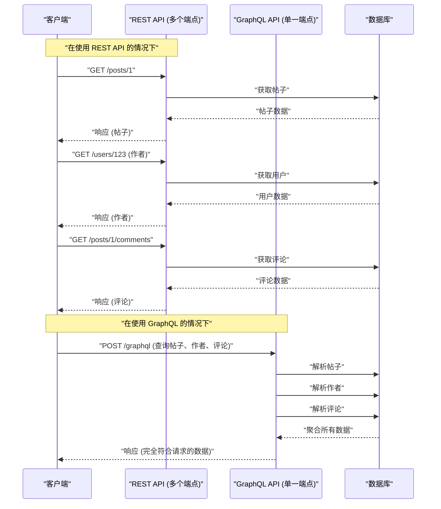

在现代 Web 开发中，连接后端与前端的 API 架构的选择，对应用程序的性能、开发效率以及可维护性有着巨大的影响。历史上作为标准被采用的 **REST API** ，凭借其简单直观的设计原则得到了广泛普及，但随着前端的高度化和复杂化，各种问题也逐渐显现出来。本文将详细且彻底地从架构、数据获取、类型安全的角度，解说 REST API 所面临的局限性，以及为解决这些问题而出现的 **GraphQL** 的创新性方法。

## 1. REST API 的架构风格原则及其局限性

**REST** （Representational State Transfer）是 Roy Fielding 在 2000 年提出的架构风格。它最大化地利用了 HTTP 协议的基本功能，进行面向资源的设计。

### REST 的主要设计原则

在设计 REST API 时，满足以下约束被认为是理想的（RESTful API）。

1. **客户端-服务器分离** （Client-Server）: 将与用户界面相关的关注点和与数据存储相关的关注点分离开来，使它们能够相互独立地发展。
2. **无状态** （Stateless）: 服务器不保存客户端的会话状态，每个请求都必须包含能够独立完成处理的所有信息。
3. **可缓存** （Cacheable）: 为了提高网络效率，必须明确表明来自服务器的响应是否可缓存。
4. **统一接口** （Uniform Interface）: 基于资源的标识（URI）、通过表现形式操作资源、自描述消息、HATEOAS（Hypermedia as the Engine of Application State）等原则，提供整体一致的接口。
5. **分层系统** （Layered System）: 客户端无需关心它是直接连接到服务器，还是通过中间的代理或负载均衡器进行通信。

凭借这些原则，REST 在 Web 规模上建立了一个非常坚固的基础。然而，在现代多样化的设备和复杂的 UI 需求下，它正面临着如下所述的挑战。

## 2. 过度获取与获取不足问题

REST API 最显著的问题是 **过度获取** （Overfetching）和 **获取不足** （Underfetching）。这些问题是由于 REST 以“资源”为单位返回固定数据结构而引起的。

### 过度获取（Overfetching）

过度获取是指从服务器发送了超出客户端所需的数据的现象。

例如，假设有一个仅列表显示用户的“名称”和“图标图像”的画面。当通过 REST API 请求 `/users` 端点时，通常会返回包含该画面完全用不到的大量数据的 JSON，如电子邮件地址、创建时间、详细的个人资料信息等。在移动网络等带宽有限的环境中，这种无效的数据传输是性能下降的直接原因。

### 获取不足（Underfetching）与 N+1 请求

另一方面，获取不足是指仅从一个端点的响应中无法获得构建 UI 所需的足够数据，需要额外请求的现象。

例如，假设在某个博客文章的详情页面上需要显示“文章正文”、“作者信息”以及“对文章的评论列表”。在使用 REST API 时，经常需要向多个端点发送请求，如下所示。

1. 通过 `/posts/1` 获取文章数据
2. 使用获取到的 `author_id` ，通过 `/users/{author_id}` 获取作者信息
3. 为了获取文章的评论，向 `/posts/1/comments` 发送请求

这会导致网络延迟的累积，从而延迟初始显示。这也就是构建 UI 时的 **N+1 请求问题** 。

## 3. GraphQL 是什么？它的创新方法

**GraphQL** 是一种面向 API 的查询语言，由 Facebook（现 Meta）在 2012 年开发，并于 2015 年开源，同时也是用于执行该语言的服务器端运行时。

### GraphQL 的核心概念

1. **单一端点** : 与 REST 为每个资源准备多个 URL（端点）不同，GraphQL 通常仅使用 `/graphql` 这样一个单一的端点。
2. **声明式数据获取** : 客户端准确地以查询的方式描述需要怎样的数据结构，并向服务器发起请求。服务器则返回与请求结构完全一致的 JSON。
3. **强类型（模式驱动）** : API 的规范通过 GraphQL 模式定义语言（SDL，Schema Definition Language）进行严格的类型定义。

由此，客户端变得能够“获取需要的数据，且只获取需要的数据”，过度获取和获取不足的问题得到了极大的解决。

## 4. 架构比较（REST vs GraphQL）

下图展示了在获取前述的“文章”、“作者”、“评论”时，REST 与 GraphQL 在请求流程上的差异。



可以看出，在 REST 中客户端与服务器之间会发生多次往返，而在 GraphQL 中，只需 1 次请求即可解析并返回所需的所有数据结构。

## 5. 模式驱动开发与数据结构的比较

GraphQL 最大的特点之一就是 **模式驱动开发** （Schema-Driven Development）。前端和后端工程师首先共同商定并定义 GraphQL 模式（SDL）。该模式即成为“契约”，双方可以并行推进开发。

### GraphQL 模式定义 (SDL) 示例

```graphql
# type 定义了一个对象
type User {
  id: ID!
  name: String!
  email: String!
  avatarUrl: String
  posts: [Post!]!
}

type Comment {
  id: ID!
  body: String!
  author: User!
}

type Post {
  id: ID!
  title: String!
  content: String!
  author: User!
  comments: [Comment!]!
}

# 查询的入口点
type Query {
  post(id: ID!): Post
  user(id: ID!): User
}
```

（ `!` 表示必需且非 null）

### 请求与响应的比较

**在使用 REST API 的情况下（需要合成多个 JSON）**

`/posts/1` 的响应:
```json
{
  "id": "1",
  "title": "GraphQL的引入",
  "content": "GraphQL非常出色...",
  "author_id": "123"
}
```
此时，明明只想知道 `author` 的名字，但在 REST 中只能得到 `author_id` ，需要另外获取用户详情，或者要求后端勉强拼接出专用的端点（例如: `/posts/1?include=author`）来应对。

**在使用 GraphQL 的情况下**

客户端发送的查询:
```graphql
query GetPostDetails {
  post(id: "1") {
    title
    content
    author {
      name
    }
    comments {
      body
      author {
        name
      }
    }
  }
}
```

来自服务器的响应:
```json
{
  "data": {
    "post": {
      "title": "GraphQL的引入",
      "content": "GraphQL非常出色...",
      "author": {
        "name": "山田 太郎"
      },
      "comments": [
        {
          "body": "非常有参考价值！",
          "author": {
            "name": "佐藤 花子"
          }
        }
      ]
    }
  }
}
```
就像这样，1 次请求就会返回与要求的结构完全一致的 JSON。其中绝不会包含无用的字段（如 email 等）。

## 6. 解析器的实现与后端的作用

GraphQL 服务器会解析来自客户端的查询，并执行对应于模式中各个字段的被称为 **解析器** （Resolver）的函数来收集数据。

让我们看看在 Node.js（如 Apollo Server 等）中实现解析器的例子。

```typescript
const resolvers = {
  Query: {
    // 针对 post 查询的解析器
    post: async (parent, args, context) => {
      return await context.db.Post.findById(args.id);
    },
  },
  Post: {
    // Post 对象的 author 字段的解析器
    author: async (parent, args, context) => {
      // parent 中包含父级的 Post 数据
      return await context.db.User.findById(parent.author_id);
    },
    comments: async (parent, args, context) => {
      return await context.db.Comment.find({ postId: parent.id });
    }
  },
  Comment: {
    author: async (parent, args, context) => {
      return await context.db.User.findById(parent.author_id);
    }
  }
};
```

就像这样，解析器会像遍历数据图一样被连锁调用。后端的实现者无需考虑“在哪个 URL 返回什么”，而是可以专注于“如何为这个类型的这个字段填入数据”。

## 7. 后端的 N+1 问题及其解决方案（DataLoader）

上述解析器的实现中，潜藏着严重的性能缺陷。那就是后端侧的 **N+1 问题** 。

例如，假设执行了一个获取 10 篇文章列表并分别获取每篇 `author` 的查询。
1. 执行 1 次获取 10 篇文章的查询（ `SELECT * FROM posts LIMIT 10` ）
2. 对每篇文章都会调用 `Post.author` 解析器。
3. 结果，获取作者的查询会执行 10 次（ `SELECT * FROM users WHERE id = ?` × 10 ）

如果数量达到 100 件、1000 件，就会对数据库造成巨大的负担。解决这个问题的，是 Facebook 开发的名为 **DataLoader** 的模式（库）。

### 通过 DataLoader 进行批处理与缓存

DataLoader 运用 JavaScript 的事件循环（微任务队列），将 1 个 tick 内发生的键获取请求进行批处理，并合并为一个查询。

```typescript
import DataLoader from 'dataloader';

// 实例化 DataLoader。定义批处理函数。
const userLoader = new DataLoader(async (userIds) => {
  // 传入如 [1, 2, 3] 这样的 ID 数组
  // 通过 1 次 IN 查询批量获取
  const users = await db.User.find({ id: { $in: userIds } });
  
  // 必须返回与 userIds 顺序对应的数组
  const userMap = users.reduce((acc, user) => {
    acc[user.id] = user;
    return acc;
  }, {});
  return userIds.map(id => userMap[id] || null);
});

// 在解析器中的使用
const resolvers = {
  Post: {
    author: (parent, args, context) => {
      // 指定 id 进行加载，但在底层会被批处理
      return context.loaders.userLoader.load(parent.author_id);
    }
  }
};
```

这样一来，即使在先前的例子中，获取作者的查询也被优化为仅执行 1 次 `SELECT * FROM users WHERE id IN (?, ?, ...)` 。为了让 GraphQL 能够在实际生产环境中扩展，引入 DataLoader 实际上可以说是必须的。

## 8. GraphQL Code Generator 带来的极致类型安全

GraphQL 的类型系统（模式）为前端开发带来了绝大的优势。通过使用像 **GraphQL Code Generator** 这样的工具，可以根据模式自动生成 TypeScript 的类型定义以及用于数据获取的自定义 Hooks（在 React 中）。

在 REST API 中，也可以从 Swagger（OpenAPI）生成类型，但在 GraphQL 中，甚至能够生成客户端“在查询中指定的形式”的类型定义，这一点具有压倒性的优势。

1. 读入 **模式文件** 和 **客户端编写的查询字符串（.graphql 文件）** 。
2. GraphQL Code Gen 会生成与该查询的响应完全一致的 TypeScript 类型（Interface）。

```typescript
// 自动生成的 Hooks 的使用示例 (Apollo Client)
import { useGetPostDetailsQuery } from '../generated/graphql';

const PostPage = ({ postId }: { postId: string }) => {
  const { data, loading, error } = useGetPostDetailsQuery({
    variables: { id: postId }
  });

  if (loading) return <p>Loading...</p>;
  if (error) return <p>Error</p>;
  
  // data 的类型会严格按照查询中指定的进行推断！
  // data.post.title 会被识别为 string 类型
  // 如果试图访问未包含在查询中的字段（如 email 等），则会引发 TS 编译错误
  return (
    <div>
      <h1>{data?.post?.title}</h1>
      <p>Author: {data?.post?.author.name}</p>
    </div>
  );
};
```

通过这种方式，“运行时因属性为 undefined 而崩溃”之类的 bug 几乎可以在静态分析（编译时）阶段被防止，前端的 DX（Developer Experience，开发者体验）得到了飞跃性的提升。

## 9. 高级的缓存策略: Apollo Client 与 Relay

REST API 的长处之一是，易于利用 HTTP 标准的缓存（ETag, Cache-Control 等）。由于 GraphQL 原则上均使用 POST 请求和单一端点，因此很难在 HTTP 层面进行缓存（尽管有 Persisted Queries 等手法）。

取而代之的是，在 GraphQL 生态系统中，具备强大 **客户端侧缓存** （规范化缓存）的客户端库得到了进化。代表性的就是 **Apollo Client** 和 **Relay** 。

### 什么是规范化缓存 (Normalized Cache)

Apollo Client 等智能的 GraphQL 客户端，不会将作为响应接收到的 JSON 树结构原封不动地保存，而是将其作为扁平化的记录存储来进行保存。
每个对象都会以 `__typename` （类型名）和 `id` （唯一标识符）的组合（例如: `Post:1` ）作为键进行保存（规范化）。

这种机制带来了令人惊叹的好处。
例如，假设有一个“帖子列表”的查询和一个“帖子详情”的查询。
1. 用户打开“帖子详情”画面，编辑了帖子标题（Mutation）。
2. 服务器返回包含了新标题的响应（ `id` 和 `title` ）。
3. Apollo Client 会自动更新存储内 `Post:1` 的数据。
4. 随后，在“帖子列表”画面中显示的相同的 `Post:1` 的信息也 **会被自动重新渲染，并同步为最新状态** 。

工程师无需编写手动更新状态管理（如 [Redux](https://kenji.blog/zh-cn/p/state-management-history-redux-context-recoil-zustand/)）的代码，UI 整体数据的一致性由库来保证。这也是在构建复杂的 SPA（Single Page Application）时，GraphQL 相比 REST 拥有决定性优势的部分。

### Relay - Facebook 引以为傲的终极 GraphQL 客户端

作为 React 开发者的 Facebook 所制作的 **Relay** ，采取了比 Apollo 更严格、更侧重于性能的方法。
它将每个组件所需的数据作为 **Fragment（片段）** 进行定义，由父组件将其汇总并作为一个巨大的查询发送给服务器。由于数据的依赖关系是以组件为单位进行封装的，因此可以实现完全消除“删除了组件但在查询中仍残留不需要的字段”此类问题的极度高级的架构。

## 10. 应该采用 GraphQL 吗？（权衡与结论）

到目前为止，我们已经阐述了 GraphQL 的强大优势，但它绝不是“永远优于 REST 的银弹”。

**GraphQL 的缺点 / 引入的门槛**
* **学习成本** : 后端和前端都要求进行范式转换，存在学习曲线的障碍。
* **复杂的后端实现** : 必须在服务器侧进行防御性实现，例如用于避免 N+1 问题的 DataLoader 设计、对复杂查询（递归且深层嵌套的请求）的性能调优、基于查询复杂度（Complexity）的速率限制等。
* **对简单的 API 而言过于繁重** : 如果数据更新、获取的需求简单，且 UI 复杂度低，对于小规模应用程序来说，REST 的简单性会更有优势。

### 总结

REST API 依然是非常优秀的架构，在公开 API 和服务间通信（微服务）等场景中，将继续作为强大的选项。

另一方面，在高度交互且数据需求复杂的现代 Web、移动应用程序中， **GraphQL** 提供了“消灭过度获取/获取不足”、“利用强大类型推断实现安全的前端开发”、“基于规范化缓存实现状态管理的自动化”这样压倒性的 DX 和 UX。

仔细评估开发团队的技能栈、产品的复杂性以及未来的扩展性，选择最合适的 API 架构，这无疑将是现代软件开发中最重要的决策之一。
