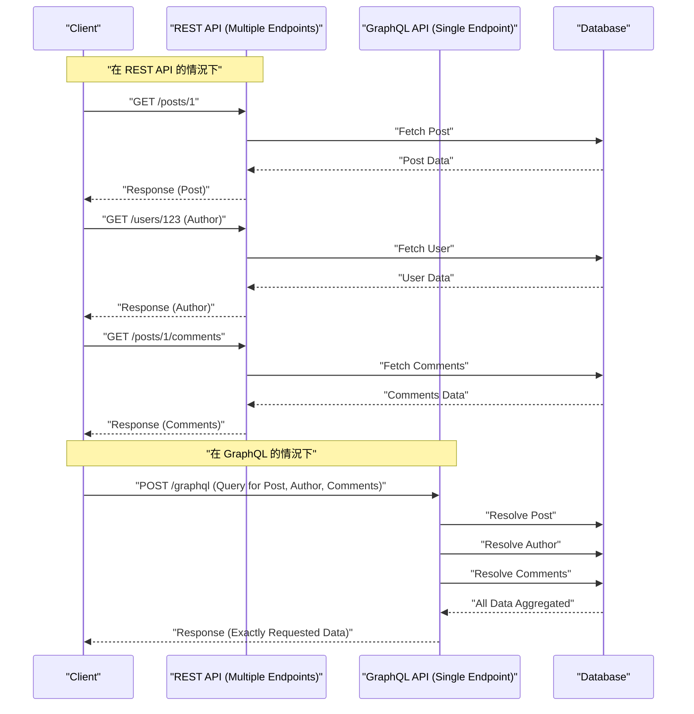

現代的 Web 開發中，連接後端與前端的 API 架構選擇，對應用程式的效能、開發效率以及可維護性有著深遠的影響。歷史上作為標準被採用的 **REST API**，憑藉著簡單直觀的設計原則而廣泛普及，但隨著前端的高度化與複雜化，各種課題也逐漸浮現。本文將從架構、資料獲取以及型別安全的角度，詳細且透徹地解說 REST API 所面臨的極限，以及為了解決這些問題而登場的 **GraphQL** 創新方法。

## 1. REST API 的架構風格原則與其極限

**REST** （Representational State Transfer）是由 Roy Fielding 在 2000 年提出的架構風格。它最大限度地發揮 HTTP 協定的基本功能，進行資源導向的設計。

### REST 的主要設計原則

設計 REST API 時，理想情況下需要滿足以下約束（RESTful API）。

1. **客戶端-伺服器分離** （Client-Server）：將使用者介面相關的關注點與資料儲存相關的關注點分離，使其能夠相互獨立地發展。
2. **無狀態** （Stateless）：伺服器不保留客戶端的工作階段狀態，每個請求必須包含完成處理所需的所有資訊，且獨立執行。
3. **可快取** （Cacheable）：為了提高網路效率，伺服器的回應必須明確指出是否可被快取。
4. **統一介面** （Uniform Interface）：基於資源識別（URI）、透過表現形式操作資源、自描述訊息、HATEOAS（Hypermedia as the Engine of Application State）等原則，提供整體一致的介面。
5. **分層系統** （Layered System）：客戶端無需意識到是直接連接到伺服器，還是透過中間代理或負載平衡器進行通訊。

憑藉這些原則，REST 在 Web 規模上建立了一個非常堅固的基礎。然而，在現代多樣化的設備與複雜的 UI 需求下，正面臨著以下將要敘述的課題。

## 2. 過度獲取與獲取不足問題

REST API 最顯著的課題是 **過度獲取** （Overfetching）與 **獲取不足** （Underfetching）。這些是由於 REST 以「資源」為單位，返回固定資料結構所引起的。

### 過度獲取（Overfetching）

過度獲取是指伺服器發送了多於客戶端所需資料的現象。

例如，假設有一個僅列表顯示使用者的「名字」與「頭像圖片」的畫面。當使用 REST API 呼叫 `/users` 端點時，通常會返回包含電子郵件地址、建立時間、詳細個人資料等在該畫面中完全用不到的大量資料的 JSON。在行動網路等頻寬受限的環境中，這種無謂的資料傳輸會成為效能下降的直接原因。

### 獲取不足（Underfetching）與 N+1 請求

另一方面，獲取不足是指僅靠來自一個端點的回應，無法獲得構建 UI 足夠的資料，從而需要發送額外請求的現象。

例如，在某個部落格文章的詳細頁面中，需要顯示「文章正文」、「作者資訊」與「文章留言列表」。在 REST API 中，通常必須像下面這樣向多個端點發送請求：

1. 透過 `/posts/1` 取得文章資料
2. 使用取得的 `author_id` 透過 `/users/{author_id}` 取得作者資訊
3. 為了取得文章的留言，向 `/posts/1/comments` 發送請求

結果，網路延遲不斷累積，導致初始顯示延遲。這就導致了構建 UI 時的 **N+1 請求問題**。

## 3. GraphQL 是什麼？其創新的方法

**GraphQL** 是由 Facebook（現為 Meta）於 2012 年開發，並在 2015 年開源的針對 API 的查詢語言，以及用於執行它的伺服器端執行環境。

### GraphQL 的核心概念

1. **單一端點** ：不同於 REST 為每個資源準備多個 URL（端點），GraphQL 通常僅使用 `/graphql` 這一個單一端點。
2. **宣告式資料獲取** ：客戶端準確地以查詢的形式描述需要什麼樣的資料結構，並向伺服器發出請求。伺服器則返回與請求結構完全一致的 JSON。
3. **強型別（結構描述驅動）** ：API 的規格由 GraphQL Schema Definition Language (SDL) 嚴格定義了型別。

藉此，客戶端變得能夠「只獲取所需數量的必要資料」，徹底解決了過度獲取與獲取不足的問題。

## 4. 架構比較（REST vs GraphQL）

下圖展示了前述獲取「文章」、「作者」、「留言」時，REST 與 GraphQL 請求流程的差異。



REST 中，客戶端與伺服器之間會發生多次來回傳輸，而 GraphQL 中可以看出，只需 1 次請求即可解析並返回所有所需的資料結構。

## 5. 結構描述驅動開發與資料結構的比較

GraphQL 最大的特點之一是 **結構描述驅動開發** （Schema-Driven Development）。前端與後端工程師首先會商議並定義 GraphQL 結構描述 (SDL)。這個結構描述成為了「契約」，雙方就可以並行推進開發工作。

### GraphQL 結構描述定義 (SDL) 的範例

```graphql
# type 用於定義物件
type User {
  id: ID!
  name: String!
  email: String!
  avatarUrl: String
  posts: [Post!]!
}

type Comment {
  id: ID!
  body: String!
  author: User!
}

type Post {
  id: ID!
  title: String!
  content: String!
  author: User!
  comments: [Comment!]!
}

# 查詢的入口點
type Query {
  post(id: ID!): Post
  user(id: ID!): User
}
```

（ `!` 表示必須・不可為 null）

### 請求與回應的比較

**在 REST API 的情況下（需要合成多個 JSON）**

`/posts/1` 的回應：
```json
{
  "id": "1",
  "title": "GraphQL的導入",
  "content": "GraphQL非常棒...",
  "author_id": "123"
}
```
此時，實際上只想知道 `author` 的名字，但在 REST 中只能取得 `author_id`，需要另外查詢使用者詳情，或者在後端準備一個強制結合的專用端點（例如：`/posts/1?include=author`）等應對方式。

**在 GraphQL 的情況下**

客戶端發送的查詢：
```graphql
query GetPostDetails {
  post(id: "1") {
    title
    content
    author {
      name
    }
    comments {
      body
      author {
        name
      }
    }
  }
}
```

來自伺服器的回應：
```json
{
  "data": {
    "post": {
      "title": "GraphQL的導入",
      "content": "GraphQL非常棒...",
      "author": {
        "name": "山田 太郎"
      },
      "comments": [
        {
          "body": "非常有參考價值！",
          "author": {
            "name": "佐藤 花子"
          }
        }
      ]
    }
  }
}
```
像這樣，與請求結構完全一致的 JSON 會在 1 次請求中返回。完全不會包含無用的欄位（如 email 等）。

## 6. 解析器的實作與後端的角色

GraphQL 伺服器會解析來自客戶端的查詢，並執行對應結構描述中各個欄位的稱為 **解析器** （Resolver）的函式來收集資料。

讓我們來看看在 Node.js（如 Apollo Server）中解析器的實作範例。

```typescript
const resolvers = {
  Query: {
    // 對 post 查詢的解析器
    post: async (parent, args, context) => {
      return await context.db.Post.findById(args.id);
    },
  },
  Post: {
    // Post 物件的 author 欄位的解析器
    author: async (parent, args, context) => {
      // parent 中包含父層的 Post 資料
      return await context.db.User.findById(parent.author_id);
    },
    comments: async (parent, args, context) => {
      return await context.db.Comment.find({ postId: parent.id });
    }
  },
  Comment: {
    author: async (parent, args, context) => {
      return await context.db.User.findById(parent.author_id);
    }
  }
};
```

像這樣，解析器會如同遍歷資料圖般地連鎖呼叫。後端實作者不需要考慮「在哪個 URL 返回什麼」，而是能夠集中精力處理「該如何把資料放進這個型別的這個欄位中」。

## 7. 後端的 N+1 問題與其解決方案（DataLoader）

前述的解析器實作中，潛藏著重大的效能缺陷。那就是後端側的 **N+1 問題**。

例如，假設執行了一個取得 10 篇文章列表，並獲取各自 `author` 的查詢。
1. 取得 10 篇文章的查詢執行 1 次（ `SELECT * FROM posts LIMIT 10` ）
2. 對每一篇文章呼叫 `Post.author` 解析器。
3. 結果，查詢作者的查詢執行了 10 次（ `SELECT * FROM users WHERE id = ?` × 10 ）

如果這是 100 篇、1000 篇，就會對資料庫造成巨大的負擔。解決這個問題的就是 Facebook 開發的稱為 **DataLoader** 的模式（函式庫）。

### 透過 DataLoader 進行批次處理與快取

DataLoader 活用了 JavaScript 的事件迴圈（微任務佇列），將 1 個 Tick 內發生的鍵值獲取請求批次化，合併為 1 個查詢。

```typescript
import DataLoader from 'dataloader';

// DataLoader 的實例化。定義批次函式。
const userLoader = new DataLoader(async (userIds) => {
  // 會傳入如 [1, 2, 3] 的 ID 陣列
  // 透過 1 次 IN 查詢統一取得
  const users = await db.User.find({ id: { $in: userIds } });
  
  // 必須返回與 userIds 順序對應的陣列
  const userMap = users.reduce((acc, user) => {
    acc[user.id] = user;
    return acc;
  }, {});
  return userIds.map(id => userMap[id] || null);
});

// 在解析器中的使用
const resolvers = {
  Post: {
    author: (parent, args, context) => {
      // 指定 id 進行載入，但在背後會被批次化
      return context.loaders.userLoader.load(parent.author_id);
    }
  }
};
```

藉此，即使是剛才的例子，查詢作者的查詢也將被優化為只有 1 次 `SELECT * FROM users WHERE id IN (?, ?, ...)`。要在實際營運環境中擴展 GraphQL，可以說導入 DataLoader 是事實上必須的。

## 8. GraphQL Code Generator 所帶來的極致型別安全

GraphQL 的型別系統（結構描述），為前端開發帶來了極大的好處。透過使用如 **GraphQL Code Generator** 這樣的工具，可以從結構描述自動產生 TypeScript 的型別定義以及用於資料獲取的自訂 Hooks（在 React 的情況下）。

在 REST API 中，也可以從 Swagger（OpenAPI）產生型別，但在 GraphQL 的情況下，甚至能產生客戶端「在查詢中指定的形狀」的型別定義，這一點擁有壓倒性的優勢。

1. 讀取 **結構描述檔案** 與 **客戶端撰寫的查詢字串（.graphql 檔案）**。
2. GraphQL Code Gen 會產生與該查詢回應完全一致的 TypeScript 型別（Interface）。

```typescript
// 自動產生的 Hooks 使用範例 (Apollo Client)
import { useGetPostDetailsQuery } from '../generated/graphql';

const PostPage = ({ postId }: { postId: string }) => {
  const { data, loading, error } = useGetPostDetailsQuery({
    variables: { id: postId }
  });

  if (loading) return <p>Loading...</p>;
  if (error) return <p>Error</p>;
  
  // data 的型別會嚴格地推斷為查詢中所指定的樣子！
  // data.post.title 會被識別為 string 型別
  // 如果嘗試存取未包含在查詢中的欄位（如 email 等），就會產生 TS 編譯錯誤
  return (
    <div>
      <h1>{data?.post?.title}</h1>
      <p>Author: {data?.post?.author.name}</p>
    </div>
  );
};
```

藉此，可以在靜態分析（編譯時）幾乎防止「執行時因屬性為 undefined 而崩潰」這類錯誤，讓前端的 DX（開發者體驗）大幅提升。

## 9. 進階的快取策略：Apollo Client 與 Relay

REST API 的長處之一，是易於利用 HTTP 標準的快取機制（如 ETag、Cache-Control 等）。因為 GraphQL 原則上全部透過 POST 請求利用單一端點，因此 HTTP 層級的快取非常困難（雖然有 Persisted Queries 等手法）。

取而代之的是，在 GraphQL 生態系統中，具備強大 **客戶端快取** （正規化快取）的客戶端函式庫得到了進化。代表性的是 **Apollo Client** 與 **Relay**。

### 正規化快取 (Normalized Cache) 是什麼

像 Apollo Client 這樣聰明的 GraphQL 客戶端，並不會將作為回應接收到的 JSON 樹狀結構原封不動地儲存，而是將其儲存為扁平的記錄儲存庫。
每個物件會以 `__typename` （型別名稱）與 `id` （唯一識別碼）的組合（例如：`Post:1`）作為鍵值被儲存（正規化）。

這個機制帶來了驚人的好處。
例如，假設有一個「文章列表」的查詢，與一個「文章詳情」的查詢。
1. 使用者打開「文章詳情」畫面，編輯了文章標題（Mutation）。
2. 從伺服器返回包含了新標題的回應（ `id` 與 `title` ）。
3. Apollo Client 會自動更新儲存庫內的 `Post:1` 資料。
4. 於是，「文章列表」畫面中顯示的相同 `Post:1` 的資訊，也 **會自動重新渲染，並同步為最新狀態**。

工程師不再需要手動撰寫狀態管理（如 [Redux](https://kenji.blog/zh-tw/p/state-management-history-redux-context-recoil-zustand/) 等）的更新程式碼，整個 UI 的資料一致性由函式庫來保證。在建構複雜的 SPA（單頁應用程式）時，這是 GraphQL 相對於 REST 具有決定性優勢的部分。

### Relay - Facebook 引以為傲的終極 GraphQL 客戶端

由 React 的開發者 Facebook 所製作的 **Relay**，採取了比 Apollo 更嚴格、更專注於效能的方法。
它將各個元件所需的資料定義為 **Fragment（片段）**，並由父元件將其彙整，作為一個巨大的查詢發送給伺服器。由於資料的依賴關係被封裝在元件層級，因此能夠徹底排除「刪除了元件，但查詢中卻殘留著不必要欄位」這類問題，實現極度進階的架構。

## 10. 應該採用 GraphQL 嗎？（權衡與結論）

到此為止敘述了 GraphQL 強大的優點，但它絕不是「永遠優於 REST 的萬靈丹」。

**GraphQL 的缺點 / 導入的門檻**
* **學習成本** ：後端與前端都要求典範轉移，存在著學習曲線的障礙。
* **複雜的後端實作** ：必須進行伺服器端的防禦性實作，例如迴避 N+1 問題的 DataLoader 設計、針對複雜查詢（遞迴且深層結構的請求）的效能調校、基於查詢複雜度（Complexity）的速率限制等。
* **對於簡單的 API 而言過於沉重** ：如果資料的更新與獲取需求簡單，且 UI 複雜度較低的小型應用程式，REST 的簡單性會更勝一籌。

### 總結

REST API 依然是個出色的架構，在公開 API 與服務間通訊（微服務）等領域，將持續作為強而有力的選項。

另一方面，在高度互動且資料需求複雜的現代 Web 與行動應用程式中，**GraphQL** 提供了「消滅過度獲取 / 獲取不足」、「透過強大型別推斷實現安全的前端開發」、「透過正規化快取實現狀態管理自動化」等壓倒性的 DX 與 UX。

謹慎評估開發團隊的技能組合、產品的複雜度以及未來的規模擴展，並選擇最適合的 API 架構，將是現代軟體開發中最重要決策之一。
