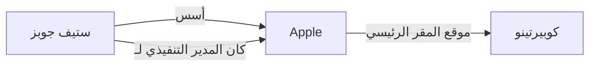
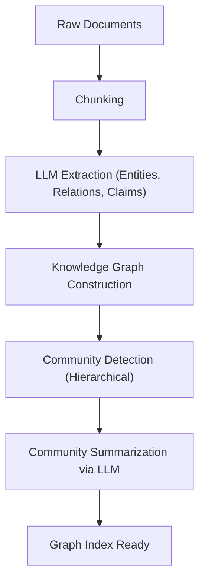

# تطور RAG: دمج GraphRAG ورسوم المعرفة البيانية

مع ظهور النماذج اللغوية الكبيرة (LLM)، حقق مجال معالجة اللغات الطبيعية قفزات هائلة. ومع ذلك، تواجه LLMs بمفردها تحديات مثل "عدم القدرة على التعامل مع أحدث المعلومات غير المشمولة في بيانات التدريب" واحتمالية "التسبب في الهلوسة". للحل تم نشر **RAG (الجيل المعزز بالاسترجاع)** على نطاق واسع كطريقة للتغلب على هذه المشكلات.

في RAG التقليدي، كان الاتجاه السائد هو "البحث المتجهي"، حيث يتم تقسيم المستندات إلى أجزاء (chunks)، وتحويلها إلى متجهات، وإجراء بحث عن التشابه. ومع ذلك، عندما يتعلق الأمر بالسياقات المعقدة أو استنتاج المعلومات عبر مستندات متعددة، فإن البحث المتجهي البسيط يصل إلى حدوده. لذلك، يتزايد الاهتمام حالياً بـ **"GraphRAG"**، الذي يدمج **رسوم المعرفة البيانية (Knowledge Graph)** مع RAG.

في هذا المقال، انطلاقاً من التحديات التي يواجهها RAG التقليدي القائم على البحث المتجهي، سنتعمق في تفاصيل طرق استخراج الروابط الدلالية باستخدام رسوم المعرفة البيانية، وصولاً إلى بنية GraphRAG وأفضل الممارسات لتنفيذها.

---

## 1. حدود RAG التقليدي القائم على البحث المتجهي

### آلية البحث المتجهي ومزاياه

يعمل RAG التقليدي بشكل أساسي وفقاً للتدفق التالي:

1. **فهرسة المستندات**: يتم قراءة البيانات غير المنظمة مثل ملفات PDF وملفات النصوص وملفات Wiki الداخلية للشركة، وتقسيمها إلى أحجام معينة (أجزاء).
2. **إنشاء التضمين (Embedding)**: يتم تحويل كل جزء تم تقسيمه إلى نقطة في فضاء متجهي متعدد الأبعاد باستخدام نموذج تضمين.
3. **التخزين في قاعدة بيانات المتجهات**: يتم حفظ المتجهات الناتجة مع النص الأصلي في قاعدة بيانات المتجهات (مثل Pinecone، Milvus، Qdrant وغيرها).
4. **البحث والتوليد**: عندما يُدخل المستخدم سؤالاً، يتم تحويل نص السؤال بالمثل إلى متجه، وحساب تشابه جيب التمام مع المتجهات في قاعدة البيانات، واسترداد الأجزاء الأكثر تشابهاً. يتم دمج الأجزاء المستردة كسياق في موجه (prompt) نموذج LLM لتوليد إجابة.

تتميز هذه الطريقة بكونها بسيطة وقوية، وهي ممتازة جداً في العثور على حقائق محددة أو معلومات مذكورة في مستند واحد.

### التحديات والقيود التي يواجهها

ومع ذلك، في بيئات التشغيل الفعلية، بدأ RAG القائم على البحث المتجهي البسيط في إظهار بعض القيود الأساسية.

#### 1. صعوبة "الاستنتاج متعدد الخطوات" لدمج معلومات متعددة

لنفكر في حالة يكون فيها سؤال المستخدم معقداً مثل "ما هو عدد سكان المدينة التي تقع فيها الجامعة التي تخرج منها المدير التنفيذي للشركة A؟". للإجابة على هذا السؤال، يجب اتباع الخطوات التالية:
- معرفة أن المدير التنفيذي للشركة A هو "تارو يامادا".
- معرفة أن الجامعة التي تخرج منها "تارو يامادا" هي "جامعة طوكيو".
- معرفة أن المدينة التي تقع فيها "جامعة طوكيو" هي "طوكيو".
- معرفة عدد سكان "طوكيو".

يمكن للبحث المتجهي العثور على أجزاء النص القريبة دلالياً من سلسلة الأحرف "المدير التنفيذي للشركة A"، لكن من الصعب جداً تتبع الحقائق المتناثرة عبر مستندات متعددة بشكل تسلسلي (استنتاج متعدد الخطوات) كما هو موضح أعلاه. هذا لأن التضمين يعبر فقط عن "التقارب الدلالي" العام للنص، ولا يحتفظ بالعلاقات المنطقية المحددة بين الكيانات.

#### 2. الافتقار إلى الفهم الشامل (Global Understanding)

لا يعمل البحث المتجهي مع الأسئلة الواسعة (الاستعلامات الشاملة) الموجهة لمجموعة كبيرة من المستندات بأكملها، مثل "ما هو الموضوع الرئيسي في مجموعة البيانات هذه؟" أو "أريد ملخصاً للصورة العامة". لأن البحث المتجهي يقوم فقط باستخراج "الأجزاء المحلية المتشابهة" (بحث k-NN)، فإنه لا يستطيع توليد إجابات تقدم نظرة عامة على الكل.

#### 3. معضلة حجم الجزء وتجزؤ السياق

عند تقسيم النص إلى أجزاء، يظل تحديد "الحجم المناسب للتقسيم" تحدياً كبيراً دائماً. إذا كان الجزء صغيراً جداً، يُفقد السياق وتتجزأ المعلومات. على العكس، إذا كان كبيراً جداً، تزداد نسبة الضوضاء غير ذات الصلة، وتقل دقة البحث. على الرغم من وجود طرق لتقسيم الأجزاء عند الحدود الدلالية (التقسيم الدلالي)، إلا أن فقدان السياق الناتج عن "تقطيع المستند" أمر لا مفر منه بطبيعته.

---

## 2. ما هي رسوم المعرفة البيانية (Knowledge Graph)؟

### المفهوم الأساسي لرسوم المعرفة البيانية

رسم المعرفة البياني هو تمثيل لكيانات العالم الحقيقي (الأشخاص، الأماكن، المنظمات، المفاهيم، إلخ) والعلاقات بينها كبنية شبكية (رسم بياني).

يتكون رسم المعرفة البياني بشكل أساسي من "عقد (Nodes)" و "حواف (Edges)".
- **العقدة (Node)**: تمثل كياناً. (مثال: "ستيف جوبز"، "Apple")
- **الحافة (Edge)**: تمثل العلاقة بين الكيانات. (مثال: "أسس"، "المدير التنفيذي لـ")

عادةً ما يتم التعبير عن هذه العناصر كثلاثيات (Triples) تتكون من **الفاعل-المسند-المفعول به (Subject-Predicate-Object)**.
(مثال: `ستيف جوبز (Subject) -- أسس (Predicate) --> Apple (Object)`)

### لماذا يحتاج RAG إلى رسوم المعرفة البيانية؟

بينما يقيس البحث المتجهي "المسافة في الفضاء الدلالي"، فإن رسم المعرفة البياني ينمذج "العلاقات الواضحة بين الحقائق". من خلال دمج رسم المعرفة البياني مع RAG، يتم الحصول على الفوائد التالية:

1. **فهم العلاقات الدقيقة**: نظراً لأنه يمكن تتبع العلاقات المنطقية الواضحة مثل "A جزء من B" أو "C يمتلك D"، يمكن تقليل الهلوسة بشكل كبير.
2. **الاستنتاج المعقد (البحث متعدد الخطوات)**: من خلال تتبع (العبور عبر) عقد الرسم البياني، يصبح من الممكن إجراء استنتاج عبر كيانات متعددة.
3. **تلخيص المعلومات الشاملة**: من خلال تحليل بنية الرسم البياني بأكملها، أو مجتمعات معينة (مجموعات من العقد المرتبطة بكثافة)، يصبح من الممكن توليد اتجاهات وملخصات لمجموعة المستندات بأكملها.

---

## 3. بنية GraphRAG وتدفق المعالجة

GraphRAG (الجيل المعزز باسترجاع الرسم البياني) هو نهج يقوم ببناء رسم معرفة بياني من النصوص غير المنظمة ودمجه في عملية البحث والتوليد الخاصة بنموذج LLM. سنشرح الخطوات التفصيلية استناداً إلى بنية GraphRAG التي اقترحها فريق بحث Microsoft، وهي نهج تمثيلي.

### المرحلة 1: بناء الفهرس (Indexing Phase)

المرحلة الأكثر أهمية، والأكثر تكلفة من الناحية الحسابية في GraphRAG، هي بناء رسم المعرفة البياني من النصوص غير المنظمة.

#### 1.1 تقسيم النص (Text Chunking)
على غرار RAG التقليدي، يتم أولاً تقسيم مستند الإدخال إلى أجزاء نصية بحجم مناسب.

#### 1.2 استخراج الكيانات والعلاقات (Entity & Relationship Extraction)
هذا هو جوهر GraphRAG. باستخدام LLM، يتم استخراج الكيانات (العقد) والعلاقات (الحواف) من كل جزء.
يتم إعطاء موجه (prompt) مثل هذا لـ LLM:
"من النص التالي، استخرج جميع الأشخاص، المنظمات، الأماكن، والمفاهيم، وحدد العلاقات بينها، وأخرجها بتنسيق (Source Node, Relationship, Target Node, Description)."

من خلال هذه العملية، يتم تحويل الحقائق الصريحة في النص إلى بيانات منظمة.

#### 1.3 بناء الرسم البياني وحل الكيانات (Graph Construction & Entity Resolution)
يتم دمج الثلاثيات المستخرجة لبناء رسم بياني ضخم واحد. في هذا الوقت، يصبح "حل الكيانات (Entity Resolution)" بالغ الأهمية.
على سبيل المثال، إذا تم استخراج كيانات مثل "Apple Inc." و "أبل" و "الشركة نفسها" من أجزاء مختلفة، فيجب تحديد أنها تشير إلى نفس الشيء ودمجها كعقدة واحدة على الرسم البياني.

#### 1.4 اكتشاف المجتمعات وتلخيصها (Community Detection & Summarization)
على رسم المعرفة البياني المبني، يتم تطبيق خوارزميات نظرية الرسم البياني (مثل خوارزمية Leiden، طريقة Louvain) لاكتشاف مجموعات العقد المرتبطة بكثافة (المجتمعات). تمثل هذه المجتمعات "المواضيع" أو "السمات" داخل مجموعة البيانات.
علاوة على ذلك، يتم استخدام LLM لتوليد ملخص لكل مجتمع (Community Summary). من خلال التجميع الهرمي (Hierarchical Clustering)، يتم إنشاء ملخصات بتفاصيل مختلفة، من المستوى العام إلى المستوى التفصيلي.

### المرحلة 2: البحث والتوليد (Query Phase)

بعد بناء الفهرس، هذه هي مرحلة توليد الإجابات لأسئلة المستخدمين. يستخدم GraphRAG استراتيجيات بحث مختلفة (البحث المحلي / البحث الشامل) بناءً على طبيعة السؤال.

#### 2.1 البحث المحلي (Local Search)
مناسب للأسئلة التفصيلية حول كيانات أو حقائق معينة. (مثال: "ما هو دور السيد فلان في حادثة كذا؟")

1. **تحديد الكيانات**: يتم استخراج الكيانات المهمة من سؤال المستخدم.
2. **استرداد العقد**: يتم العثور على العقد المتعلقة بالكيانات المستخرجة من رسم المعرفة البياني.
3. **جمع السياق**: يتم جمع الحواف (العلاقات) المتصلة مباشرة بالعقد المكتشفة، وأجزاء النص ذات الصلة، وملخصات المجتمعات التي تنتمي إليها تلك العقد.
4. **توليد الإجابة**: يتم تمرير المعلومات المجمعة كموجه لـ LLM لتوليد إجابة.

#### 2.2 البحث الشامل (Global Search)
مناسب للأسئلة الشاملة والملخصة التي تغطي مجموعة البيانات بأكملها. (مثال: "لخص الموضوعات الرئيسية وهياكل الصراع في مجموعة البيانات هذه")

1. **المعالجة المتوازية لملخصات المجتمعات**: استجابةً للسؤال، يتم تمرير ملخصات المجتمعات التي تم إنشاؤها مسبقاً (بالتوازي إذا لزم الأمر) إلى LLM، ويتم تقييم وتصفية مدى فائدة كل ملخص للإجابة على السؤال.
2. **توليد إجابات وسيطة**: لكل ملخص مجتمع يعتبر مفيداً، يتم توليد إجابة وسيطة (Intermediate Response).
3. **دمج الإجابة النهائية**: يتم دمج جميع الإجابات الوسيطة لتوليد إجابة نهائية شاملة. هذه العملية تشبه إلى حد ما مفهوم Map-Reduce.

---

## 4. تقنيات متقدمة وتحديات في تنفيذ GraphRAG

لنجاح تشغيل GraphRAG في بيئة الإنتاج الفعلية، يجب التغلب على العديد من العقبات التقنية.

### تحسين دقة الاستخراج وتحسين التكلفة

في مرحلة بناء الفهرس، نظراً لأنه يتم تمرير جميع أجزاء النص عبر LLM لاستخراج الكيانات، فإن استهلاك الرموز (تكلفة API) يصبح هائلاً.
- **استخدام النماذج الخفيفة**: بدلاً من النماذج الضخمة بفئة GPT-4 لمهمة الاستخراج، يمكن تحسين التكلفة والسرعة باستخدام نماذج صغيرة إلى متوسطة الحجم تم ضبطها دقيقاً (Fine-tuned) (مثل Llama 3 8B, Mistral) أو نماذج مخصصة لاستخراج المعلومات (مثل GLiNER).
- **تعريف الأنطولوجيا**: من خلال التحديد المسبق للمخطط (الأنطولوجيا) وتوجيه LLM حول أنواع الكيانات (مثل شخص، منظمة، مهارة تقنية، إلخ) والعلاقات التي تريد استخراجها، ستتحسن دقة واتساق الاستخراج.

### النهج الهجين (Vector + Graph)

في الواقع، البحث المتجهي و GraphRAG ليسا حصريين. البنية الأقوى هي **البحث الهجين** الذي يجمع بينهما.

1. بالنسبة لسؤال المستخدم، يتم استرداد الأجزاء ذات الصلة باستخدام البحث المتجهي التقليدي.
2. في نفس الوقت، يتم استرداد الهياكل الفرعية للرسم البياني ذات الصلة باستخدام البحث المحلي لـ GraphRAG.
3. يتم دمج كلا السياقين وتقديمهما إلى LLM.

يتفوق البحث المتجهي في التقاط "التشابه الدلالي الضمني" و "الفروق الدقيقة"، بينما يتفوق رسم المعرفة البياني في التقاط "العلاقات الواقعية الصريحة". من خلال تكملة بعضهما البعض، يتحقق نظام RAG قوي للغاية.

### اختيار قاعدة بيانات الرسم البياني الخصائصية

يعد اختيار قاعدة البيانات (قاعدة بيانات الرسم البياني) لحفظ والاستعلام عن رسم المعرفة البياني أمراً مهماً أيضاً. Neo4j هي الأكثر شهرة وتتمتع بنظام بيئي ناضج، ولكن في السنوات الأخيرة، اكتسبت قواعد البيانات التي تدمج ميزات البحث المتجهي واستعلامات الرسم البياني (مثل Cypher أو Gremlin) (مثل NebulaGraph، ArangoDB، أو تكوين يجمع بين PostgreSQL مع Apache AGE و pgvector) شعبية متزايدة.

---

## 5. الخلاصة والتطلعات المستقبلية

لقد أدى RAG التقليدي القائم على المتجهات إلى تقدم كبير في الاستخدام العملي للذكاء الاصطناعي التوليدي، لكنه كان مقيداً في الاستنتاج متعدد الخطوات وفهم الهيكل العام. يوفر "GraphRAG"، الذي يدمج رسوم المعرفة البيانية مع RAG، "هيكلاً دلالياً ومنطقياً" للبيانات، مما يتيح الإجابة على أسئلة أكثر دقة وتعقيداً، ويحقق نظام ذكاء اصطناعي من الجيل التالي يقلل من الهلوسة.

على الرغم من أنه لا تزال هناك تحديات يجب حلها، مثل تكلفة البناء العالية وصعوبة استخراج الكيانات، فمن المؤكد أن GraphRAG سيصبح البنية القياسية للذكاء الاصطناعي للمؤسسات بفضل تطور LLM نفسه وتحسين خوارزميات الاستخراج.

من مجرد "بحث نصي" إلى "استكشاف شبكة المعرفة". هناك توقعات كبيرة للإمكانيات الجديدة لـ RAG التي يفتحها GraphRAG في المستقبل.
