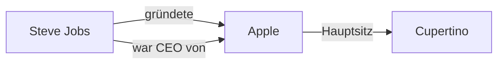
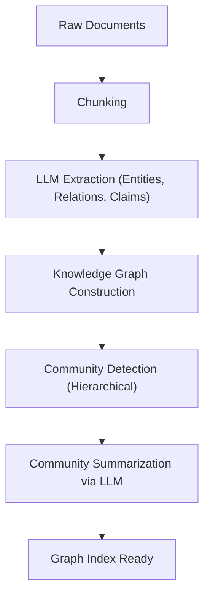

# Die Evolution von RAG: GraphRAG und die Integration von Wissensgraphen

Mit dem Aufstieg von Large Language Models (LLMs) hat der Bereich der Verarbeitung natürlicher Sprache einen dramatischen Fortschritt gemacht. Dennoch haben LLMs für sich allein genommen noch Herausforderungen, wie etwa "die Unfähigkeit, mit den neuesten Informationen umzugehen, die nicht in den Trainingsdaten enthalten sind" und "die Möglichkeit, Halluzinationen zu verursachen". Eine weithin übernommene Lösung für diese Probleme ist **RAG (Retrieval-Augmented Generation)**.

Herkömmliches RAG stützt sich hauptsächlich auf die "Vektorsuche", bei der Dokumente in Chunks unterteilt, in Vektoren umgewandelt und auf Ähnlichkeit gesucht werden. Bei komplexen Kontexten oder dem Ableiten von Informationen über mehrere Dokumente hinweg stößt die einfache Vektorsuche jedoch an ihre Grenzen. Daher gewinnt **GraphRAG**, welches **Wissensgraphen (Knowledge Graphs)** mit RAG integriert, derzeit stark an Aufmerksamkeit.

In diesem Artikel werden wir im Detail auf die Herausforderungen des herkömmlichen, auf Vektorsuche basierenden RAG eingehen, Methoden zur Extraktion semantischer Verbindungen mithilfe von Wissensgraphen untersuchen und uns tiefgehend mit der Architektur von GraphRAG und Best Practices für seine Implementierung befassen.

---

## 1. Die Grenzen des herkömmlichen, auf Vektorsuche basierenden RAG

### Der Mechanismus und die Vorteile der Vektorsuche

Herkömmliches RAG arbeitet hauptsächlich nach folgendem Ablauf:

1. **Dokumenten-Indizierung**: Unstrukturierte Daten wie unternehmensinterne PDFs, Textdateien und Unternehmens-Wikis werden eingelesen und in Textblöcke (Chunks) einer bestimmten Größe aufgeteilt.
2. **Generierung von Embeddings**: Jeder aufgeteilte Chunk wird mithilfe eines Embedding-Modells in einen Punkt in einem mehrdimensionalen Vektorraum umgewandelt.
3. **Speicherung in einer Vektordatenbank**: Die generierten Vektoren werden zusammen mit dem Originaltext in einer Vektordatenbank (z. B. Pinecone, Milvus, Qdrant) gespeichert.
4. **Suche und Generierung**: Wenn ein Benutzer eine Frage eingibt, wird die Frage ebenfalls vektorisiert. Dann wird die Kosinus-Ähnlichkeit mit den Vektoren in der Datenbank berechnet, um die ähnlichsten Chunks abzurufen. Die abgerufenen Chunks werden als Kontext in den LLM-Prompt eingebettet, um eine Antwort zu generieren.

Dieser Ansatz ist einfach, aber leistungsstark und eignet sich sehr gut, um bestimmte Fakten oder Informationen in einem einzelnen Dokument zu finden.

### Herausforderungen und Grenzen

In realen Produktionsumgebungen beginnt das einfache, auf Vektorsuche basierende RAG jedoch, einige grundlegende Grenzen zu offenbaren.

#### 1. Die Schwierigkeit der "Multi-Hop-Schlussfolgerung", um mehrere Informationen zu integrieren

Stellen wir uns vor, die Frage eines Benutzers ist komplex, wie etwa: "Wie groß ist die Bevölkerung der Stadt, in der sich die Universität befindet, an der der CEO von Unternehmen A seinen Abschluss gemacht hat?" Um diese Frage zu beantworten, sind die folgenden Schritte erforderlich:
- Herausfinden, dass der CEO von Unternehmen A "Taro Yamada" ist.
- Herausfinden, dass die Universität, an der "Taro Yamada" seinen Abschluss gemacht hat, die "Universität Tokio" ist.
- Herausfinden, dass sich die "Universität Tokio" in der Stadt "Tokio" befindet.
- Die Einwohnerzahl von "Tokio" herausfinden.

Während die Vektorsuche Textfragmente finden kann, die semantisch ähnlich dem Begriff "CEO von Unternehmen A" sind, ist es extrem schwierig, Fakten, die über mehrere Dokumente verstreut sind, wie oben in einer Kette (Multi-Hop-Schlussfolgerung) zu verfolgen. Das liegt daran, dass Embeddings lediglich die "semantische Nähe" des Textes als Ganzes darstellen und keine spezifischen logischen Beziehungen zwischen Entitäten bewahren.

#### 2. Der Mangel an globalem Verständnis (Global Understanding)

Bei umfassenden Fragen (Global Queries) über eine große Menge von Dokumenten, wie etwa "Was sind die Hauptthemen in diesem Datensatz?" oder "Bitte fassen Sie das Gesamtbild zusammen", funktioniert die Vektorsuche nicht gut. Da die Vektorsuche nur "lokale ähnliche Teile" extrahiert (k-NN-Suche), kann sie keine Antwort generieren, die das Ganze überblickt.

#### 3. Das Dilemma der Chunk-Größe und der Fragmentierung des Kontexts

Bei der Aufteilung von Text in Chunks ist "in welche Größe aufgeteilt werden soll" immer eine große Herausforderung. Sind die Chunks zu klein, geht der Kontext verloren und die Informationen werden fragmentiert. Sind sie hingegen zu groß, steigt der Anteil an irrelevantem Rauschen und die Suchgenauigkeit sinkt. Zwar gibt es Methoden, um Chunks an semantischen Grenzen zu teilen (Semantic Chunking), doch der Kontextverlust durch das inhärente "Zerschneiden von Dokumenten" ist unvermeidlich.

---

## 2. Was ist ein Wissensgraph (Knowledge Graph)?

### Grundkonzept des Wissensgraphen

Ein Wissensgraph repräsentiert Entitäten der realen Welt (Menschen, Orte, Organisationen, Konzepte usw.) und die Beziehungen zwischen ihnen als Netzwerkstruktur (Graph).

Wissensgraphen bestehen im Wesentlichen aus "Knoten (Nodes)" und "Kanten (Edges)".
- **Knoten (Node)**: Repräsentiert eine Entität. (z. B. "Steve Jobs", "Apple")
- **Kante (Edge)**: Repräsentiert die Beziehung zwischen Entitäten. (z. B. "gründete", "ist CEO von")

Diese Elemente werden üblicherweise als Triplett von **Subjekt-Prädikat-Objekt (Subject-Predicate-Object)** dargestellt.
(Beispiel: `Steve Jobs (Subject) -- gründete (Predicate) --> Apple (Object)`)

### Warum benötigt RAG einen Wissensgraphen?

Während die Vektorsuche die "Entfernung im semantischen Raum" misst, modelliert ein Wissensgraph "klare Beziehungen zwischen Fakten". Die Integration von Wissensgraphen in RAG bietet folgende Vorteile:

1. **Genaue Erfassung von Beziehungen**: Durch das Verfolgen klarer logischer Beziehungen wie "A ist Teil von B" oder "C besitzt D" können Halluzinationen drastisch reduziert werden.
2. **Komplexe Schlussfolgerungen (Multi-Hop-Suche)**: Das Durchlaufen (Traversieren) der Knoten des Graphen ermöglicht Schlussfolgerungen über mehrere Entitäten hinweg.
3. **Zusammenfassung globaler Informationen**: Durch die Analyse der gesamten Graphenstruktur oder bestimmter Communities (dicht verbundene Gruppen von Knoten) ist es möglich, Trends und Zusammenfassungen ganzer Dokumentensammlungen zu erstellen.

---

## 3. Architektur und Verarbeitungsablauf von GraphRAG

GraphRAG (Graph Retrieval-Augmented Generation) ist eine Methode zur Konstruktion eines Wissensgraphen aus unstrukturiertem Text und dessen Integration in den Such- und Generierungsprozess eines LLM. Wir werden die detaillierten Schritte basierend auf der Architektur von GraphRAG erklären, einem repräsentativen Ansatz, der von Microsoft-Forschern vorgeschlagen wurde.

### Phase 1: Indexierungsphase (Indexing Phase)

Die wichtigste und rechenintensivste Phase von GraphRAG ist die Konstruktion des Wissensgraphen aus unstrukturiertem Text.

#### 1.1 Text-Chunking (Text Chunking)
Ähnlich wie beim herkömmlichen RAG werden die Eingabedokumente zunächst in Text-Chunks geeigneter Größe unterteilt.

#### 1.2 Extraktion von Entitäten und Beziehungen (Entity & Relationship Extraction)
Dies ist der Kern von GraphRAG. Ein LLM wird verwendet, um Entitäten (Knoten) und Beziehungen (Kanten) aus jedem Chunk zu extrahieren.
Dem LLM wird ein Prompt wie der folgende gegeben:
"Extrahieren Sie aus dem folgenden Text alle Personen, Organisationen, Orte und Konzepte, identifizieren Sie die Beziehungen zwischen ihnen und geben Sie sie im Format (Source Node, Relationship, Target Node, Description) aus."

Durch diesen Prozess werden explizite Fakten im Text in strukturierte Daten umgewandelt.

#### 1.3 Graphenkonstruktion und Entitätsauflösung (Graph Construction & Entity Resolution)
Die extrahierten Tripletts werden integriert, um einen riesigen Graphen zu bilden. In dieser Phase wird die "Entity Resolution (Entitätsauflösung)" extrem wichtig.
Wenn beispielsweise die Entitäten "Apple Inc.", "Apple" und "das Unternehmen" aus verschiedenen Chunks extrahiert werden, muss erkannt werden, dass sie sich auf dasselbe beziehen, und sie müssen als derselbe Knoten auf dem Graphen zusammengeführt werden.

#### 1.4 Community-Erkennung und -Zusammenfassung (Community Detection & Summarization)
Auf den konstruierten Wissensgraphen werden graphentheoretische Algorithmen (z. B. Leiden-Algorithmus, Louvain-Methode) angewendet, um Gruppen von dicht verbundenen Knoten (Communities) zu erkennen. Diese Communities repräsentieren "Themen" oder "Schwerpunkte" im Datensatz.
Darüber hinaus wird ein LLM verwendet, um eine Zusammenfassung für jede Community (Community Summary) zu generieren. Durch hierarchisches Clustering werden Zusammenfassungen mit unterschiedlichen Granularitätsgraden erstellt, von der globalen bis zur detaillierten Ebene.

### Phase 2: Abfragephase (Query Phase)

Nachdem der Index erstellt wurde, ist dies die Phase, in der Antworten auf Benutzerfragen generiert werden. GraphRAG verwendet je nach Art der Frage unterschiedliche Suchstrategien (Local Search / Global Search).

#### 2.1 Lokale Suche (Local Search)
Geeignet für detaillierte Fragen zu bestimmten Entitäten oder Fakten. (z. B. "Welche Rolle spielte Herr △△ im 〇〇-Vorfall?")

1. **Entitätsidentifikation**: Wichtige Entitäten werden aus der Benutzerfrage extrahiert.
2. **Knotenabruf**: Knoten, die mit den extrahierten Entitäten in Beziehung stehen, werden im Wissensgraphen gefunden.
3. **Kontextsammlung**: Kanten (Beziehungen), die direkt mit den gefundenen Knoten verbunden sind, zugehörige Text-Chunks und die Zusammenfassung der Community, zu der der Knoten gehört, werden gesammelt.
4. **Antwortgenerierung**: Die gesammelten Informationen werden als Prompt an das LLM übergeben, um eine Antwort zu generieren.

#### 2.2 Globale Suche (Global Search)
Geeignet für breite, zusammenfassende Fragen, die sich über den gesamten Datensatz erstrecken. (z. B. "Fassen Sie die Hauptthemen und Konflikte dieses Datensatzes zusammen.")

1. **Parallele Verarbeitung von Community-Zusammenfassungen**: Als Antwort auf die Frage werden die vorab generierten Community-Zusammenfassungen an das LLM übergeben (falls erforderlich parallel), um zu bewerten und zu filtern, wie nützlich jede Zusammenfassung für die Beantwortung der Frage ist.
2. **Generierung von Zwischenantworten**: Für jede als nützlich erachtete Community-Zusammenfassung wird eine Zwischenantwort (Intermediate Response) generiert.
3. **Integration zur endgültigen Antwort**: Alle Zwischenantworten werden integriert, um die endgültige, umfassende Antwort zu generieren. Dies ist ein Prozess, der dem Konzept von Map-Reduce ähnelt.

---

## 4. Fortgeschrittene Techniken und Herausforderungen bei der GraphRAG-Implementierung

Um GraphRAG in einer Produktionsumgebung erfolgreich einzusetzen, müssen einige technische Hürden überwunden werden.

### Verbesserung der Extraktionsgenauigkeit und Kostenoptimierung

In der Indexierungsphase wird die Entitätsextraktion durchgeführt, indem alle Text-Chunks durch das LLM geleitet werden, was zu einem enormen Token-Verbrauch (API-Kosten) führt.
- **Verwendung leichtgewichtiger Modelle**: Für Extraktionsaufgaben können Kosten und Geschwindigkeit optimiert werden, indem feinabgestimmte kleine bis mittlere Modelle (Llama 3 8B, Mistral usw.) oder auf Informationsextraktion spezialisierte Modelle (z. B. GLiNER) anstelle von riesigen Modellen der GPT-4-Klasse verwendet werden.
- **Definition der Ontologie**: Durch die vorherige Definition eines Schemas (Ontologie), das dem LLM vorgibt, welche Arten von Entitäten (Person, Organization, TechSkill usw.) und Beziehungen extrahiert werden sollen, wird die Genauigkeit und Konsistenz der Extraktion verbessert.

### Hybrider Ansatz (Vector + Graph)

Tatsächlich schließen sich die Vektorsuche und GraphRAG nicht gegenseitig aus. Die leistungsstärkste Architektur ist eine **Hybridsuche**, die beides kombiniert.

1. Für eine Benutzerfrage ruft die herkömmliche Vektorsuche relevante Chunks ab.
2. Gleichzeitig ruft die lokale Suche von GraphRAG relevante Graphen-Substrukturen ab.
3. Beide Kontexte werden integriert und dem LLM präsentiert.

Die Vektorsuche ist gut darin, "implizite semantische Ähnlichkeiten" und "Nuancen" zu erfassen, während der Wissensgraph gut darin ist, "explizite Faktenbeziehungen" zu erfassen. Die Kombination beider ergibt ein extrem robustes RAG-System.

### Auswahl einer Property-Graph-Datenbank

Die Auswahl einer Datenbank (Graphdatenbank) zum Speichern und Abfragen von Wissensgraphen ist ebenfalls wichtig. Neo4j ist die bekannteste mit einem ausgereiften Ökosystem, aber in den letzten Jahren gewinnen auch Datenbanken, die Vektorsuchfunktionen und Graphenabfragen (wie Cypher oder Gremlin) integrieren (NebulaGraph, ArangoDB oder Konfigurationen, die PostgreSQL mit Apache AGE oder pgvector kombinieren), an Beliebtheit.

---

## 5. Zusammenfassung und zukünftige Perspektiven

Das herkömmliche vektorgestützte RAG hat die praktische Anwendung generativer KI stark vorangetrieben, hatte jedoch Grenzen bei der Multi-Hop-Schlussfolgerung und dem Verständnis globaler Strukturen. "GraphRAG", das Wissensgraphen und RAG integriert, bietet Daten eine "semantische und logische Struktur", die es ermöglicht, komplexere Fragen genauer zu beantworten und Halluzinationen zu reduzieren, wodurch KI-Systeme der nächsten Generation realisiert werden.

Es gibt noch Herausforderungen zu lösen, wie etwa die hohen Konstruktionskosten und die Schwierigkeit der Entitätsextraktion, aber mit der Weiterentwicklung der LLMs selbst und der Verfeinerung der Extraktionsalgorithmen wird GraphRAG zweifellos zu einer Standardarchitektur für Unternehmens-KI werden.

Von der einfachen "Textsuche" zur "Erkundung von Wissensnetzwerken". Die neuen Möglichkeiten für RAG, die durch GraphRAG eröffnet werden, lassen auch weiterhin Großes erwarten.
