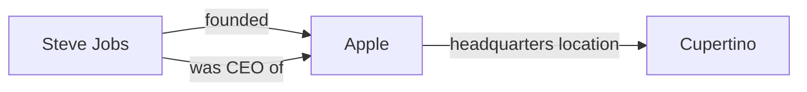
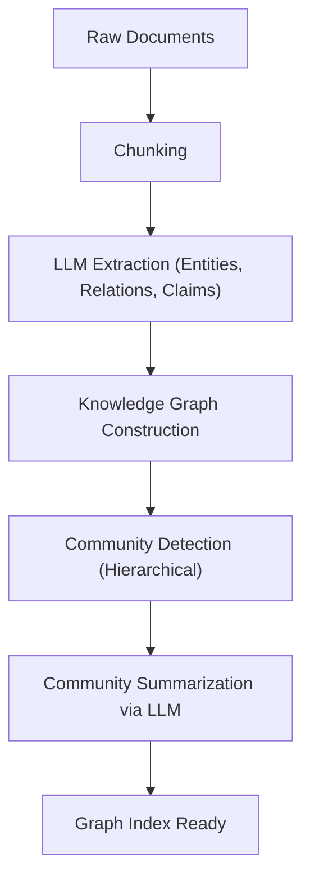

# The Evolution of RAG: Integrating GraphRAG and Knowledge Graphs

With the rise of Large Language Models (LLMs), the field of natural language processing has achieved dramatic evolution. However, LLMs alone have challenges such as "inability to handle the latest information not included in the training data" and "potential to cause hallucinations." As a means to solve these issues, **RAG (Retrieval-Augmented Generation)** has become widely adopted.

Traditional RAG has been dominated by "vector search," which splits documents into chunks, vectorizes them, and performs similarity searches. However, in complex contexts or when reasoning with information spanning multiple documents, simple vector search is reaching its limits. Therefore, "**GraphRAG**," which integrates **Knowledge Graphs** with RAG, is currently attracting attention.

In this article, starting from the challenges faced by traditional vector search-based RAG, we will deeply explore and explain the semantic connection extraction methods using knowledge graphs, and the architecture and best practices for implementing GraphRAG.

---

## 1. The Limits of Traditional Vector Search-Based RAG

### The Mechanism and Benefits of Vector Search

Traditional RAG mainly operates through the following flow:

1. **Document Indexing**: Reads unstructured data such as internal PDFs, text files, and internal Wikis, and splits them into a certain size (chunks).
2. **Embedding Generation**: Converts each split chunk into a point in a multidimensional vector space using an embedding model.
3. **Storage in Vector Database**: Saves the generated vectors along with the original text in a vector database (Pinecone, Milvus, Qdrant, etc.).
4. **Search and Generation**: When a user inputs a question, the question text is similarly vectorized, the cosine similarity with the vectors in the database is calculated, and the most similar chunks are retrieved. The retrieved chunks are embedded as context into the LLM's prompt to generate an answer.

This method is simple and powerful, and is exceptionally good at finding specific factual relationships or information written in a single document.

### Challenges and Limits Encountered

However, in actual operational environments, simple vector search-based RAG has begun to expose some fundamental limitations.

#### 1. The Difficulty of "Multi-hop Reasoning" Integrating Multiple Pieces of Information

Consider a case where the user's question is complex, such as "What is the population of the city where the university the CEO of Company A graduated from is located?" To answer this question, the following steps are required:
- Find that the CEO of Company A is "Taro Yamada."
- Find that the university "Taro Yamada" graduated from is "Tokyo University."
- Find that the city where "Tokyo University" is located is "Tokyo."
- Find the population of "Tokyo."

While vector search can find text fragments that are semantically close to the string "CEO of Company A," it is extremely difficult to chain together facts scattered across multiple documents like the above (multi-hop reasoning). This is because embeddings only express the overall "semantic proximity" of the text and do not preserve the specific logical relationships between entities.

#### 2. The Lack of Global Understanding

For broad questions (global queries) such as "What are the main themes in this dataset?" or "Please summarize the overall picture" from an entire set of documents, vector search does not work. Since vector search merely extracts "locally similar parts" (k-NN search), it cannot generate an answer that provides a bird's-eye view of the whole.

#### 3. The Chunk Size Dilemma and Context Fragmentation

When splitting text into chunks, "what size to split them into" is always a major issue. If the chunks are too small, context is lost and information is fragmented. Conversely, if they are too large, the proportion of irrelevant noise increases, degrading search accuracy. Although methods for splitting chunks at semantic boundaries (semantic chunking) exist, the loss of context by essentially "chopping up the document" is unavoidable.

---

## 2. What is a Knowledge Graph?

### Basic Concepts of Knowledge Graphs

A knowledge graph represents real-world entities (people, places, organizations, concepts, etc.) and the relationships between them as a network structure (graph).

Knowledge graphs generally consist of "nodes (vertices)" and "edges (lines)":
- **Node**: Represents an entity. (e.g., "Steve Jobs", "Apple")
- **Edge**: Represents the relationship between entities. (e.g., "founded", "is CEO of")

These elements are usually expressed as triples of **Subject-Predicate-Object**.
(e.g., `Steve Jobs (Subject) -- founded (Predicate) --> Apple (Object)`)

### Why Do We Need Knowledge Graphs in RAG?

While vector search measures "distance in semantic space," knowledge graphs model "clear relationships between facts and facts." Integrating knowledge graphs into RAG provides the following benefits:

1. **Accurate Grasping of Relationships**: By tracking clear logical relationships such as "A is a part of B" and "C owns D," hallucinations can be dramatically reduced.
2. **Complex Reasoning (Multi-hop Search)**: By traversing the nodes of the graph, reasoning via multiple entities becomes possible.
3. **Summarization of Global Information**: By analyzing the entire graph structure or specific communities (densely connected groups of nodes), it becomes possible to generate trends and summaries for the entire document set.

---

## 3. GraphRAG Architecture and Processing Flow

GraphRAG (Graph Retrieval-Augmented Generation) is a method that builds a knowledge graph from unstructured text and integrates it into the LLM's search and generation process. Based on the representative approach proposed by Microsoft's research team, we will explain the detailed steps.

### Phase 1: Indexing Phase

The most important and computationally expensive phase of GraphRAG is building the knowledge graph from unstructured text.

#### 1.1 Text Chunking
Similar to traditional RAG, the input documents are first split into text chunks of an appropriate size.

#### 1.2 Entity & Relationship Extraction
This is the core of GraphRAG. An LLM is used to extract entities (nodes) and relationships (edges) from each chunk.
The LLM is given a prompt like the following:
"From the following text, extract all people, organizations, locations, and concepts, identify the relationships between them, and output in the format of (Source Node, Relationship, Target Node, Description)."

Through this process, explicit facts in the text are converted into structured data.

#### 1.3 Graph Construction & Entity Resolution
The extracted triples are integrated to construct a single giant graph. At this time, "Entity Resolution" becomes extremely important.
For example, if entities such as "Apple Inc.", "Apple", and "the company" are extracted from different chunks, they must be identified as referring to the same thing and merged as the same node on the graph.

#### 1.4 Community Detection & Summarization
Graph theory algorithms (e.g., Leiden algorithm, Louvain method) are applied to the constructed knowledge graph to detect densely connected groups of nodes (communities). These communities represent "topics" or "themes" within the dataset.
Furthermore, the LLM is used to generate summaries of each community (Community Summary). By performing hierarchical clustering, summaries of different granularities are created, from the global level to the detailed level.

### Phase 2: Query Phase

After the index is built, this is the phase where answers to user questions are generated. GraphRAG uses different search strategies (Local Search / Global Search) depending on the nature of the question.

#### 2.1 Local Search
Suitable for detailed questions regarding specific entities or facts. (e.g., "What was Mr. X's role in the Y incident?")

1. **Entity Identification**: Extracts important entities from the user's question.
2. **Node Retrieval**: Finds nodes in the knowledge graph related to the extracted entities.
3. **Context Collection**: Collects edges (relationships) directly connected to the found nodes, related text chunks, and summaries of the communities to which the nodes belong.
4. **Answer Generation**: Passes the collected information as a prompt to the LLM to generate an answer.

#### 2.2 Global Search
Suitable for broad, summarization-type questions spanning the entire dataset. (e.g., "Summarize the main themes and conflict structures in this dataset")

1. **Parallel Processing of Community Summaries**: For the question, previously generated community summaries are passed to the LLM (in parallel, if necessary) to evaluate and filter how useful each summary is for answering the question.
2. **Intermediate Answer Generation**: For each community summary determined to be useful, an intermediate answer (Intermediate Response) is generated.
3. **Final Answer Integration**: Integrates all intermediate answers to generate the final comprehensive answer. This is a process similar to the concept of Map-Reduce.

---

## 4. Advanced Techniques and Challenges in GraphRAG Implementation

To make GraphRAG successful in actual operational environments, several technical hurdles must be overcome.

### Improving Extraction Accuracy and Cost Optimization

During the indexing phase, since all text chunks are passed through the LLM for entity extraction, token consumption (API cost) becomes massive.
- **Utilizing Lightweight Models**: For extraction tasks, instead of huge models in the GPT-4 class, fine-tuned small to medium-scale models (Llama 3 8B, Mistral, etc.) or models specialized for information extraction (GLiNER, etc.) can optimize costs and speed.
- **Defining an Ontology**: By pre-defining a schema (ontology) of what entity types (Person, Organization, TechSkill, etc.) and relationships you want to extract and instructing the LLM, the accuracy and consistency of extraction will improve.

### Hybrid Approach (Vector + Graph)

In fact, vector search and GraphRAG are not mutually exclusive. The most powerful architecture is a **hybrid search** that combines both.

1. For the user's question, retrieve related chunks using traditional vector search.
2. At the same time, retrieve related graph sub-structures using GraphRAG's local search.
3. Integrate both contexts and present them to the LLM.

Vector search is good at capturing "implicit semantic similarities" and "nuances," while knowledge graphs are good at capturing "explicit factual relationships." By complementing each other, an extremely robust RAG system is realized.

### Selecting a Property Graph Database

Selecting a database (graph database) to store and query the knowledge graph is also important. Neo4j is the most famous and has a mature ecosystem, but recently, databases that integrate vector search capabilities and graph queries (Cypher, Gremlin, etc.) (such as NebulaGraph, ArangoDB, or configurations combining Apache AGE or pgvector with PostgreSQL) are also gaining popularity.

---

## 5. Conclusion and Future Prospects

While traditional vector-based RAG significantly advanced the practical application of generative AI, it had limitations in multi-hop reasoning and understanding overall structures. "GraphRAG," which integrates knowledge graphs and RAG, imparts a "semantic and logical structure" to data, realizing a next-generation AI system that can answer more complex questions more accurately with reduced hallucinations.

Although there are still challenges to solve, such as high construction costs and the difficulty of entity extraction, with the evolution of LLMs themselves and the refinement of extraction algorithms, there is no doubt that GraphRAG will become a standard architecture for enterprise AI.

From simple "text search" to "knowledge network exploration." Great expectations are continuously held for the new possibilities of RAG that GraphRAG is opening up.
