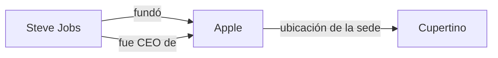
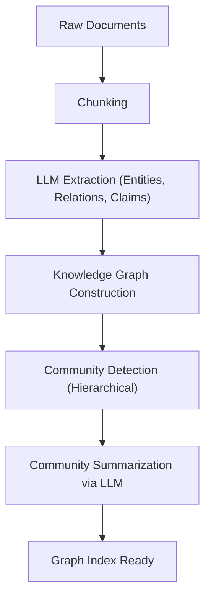

# La evolución de RAG: Integración de GraphRAG y grafos de conocimiento

Con el auge de los grandes modelos de lenguaje (LLM), el campo del procesamiento del lenguaje natural ha experimentado una evolución espectacular. Sin embargo, los LLM por sí solos presentan desafíos como "no poder responder a la información más reciente que no está incluida en los datos de entrenamiento" y "la posibilidad de provocar alucinaciones". Para solucionar esto, el método que se ha generalizado ampliamente es **RAG (Retrieval-Augmented Generation: Generación Aumentada por Recuperación)**.

El enfoque principal del RAG tradicional era la "búsqueda vectorial", en la cual los documentos se dividen en fragmentos, se vectorizan y se realiza una búsqueda de similitud. No obstante, en contextos complejos o al inferir información que abarca múltiples documentos, la búsqueda vectorial simple alcanza sus límites. Es por esto que actualmente está atrayendo gran atención "**GraphRAG**", que integra **grafos de conocimiento (Knowledge Graph)** con RAG.

En este artículo, partiendo de los problemas que enfrenta el RAG tradicional basado en búsqueda vectorial, profundizaremos y explicaremos detalladamente el método de extracción de conexiones semánticas mediante grafos de conocimiento, así como la arquitectura de GraphRAG y las mejores prácticas para su implementación.

---

## 1. Limitaciones del RAG tradicional basado en búsqueda vectorial

### Mecanismo y ventajas de la búsqueda vectorial

El RAG tradicional opera principalmente bajo el siguiente flujo:

1. **Indexación de documentos**: Se leen datos no estructurados de la empresa, como PDF, archivos de texto y wikis internas, y se dividen en fragmentos de cierto tamaño (chunks).
2. **Generación de incrustaciones (Embeddings)**: Cada fragmento dividido se convierte en un punto en un espacio vectorial multidimensional utilizando un modelo de incrustación.
3. **Almacenamiento en una base de datos vectorial**: Los vectores generados se guardan en una base de datos vectorial (Pinecone, Milvus, Qdrant, etc.) junto con el texto original.
4. **Búsqueda y generación**: Cuando un usuario ingresa una pregunta, el texto de la pregunta se vectoriza de manera similar, se calcula la similitud del coseno (o similar) con los vectores en la base de datos, y se obtienen los fragmentos más similares. Los fragmentos obtenidos se incrustan como contexto en el prompt del LLM para generar una respuesta.

Este método es simple y poderoso, siendo muy hábil para encontrar relaciones fácticas específicas o información escrita en un documento único.

### Desafíos y límites enfrentados

Sin embargo, en entornos de producción reales, el RAG tradicional basado en búsqueda vectorial simple ha comenzado a revelar varios límites fundamentales.

#### 1. Dificultad en la "inferencia multisalto" para integrar múltiple información

Consideremos el caso donde la pregunta del usuario es compleja, como "¿Cuál es la población de la ciudad donde se encuentra la universidad de la que se graduó el CEO de la empresa A?". Para responder a esta pregunta se requieren los siguientes pasos:
- Encontrar que el CEO de la empresa A es "Taro Yamada".
- Encontrar que la universidad de la que se graduó "Taro Yamada" es la "Universidad de Tokio".
- Encontrar que la ciudad donde se ubica la "Universidad de Tokio" es "Tokio".
- Encontrar la población de "Tokio".

La búsqueda vectorial puede encontrar fragmentos de texto con un significado cercano a la cadena "CEO de la empresa A", pero seguir de manera encadenada hechos dispersos en múltiples documentos (inferencia multisalto) resulta extremadamente difícil. Esto se debe a que las incrustaciones expresan meramente la "cercanía de significado" general del texto y no conservan relaciones lógicas específicas concretas entre entidades.

#### 2. Falta de comprensión global (Global Understanding)

Para preguntas amplias (consultas globales) sobre el conjunto de una gran cantidad de documentos, como "¿Cuál es el tema principal en este conjunto de datos?" o "Por favor, resume la perspectiva general", la búsqueda vectorial no funciona. Dado que la búsqueda vectorial solo extrae "partes similares locales" (búsqueda k-NN), no puede generar una respuesta que ofrezca una visión global.

#### 3. El dilema del tamaño de los fragmentos y la fragmentación del contexto

Al dividir texto en fragmentos, "en qué tamaño dividir" siempre es un desafío importante. Si el fragmento es demasiado pequeño, se pierde el contexto y la información se fragmenta. Por el contrario, si es demasiado grande, aumenta la proporción de ruido irrelevante incluido, lo que reduce la precisión de la búsqueda. Existen métodos que dividen los fragmentos por límites semánticos (segmentación semántica), pero es inevitable la pérdida de contexto causada esencialmente por "despedazar el documento".

---

## 2. ¿Qué es un grafo de conocimiento (Knowledge Graph)?

### Conceptos básicos de los grafos de conocimiento

Un grafo de conocimiento es una representación como estructura de red (grafo) de entidades del mundo real (personas, lugares, organizaciones, conceptos, etc.) y las relaciones entre ellas.

Los grafos de conocimiento se componen básicamente de "nodos (vértices)" y "aristas (bordes)".
- **Nodo (Node)**: Representa una entidad. (Ejemplo: "Steve Jobs", "Apple")
- **Arista (Edge)**: Representa la relación entre entidades. (Ejemplo: "fundó", "es CEO de")

Estos elementos normalmente se representan como una tripleta (triple) de **Sujeto-Predicado-Objeto (Subject-Predicate-Object)**.
(Ejemplo: `Steve Jobs (Subject) -- fundó (Predicate) --> Apple (Object)`)

### ¿Por qué se necesita un grafo de conocimiento en RAG?

Mientras que la búsqueda vectorial mide la "distancia en el espacio semántico", el grafo de conocimiento modela "relaciones claras entre hechos". Al integrar grafos de conocimiento en RAG, se obtienen las siguientes ventajas:

1. **Comprensión precisa de las relaciones**: Dado que se pueden rastrear relaciones lógicas claras como "A es parte de B" y "C es dueño de D", se pueden reducir drásticamente las alucinaciones.
2. **Inferencia compleja (búsqueda multisalto)**: Siguiendo (atravesando) los nodos del grafo, es posible inferir pasando a través de múltiples entidades.
3. **Resumen de información global**: Analizando toda la estructura del grafo o comunidades específicas (grupos de nodos densamente conectados), es posible generar tendencias y resúmenes de todo el grupo de documentos.

---

## 3. Arquitectura y flujo de procesamiento de GraphRAG

GraphRAG (Graph Retrieval-Augmented Generation) es un método que construye un grafo de conocimiento a partir de texto no estructurado y lo integra en el proceso de búsqueda y generación del LLM. Explicaremos los pasos detallados basados en la arquitectura representativa de GraphRAG propuesta por el equipo de investigación de Microsoft.

### Fase 1: Construcción del índice (Indexing Phase)

La fase más importante y computacionalmente costosa de GraphRAG es la construcción del grafo de conocimiento a partir de texto no estructurado.

#### 1.1 Fragmentación del texto (Text Chunking)
Al igual que en el RAG tradicional, primero se dividen los documentos de entrada en fragmentos de texto de un tamaño apropiado.

#### 1.2 Extracción de entidades y relaciones (Entity & Relationship Extraction)
Este es el núcleo de GraphRAG. Se utiliza un LLM para extraer entidades (nodos) y relaciones (aristas) de cada fragmento.
Se da al LLM un prompt como este:
"Extrae todas las personas, organizaciones, lugares y conceptos del siguiente texto, identifica las relaciones entre ellos y preséntalos en el formato (Nodo de Origen, Relación, Nodo de Destino, Descripción)."

A través de este proceso, los hechos explícitos en el texto se convierten en datos estructurados.

#### 1.3 Construcción del grafo y resolución de entidades (Graph Construction & Entity Resolution)
Las tripletas extraídas se integran para construir un grafo gigante. En este momento, la "Resolución de Entidades (Entity Resolution)" se vuelve de suma importancia.
Por ejemplo, si de diferentes fragmentos se extraen entidades como "Apple Inc.", "Apple" o "la compañía", es necesario identificar que apuntan a lo mismo y consolidarlas como el mismo nodo en el grafo.

#### 1.4 Detección y resumen de comunidades (Community Detection & Summarization)
Se aplican algoritmos de teoría de grafos (ej: algoritmo Leiden, método Louvain) al grafo de conocimiento construido para detectar grupos (comunidades) de nodos fuertemente conectados. Estas comunidades representan "tópicos" o "temas" dentro del conjunto de datos.
Además, se utiliza el LLM para generar un resumen de cada comunidad (Community Summary). Realizando agrupamiento jerárquico, se crean resúmenes de diferentes niveles de granularidad, desde el nivel general hasta el nivel detallado.

### Fase 2: Búsqueda y generación (Query Phase)

Después de construir el índice, esta es la fase de generar respuestas a las preguntas del usuario. GraphRAG utiliza diferentes estrategias de búsqueda (Local Search / Global Search) dependiendo de la naturaleza de la pregunta.

#### 2.1 Búsqueda local (Local Search)
Es adecuada para preguntas detalladas sobre entidades o hechos específicos. (Ejemplo: "¿Cuál fue el rol del Sr. ΔΔ en el incidente 〇〇?")

1. **Identificación de entidades**: Se extraen entidades importantes de la pregunta del usuario.
2. **Obtención de nodos**: Se encuentran los nodos relacionados con las entidades extraídas en el grafo de conocimiento.
3. **Recopilación del contexto**: Se recopilan las aristas (relaciones) directamente conectadas a los nodos encontrados, los fragmentos de texto relacionados y los resúmenes de las comunidades a las que pertenecen esos nodos.
4. **Generación de respuestas**: La información recopilada se pasa al LLM como prompt para generar una respuesta.

#### 2.2 Búsqueda global (Global Search)
Es adecuada para preguntas generales o resumidas que abarcan todo el conjunto de datos. (Ejemplo: "Resume los temas principales y la estructura de conflictos en este conjunto de datos")

1. **Procesamiento paralelo de resúmenes de comunidad**: Para la pregunta, se pasan los resúmenes de comunidad generados previamente al LLM (en paralelo si es necesario) para evaluar y filtrar qué tan útil es cada resumen para responder la pregunta.
2. **Generación de respuestas intermedias**: Se genera una respuesta intermedia (Intermediate Response) por cada resumen de comunidad considerado útil.
3. **Integración de la respuesta final**: Se integran todas las respuestas intermedias para generar una respuesta final exhaustiva. Es un proceso conceptualmente similar a Map-Reduce.

---

## 4. Técnicas avanzadas y desafíos en la implementación de GraphRAG

Para tener éxito con GraphRAG en un entorno de producción, es necesario superar varios obstáculos técnicos.

### Mejora de la precisión de extracción y optimización de costos

En la fase de construcción del índice, como todos los fragmentos de texto pasan por el LLM para extraer entidades, el consumo de tokens (costo de API) es enorme.
- **Uso de modelos ligeros**: Para las tareas de extracción, en lugar de modelos masivos clase GPT-4, se pueden usar modelos pequeños a medianos con fine-tuning (Llama 3 8B, Mistral, etc.) o modelos especializados en extracción de información (como GLiNER) para optimizar costos y velocidad.
- **Definición de ontologías**: Especificando previamente un esquema (ontología) que dicte qué tipos de entidades (Person, Organization, TechSkill, etc.) y relaciones extraer e indicándolo al LLM, mejoran la precisión y consistencia de la extracción.

### Enfoque híbrido (Vector + Grafo)

En realidad, la búsqueda vectorial y GraphRAG no son excluyentes. La arquitectura más poderosa es una **búsqueda híbrida** que combina ambos.

1. Para la pregunta del usuario, se obtienen fragmentos relacionados con la búsqueda vectorial tradicional.
2. Al mismo tiempo, se obtiene la subestructura de grafo relevante con la búsqueda local de GraphRAG.
3. Se integran ambos contextos para presentarlos al LLM.

La búsqueda vectorial es buena para capturar "similitudes semánticas implícitas" y "matices", mientras que el grafo de conocimiento es bueno para capturar "relaciones fácticas explícitas". Al complementarlas, se consigue un sistema RAG sumamente robusto.

### Selección de base de datos de grafos de propiedades

También es importante elegir la base de datos (base de datos de grafos) para almacenar y consultar el grafo de conocimiento. Neo4j es la más famosa y su ecosistema es maduro, pero en los últimos años, las bases de datos que integran la función de búsqueda vectorial y la consulta de grafos (Cypher, Gremlin, etc.) (como NebulaGraph, ArangoDB o configuraciones que combinan PostgreSQL con Apache AGE o pgvector) también están ganando popularidad.

---

## 5. Conclusión y perspectivas futuras

El RAG tradicional basado en vectores ha impulsado en gran medida la implementación práctica de la IA generativa, pero presentaba límites en la inferencia multisalto y en la comprensión de la estructura global. "GraphRAG", que integra grafos de conocimiento y RAG, otorga una "estructura semántica y lógica" a los datos, permitiendo responder preguntas más complejas con mayor precisión y logrando un sistema de IA de próxima generación que suprime las alucinaciones.

Aunque aún hay desafíos que resolver, como el alto costo de construcción y la dificultad en la extracción de entidades, con la evolución de los propios LLM y el refinamiento de los algoritmos de extracción, no hay duda de que GraphRAG se convertirá en la arquitectura estándar para la IA empresarial.

Desde una mera "búsqueda de texto" hacia una "exploración en red del conocimiento". Se mantienen grandes expectativas sobre el nuevo potencial del RAG que GraphRAG abre en el futuro.
