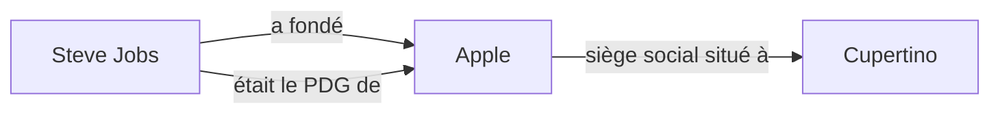
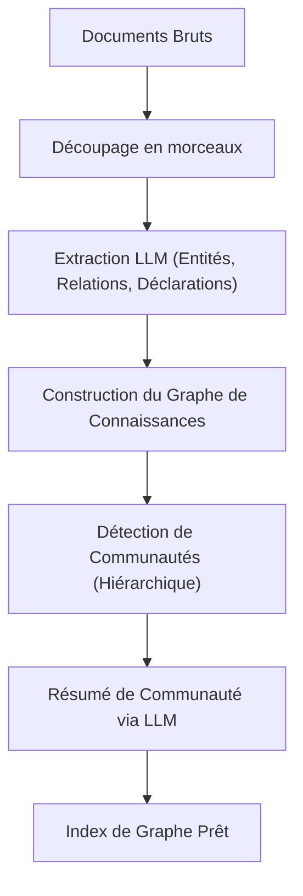

# L'évolution du RAG : Intégration de GraphRAG et des graphes de connaissances

L'essor des grands modèles de langage (LLM) a permis des avancées spectaculaires dans le domaine du traitement du langage naturel. Cependant, les LLM seuls présentent certains défis, tels que "l'incapacité de s'adapter aux informations récentes non incluses dans les données d'entraînement" et "la possibilité de générer des hallucinations". Le **RAG (Retrieval-Augmented Generation : Génération Augmentée par la Recherche)** s'est largement imposé comme moyen de résoudre ces problèmes.

Le RAG traditionnel s'appuyait principalement sur la "recherche vectorielle", où les documents sont divisés en morceaux (chunks), vectorisés, et soumis à une recherche de similarité. Néanmoins, pour des contextes complexes ou le raisonnement d'informations réparties sur plusieurs documents, la simple recherche vectorielle atteint ses limites. C'est pourquoi le "**GraphRAG**", qui intègre les **graphes de connaissances (Knowledge Graphs)** au RAG, attire actuellement beaucoup d'attention.

Dans cet article, nous partirons des limites du RAG traditionnel basé sur la recherche vectorielle, pour explorer en profondeur et en détail les méthodes d'extraction de liens sémantiques à l'aide de graphes de connaissances, ainsi que l'architecture de GraphRAG et les meilleures pratiques pour son implémentation.

---

## 1. Les limites du RAG traditionnel basé sur la recherche vectorielle

### Le fonctionnement et les avantages de la recherche vectorielle

Le RAG traditionnel fonctionne principalement selon le flux suivant :

1. **Indexation des documents** : Les données non structurées de l'entreprise (fichiers PDF, fichiers texte, wiki interne, etc.) sont lues et divisées en morceaux (chunks) d'une taille définie.
2. **Génération d'embeddings** : Chaque morceau divisé est converti en un point dans un espace vectoriel multidimensionnel à l'aide d'un modèle d'embedding.
3. **Stockage dans une base de données vectorielle** : Les vecteurs générés sont sauvegardés, avec le texte original, dans une base de données vectorielle (Pinecone, Milvus, Qdrant, etc.).
4. **Recherche et génération** : Lorsqu'un utilisateur saisit une question, celle-ci est également vectorisée, et la similarité cosinus avec les vecteurs de la base de données est calculée pour récupérer les morceaux les plus similaires. Les morceaux récupérés sont intégrés comme contexte dans le prompt du LLM pour générer une réponse.

Cette méthode est simple et puissante, et excelle particulièrement à trouver des faits spécifiques ou des informations contenues dans un document unique.

### Défis rencontrés et limites

Cependant, dans un environnement de production, le RAG basé sur une simple recherche vectorielle commence à montrer quelques limites fondamentales.

#### 1. La difficulté du "raisonnement multi-sauts" (multi-hop) pour intégrer de multiples informations

Imaginons que la question de l'utilisateur soit complexe, comme : "Quelle est la population de la ville où se trouve l'université dont le PDG de l'entreprise A est diplômé ?" Pour répondre à cette question, les étapes suivantes sont nécessaires :
- Découvrir que le PDG de l'entreprise A est "Taro Yamada".
- Découvrir que l'université dont "Taro Yamada" est diplômé est "l'Université de Tokyo".
- Découvrir que la ville où se trouve "l'Université de Tokyo" est "Tokyo".
- Trouver la population de "Tokyo".

La recherche vectorielle peut trouver un fragment de texte sémantiquement proche de la chaîne "PDG de l'entreprise A", mais il lui est extrêmement difficile de suivre en chaîne des faits dispersés dans plusieurs documents comme ci-dessus (raisonnement multi-sauts). L'embedding ne représente que la "proximité de sens" globale du texte et ne conserve pas les relations logiques spécifiques entre les entités.

#### 2. Le manque de compréhension globale (Global Understanding)

Face à des questions larges (requêtes globales) couvrant l'ensemble d'un vaste groupe de documents, comme "Quel est le thème principal de cet ensemble de données ?" ou "Pourriez-vous résumer la vue d'ensemble ?", la recherche vectorielle ne fonctionne pas. Puisque la recherche vectorielle ne fait qu'extraire des "parties similaires locales" (recherche k-NN), elle est incapable de générer une réponse offrant une vue d'ensemble.

#### 3. Le dilemme de la taille des morceaux et la fragmentation du contexte

Lors de la division du texte en morceaux, la question "à quelle taille faut-il le diviser ?" est toujours un défi majeur. Si le morceau est trop petit, le contexte est perdu et l'information est fragmentée. À l'inverse, s'il est trop grand, la proportion de bruit non pertinent augmente, ce qui réduit la précision de la recherche. Bien qu'il existe des méthodes pour diviser les morceaux au niveau des frontières sémantiques (semantic chunking), la perte de contexte inhérente au fait de "découper le document" reste inévitable.

---

## 2. Qu'est-ce qu'un graphe de connaissances (Knowledge Graph) ?

### Concepts fondamentaux des graphes de connaissances

Un graphe de connaissances est une représentation sous forme de réseau (graphe) des entités du monde réel (personnes, lieux, organisations, concepts, etc.) et des relations entre elles.

Un graphe de connaissances est fondamentalement composé de "nœuds" (sommets) et d'"arêtes" (liens).
- **Nœud (Node)** : Représente une entité. (Ex : "Steve Jobs", "Apple")
- **Arête (Edge)** : Représente la relation entre les entités. (Ex : "a fondé", "est le PDG de")

Ces éléments sont généralement exprimés sous la forme d'un triplet **Sujet-Prédicat-Objet (Subject-Predicate-Object)**.
(Ex : `Steve Jobs (Sujet) -- a fondé (Prédicat) --> Apple (Objet)`)

### Pourquoi le RAG a-t-il besoin de graphes de connaissances ?

Alors que la recherche vectorielle mesure la "distance dans un espace sémantique", le graphe de connaissances modélise une "relation claire entre un fait et un autre". L'intégration d'un graphe de connaissances au RAG offre les avantages suivants :

1. **Appréhension précise des relations** : Parce qu'il permet de suivre des relations logiques claires telles que "A fait partie de B" ou "C possède D", il peut réduire drastiquement les hallucinations.
2. **Raisonnement complexe (recherche multi-sauts)** : En parcourant (traversant) les nœuds du graphe, il devient possible d'effectuer des raisonnements passant par plusieurs entités.
3. **Résumé des informations globales** : En analysant la structure entière du graphe ou des communautés spécifiques (groupes de nœuds densément connectés), il devient possible de générer des tendances ou des résumés pour l'ensemble d'un groupe de documents.

---

## 3. Architecture et flux de traitement de GraphRAG

GraphRAG (Graph Retrieval-Augmented Generation) est une méthode qui construit un graphe de connaissances à partir de texte non structuré et l'intègre au processus de recherche et de génération d'un LLM. Nous allons expliquer ses étapes détaillées, en nous basant sur l'architecture représentative de GraphRAG proposée par l'équipe de recherche de Microsoft.

### Phase 1 : Construction de l'index (Indexing Phase)

La phase la plus importante, et aussi la plus coûteuse en termes de calcul, de GraphRAG est la construction du graphe de connaissances à partir de texte non structuré.

#### 1.1 Découpage du texte en morceaux (Text Chunking)
Comme dans le RAG traditionnel, la première étape consiste à diviser le document d'entrée en morceaux de texte (chunks) d'une taille appropriée.

#### 1.2 Extraction des entités et des relations (Entity & Relationship Extraction)
C'est ici que se trouve le cœur de GraphRAG. Un LLM est utilisé pour extraire des entités (nœuds) et des relations (arêtes) de chaque morceau.
On fournit au LLM un prompt tel que :
"Extrayez toutes les personnes, organisations, lieux et concepts du texte suivant, identifiez les relations entre eux, et affichez-les au format (Nœud Source, Relation, Nœud Cible, Description)."

Ce processus convertit les faits explicites du texte en données structurées.

#### 1.3 Construction du graphe et résolution des entités (Graph Construction & Entity Resolution)
Les triplets extraits sont intégrés pour construire un unique graphe géant. À ce stade, la "Résolution des Entités" (Entity Resolution) devient extrêmement importante.
Par exemple, si les entités "Apple Inc.", "Apple" et "l'entreprise" sont extraites de différents morceaux, il faut identifier qu'elles se réfèrent à la même chose et les fusionner en un seul nœud sur le graphe.

#### 1.4 Détection de communautés et résumé (Community Detection & Summarization)
Des algorithmes de la théorie des graphes (ex: algorithme de Leiden, méthode de Louvain) sont appliqués au graphe de connaissances construit pour détecter les groupes de nœuds densément interconnectés (communautés). Ces communautés représentent des "sujets" ou des "thèmes" au sein de l'ensemble de données.
De plus, un LLM est utilisé pour générer un résumé de chaque communauté (Community Summary). En effectuant un clustering hiérarchique, des résumés à différents niveaux de granularité, allant du niveau global au niveau détaillé, sont créés.

### Phase 2 : Recherche et génération (Query Phase)

C'est la phase de génération de la réponse à la question de l'utilisateur après la construction de l'index. GraphRAG utilise différentes stratégies de recherche (Recherche Locale / Recherche Globale) selon la nature de la question.

#### 2.1 Recherche Locale (Local Search)
Adaptée aux questions détaillées concernant une entité spécifique ou un fait. (Ex : "Quel était le rôle de M. △△ dans l'incident 〇〇 ?")

1. **Identification de l'entité** : Extrait les entités importantes de la question de l'utilisateur.
2. **Récupération des nœuds** : Trouve les nœuds liés aux entités extraites dans le graphe de connaissances.
3. **Collecte du contexte** : Collecte les arêtes (relations) directement connectées aux nœuds trouvés, les morceaux de texte pertinents, et les résumés des communautés auxquelles appartiennent ces nœuds.
4. **Génération de la réponse** : Transmet les informations collectées au LLM en tant que prompt et lui fait générer une réponse.

#### 2.2 Recherche Globale (Global Search)
Adaptée aux questions d'ensemble, résumant et couvrant l'intégralité du jeu de données. (Ex : "Résumez les thèmes principaux et les conflits de ce jeu de données")

1. **Traitement parallèle des résumés de communauté** : Les résumés de communauté générés à l'avance sont transmis (en parallèle, si nécessaire) au LLM pour la question, et chacun d'eux est évalué et filtré pour déterminer son utilité dans la réponse à la question.
2. **Génération de réponses intermédiaires** : Une réponse intermédiaire (Intermediate Response) est générée pour chaque résumé de communauté jugé utile.
3. **Intégration dans la réponse finale** : Toutes les réponses intermédiaires sont intégrées pour générer la réponse finale exhaustive. C'est un processus similaire au concept de Map-Reduce.

---

## 4. Techniques avancées et défis dans l'implémentation de GraphRAG

Pour réussir le déploiement de GraphRAG dans un environnement de production, plusieurs obstacles techniques doivent être surmontés.

### Amélioration de la précision de l'extraction et optimisation des coûts

Lors de la phase de construction de l'index, tous les morceaux de texte sont passés par le LLM pour l'extraction des entités, ce qui entraîne une consommation de tokens (coûts API) colossale.
- **Utilisation de modèles légers** : Pour la tâche d'extraction, utiliser des modèles de taille petite à moyenne affinés (fine-tunés) (comme Llama 3 8B, Mistral, etc.) ou des modèles spécialisés dans l'extraction d'informations (comme GLiNER) plutôt que des modèles massifs de la classe GPT-4 permet d'optimiser les coûts et la vitesse.
- **Définition d'ontologie** : En définissant à l'avance un schéma (ontologie) pour indiquer au LLM quels types d'entités (Personne, Organisation, Compétence Technique, etc.) et de relations on souhaite extraire, on améliore la précision et la cohérence de l'extraction.

### Approche Hybride (Vecteur + Graphe)

En réalité, la recherche vectorielle et GraphRAG ne sont pas mutuellement exclusifs. L'architecture la plus puissante est la **recherche hybride** qui combine les deux.

1. Pour la question de l'utilisateur, récupérer les morceaux pertinents via la recherche vectorielle traditionnelle.
2. Simultanément, récupérer les sous-structures de graphe pertinentes via la recherche locale de GraphRAG.
3. Intégrer les deux contextes et les présenter au LLM.

La recherche vectorielle excelle pour capturer "les similarités de sens implicites" et les "nuances", tandis que le graphe de connaissances excelle pour capturer "les relations factuelles explicites". En les rendant complémentaires, un système RAG extrêmement robuste est réalisé.

### Choix de la base de données orientée graphe (Property Graph)

La sélection de la base de données (base de données graphe) pour stocker et interroger le graphe de connaissances est également importante. Neo4j est la plus connue et possède un écosystème mature, mais récemment, les bases de données qui intègrent la recherche vectorielle et les requêtes graphe (comme Cypher ou Gremlin) (NebulaGraph, ArangoDB, ou une configuration combinant PostgreSQL avec Apache AGE ou pgvector) gagnent également en popularité.

---

## 5. Conclusion et perspectives d'avenir

Le RAG traditionnel basé sur des vecteurs a fait considérablement avancer l'utilisation pratique de l'IA générative, mais il présentait des limites en matière de raisonnement multi-sauts et de compréhension de la structure globale. En intégrant le RAG aux graphes de connaissances, "GraphRAG" donne une "structure sémantique et logique" aux données, permettant aux systèmes d'IA de la prochaine génération de répondre à des questions plus complexes avec plus de précision et avec moins d'hallucinations.

Bien qu'il reste encore des défis à résoudre, tels que les coûts de construction élevés et la difficulté de l'extraction des entités, l'évolution continue des LLM eux-mêmes et le raffinement des algorithmes d'extraction feront sans aucun doute de GraphRAG l'architecture standard pour l'IA d'entreprise.

D'une simple "recherche de texte" à une "exploration du réseau de connaissances". On attend beaucoup du nouveau potentiel du RAG que GraphRAG est en train d'ouvrir.
