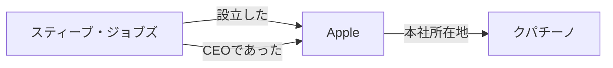
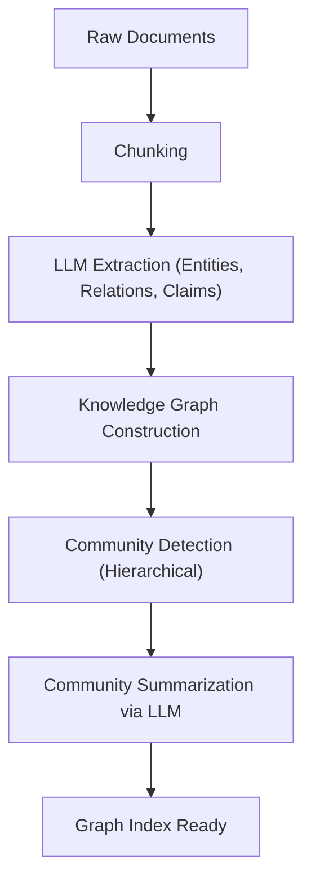

# RAG का विकास: GraphRAG और नॉलेज ग्राफ़ का एकीकरण

लाज लैंग्वेज मॉडल्स (LLM) के उदय से प्राकृतिक भाषा प्रसंस्करण (NLP) के क्षेत्र में अभूतपूर्व विकास हुआ है। हालांकि, केवल LLM में कुछ चुनौतियां हैं जैसे "ट्रेनिंग डेटा में शामिल नहीं होने वाली नवीनतम जानकारी का जवाब देने में असमर्थता" और "हैलुसिनेशन (भ्रम) पैदा करने की संभावना"। इन्हें हल करने के तरीके के रूप में **RAG (Retrieval-Augmented Generation: रिट्रीवल-ऑगमेंटेड जेनरेशन)** व्यापक रूप से लोकप्रिय हुआ है।

पारंपरिक RAG में मुख्य रूप से "वेक्टर सर्च" का उपयोग होता था, जिसमें दस्तावेज़ों को चंक (टुकड़ों) में विभाजित किया जाता है, उनका वेक्टरीकरण किया जाता है, और फिर समानता (similarity) के आधार पर खोज की जाती है। लेकिन, जटिल संदर्भों या कई दस्तावेज़ों में फैली जानकारी के आधार पर अनुमान लगाने (reasoning) में साधारण वेक्टर सर्च की अपनी सीमाएँ हैं। इसलिए, अब **नॉलेज ग्राफ़ (Knowledge Graph)** और RAG को एकीकृत करने वाली तकनीक, "**GraphRAG**", बहुत ध्यान आकर्षित कर रही है।

इस लेख में, हम पारंपरिक वेक्टर सर्च-आधारित RAG के सामने आने वाली चुनौतियों से शुरुआत करेंगे, और फिर नॉलेज ग्राफ़ का उपयोग करके सिमेंटिक (अर्थपूर्ण) कनेक्शन निकालने के तरीके, और GraphRAG के आर्किटेक्चर तथा इसके कार्यान्वयन (implementation) के सर्वोत्तम अभ्यासों पर गहराई से चर्चा करेंगे।

---

## 1. पारंपरिक वेक्टर सर्च-आधारित RAG की सीमाएँ

### वेक्टर सर्च कैसे काम करता है और इसके फायदे

पारंपरिक RAG मुख्य रूप से निम्नलिखित प्रवाह (flow) के अनुसार काम करता है:

1. **दस्तावेज़ों की इंडेक्सिंग**: कंपनियों के भीतर मौजूद PDF, टेक्स्ट फाइल और इंटरनल विकी जैसे असंरचित डेटा (unstructured data) को पढ़ा जाता है और निश्चित आकार (चंक) में विभाजित किया जाता है।
2. **एम्बेडिंग जेनरेशन**: विभाजित किए गए प्रत्येक चंक को एक एम्बेडिंग मॉडल का उपयोग करके बहु-आयामी वेक्टर स्पेस में बिंदुओं में बदल दिया जाता है।
3. **वेक्टर डेटाबेस में स्टोरेज**: जनरेट किए गए वेक्टर्स को मूल टेक्स्ट के साथ वेक्टर डेटाबेस (Pinecone, Milvus, Qdrant आदि) में सहेजा जाता है।
4. **सर्च और जेनरेशन**: जब कोई उपयोगकर्ता प्रश्न दर्ज करता है, तो प्रश्न को भी उसी तरह वेक्टरीकृत किया जाता है। फिर डेटाबेस में मौजूद वेक्टर्स के साथ कोसाइन सिमिलैरिटी (cosine similarity) आदि की गणना की जाती है और सबसे समान चंक प्राप्त किए जाते हैं। इन प्राप्त किए गए चंक को LLM के प्रॉम्प्ट में संदर्भ (context) के रूप में शामिल किया जाता है और उत्तर जनरेट किया जाता है।

यह तरीका सरल और शक्तिशाली है, और यह विशिष्ट तथ्यों या किसी एक दस्तावेज़ में दर्ज जानकारी का पता लगाने में बहुत उत्कृष्ट है।

### सामने आने वाली चुनौतियां और सीमाएँ

हालांकि, वास्तविक उत्पादन वातावरण में, साधारण वेक्टर सर्च-आधारित RAG की कुछ मूलभूत सीमाएँ उजागर होने लगी हैं।

#### 1. कई सूचनाओं को एकीकृत करने वाले "मल्टी-हॉप रीज़निंग" की कठिनाई

मान लीजिए कि उपयोगकर्ता का प्रश्न जटिल है, जैसे "कंपनी A के CEO ने जिस विश्वविद्यालय से स्नातक किया है, वह जिस शहर में है उसकी जनसंख्या कितनी है?"। इस प्रश्न का उत्तर देने के लिए निम्नलिखित चरणों की आवश्यकता है:
- यह खोजना कि कंपनी A के CEO "तारो यामादा" हैं।
- यह खोजना कि "तारो यामादा" ने "टोक्यो विश्वविद्यालय" से स्नातक किया है।
- यह खोजना कि "टोक्यो विश्वविद्यालय" "टोक्यो" में स्थित है।
- "टोक्यो" की जनसंख्या खोजना।

वेक्टर सर्च "कंपनी A के CEO" स्ट्रिंग के अर्थ के करीब वाले टेक्स्ट के टुकड़ों को तो खोज सकता है, लेकिन ऊपर बताए गए तरीके से कई दस्तावेज़ों में फैले तथ्यों को श्रृंखला में (मल्टी-हॉप रीज़निंग) खोजना इसके लिए बेहद मुश्किल है। ऐसा इसलिए है क्योंकि एम्बेडिंग केवल टेक्स्ट की समग्र "अर्थ संबंधी निकटता" को व्यक्त करते हैं, और संस्थाओं (entities) के बीच विशिष्ट तार्किक संबंधों को बनाए नहीं रखते हैं।

#### 2. समग्र समझ (Global Understanding) का अभाव

बड़ी संख्या में दस्तावेज़ों में से, "इस डेटासेट का मुख्य विषय क्या है?" या "कृपया पूरी तस्वीर को संक्षेप में बताएं" जैसे व्यापक प्रश्नों (ग्लोबल क्वेरीज़) के लिए, वेक्टर सर्च काम नहीं करता है। चूंकि वेक्टर सर्च केवल "स्थानीय समान भागों" को निकालता है (k-NN सर्च), यह समग्र दृष्टिकोण (bird's-eye view) वाला उत्तर जनरेट करने में असमर्थ है।

#### 3. चंक आकार की दुविधा और संदर्भ का विखंडन

जब टेक्स्ट को चंक्स में बांटा जाता है, तो "किस आकार में विभाजित किया जाना चाहिए" यह हमेशा एक बड़ी चुनौती होती है। यदि चंक बहुत छोटा है, तो संदर्भ खो जाता है और जानकारी खंडित हो जाती है। इसके विपरीत, यदि यह बहुत बड़ा है, तो अप्रासंगिक शोर (noise) शामिल होने का अनुपात बढ़ जाता है, जिससे खोज की सटीकता कम हो जाती है। हालांकि अर्थ संबंधी सीमाओं (semantic chunking) पर चंक को विभाजित करने के तरीके मौजूद हैं, लेकिन मुख्य रूप से "दस्तावेज़ को काटने" के कारण संदर्भ का नुकसान अपरिहार्य है।

---

## 2. नॉलेज ग्राफ़ (Knowledge Graph) क्या है?

### नॉलेज ग्राफ़ की बुनियादी अवधारणा

नॉलेज ग्राफ़ वास्तविक दुनिया की संस्थाओं (entities) (जैसे लोग, स्थान, संगठन, अवधारणाएं) और उनके बीच के संबंधों का एक नेटवर्क संरचना (ग्राफ़) के रूप में प्रतिनिधित्व है।

नॉलेज ग्राफ़ मुख्य रूप से "नोड्स (शीर्ष)" और "एजेस (किनारे)" से बने होते हैं।
- **नोड (Node)**: संस्थाओं (entities) का प्रतिनिधित्व करता है। (उदाहरण: "स्टीव जॉब्स", "Apple")
- **एज (Edge)**: संस्थाओं के बीच संबंधों का प्रतिनिधित्व करता है। (उदाहरण: "स्थापना की", "CEO है")

इन तत्वों को आमतौर पर **विषय-विधेय-वस्तु (Subject-Predicate-Object)** के ट्रिपल्स (त्रिक) के रूप में दर्शाया जाता है।
(उदाहरण: `स्टीव जॉब्स (Subject) -- स्थापना की (Predicate) --> Apple (Object)`)

### RAG में नॉलेज ग्राफ़ की आवश्यकता क्यों है?

जबकि वेक्टर सर्च "अर्थ के स्थान में दूरी" को मापता है, नॉलेज ग्राफ़ "तथ्यों और तथ्यों के बीच स्पष्ट संबंधों" को मॉडल करता है। नॉलेज ग्राफ़ को RAG के साथ एकीकृत करने से निम्नलिखित लाभ मिलते हैं:

1. **सटीक संबंधों की समझ**: "A, B का हिस्सा है" या "C, D का मालिक है" जैसे स्पष्ट तार्किक संबंधों को ट्रैक किया जा सकता है, जिससे हैलुसिनेशन (भ्रम) को काफी हद तक कम किया जा सकता है।
2. **जटिल रीज़निंग (मल्टी-हॉप सर्च)**: ग्राफ़ में नोड्स को ट्रैवर्स करके (पार करके), कई संस्थाओं के माध्यम से निष्कर्ष निकालना संभव हो जाता है।
3. **समग्र सूचना का सारांशीकरण**: पूरे ग्राफ़ संरचना या विशिष्ट समुदायों (नोड्स के घने समूह) का विश्लेषण करके, पूरे दस्तावेज़ों के रुझान या सारांश को जनरेट करना संभव हो जाता है।

---

## 3. GraphRAG आर्किटेक्चर और प्रोसेसिंग फ्लो

GraphRAG (Graph Retrieval-Augmented Generation) असंरचित टेक्स्ट से नॉलेज ग्राफ़ बनाने और इसे LLM की खोज और निर्माण प्रक्रिया में एकीकृत करने का एक तरीका है। एक प्रतिनिधि दृष्टिकोण के रूप में, Microsoft की शोध टीम द्वारा प्रस्तावित GraphRAG के आर्किटेक्चर के आधार पर, हम इसके विस्तृत चरणों की व्याख्या करेंगे।

### चरण 1: इंडेक्स निर्माण (Indexing Phase)

GraphRAG का सबसे महत्वपूर्ण और सबसे कम्प्यूटेशनल रूप से महंगा चरण असंरचित टेक्स्ट से नॉलेज ग्राफ़ का निर्माण करना है।

#### 1.1 टेक्स्ट चंकिंग (Text Chunking)
पारंपरिक RAG की तरह, सबसे पहले इनपुट दस्तावेज़ को उचित आकार के टेक्स्ट चंक्स में विभाजित किया जाता है।

#### 1.2 एंटिटी और रिलेशनशिप एक्सट्रैक्शन (Entity & Relationship Extraction)
यह GraphRAG का मुख्य भाग है। LLM का उपयोग करके, प्रत्येक चंक से एंटिटीज (नोड्स) और संबंधों (एजेस) को निकाला जाता है।
LLM को कुछ इस प्रकार का प्रॉम्प्ट दिया जाता है:
"निम्नलिखित टेक्स्ट से, सभी व्यक्तियों, संगठनों, स्थानों और अवधारणाओं को निकालें, उनके बीच के संबंधों को पहचानें, और उन्हें (Source Node, Relationship, Target Node, Description) के प्रारूप में आउटपुट करें।"

यह प्रक्रिया टेक्स्ट में मौजूद स्पष्ट तथ्यों को संरचित डेटा में बदल देती है।

#### 1.3 ग्राफ़ निर्माण और एंटिटी रिज़ॉल्यूशन (Graph Construction & Entity Resolution)
निकाले गए ट्रिपल्स को एक बड़े ग्राफ़ को बनाने के लिए एकीकृत किया जाता है। इस समय, "एंटिटी रिज़ॉल्यूशन" (Entity Resolution) बेहद महत्वपूर्ण हो जाता है।
उदाहरण के लिए, यदि अन्य चंक्स से "Apple Inc.", "Apple", और "वही कंपनी" जैसी एंटिटीज निकाली जाती हैं, तो यह पहचानना आवश्यक है कि वे एक ही चीज़ को संदर्भित कर रहे हैं और उन्हें ग्राफ़ पर एक ही नोड के रूप में एकीकृत किया जाना चाहिए।

#### 1.4 कम्युनिटी डिटेक्शन और समराइज़ेशन (Community Detection & Summarization)
निर्मित नॉलेज ग्राफ़ पर ग्राफ़ सिद्धांत एल्गोरिदम (जैसे Leiden एल्गोरिदम, Louvain विधि) को लागू किया जाता है ताकि सघन रूप से जुड़े नोड्स के समूहों (समुदायों) का पता लगाया जा सके। ये समुदाय डेटासेट के भीतर "विषयों" और "थीम्स" का प्रतिनिधित्व करते हैं।
इसके अलावा, प्रत्येक समुदाय का सारांश (Community Summary) उत्पन्न करने के लिए LLM का उपयोग किया जाता है। पदानुक्रमित क्लस्टरिंग (hierarchical clustering) का उपयोग करके, समग्र स्तर से विस्तृत स्तर तक विभिन्न ग्रैन्युलैरिटी (गहराई) के सारांश बनाए जाते हैं।

### चरण 2: खोज और निर्माण (Query Phase)

इंडेक्स बनने के बाद, यह उपयोगकर्ताओं के प्रश्नों के उत्तर जनरेट करने का चरण है। GraphRAG प्रश्न की प्रकृति के आधार पर विभिन्न खोज रणनीतियों (Local Search / Global Search) का उपयोग करता है।

#### 2.1 लोकल सर्च (Local Search)
विशिष्ट एंटिटीज या तथ्यों के बारे में विस्तृत प्रश्नों के लिए उपयुक्त है। (उदाहरण: "XX घटना में YY की भूमिका क्या थी?")

1. **एंटिटी की पहचान**: उपयोगकर्ता के प्रश्न से महत्वपूर्ण एंटिटीज निकाली जाती हैं।
2. **नोड की प्राप्ति**: निकाली गई एंटिटीज से संबंधित नोड्स को नॉलेज ग्राफ़ से खोजा जाता है।
3. **संदर्भ का संग्रह**: खोजे गए नोड्स से सीधे जुड़े एजेस (संबंध), संबंधित टेक्स्ट चंक्स, और उस समुदाय के सारांश जहां नोड स्थित है, को एकत्र किया जाता है।
4. **उत्तर जनरेशन**: एकत्र की गई जानकारी को प्रॉम्प्ट के रूप में LLM में पास किया जाता है ताकि उत्तर जनरेट किया जा सके।

#### 2.2 ग्लोबल सर्च (Global Search)
यह पूरे डेटासेट में फैले व्यापक और सारांश वाले प्रश्नों के लिए उपयुक्त है। (उदाहरण: "इस डेटासेट के मुख्य विषयों और संघर्ष संरचनाओं को संक्षेप में बताएं")

1. **कम्युनिटी सारांश की समानांतर प्रोसेसिंग**: प्रश्न का उत्तर देने के लिए, पहले से उत्पन्न समुदायों के सारांश को LLM (आवश्यकतानुसार समानांतर में) को दिया जाता है, और यह मूल्यांकन और फ़िल्टर किया जाता है कि प्रत्येक सारांश कितना उपयोगी है।
2. **मध्यवर्ती उत्तरों का निर्माण**: उपयोगी माने जाने वाले प्रत्येक समुदाय सारांश के लिए, एक मध्यवर्ती उत्तर (Intermediate Response) जनरेट किया जाता है।
3. **अंतिम उत्तर का एकीकरण**: सभी मध्यवर्ती उत्तरों को मिलाकर एक अंतिम और व्यापक उत्तर जनरेट किया जाता है। यह Map-Reduce अवधारणा के समान एक प्रक्रिया है।

---

## 4. GraphRAG कार्यान्वयन में उन्नत तकनीकें और चुनौतियाँ

GraphRAG को वास्तविक उत्पादन वातावरण में सफल बनाने के लिए, कई तकनीकी बाधाओं को दूर किया जाना चाहिए।

### एक्सट्रैक्शन सटीकता में सुधार और लागत अनुकूलन

इंडेक्स निर्माण चरण में, चूंकि सभी टेक्स्ट चंक्स को एंटिटी एक्सट्रैक्शन के लिए LLM के माध्यम से पास किया जाता है, इसलिए टोकन की खपत (API लागत) भारी होती है।
- **हल्के मॉडल का उपयोग**: निष्कर्षण (extraction) कार्यों के लिए GPT-4 जैसे बड़े मॉडलों के बजाय, फाइन-ट्यून किए गए छोटे-से-मध्यम आकार के मॉडल (जैसे Llama 3 8B, Mistral) या जानकारी निष्कर्षण (GLiNER आदि) के लिए विशिष्ट मॉडल का उपयोग करके लागत और गति को अनुकूलित किया जा सकता है।
- **ऑन्टोलॉजी की परिभाषा**: निष्कर्षण की सटीकता और स्थिरता को बढ़ाने के लिए, पहले से एक स्कीमा (ऑन्टोलॉजी) परिभाषित करना और LLM को निर्देशित करना महत्वपूर्ण है कि किस प्रकार की एंटिटीज (Person, Organization, TechSkill, आदि) और संबंधों को निकाला जाना है।

### हाइब्रिड दृष्टिकोण (Vector + Graph)

वास्तव में, वेक्टर सर्च और GraphRAG एक-दूसरे से अलग नहीं हैं। सबसे शक्तिशाली आर्किटेक्चर दोनों को मिलाकर बनने वाला **हाइब्रिड सर्च** है।

1. उपयोगकर्ता के प्रश्नों के लिए पारंपरिक वेक्टर सर्च के माध्यम से संबंधित चंक्स को प्राप्त करना।
2. साथ ही, GraphRAG की लोकल सर्च का उपयोग करके संबंधित ग्राफ़ उप-संरचनाओं (substructures) को प्राप्त करना।
3. दोनों संदर्भों को संयोजित करना और उन्हें LLM को प्रस्तुत करना।

वेक्टर सर्च "अंतर्निहित अर्थ संबंधी समानता" और "बारीकियों (nuances)" को पकड़ने में अच्छा है, जबकि नॉलेज ग्राफ़ "स्पष्ट तथ्यात्मक संबंधों" को पकड़ने में अच्छा है। दोनों के पूरक होने से, एक अत्यंत मजबूत RAG प्रणाली को साकार किया जा सकता है।

### प्रॉपर्टी ग्राफ़ डेटाबेस का चयन

नॉलेज ग्राफ़ को सहेजने और क्वेरी करने के लिए डेटाबेस (ग्राफ़ डेटाबेस) का चयन करना भी महत्वपूर्ण है। Neo4j सबसे प्रसिद्ध है और इसका एक परिपक्व इकोसिस्टम है, लेकिन हाल के वर्षों में ऐसे डेटाबेस (जैसे NebulaGraph, ArangoDB, या PostgreSQL के साथ Apache AGE और pgvector का संयोजन) भी लोकप्रिय हो रहे हैं जो वेक्टर खोज क्षमताओं को ग्राफ़ क्वेरी (जैसे Cypher या Gremlin) के साथ एकीकृत करते हैं।

---

## 5. निष्कर्ष और भविष्य की संभावनाएं

पारंपरिक वेक्टर-आधारित RAG ने जनरेटिव AI के व्यावहारिक अनुप्रयोगों को बहुत आगे बढ़ाया है, लेकिन मल्टी-हॉप रीज़निंग और समग्र संरचनाओं को समझने में इसकी अपनी सीमाएं थीं। नॉलेज ग्राफ़ और RAG को एकीकृत करने वाला "GraphRAG", डेटा को "अर्थपूर्ण और तार्किक संरचना" प्रदान करके एक अगली पीढ़ी के AI सिस्टम को साकार करता है, जो अधिक सटीक है, जटिल सवालों के जवाब दे सकता है, और हैलुसिनेशन को कम कर सकता है।

यद्यपि अभी भी ऐसी चुनौतियाँ हैं जिन्हें हल करने की आवश्यकता है, जैसे कि निर्माण की उच्च लागत और एंटिटी एक्सट्रैक्शन की कठिनाई, लेकिन इसमें कोई संदेह नहीं है कि LLM के स्वयं के विकास और एक्सट्रैक्शन एल्गोरिदम के शोधन के साथ, GraphRAG एंटरप्राइज़ AI के लिए मानक आर्किटेक्चर बन जाएगा।

केवल "टेक्स्ट सर्च" से लेकर "ज्ञान नेटवर्क की खोज" तक। GraphRAG द्वारा खोली गई RAG की नई संभावनाओं से भविष्य में बहुत उम्मीदें हैं。
